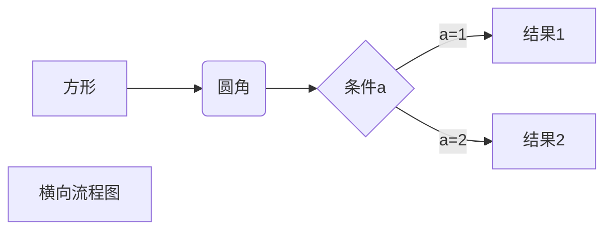
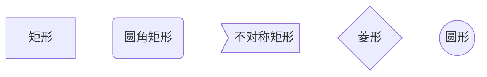

<!--
 * @Author: your name
 * @Date: 2021-08-09 20:28:02
 * @LastEditTime: 2021-08-10 09:00:08
 * @LastEditors: Please set LastEditors
 * @Description: In User Settings Edit
 * @FilePath: \gitbook-books-main\0.基本定义（必看）\兼容性.md
-->

# 概念

## 定义

兼容性：是指两个插件之间的关系，具体兼容性见下列关系。
1）冲突
冲突是指插件A直接干扰/破坏了插件B的结构，造成系统报错。使得游戏无法运行。冲突并不是刻意造成的，有时候是插件作者没有考虑到特殊的情况。



```flow
st=>start: 开始框
op=>operation: 处理框
cond=>condition: 判断框(是或否?)
sub1=>subroutine: 子流程
io=>inputoutput: 输入输出框
e=>end: 结束框
st(right)->op(right)->cond
cond(yes)->io(bottom)->e
cond(no)->sub1(right)->op
```


​```mermaid
flowchat
st=>start: Start
e=>end: End
op1=>operation: Operation
sub1=>subroutine: Subroutine
cond=>condition: yes or no ?
io=>inputoutput: proceess something...
st->op1->cond`
cond(yes)->io->e`
cond(no)->sub1(right)->op1
​```




2）强占资源
强占资源是指，插件A强占了插件B需要的系统资源，虽然系统不报错，且能正常运行，但是插件B的部分功能会失效。一般换换插件顺序，能够解决这类情况。

3）相互独立
两个插件各自要各自的系统资源，即使是相同的系统资源，也会排队等待，相互不干扰，这样就说明插件之间相互独立。


4）依赖
依赖表示插件A必须要插件B给予的资源才能运行。
详细可见后面章节基于。

5）不完全依赖
不完全依赖表示插件A在有插件B的情况下，使用计划1；如果没有插件B，那么使用计划2。这样插件通常可以独立运行。但是计划1的功能效果肯定比计划2的要好。
详细可见后面章节作用于、被扩展。

特点
你的游戏中通常情况下会放置大量的插件，虽然大部分插件相互独立，但是也会遇到小概率冲突的情况。因为你每加入一个新插件时，相同作用域下的插件都会相互影响。
另外，你不能给游戏装上两个相同的插件，这是必然 冲突/强占资源 的。


插件扩展
定义
基于：如果插件A必须要插件B给予的资源才能运行，那么就称插件A基于插件B。

所有drill插件中，都加入了校验机制，如果所基于的插件缺失，会弹出相应提示，所以不需要担心游戏时会因缺插件而报错。

作用于/可作用于：根据下图的箭头关系，插件A作用于插件B。箭头是可断开的。
被扩展/可被扩展：根据下图的箭头关系，插件B被插件A扩展。箭头是可断开的。

与”基于”的定义不同，这两个关系属于不完全依赖。插件中经常出现这种扩展关系。
特点
插件有 基于、被扩展 关系的，比较容易出现不同版本插件的 冲突。
比如下图中插件A[v1.2]向插件B[v1.0]寻求资源时，由于旧插件可能没有新的资源提供，造成插件A出错。解决这类问题，只要保证插件都是示例中最新的版本，就可以了。

（但要注意，一次性升级所有插件，还是存在一些风险的，升级时要备份工程。）


关于不同作者的插件
不同作者之间，冲突的隐患非常大。
因为不同作者的写脚本时，考虑的方向完全不同。如果插件的某些地方作硬性设定，将直接影响到其他作者对脚本进行扩展。


Mog自身插件版本组兼容情况（插件示例1.60 – 2.00的旧版本）
Mog大部分插件可以单独运行，但是 插件组合后 会对版本比较敏感，如果与目标插件的版本太高或太低，会报错误。
当前已知的版本组如下：（你其实只要按最新的版本来替换 组中所有插件就可以了）
插件	旧版本组1	旧版本组2	最新版本组
MOG_ATB  即时战斗模式
MOG_BattleHud  角色窗口
MOG_BattleCommands  技能类型面板
MOG_BalloonActionName  招式名气泡框
MOG_ConsecutiveBattles  车轮战
MOG_BattlerMotion 技能动作+呼吸效果
MOG_HPGauge   生命浮动框
MOG_EmergeMotion  敌人出现动画效果	无
（v3.5）
（v1.0）
（v1.5）
无
（v1.6）
（v1.2）
无	（v0.1 Beta）
（v4.0）
（v1.2）
（v1.7）
（v1.0）
（v1.8）
（v1.3）
（v1.2）	（v0.3 Beta）
（v4.0）
（v1.2）
（v1.7）
（v1.1）
（v2.0）
（v1.3）
（v1.4）
如果你用了表中高版本组的插件，需要都换成组中高版本的插件，因为两组之间存在不兼容情况。（如果你使用了插件组中以外的版本，兼容情况就未知了。）
已知冲突插件
下列有一些已知会产生冲突的插件，你需要对其做出选择，进行取舍。
MOG_SceneItem.js
全自定义物品界面
MiniInformationWindow.js
详细信息窗口		YEP_ItemCore.js
yep物品核心
MOG_BattleResult.js
战斗结果		YEP_VictoryAftermath.js
yep战斗结算
MOG_ATB.js
即时战斗模式MOG_SkipWindowLog.js 
去掉窗口提示消息
Drill_WindowLog.js
窗口提示消息		YEP_BattleEngineCore.js
yep战斗核心
Drill_SenceShop
全自定义商店界面		YEP_ShopMenuCore
Yep商店核心


