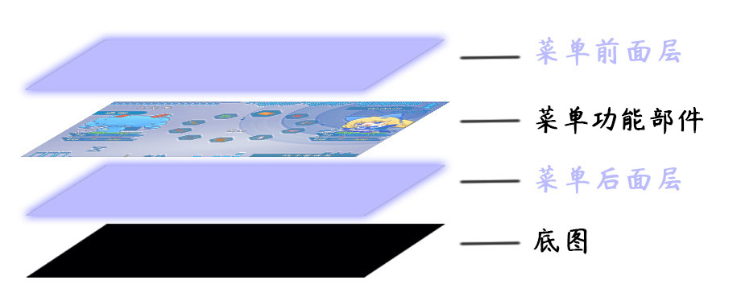
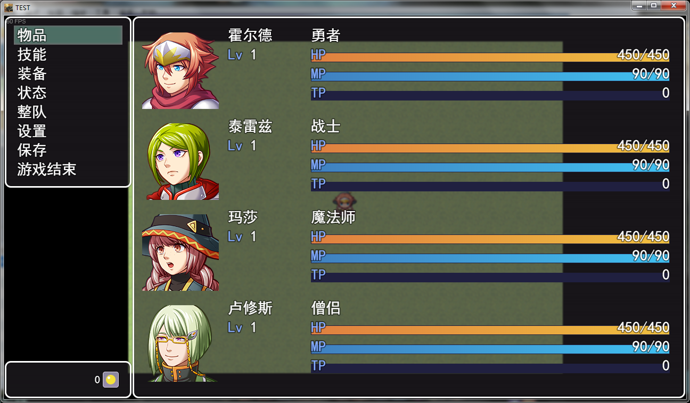

## 概念

### 定义

**界面：**是指用户 当前看到 的游戏窗口内的所有图像画面。

### 特点

1.界面在脚本中定义为Scene。

2.rmmv游戏分为三种界面类型：**战斗**、**地图**、**菜单**。

（战斗界面和地图界面内容复杂，通过大量游戏数据拼接而成；而菜单界面内容简单，但是数量特别多，是一套大卡组。）

3.系统每次只能运行一个界面，运行时其它界面处于**暂停状态**。

（系统每次只能运行一张卡片，且每张卡片是单独运行的，不会牵连其他卡片。）

## 类型

### 菜单（菜单界面）

菜单界面定制化较强。主要结构如下：

**底图**：可以被主菜单相关装饰插件进行装饰。

**功能部件**：原始的rmmv主菜单的部件结构如下图。（由 3个窗口
组成）rmmv本体没有定制菜单的渠道，所有可定制的菜单，都是通过插件一个个配置的。

菜单界面的层级如下：（蓝色部分为多层背景、粒子、魔法圈插件的装饰插入层）

{width="5.533333333333333in"
height="2.293008530183727in"}

### 战斗（战斗界面）

战斗界面数据内容较多，但整体结构变化不大。

rmmv本体可以设置 敌人、敌群、回合事件 等，你也可以通过插件定制更多内容。

战斗界面的层级如下：

（蓝色部分为多层背景、粒子、魔法圈插件的插入层，其实你**并不需要记住**所有复杂的层级，你只需要把内容放在想放的位置即可）

{width="5.768055555555556in"
height="4.909027777777778in"}

### 地图（地图界面）

地图界面是一种**变化性非常强**的界面。

**切换地图时，地图界面并没有切换，而是进行了游戏数据重读、贴图重组**。每个变量、独立开关都直接影响下次地图界面的内容。

rmmv本体可以设置 事件、独立开关 等，你也可以通过插件定制更多内容。

地图界面的层级如下：

（蓝色部分为多层背景、粒子、魔法圈插件的插入层，其实你**并不需要记住**所有复杂的层级，你只需要把内容放在想放的位置即可）

{width="5.768055555555556in"
height="6.172928696412948in"}

## 界面

### 作用域

界面的作用域根据情况分成下面的类：

### 游戏界面

游戏界面不外乎就这三种基本元素：战斗、地图、菜单。

一些比较新颖的游戏可能会将元素两两融合：

战斗+地图、菜单 （即时战斗游戏ARPG）

战斗、地图+菜单 （策略类游戏）

战斗+菜单、地图 （文字冒险类游戏galgame）

从脚本层面来看，分离战斗与地图，最显著的作用就是**节省计算量**。

战斗占计算量多，地图占内存大。如果是即时战斗，由于图像变化多，消耗量大，现在的电脑基本不存在问题，但是手机就是一种挑战了。

当你打开菜单时，因为其它界面是暂停状态，所以繁忙计算中的CPU可以瞬间降下来。这也是为什么卡顿的游戏地图中，只要一打开菜单，瞬间变流畅的原因。

另外，如果一个游戏连菜单都卡顿的话，那就真的是电脑硬件的问题了。

### 界面理解误区

战斗界面、地图界面、菜单界面是三个完全独立的界面，进入了任何一个界面，其他界面都是暂停状态。暂停状态时，数据无法实时交互。

在地图界面中选择菜单时，许多萌新会误以为是在地图界面中添加了菜单，而实际上，这里已经离开了地图界面。**地图的轮廓只是一个地图截屏放在了菜单的背景中而已**。

{width="5.768055555555556in"
height="3.3756944444444446in"}
