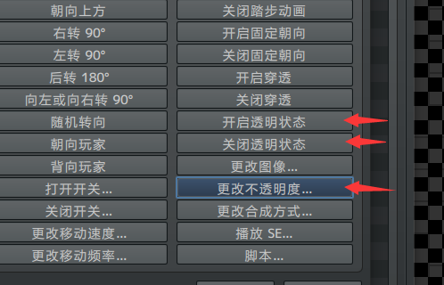
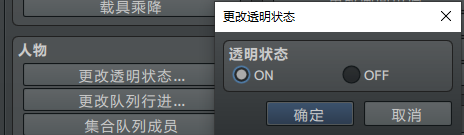
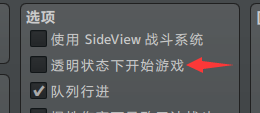
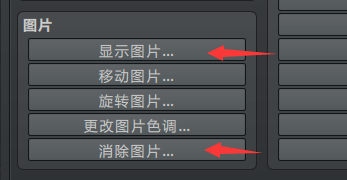
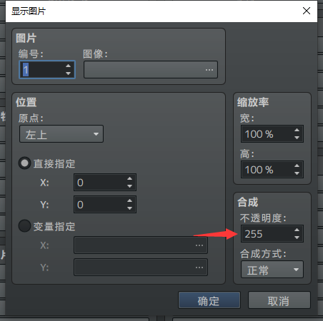
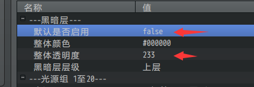
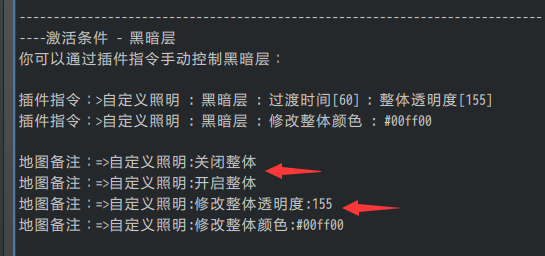

## 概述

### 定义

**透明度/不透明度：**在rmmv中，”不透明度”和”透明度”的意思一样。只要有“透明度”三个字，就都是统一的：255完全不透明，0完全透明。

（从脚本层面上，”不透明度”的英文为opacity，但是用中文解释非常绕，索性全部理解为”透明度”。）

### 常见坑

当你操作任何贴图时，都会遇到两种操作方法：

显示/不显示，

透明度255/透明度0。

道理简单，但坑就在于：

不显示是看不见图片的，

透明度0也是看不见图片的，

显示的透明度0也是看不见图片的，

不显示的透明度255也是看不见图片的，

不显示的透明度0更加是看不见图片的。

只要看不见图片，就很容易误认为没有生效。所以你必须留意显示与透明度的关系。

### 关系

显示、透明度与看见关系如下表：

|           | 显示       | 不显示 |
|-----------|------------|--------|
| 透明度0   | 看不见     | 看不见 |
| 透明度40  | 几乎看不见 | 看不见 |
| 透明度215 | 能看见     | 看不见 |
| 透明度255 | 能看见     | 看不见 |

另外，看不见也可能包含其他因素，具体情况需要具体分析：

1.空图片，也是看不见的。

2.直接给透明图片，也是看不见的。

3.图片超出了窗口范围，也是看不见的。

## Rmmv功能

### 行走图操作

下图为移动路线中控制的三种情况，透明状态对应 显示/不显示：

玩家的 显示/不显示 可以直接修改，也可以在移动路线中修改：

### 图片操作

图片的功能比行走图要好理解，图片的 显示/不显示 直接对应下面两条指令。

你必须点开显示才能控制透明度，而不是并列控制的。

## 插件

### 自定义照明 - 黑暗层

Drill_LayerIllumination 地图 - 自定义照明效果

自定义照明是在地图的基础上加上一层黑暗层。把上面的表挪用下来，你会发现：

|                 | 开启           | 关闭       |
|-----------------|----------------|------------|
| 黑暗层透明度0   | 看不见黑暗     | 看不见黑暗 |
| 黑暗层透明度40  | 几乎看不见黑暗 | 看不见黑暗 |
| 黑暗层透明度215 | 能看见黑暗     | 看不见黑暗 |
| 黑暗层透明度255 | 能看见黑暗     | 看不见黑暗 |

黑暗层的开关（显示/不显示）在这里是以地图为准的，一张地图一个开关。默认启用是一次性对所有地图的，而备注是一对一的。也就是说，如果默认是关闭的，你需要加地图备注来开启黑暗层，不然就看不见黑暗。

### 显现动作/消失动作

Drill_EventFadeOutEffect 行走图 – 消失动作效果

Drill_EventFadeInEffect 行走图 – 显现动作效果

Drill_PictureFadeOutEffect 图片 – 消失动作效果

Drill_PictureFadeInEffect 图片 – 显现动作效果

显现动作固定为：从 完全透明 到 完全不透明
的过程。动作结束后，对象的透明度将变为255。

消失动作固定为：从 完全不透明 到 完全透明
的过程。动作结束后，对象的透明度将变为0。

这类插件只控制对象的透明度，并不控制
显示/不显示。**如果你让某个事件播放动作，事件没有透明过程直接消失了，那么可以确定是其他插件造成的问题，而不是该插件**。

### 倒影镜像/同步镜像

Drill_LayerReverseReflection 行走图 - 图块倒影镜像

Drill_LayerSynchronizedReflection 行走图 - 图块同步镜像

镜像分为 **镜面和镜像**。镜面是 显示/不显示
的一个重要因素，如果没有镜面，镜像当然不会存在。每张地图会有默认的镜面，你也可以配置自己画的镜面资源图片。

镜像中还有个概念，"镜像透明同步"。是指：

镜像透明度 随着 事件透明度 变化而变化。

镜像透明状态 随着 事件透明状态 变化而变化。

**也就是说，如果关闭透明同步，镜像和事件贴图的两个属性（显示/不显示 和
透明度）会单独作用**。单独作用时，关系如下：

|          | 显示/不显示 控制                                | 透明度 控制 |
|----------|-------------------------------------------------|-------------|
| 镜像     | 处于无镜面区/处于镜面区 不反射镜像/开启反射镜像 | 无          |
| 事件贴图 | 事件透明状态                                    | 事件透明度  |

关闭同步后，你可以设置 透明度为0 或 开启透明状态
的事件，使得事件具有镜像却看不见本体。

需要注意的是，你不能修改镜像的透明度。

## 小结

上述的插件介绍，只是对于部分具体插件的解析。其它的插件也具有相似的功能，不过称呼命名方式会有部分区别。所以这里只能是抛砖引玉，让你留意部分小坑。

在你使用插件时，建议下意识地去分析：是不是开关没开、是不是透明度没有255，另外，考虑一下是不是图片之间相互遮挡了，图片是不是超出窗口范围看不见。
