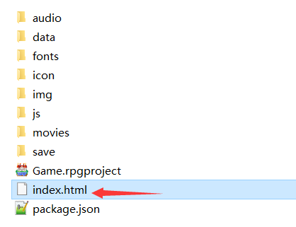

## 运行原理

### 程序入口

**Rmmv游戏本质上就是网页游戏。**

游戏的一切入口都是从index.html进入的。

| 工程文件下的入口                                                                                                                                                      | 部署后的入口（在www文件夹下）                                                                                                                                      |
|-----------------------------------------------------------------------------------------------------------------------------------------------------------------------|--------------------------------------------------------------------------------------------------------------------------------------------------------------------|
|  |  |

### 运行环境

**Nwjs仅仅是个游戏环境启动器，换成别的环境，一样可以启动游戏。**

比如谷歌浏览器、火狐浏览器。

具体可以见链接，其中都有使用说明。

| 链接：<https://pan.baidu.com/s/1HVUxMXaGuZA0nf8fSZUZng>  提取码：rm0p  |
|------------------------------------------------------------------------|

（作者我自己用c++封装了一个网页启动器，也可以成功运行rmmv，但是特别卡……理解意义上玩玩就好了）

在手机上安卓打包也是相当于在手机上建立一个安卓启动器，但是具体作者我并没有试过安卓打包，所以暂时不能提供手机端打包方面的建议。
