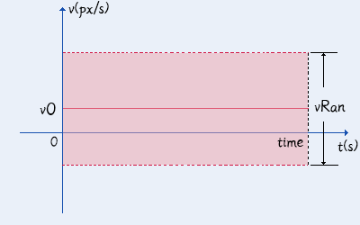
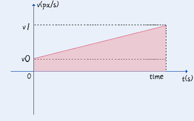
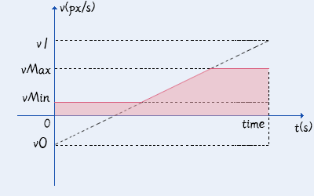
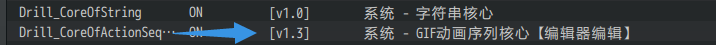

## 概述

### 插件介绍

GIF动画序列是一个act类游戏动画的开始：

◆Drill_CoreOfActionSequence 系统 - GIF动画序列核心

以下是GIF动画序列的子插件：

◆Drill_ActorPortraitureExtend 战斗UI - 高级角色肖像

◆Drill_PictureActionSequence 图片 - GIF动画序列

◆Drill_EventActionSequence 行走图 - GIF动画序列

在了解当前难懂的文档和名词前，

建议你先去试用小工具：GIF动画序列编辑器（DrillGIFActionSequenceEditor）

{width="2.9in"
height="2.4531233595800526in"}

### 名词索引

以下你可以按住ctrl键点击下面的词，可以直接定位到想了解的名词：

  -----------------------------------------------------------------------
  动画序列          [动画序列](#动画序列-1)
                    [底层变换唯一性](#底层变换唯一性)
  ----------------- -----------------------------------------------------
  状态元            [状态元](#状态元-1) [状态名](#状态名)
                    [状态元集合](#状态元集合)

  动作元            [动作元](#动作元-1) [动作名](#动作名)
                    [优先级](#优先级)
  -----------------------------------------------------------------------

### 子插件文档

以下 子插件 有相关插件说明文档：

+--------------------------------+-------------------------------------+
| 子插件名称                     | 文档名称                            |
+================================+=====================================+
| Drill_ActorPortraitureExtend   | 5.战斗UI \> 关于高级角色肖像.docx   |
|                                |                                     |
| 战斗UI - 高级角色肖像          |                                     |
+--------------------------------+-------------------------------------+
| Drill_EventActionSequence      | 7.行走图 \>                         |
|                                | 关于行走图GIF动画序列.docx          |
| 行走图 - GIF动画序列           |                                     |
+--------------------------------+-------------------------------------+

### 插件关系

GIF动画序列核心的插件关系如下图。

### 思维导图

GIF动画序列核心结构的思维导图如下：（调整一下word右下角的缩放率，可以看清小字）

## 动画序列

### 定义

[]{#动画序列-1
.anchor}**动画序列**：动画序列是一个完整的盒子，每个动画序列都包含成批量的GIF切片，即状态元
与 动作元。

动画序列、GIF动画序列、GIF动作序列 是同一个东西，只是称呼不同。

（就目前情况看，live2d动画序列是不可能成功写出插件了，所以只有GIF动画序列了。）

**放映动画序列：**要操作这个动画序列盒子，需要从外部输入要播放的动作名、状态名、状态名列表。动画序列接收到输入后，按情况播放不同GIF图像。

如果动画序列中没有指定的状态名、动作名，则没有任何效果。

相关名称定义可以去看后面章节的：[状态名](#状态名) 、[动作名](#动作名)。

[]{#底层变换唯一性 .anchor}**底层变换唯一性**：脚本上，动画序列 只变换
图片资源（bitmap），其它数据全都不影响（平移xy、中心锚点anchor、缩放拉伸scale等都不变）。

也就是说，动画序列中，不能自定义额外的平移、拉伸等效果，需要与其它动作效果插件组合使用才行。

### 状态元

[]{#状态元-1 .anchor}**状态元**：状态元本质上就是一个GIF切片，用于表示
持续执行的状态。

比如 小爱丽丝静止的GIF状态，小爱丽丝行走时的GIF状态。

**状态元自循环**：如果状态元集合中只有一个状态元，那么这个状态元会单独循环播放。

[]{#状态名
.anchor}**状态名**：即状态元的名称，设计前需要自定义此名称，会作为标识由外部调用。

下图中的"小爱丽丝静止"即为状态名。

[]{#状态元集合
.anchor}**状态元集合**：用于存放多个状态元的集合，这个集合可以随机播放状态元。

**权重**：是指状态元被随机抽中的概率。常用的状态元可设置高权重，这样被随机抽中的概率会更大。

### 状态元设置

[]{#默认状态元集合
.anchor}**默认状态元集合**：指动画序列启用后，默认执行的状态元集合。该序列必须配置至少一个状态元，不然在动画序列载入后，你将看不见任何图像。

{width="4.708333333333333in"
height="2.4703729221347333in"}

[]{#状态元命名
.anchor}**状态元命名**：状态元的名称是完全自定义的。在使用插件指令调用动画序列时，将会直接使用状态元的名称，所以在设计名称时，最好多考虑一下起名方式。

{width="3.716666666666667in"
height="1.7080260279965005in"}

{width="4.883333333333334in"
height="1.3916262029746282in"}

### 动作元

[]{#动作元-1 .anchor}**动作元**：动作元本质上也是一个GIF切片，用于表示
临时执行一次的动作。

与状态元不同，动作元激活后，会在状态元集合中插播且只播放一次。

[]{#动作名
.anchor}**动作名**：即动作元的名称，设计前需要自定义此名称，会作为标识由外部调用。下图中的"小爱丽丝攻击"即为动作名。

[]{#优先级
.anchor}**优先级**：优先级低的动作元播放时，可以被后来的优先级高的动作元中断并播放。

优先级低的、优先级相同的 动作元 不会中断当前 动作元。

优先级低的、优先级相同的 动作元 也不会中断当前 状态元。

无法中断的动作元，会被取消。

## 配置方法

核心配置有两种方法：

[小工具配置](#小工具配置)

[直接配置](#直接配置简易gif)

这两个方法是独立操作的，互不干扰。

另外，推荐使用小工具配置，直接配置太麻烦了。

### 资源准备

资源的大小没有限制，可以是立绘、肖像，也可以是小像素行走图。

注意，所有帧都必须单独设成一张图片。

{width="2.8583333333333334in"
height="2.329737532808399in"}

{width="3.7333333333333334in"
height="3.158043525809274in"}

GIF动画序列的帧数不限，可以通过动态立绘软件（比如live2d）导出100张以上的图片，然后配置到
动作元或状态元 中。

![F:\\rpg
mv箱\\\_N0M1Z%(3OS_W3XVOO6O5\]N.png](./MediaFolder/media/image19.png){width="5.321376859142608in"
height="3.3333333333333335in"}

如果你是从外面找到的素材，最好将这些素材进行 **重新命名**
，因为后期这些素材将会全部放在同一个文件夹，需要保证这些文件名不会重名。

（下图为东方非想天则的素材示意图......好像不小心截取到了威严满满的抱头蹲防。。）

![C:\\Users\\lenovo\\AppData\\Roaming\\Tencent\\Users\\1355126171\\QQ\\WinTemp\\RichOle\\Z\[\~3\`34{M0\$DX\]%M2\$057S2.png](./MediaFolder/media/image20.png){width="5.34375in"
height="3.8561832895888015in"}

### 小工具配置

直接配置动画序列会非常麻烦，这里作者我用c++写了个小工具。

工具名称叫：GIF动画序列编辑器（DrillGIFActionSequenceEditor）

这个工具能够载入rmmv的数据，保存为.drillas工程文件，配置完的内容可以导回到rmmv配置中。

{width="5.325in"
height="3.3978444881889764in"}

该工具在"插件小工具"文件夹中。

具体用法你可以打开软件，并查看帮助文档："关于GIF动画序列核心编辑器.docx"。

### 直接配置（简易GIF）

直接点开插件核心，配置GIF，只需要编辑一个状态元即可。

不过，需要保证默认 状态元集合的配置 与 状态元名称 保持一致。

![C:\\Users\\lenovo\\AppData\\Roaming\\Tencent\\Users\\1355126171\\QQ\\WinTemp\\RichOle\\\[1C\~{3\$BDUX0RZM)315\]I\`N.png](./MediaFolder/media/image22.png){width="5.697916666666667in"
height="2.3160126859142607in"}

配置后，可以使用动画序列装饰到 图片 中。

{width="5.520833333333333in"
height="1.2916666666666667in"}

{width="1.3854166666666667in"
height="0.7916666666666666in"}

**图片延迟问题：**有时候动画序列在图片建立后，不能立即设置动画序列，不然会使得动画序列找不到对象进行初始化。这时应该等1帧再设置。

{width="5.25in"
height="1.2894291338582677in"}

### 直接配置（完整动画序列）

完整的配置相对比较麻烦。

**1）配置关系**

需要注意的是，核心中配置的动画序列，**并不能直接使用**，只是将
名称和GIF片段 组合到一起封装成一个可用的盒子。

子插件才能对该盒子进行调用。

**2）动画序列结构**

在编辑器中直接打开动画序列，选择一个动画序列。

![C:\\Users\\lenovo\\AppData\\Roaming\\Tencent\\Users\\1355126171\\QQ\\WinTemp\\RichOle\\H\$AXY\]DP21U)VCLJEKAAL73.png](./MediaFolder/media/image26.png){width="4.15625in"
height="2.232965879265092in"}

可以看到 默认集合、状态元列表、动作元列表 三个配置项。

![C:\\Users\\lenovo\\AppData\\Roaming\\Tencent\\Users\\1355126171\\QQ\\WinTemp\\RichOle\\Y\[CI{\]2A0P\$VU%H%LDIZ\$NL.png](./MediaFolder/media/image27.png){width="3.6041666666666665in"
height="1.7080971128608924in"}

状态元名称命名时要注意区分，可以去看看：
[默认状态元集合](#默认状态元集合) 、 [状态元命名](#状态元命名) 。

{width="5.28125in"
height="2.432726377952756in"}

**3）配置大量资源方法**

比如下图有45张小爱丽丝图片需要配置。

![C:\\Users\\lenovo\\AppData\\Roaming\\Tencent\\Users\\1355126171\\QQ\\WinTemp\\RichOle\\\]TI)NJ9\[1}USDN}P\]G\`WTGB.png](./MediaFolder/media/image29.png){width="5.5625in"
height="3.0604090113735785in"}

先配置一个"小爱丽丝 (1)"后，点击文本。

{width="3.8843919510061244in"
height="1.5in"}

{width="3.867230971128609in"
height="1.5416666666666667in"}

将文本复制到记事本中，按照下面的格式，一次写2、3、4、5、6......直到45.

逗号必须是英文逗号，引号也必须是英文引号。

{width="3.7663057742782153in"
height="1.09375in"}

写完后，按Ctrl+A全选，然后复制粘贴到刚才的文本中。

![C:\\Users\\lenovo\\AppData\\Roaming\\Tencent\\Users\\1355126171\\QQ\\WinTemp\\RichOle\\UQAV\]D5J%0S}\_YE811K%A\~U.png](./MediaFolder/media/image33.png){width="3.814583333333333in"
height="1.0866240157480316in"}

{width="3.8017825896762907in"
height="1.4583333333333333in"}

这样就能通过敲数字的方法，快速添加大量资源文件了。

{width="3.2295286526684164in"
height="2.8541666666666665in"}

4）**子插件配置**

当前完成的配置，只是 GIF动画序列核心 的配置。

完成配置后，还要在子插件中，对核心的 状态元、动作元 进行连接。

具体需要去看相关子插件文档：[子插件文档](#子插件文档)。

## 常见问题

### 配置的动作元无法播放

动画序列核心v1.2及以前版本，设定上存在一些问题，

**当 动作元优先级 低于 状态元优先级 时，不会播放该动作元。**

也就是说，如果没有任何配置，默认优先级都为0时，会导致动作元无法播放。

你可以更新核心到v1.3或以上版本，

{width="5.768055555555556in"
height="0.3611111111111111in"}

也可以将动作元优先级设为1以上。

{width="4.618055555555555in"
height="2.261768372703412in"}
