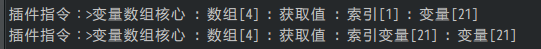

## 概述

### 相关插件

以下是与全局存储有关的插件：

◆Drill_GlobalVariable 系统 -- 跨存档的变量

◆Drill_SceneSelfplateA 面板 -- 全自定义信息面板A

◆Drill_SceneSelfplateB 面板 -- 全自定义信息面板B

◆Drill_SceneSelfplateC 面板 -- 全自定义信息面板C

◆Drill_SceneSelfplateD 面板 -- 全自定义信息面板D

◆Drill_SceneSelfplateG 面板 -- 全自定义信息面板G

◆Drill_SceneSelfplateH 面板 -- 全自定义信息面板H

◆MOG_Music_Book 面板 -- 音乐书

◆MOG_PictureGallery 面板 -- 画廊

◆Drill_TitleBackground 标题 -- 多层标题背景

◆Drill_TitleCircle 标题 -- 多层标题魔法圈

◆Drill_TitleParticles 标题 -- 多层标题粒子

◆Drill_TitleGif 标题 -- 多层标题gif

◆Drill_TitleVideo 标题 -- 多层标题视频

◆Drill_TitleScene 标题 -- 全自定义标题界面

◆Drill_X\_GlobalOptimization 系统 - 全局存储性能优化\[扩展\]

### 插件关系

全局存储的插件相互之间没有依赖关系，如下图所示：

## 结构

### 定义

**正常存储**：将所有游戏存档保存在固定编号的存档中。新开游戏，所有数据清空。

**全局存储**：通过插件指令后台存储，将数据存储在全局文件中。新开游戏不会改变已存储的数据。

### 存储文件

rmmv没有那么深沉隐秘的存储，所有存储的文件都在save文件夹中，云端也是在服务器的save文件夹中。

**你如果经常测试全局存储的变量，要记得及时清理这些文件，避免坏档干扰。**

{width="5.768055555555556in"
height="1.5441568241469816in"}

**你只要把save文件夹中的所有文件清空，那么游戏的所有全局存储和存档都会被清空。**

（大部分metagame游戏也是通过这种全局方式存储，不过有的为了完美，将全局存储的文件藏在c盘中非常隐秘的位置，就像病毒一样，删游戏也无法改变游戏进度。）

## 其他说明

全局变量在 **测试战斗**
时，可能会自己存储global文件，为避免影响，记得随时清理save里面的全部文件。
