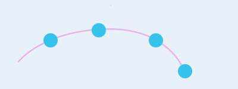
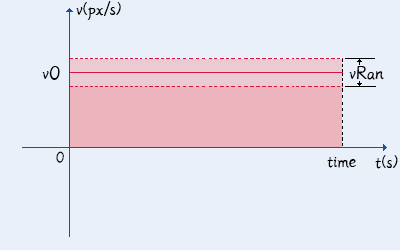
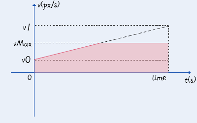
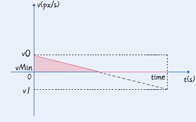
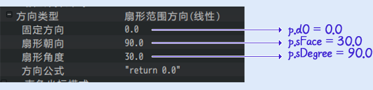

## 概述

### 插件介绍

核心插件：

◆Drill_CoreOfBallistics 系统 - 弹道核心

子插件：

◆Drill_CoreOfGaugeMeter 系统 - 参数条核心

◆Drill_CoreOfShatterEffect 系统 - 方块粉碎核心

◆Drill_CoreOfSelectableButton 系统 - 按钮组核心

◆Drill_STG\_\_core STG - 引擎

**弹道：**是指能够描述 单个或一群
粒子/碎片/子弹运动的轨迹，是程序经过**数学计算**后的结果数据集。此定义与实际的弹道学有一些区别。

{width="3.841666666666667in"
height="1.4406255468066491in"}

由于弹道同时涉及 数学公式和代码定义
，且许多插件都基于弹道移动，所以此文档需要全文反复学习。（简单过目即可）

### 插件关系

弹道核心属于数学计算，服务于其他的核心或一般插件，关系如下：

## 弹道模式

核心提供了下列弹道的移动模式。

注意，相关子插件会根据自身特殊的情况，提供部分模式的设置，但不一定会提供所有模式的支持。

### 直角坐标模式

直角坐标模式通过 x速度 + y速度 控制轨迹。

时间、速度已知，路程未知。

+-----------------------------------------------------------------------+
| **X速度(vx)**：正数向右，负数向左。单位 像素/帧。见 [类型 -           |
| 速度](#类型---速度) 。                                                |
|                                                                       |
| **Y速度(vy)**：正数向下，负数向上。单位 像素/帧。见 [类型 -           |
| 速度](#类型---速度) 。                                                |
|                                                                       |
| （注意，y速度正数向下，是反的。）                                     |
+=======================================================================+
+-----------------------------------------------------------------------+

{width="4.155555555555556in"
height="1.5583333333333333in"}

### 极坐标模式

极坐标模式通过 速度+方向 控制轨迹。

时间、速度已知，路程未知。

+-----------------------------------------------------------------------+
| **速度(v)**：正数沿着方向移动，负数反向移动。单位 像素/帧。见 [类型 - |
| 速度](#类型---速度) 。                                                |
|                                                                       |
| **方向(θ)**：0朝向右，90朝下，-90朝上，顺时针规律。单位 角度。见      |
| [类型 - 方向](#类型---方向) 。                                        |
|                                                                       |
| （可以写超过360的数。390度与30度的方向一样。）                        |
+=======================================================================+
+-----------------------------------------------------------------------+

{width="4.133333333333334in"
height="1.55in"}

### 两点式

两点式通过 固定模式+目标点 控制轨迹。

时间、路程已知，速度未知。

**起始点：**粒子移动前所在的位置。

**目标点：**分为绝对坐标与相对坐标，用于计算当前物体到目标物体的路程。

+-----------------------------------------------------------------------+
| **固定模式：**由于时间和路程是固定量，只有速度是可控制变量。          |
|                                                                       |
| 根据速度的不同变化方式，可分成多种模式。见 [类型 -                    |
| 两点式](#类型---两点式) 。                                            |
+=======================================================================+
+-----------------------------------------------------------------------+

{width="4.2in" height="1.575in"}

## 参数类型

### 类型 - 速度

**1）初速度**

公式参数名：p.v0 。

速度1，表示 1像素/帧。 速度1.5，表示 1.5像素/帧。

速度可以为负数，表示反方向移动。

只有初速度时，表示匀速运动，可见：[公式：只初速度](#公式只初速度)。

{width="3.955553368328959in"
height="1.4833333333333334in"}

**2）随机波动量**

公式参数名：p.wave 。

在粒子的速度的基础上，添加/减少的随机速度量。

比如，初速度为10，波动量为8，那么速度为：6\~14之间。（10-4 \~ 10+4）

初速度+波动量
仍然为匀速运动，可见：[公式：初速度+波动量](#公式初速度波动量)。

{width="3.977777777777778in"
height="1.4916666666666667in"}

**3）加速度**

公式参数名：p.a 。

粒子在运动过程中，速度逐渐改变的加速度值。

极坐标模式中：无论加速度如何变化，都**不会**影响运动方向。

直角坐标模式中：如果vy的加速度化和vx的加速度**不一样**，那么就会间接改变这个粒子的实际方向。比如，vx匀速+vy匀加速
= 抛物线。

{width="4.0in" height="1.5in"}

**4）速度最大/最小值**

公式参数名：p.vMax p.vMin 。

设置限制后，无论速度如何变化，都会保持在最大速度和最小速度之内。

比如，一个不断减速的粒子，如果设置了最小速度0，则会停下来。否则粒子速度将会越来越小，变成负数，朝反方向开始移动。

**5）路程计算公式**

见后面的章节 [路程计算公式](#路程计算公式) 。

### 类型 - 方向

**1）方向单位**

主要方向单位为 角度 ，部分设置里面可能会使用弧度，360（角度）=
2π（弧度）。

如果特殊情况要求输入弧度时，可用3.14代替π。

**2）四周扩散**

四周扩散，即以中心点为基准，方向随机。

{width="3.9583333333333335in"
height="1.484375546806649in"}

**3）扇形范围**

图中的朝向的角度为0，90度朝下，-90朝上，顺时针规则。

扇形角度为360时 = 四周扩散

{width="3.9916666666666667in"
height="1.4968755468066492in"}

{width="4.008333333333334in"
height="1.5031255468066491in"}

**4）方向计算公式**

见后面的章节 [方向计算公式](#方向计算公式) 。

### 类型 - 两点式

两点式被 窗口、按钮组、图片 等相关插件频繁使用。

其最大的特点就是时间固定，并且最终时间一定会到达终止点。

**1) 不移动**

不移动是指：指定的粒子仍然会保持在起始点，永远 不会 到目标点。

不移动就是字面意思上的真的不移动。

（如果你要实现瞬移到目标点功能，使用匀速移动，移动时间为1帧）

{width="3.7796686351706037in"
height="1.4166666666666667in"}

**2) 匀速移动**

匀速移动根据 已知路径 除以 已知时间 得到速度。

{width="3.7333333333333334in"
height="1.3993000874890638in"}

**3) 增减速移动**

增减速移动中，路程被分为两个部分，前半部分是匀加速，后半部分是匀减速。

{width="3.725in"
height="1.3961767279090114in"}

**4) 弹性移动**

弹性移动实际上就是是有初速度的匀减速移动，只是这种移动看起来更加自然而已。

{width="4.083333333333333in"
height="1.5304844706911636in"}

**5) 抛物线移动**

抛物线移动会额外受到 初速度+方向 的影响，但最终一定会到达目标点。

如果方向与目标点一致，则效果为匀加速运动。

{width="3.8854166666666665in"
height="1.4579429133858268in"}

{width="3.8541666666666665in"
height="1.4462160979877516in"}

注意，粒子到达终止点后，终止点的速度绝对值一般都会比起始点的速度绝对值大。也就是说，如果持续进行抛物线移动，那么甩动的轨迹会越来越大。

## 数学公式

### 公式关系

具体公式脚本，你可以直接打开Core_Of_Ballistics.js 脚本进行查看学习哦。

#### 可用变量与常量

**变量**：是指在游戏中，随时变化的量。

可以简单理解为：插件指令调用，设置的数字，就是变量。

**常量**：是指在游戏编辑器中，配置的固定的量，在游戏中不会变化。

可以简单理解为：打开插件配置，然后你在配置里面设置了一个固定的值。

速度、加速度等设定，都是通过路程计算公式配置的。

无论是极坐标模式，还是直角坐标模式，路程都决定了粒子**最终所在的位置**。

#### 直接写数字常量

**直接写数字常量**：如果你使用的是公式，那么可以直接写数字代替常量，因为常量只是一个可扩展编辑的量，在游戏中不会变化。

举个例子，速度公式如下：

+-----------------------------------------------------------------------+
| var result = p.v0 \* p.time; //（速度x时间）                          |
|                                                                       |
| return result;                                                        |
+=======================================================================+
+-----------------------------------------------------------------------+

如果你在配置中写了初速度:5.0，

{width="3.1333333333333333in"
height="1.175in"}

那么与你写的下面的自定义公式是完全一样的：

+-----------------------------------------------------------------------+
| var result = 5 \* p.time; //（速度x时间）                             |
|                                                                       |
| return result;                                                        |
+=======================================================================+
+-----------------------------------------------------------------------+

注意，p.time不能写成数字，因为在游戏中是实时变化的量。

如果公式中没有变量，那么这个粒子将持续固定在一个具体的位置。

### 路程计算公式

#### 可用变量与常量

**变量**：是指在游戏中，随时变化的量。

**常量**：是指在游戏编辑器中，配置的固定的量，在游戏中不会变化。

  ---------------------------------------------------------------------------------------------------
  变量名    中文名       取值范围                     描述
  --------- ------------ ---------------------------- -----------------------------------------------
  p.index   粒子序号值   整数，0 至 p.num-1值         粒子定义的Id序号值。

  p.time    时间值       整数，0 至                   移动的时间范围值。
                         游戏中设定的时间值           

  p.ran     随机值       小数，0.0 至 1.0 范围随机值  插件内部的可控随机值，不建议用Math.random()。

  p.num     粒子数量     整数，游戏中设定的粒子数量   游戏中设定的粒子数量。
  ---------------------------------------------------------------------------------------------------

  -----------------------------------------------------------------------
  常量名     中文名      说明
  ---------- ----------- ------------------------------------------------
  p.v0       初速度      无特殊规定。

  p.wave     波动量      一般该常量与随机值一起使用。

  p.a        加速度      无特殊规定。

  p.vMax     最大速度    无特殊规定。

  p.vMin     最小速度    无特殊规定。
  -----------------------------------------------------------------------

公式关系说明可以看前面章节：[公式关系](#公式关系) 。

{width="5.768055555555556in"
height="1.8291666666666666in"}

**\
**

#### 公式：只初速度

众所周知，r = v\*t，路程=时间\*速度。

匀速运动的情况最简单，长方形面积就是路程。

{width="3.3833333333333333in"
height="2.1179669728783903in"}

只初速度的v-t图

公式如下：

用到了 变量 p.time，常量 p.v0 。

+-----------------------------------------------------------------------+
| var result = p.v0 \* p.time; //（速度x时间）                          |
|                                                                       |
| return result;                                                        |
+=======================================================================+
+-----------------------------------------------------------------------+

#### 公式：初速度+波动量

波动量是指，初速度有一定的随机性，可以在上下进行浮动。

简单来说，就是在初速度公式上，额外增加一个波动变化的量。

在出现大量粒子时，通过波动量能够有效让他们散开。

{width="3.6083333333333334in"
height="2.2588167104111987in"}

初速度+波动量的v-t图

公式如下：

用到了 变量 p.time/p.ran，常量 p.v0/p.wave 。

+-----------------------------------------------------------------------+
| var v_ran = p.wave \* (p.ran - 0.5); //（根据波动量，算出波动速度）   |
|                                                                       |
| var result = (p.v0 + v_ran) \* p.time; //（随机速度x时间）            |
|                                                                       |
| return result;                                                        |
+=======================================================================+
+-----------------------------------------------------------------------+

需要注意的是，如果vRan波动量比v0初速度还大，那么就会出现速度为负值的情况。

速度为负，则会朝 相反 的方向移动。

{width="3.25in"
height="2.0345002187226595in"}

初速度+波动量的v-t图

#### 公式：初速度+波动量+加速度

匀加速运动的公式为：r=vt+½at²，也就是图中的长方形和三角形的和。

v0为初速度，a为加速度，time为时间。

则图中的v1=v0+a\*time。

则公式为： **v0\*time+0.5\*a\*time\*time**

{width="3.4166666666666665in"
height="2.138833114610674in"}

初速度+波动量+加速度的v-t图

公式如下：

用到了 变量 p.time/p.ran，常量 p.v0/p.wave/p.a 。

+-----------------------------------------------------------------------+
| var v_ran = p.wave \* (p.ran - 0.5); //（根据波动量，算出波动速度）   |
|                                                                       |
| var result = (p.v0 + v_ran) \* p.time + 0.5 \* p.a \*p.time\*p.time;  |
|                                                                       |
| return result;                                                        |
+=======================================================================+
+-----------------------------------------------------------------------+

（如果你熟悉js的一些数学函数用法，也可以使用 Math.pow(time,2)
表示时间的平方 ）

如果出现 速度v0 为负数情况，公式依然成立。

你将会看到一个粒子逐渐停下，然后朝反方向持续加速的过程。

{width="3.4478160542432197in"
height="2.158333333333333in"}

初速度+波动量+加速度的v-t图

#### 公式：初速度+波动量+加速度+最大最小

最大速度和最小速度是一个十分特殊的情况。

它会将速度变化分成多段。

如果速度超出了最大速度，那么就**减去**vMax多出的面积。

如果速度低于了最小速度，那么就**加上**vMin多出的面积。

{width="3.6741196412948383in"
height="2.3in"}

最大速度切割v-t图

{width="3.7083333333333335in"
height="2.3214162292213474in"}

最小速度切割v-t图

{width="3.775in"
height="2.3631496062992126in"}

最大最小速度组合切割的v-t图

v0为初速度，a为加速度，time为时间，vMax为最大速度，vMin为最小速度。

公式如下：

用到了 变量 p.time/p.ran，常量 p.v0/p.wave/p.a/p.vMax/p.vMin 。

+-----------------------------------------------------------------------+
| var v_ran = p.wave \* (p.ran - 0.5); //（根据波动量，算出波动速度）   |
|                                                                       |
| // \> 加速度公式                                                      |
|                                                                       |
| var v1 = (p.v0 + v_ran) + p.a \* p.time;                              |
|                                                                       |
| var d = (p.v0 + v_ran)\*p.time + 0.5 \* p.a \*p.time\*p.time;         |
|                                                                       |
| var result = d;                                                       |
|                                                                       |
| // \> 分段函数（超过上限/下限，将减去多出的路程值）                   |
|                                                                       |
| if( v1 \>= p.vMax ){                                                  |
|                                                                       |
| var m_v = v1 - p.vMax;                                                |
|                                                                       |
| var m_t = (v1 - p.vMax) / p.a;                                        |
|                                                                       |
| result = d - m_v\*m_t + 0.5 \* p.a \*m_t\*m_t;                        |
|                                                                       |
| }                                                                     |
|                                                                       |
| if( v1 \<= p.vMin ){                                                  |
|                                                                       |
| var m_v = v1-p.vMin;                                                  |
|                                                                       |
| var m_t = (v1-p.vMin)/a;                                              |
|                                                                       |
| result = d - m_v\*m_t + 0.5 \* p.a \*m_t\*m_t;                        |
|                                                                       |
| }                                                                     |
|                                                                       |
| return result;                                                        |
+=======================================================================+
+-----------------------------------------------------------------------+

#### 自定义公式

当你使用自定义公式时，之前提及的常量（见[可用变量与常量](#可用变量与常量-1)）都可以加入设计，

你甚至可以作为其他特殊的参数进行使用。

举个例子，你写了下面的公式：

+-----------------------------------------------------------------------+
| var result = p.v0 \* p.v0 \* p.time \* p.id;                          |
|                                                                       |
| return result;                                                        |
+=======================================================================+
+-----------------------------------------------------------------------+

公式中用到了 p.v0常量，那么，

配置类型为：路程计算公式，配置初速度为：5.0

{width="3.1333333333333333in"
height="1.175in"}

在公式中，将会等价于：

var result = 5.0 \* 5.0 \* p.time \* p.id

你所写自定义公式的 p.v0 真实含义 可能并不表示"初速度"的意思，

但是该参数的确可以作为一个配置值来使用。

注意，设计公式时，常量是最后再考虑加的参数，设计公式时，不要把变量和常量放一起写，会把自己绕晕。

### 方向计算公式

#### 可用变量与常量

**变量**：是指在游戏中，随时变化的量。

**常量**：是指在游戏编辑器中，配置的固定的量，在游戏中不会变化。

  ---------------------------------------------------------------------------------------------------
  变量名    中文名       取值范围                     描述
  --------- ------------ ---------------------------- -----------------------------------------------
  p.index   粒子序号值   整数，0 至 p.num-1值         粒子定义的Id序号值。

  p.time    时间值       整数，0 至                   移动的时间范围值。
                         游戏中设定的时间值           

  p.ran     随机值       小数，0.0 至 1.0 范围随机值  插件内部的可控随机值，不建议用Math.random()。

  p.num     粒子数量     整数，游戏中设定的粒子数量   游戏中设定的粒子数量。
  ---------------------------------------------------------------------------------------------------

  ------------------------------------------------------------------------
  常量名      中文名      描述
  ----------- ----------- ------------------------------------------------
  p.d0        固定方向    无特殊规定。

  p.sFace     扇形朝向    无特殊规定。

  p.sDegree   扇形范围    无特殊规定。
  ------------------------------------------------------------------------

公式关系说明可以看前面章节：[公式关系](#公式关系) 。

{width="5.768055555555556in"
height="1.3895833333333334in"}

#### 公式：固定方向

指定一个方向，就是一个方向，不会改变。

由于没有改变的成分，所以只用到了常量。

注意，如果你同时发射10个子弹，这10个子弹的 方向
都会重叠在一起，如果其速度配置也没有随机波动量散开，那么将只看到1个子弹。

公式如下：

用到了 变量 无， 常量 p.d0 。

+-----------------------------------------------------------------------+
| var result = p.d0; //（固定方向）                                     |
|                                                                       |
| return result;                                                        |
+=======================================================================+
+-----------------------------------------------------------------------+

#### 公式：四周扩散

**1) 四周扩散（线性）**

将一整个圈，按粒子数量平均划分方向值。

{width="3.9583333333333335in"
height="1.484375546806649in"}

公式如下：

用到了 变量 p.index/p.num，常量 p.d0 。

+-----------------------------------------------------------------------+
| var result = p.d0 + 360 \* p.index / p.num;                           |
|                                                                       |
| return result; //（在一个圆圈里，放入固定数量的粒子）                 |
+=======================================================================+
+-----------------------------------------------------------------------+

**2) 四周扩散（随机）**

将一整个圈，随机划分方向值。

公式如下：

用到了 变量 p.ran，常量 p.d0。

+-----------------------------------------------------------------------+
| var result = p.d0 + 360 \* p.ran;                                     |
|                                                                       |
| return result;                                                        |
+=======================================================================+
+-----------------------------------------------------------------------+

**3) 四周扩散（抖动）**

抖动功能，是在固定随机方向的基础上，再进行一次随机偏移。

需要注意的是，由于Math.random 的值不可控，这会造成 重复发射/反向弹道
都不能完美复现原有的轨迹，所以尽量少用。

（这个功能其实挺鸡肋，也不知道在什么情况下用的上）

公式如下：

用到了 变量 p.ran，常量 p.d0。

+-----------------------------------------------------------------------+
| var result = p.d0 + 360 \* p.ran + 30 \* Math.random();               |
|                                                                       |
| return result;                                                        |
+=======================================================================+
+-----------------------------------------------------------------------+

#### 公式：扇形范围方向

**1) 扇形范围方向（线性）**

扇形范围，是指以朝向为基准，向两侧撑开的扇形结构。

注意，扇形范围方向，与 p.d0 固定方向的参数没有任何关系。

{width="3.9916666666666667in"
height="1.4968755468066492in"}

{width="4.008333333333334in"
height="1.5031255468066491in"}

线性的扇形范围需要区分 只一个粒子 和 有两个或以上 的粒子情况。

单独一个粒子时，发射的朝向就是 扇形朝向 。

公式如下：

用到了 变量 p.index/p.num，常量 p.sFace/p.sDegree 。

+-----------------------------------------------------------------------+
| var result = p.sFace;                                                 |
|                                                                       |
| if( p.num \> 1 ){                                                     |
|                                                                       |
| result = p.sFace + p.sDegree \* p.index / (p.num - 1) - p.sDegree/2;  |
|                                                                       |
| }else{                                                                |
|                                                                       |
| result = p.sFace;                                                     |
|                                                                       |
| }                                                                     |
|                                                                       |
| return result;                                                        |
+=======================================================================+
+-----------------------------------------------------------------------+

**2) 扇形范围方向（随机）**

随机的扇形范围，就不需要考虑粒子数量问题了。

公式如下：

用到了 变量 p.ran，常量 p.sFace/p.sDegree 。

+-----------------------------------------------------------------------+
| var result = p.sFace + p.sDegree \* (p.ran - 0.5);                    |
|                                                                       |
| //（根据p.sDegree，算出波动范围方向，与朝向相加即可）                 |
|                                                                       |
| return result;                                                        |
+=======================================================================+
+-----------------------------------------------------------------------+

#### 自定义公式

当你使用自定义公式时，之前提及的常量（见[可用变量与常量](#可用变量与常量-2)）都可以加入设计，

你甚至可以作为其他特殊的参数进行使用。

举个例子，你写了下面的公式：

+-----------------------------------------------------------------------+
| var result = p.d0 \* p.d0 \* p.time \* p.id;                          |
|                                                                       |
| return result;                                                        |
+=======================================================================+
+-----------------------------------------------------------------------+

公式中用到了 p.d0常量，那么，

配置类型为：方向计算公式，配置固定方向为：0.8

{width="3.1166666666666667in"
height="0.7756725721784777in"}

在公式中，将会等价于：

var result = 0.8 \* 0.8 \* p.time \* p.id

你所写自定义公式的 p.d0 真实含义 可能并不表示"固定方向"的意思，

但是该参数的确可以作为一个配置值来使用。

注意，设计公式时，常量是最后再考虑加的参数，设计公式时，不要把变量和常量放一起写，会把自己绕晕。

## 组合公式效果

### 抛物线运动

抛物线是最常用的效果了。

运动轨迹分为x轴和y轴两个方向。（极坐标也可以表示，但是公式比较复杂。）

原理不难理解，举个例子：**平抛运动**（高一物理）

下图中，一个球向一个方向匀速抛出，但是球本身受到 重力加速度
的影响，可以形成一个弧线轨迹。

也就是说，x轴匀速，y轴加速运动，就可以形成抛物线。

{width="3.0541666666666667in"
height="2.125341207349081in"}

由于平抛运动的y轴初速度是0，所以是一个一直向下的抛物线。

如果y轴初速度是负数，那么可以形成先向上，再向下的抛物线轨迹。

比如 子插件 地图UI-漂浮参数数字 配置抛物线弹道后，实现的喷泉抛物线。

{width="2.3451771653543307in"
height="1.45in"}{width="2.9875995188101485in"
height="1.1006944444444444in"}

{width="2.5166666666666666in"
height="1.9154155730533684in"}

### 间隔改变方向运动

### 逆时针圆周运动
