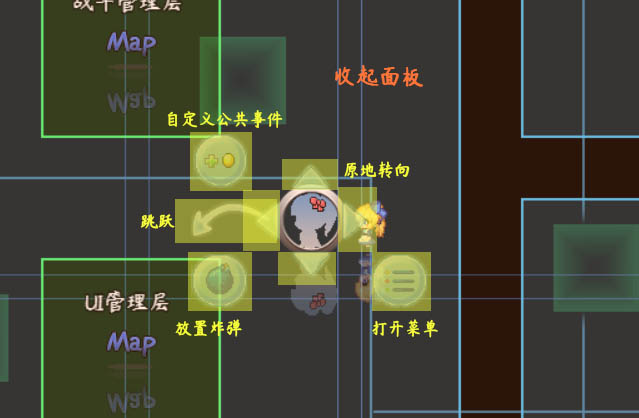

## 概述

### 相关插件

输入设备的相关插件如下：

◆Drill_CoreOfInput 系统 - 输入设备核心

◆Drill_OperateHud 互动 - 鼠标辅助操作面板

◆Drill_OperateKeys 互动 - 键盘手柄按键修改器

目前输入设备分为四种：键盘、手柄、鼠标、触屏。

官网有关于按键的部分说明：（看看就好，介绍没那么详细）

<http://help.rpgmakermv.cn/#page/01_06.html!cn>

### 名词索引

以下你可以按住ctrl键点击下面的词，可以直接定位到想了解的名词：

+----------------+-----------------------------------------------------+
| 键盘与手柄     | [物理按键](#物理按键) [逻辑按键](#逻辑按键)         |
|                | [按键映射](#按键映射)                               |
+================+=====================================================+
| 修改按键映射   | [功能键](#功能键) [基本键](#基本键)                 |
|                | [扩展键](#扩展键)                                   |
+----------------+-----------------------------------------------------+
| 鼠标与触屏     | [鼠标按键](#鼠标按键) [鼠标悬停](#鼠标悬停)         |
|                | [鼠标滚轮](#鼠标滚轮)                               |
|                |                                                     |
|                | [单指轻触](#单指轻触) [双指轻触](#双指轻触)         |
+----------------+-----------------------------------------------------+

## 键盘与手柄

### 定义

[]{#物理按键
.anchor}**物理按键：**指真实世界键盘上存在的按键，比如z,x,c,v键等。

[]{#逻辑按键
.anchor}**逻辑按键：**指游戏中用于划分特定功能的按键，比如确定键,取消键,跳跃键等。

[]{#按键映射 .anchor}**按键映射：**是指 物理按键 映射到 逻辑按键
的过程。

一个正常的按键流程如下：

游戏功能中也可能会直接指定 某个物理按键
按下后才能生效，这样的游戏功能，无法支持键盘改键。

### 什么是逻辑按键

这里几个逻辑按键的例子：

**1）任意键**

任意键 在键盘上并不是真实存在的，你按一个"a"键，就能够触发 任意键。

（在电脑刚刚普及的时候，曾有大量用户打电话给厂商问任意键在键盘上哪个地方......）

但是，游戏中的"任意键"真的就是任意的键了吗？我按一下"ctrl键"，你看看那个游戏会不会有反应。

因此，任意键是一个我们在口头上用于表示一个功能的按键，而这些按键并不唯一。

具体还与游戏设置有关系。

**2）确定键**

接着，什么是确定键？ 同样的道理，"z"键，是确定键；按"回车"，也是确定键。

多个真实物理的按键，可以表示同样的
确定键，可见，确定键也不是唯一的按键。

这种多个 物理按键 表示同一个 逻辑按键 的过程，称为"按键映射"。

你可以通过插件修改 确定键 的按键映射，具体可以看看后面章节：
[修改按键映射](#修改按键映射)。

{width="3.8104625984251967in"
height="0.9166666666666666in"}

### 控制方法

**1）rmmv默认**

Rmmv默认的 物理按键 与 逻辑按键 关系如下：

+-----------+------------------+------------------+-------------------+
| **功能**  | **键盘**         | **手柄\*1**      | **逻辑按键**      |
+===========+==================+==================+===================+
| 移动      | 方向键 上，      | 摇杆 上，        | 上（\'up\'）      |
|           |                  |                  |                   |
|           | numpad 8 键      | 方向键 上        |                   |
+-----------+------------------+------------------+-------------------+
| 移动      | 方向键 下，      | 摇杆 下，        | 下（\'down\'）    |
|           |                  |                  |                   |
|           | numpad 2键       | 方向键 下        |                   |
+-----------+------------------+------------------+-------------------+
| 移动      | 方向键 左，      | 摇杆 左，        | 左（\'left\'）    |
|           |                  |                  |                   |
|           | numpad 4键       | 方向键 左        |                   |
+-----------+------------------+------------------+-------------------+
| 移动      | 方向键 右，      | 摇杆 右，        | 右（\'right\'）   |
|           |                  |                  |                   |
|           | numpad 6键       | 方向键 右        |                   |
+-----------+------------------+------------------+-------------------+
| 确定      | enter回车，      | A键              | 确定键（\'ok\'）  |
|           |                  |                  |                   |
|           | 空格，           |                  |                   |
|           |                  |                  |                   |
|           | z键              |                  |                   |
+-----------+------------------+------------------+-------------------+
| 取消      | Esc键，          | B键              | 取消              |
|           |                  |                  | 键（\'cancel\'）  |
|           | Insert键，       |                  |                   |
|           |                  |                  |                   |
|           | x键，            |                  |                   |
|           |                  |                  |                   |
|           | numpad 0 键      |                  |                   |
+-----------+------------------+------------------+-------------------+
| 加速      | shift键          | X键              | 加                |
|           |                  |                  | 速键（\'shift\'） |
+-----------+------------------+------------------+-------------------+
| 菜单      | Esc键，          | Y键              | 菜                |
|           |                  |                  | 单键（\'menu\'）  |
|           | Insert键，       |                  |                   |
|           |                  |                  |                   |
|           | x键，            |                  |                   |
|           |                  |                  |                   |
|           | numpad 0 键      |                  |                   |
+-----------+------------------+------------------+-------------------+
| 上一页    | PgUp键，         | LB键             | 上一              |
|           |                  |                  | 页（\'pageup\'）  |
|           | q键              |                  |                   |
+-----------+------------------+------------------+-------------------+
| 下一页    | PgDn键，         | RB键             | 下一页            |
|           |                  |                  | （\'pagedown\'）  |
|           | w键              |                  |                   |
+-----------+------------------+------------------+-------------------+
| 辅助tab   | Tab键            | 无               | 辅助              |
|           |                  |                  | Tab键（\'tab\'）  |
+-----------+------------------+------------------+-------------------+
| 测        | F9键             | 无               | 游戏测试Deb       |
| 试中Debug |                  |                  | ug键（\'debug\'） |
+-----------+------------------+------------------+-------------------+
| 测        | Ctrl键，         | 无               | 游戏测试穿墙      |
| 试中穿墙  |                  |                  | 键（\'control\'） |
|           | Alt键            |                  |                   |
+-----------+------------------+------------------+-------------------+

1.辅助tab键在rmmv本体中并没有被使用。相关子插件可能会用到该插件。

2.测试Debug键，是指只在测试中生效的按键，游戏部署后将不再有效。

**2）Drill插件默认**

Drill插件 **默认的** 物理按键 与 逻辑按键 关系如下：

  -------------------------------------------------------------------------------
  **功能**     **键盘**            **手柄\*1**         **逻辑按键**
  ------------ ------------------- ------------------- --------------------------
  跳跃         q键                 LB键                跳跃键（\'jump\'）

  原地转向     w键                 功能键 + 方向键     原地转向键（\'rotate\'）

  举起花盆     z键                 A键                 举起花盆键（\'pick\'）

  投掷花盆     z键                 A键                 举起花盆键（\'throw\'）

  放置炸弹     c键                 功能键 + X键        放置炸弹键（\'bomb\'）
  -------------------------------------------------------------------------------

### 特殊控制

此部分特殊控制是 软件程序内部 的控制功能，无法修改。

  ------------------------------------------------------------------------
  **功能**               **键盘**         **手柄\*1**     **逻辑按键**
  ---------------------- ---------------- --------------- ----------------
  FPS开关                F2键             无              无

  (浏览器) 拉伸开关      F3键             无              无

  (浏览器) 全屏模式      F4键             无              无

  重启游戏               F5键             无              无

  测试中开发者模式       F8键             无              无
  ------------------------------------------------------------------------

**\
**

### 修改按键映射

你需要通过下面的插件 ，修改上表中的 按键映射。

◆Drill_OperateKeys 互动 - 键盘手柄按键修改器

按键修改器中引入了下列几个新的概念规则：

**手柄的**[]{#功能键
.anchor}**功能键：**因为手柄的键位少，所以为了支持更多功能，使用了
功能键+其它键 的按键方式。

[]{#基本键 .anchor}**基本键：**基本键属于 逻辑按键，特点是 **相互**
不能对应重复的 物理按键，否则可能导致按键失效。

比如 确定键和取消键，不能用同一个
物理按键（比如g键）表示，因为你按g键后，系统既会执行确定功能，又会执行取消功能，相互冲突。

[]{#扩展键 .anchor}**扩展键：**扩展键属于
逻辑按键，特点是可以对应重复的物理按键。

比如 举起花盆和投掷花盆 ，可以用同一个键位映射。

**\
**

## 鼠标与触屏

### 定义

[]{#鼠标按键 .anchor}**鼠标按键：**指鼠标的按键，分为三种：
鼠标左键、鼠标中键（滚轮）、鼠标右键。

[]{#鼠标悬停
.anchor}**鼠标悬停：**指鼠标指针移动到指定的范围内，触发按钮的功能。

[]{#鼠标滚轮 .anchor}**鼠标滚轮：**指鼠标滚轮上滚和下滚的功能。

注意，由于鼠标的功能按键太少，所以不存在逻辑按键，更不能实现改键功能。

[]{#单指轻触 .anchor}**单指轻触：**指用一根手指接触屏幕。

[]{#双指轻触 .anchor}**双指轻触：**指用两根以上的手指接触屏幕。

注意，浏览器中对于 触屏滑动、双指外滑内滑
都提供有相应的接口，但是由于本身游戏中对于触屏的扩展性并不高。（drill插件也很少考虑手机的功能支持）因此，这里只提及，并不深入研究。

### 控制方法

**1）rmmv默认**

+------------+-------------------------+------------------------------+
| **功能**   | **鼠标**                | **触屏**                     |
+============+=========================+==============================+
| 移动       | 左键点击目的地          | 轻触目的地                   |
+------------+-------------------------+------------------------------+
| 确定       | 左键点击目标            | 轻触目标                     |
+------------+-------------------------+------------------------------+
| 取消       | 右键点击                | 双指轻触                     |
+------------+-------------------------+------------------------------+
| 加速       | 移动到目的地时自动加速  | 移动到目的地时自动加速       |
+------------+-------------------------+------------------------------+
| 菜单       | 右键点击                | 双指轻触                     |
+------------+-------------------------+------------------------------+
| 上一页     | 左                      | 轻触选项框滚动小箭头         |
|            | 键点击选项框滚动小箭头  |                              |
+------------+-------------------------+------------------------------+
| 下一页     | 左                      | 轻触选项框滚动小箭头         |
|            | 键点击选项框滚动小箭头  |                              |
+------------+-------------------------+------------------------------+
| 页面滚动   | 滚轮滚动                | 无                           |
|            |                         |                              |
| （特殊）   |                         |                              |
+------------+-------------------------+------------------------------+

**2）地图界面点击**

地图界面点击时，可以使用 "互动-鼠标辅助操作面板" 插件进行辅助。

具体去看看 "10.互动 \> 关于鼠标辅助操作面板.docx"。

{width="4.058649387576553in"
height="2.65625in"}

**3）菜单数量面板**

在用到菜单窗口中，输入数字的功能时，会自动弹出菜单数量面板：

  ------------------------------------------------------------------------------------------------------------------------------------------------------------
  **功能**    **按钮**                                                                                              **鼠标**            **触屏**
  ----------- ----------------------------------------------------------------------------------------------------- ------------------- ----------------------
  +1数量      {width="0.5in"    点击目标            轻触目标
              height="0.5in"}                                                                                                           

  -1数量      {width="0.5in"   点击目标            轻触目标
              height="0.5in"}                                                                                                           

  +10数量     {width="0.5in"   点击目标            轻触目标
              height="0.5in"}                                                                                                           

  -10数量     {width="0.5in"   点击目标            轻触目标
              height="0.5in"}                                                                                                           

  确定        {width="1.0in"   点击目标            轻触目标
              height="0.5in"}                                                                                                           
  ------------------------------------------------------------------------------------------------------------------------------------------------------------
