## 概述

### 插件介绍

插件本体：

◆Drill_LayerStairArea 互动 - 侧边阶梯区域

侧边阶梯分为两种：▂▅▇从左往右上楼 和
▇▅▂从右往左上楼，分别占用了R区域14和15，具体去看看"关于插件与图块R占用说明.xlsx"。

{width="2.376030183727034in"
height="2.033333333333333in"}
{width="2.7735411198600173in"
height="2.025in"}

## 游戏硬性机制

**阶梯上禁止跳跃**：

阶梯区域与禁止跳跃区域 是等价的，既不能跳入，也不能在禁跳区域上跳跃。

（从真实角度来说：楼梯上乱跳会摔断腿。）

（从脚本角度来说：脚本底层处理跳跃极为麻烦，跳跃时高度有难以解决的错位问题，无奈只好禁跳。）

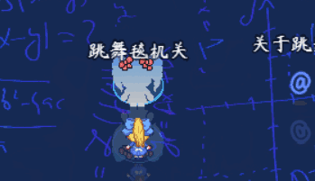{width="3.0083333333333333in"
height="1.8366666666666667in"}

**不能上下方向进入阶梯区域：**

阶梯区域和普通地面被分割成两部分，上下方向 进入/离开
的路口都是不可通行的。

（红色表示墙壁）

{width="2.033333333333333in"
height="1.4383705161854767in"}

**飞行的物体不受影响：**

飞行的物体，不会因处于阶梯区域而改变高度。

{width="2.3833333333333333in"
height="0.8583333333333333in"}

**\
**

## 游戏属性

### 区域判定

+-----------------------------------------------------------------------+
| 网格区域移动的机制是固定的。                                          |
|                                                                       |
| 举个例子，小爱丽丝从图块A移动到图块B。                                |
|                                                                       |
| {width="1.1333333333333333in"      |
| height="0.6083333333333333in"}                                        |
|                                                                       |
| **只要小爱丽丝开始移动，那么小爱丽丝就已经处于B图块位置。**           |
+=======================================================================+
+-----------------------------------------------------------------------+

**阶梯中的实际区域：**一个二阶的楼梯，如下图；

{width="2.1145833333333335in"
height="1.2291666666666667in"}

S方框（start）表示进入阶梯区域的图块，E方框（end）表示离开阶梯区域的图块。

阶梯的真实效果，是使得Y轴的坐标-1。在到达阶梯区域终点前，小爱丽丝Y轴实际坐标是不变的。

蓝色箭头为小爱丽丝的实际移动位置。

红色线路表示小爱丽丝的移动过程的高度变化。

绘制方法非常简单，只要画横向的两个连续图块，就能表示一个完整的二阶阶梯了。

{width="2.0620374015748033in"
height="1.275in"}
{width="1.8729166666666666in"
height="1.2769892825896763in"}

+-----------------------------------------------------------------------+
| 另外提一下，脚本中的设定细分极其复杂，图                              |
| 中每个进入动作（蓝色箭头）都对应了一个具体的高度变化公式，流程如下：  |
|                                                                       |
| -\>▂▅▇ 从西边进入，进入前为平地。（需要考虑连接楼梯非平地情况）       |
|                                                                       |
| 阶梯的左右移动。                                                      |
|                                                                       |
| ▂▅▇-\> 从东边离开，离开的位置为平地。（需要考虑连接楼梯非平地情况）   |
|                                                                       |
| 因此，这里不建议 萌新                                                 |
| 跑去看脚本，不建议去尝试修改一些楼梯的额外设定。                      |
+=======================================================================+
+-----------------------------------------------------------------------+

一阶、三阶、N阶的原理都是一样的。阶梯都遵循固定的高度公式。

（示例中，只提供了二阶的▂▅▇ 和
▇▅▂，以及简单的三阶▂▅▇素材，如果你需要画N阶的缓坡，需要另外单独准备的阶梯图块素材）

{width="1.725in" height="1.2125in"}
{width="2.5166666666666666in"
height="1.2166666666666666in"}

{width="1.6458333333333333in"
height="1.2291666666666667in"}
{width="2.6354166666666665in"
height="1.2291666666666667in"}

**并列的阶梯：**相同阶的阶梯，可以并列绘制，并列的阶梯可以上下移动。

{width="2.3541666666666665in"
height="1.7188090551181103in"}{width="2.1145833333333335in"
height="1.6875in"}

但是注意，必须相同阶的才可以并列，不同阶的画在一起会出现高度错位问题。

{width="2.0418438320209975in"
height="1.3751192038495188in"}
{width="1.9916666666666667in"
height="1.382917760279965in"}

{width="1.725in"
height="1.5013888888888889in"}
{width="2.325in"
height="1.4974573490813647in"}

**相连的阶梯：**相同阶相连的阶梯，可以实现更多阶层变换的移动。

但是要注意蓝色箭头，所处的Y轴位置变化。

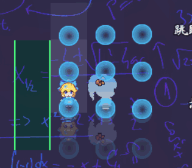{width="3.125in"
height="1.6583333333333334in"}

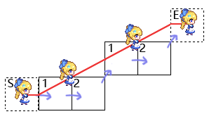{width="3.1041666666666665in"
height="1.6875in"}

相连的阶梯，同样可以多个并列绘制。

{width="2.825in"
height="1.9171773840769903in"}

但是注意，不同阶的阶梯，不能相互连接，会出现高度错位问题。

{width="2.3916666666666666in"
height="1.2839479440069992in"}
{width="2.2666666666666666in"
height="1.292212379702537in"}

### 特殊位置

**1）楼梯死角**

假设阶梯为▂▅▇，那么右侧往左侧进入时，相当于从楼梯底下钻上来，这是不被允许的，因此这个方向在程序中判定为不可通行。

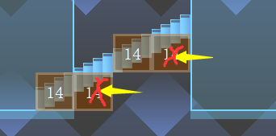{width="2.8666666666666667in"
height="1.4132392825896762in"}

另外，并列的楼梯中，死角只有最下方有。

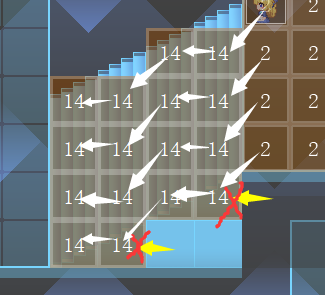{width="2.85in"
height="2.590271216097988in"}

**2）楼梯顶角**

由于楼梯死角是不可通行的，，因此楼梯顶角的左侧必须要可通行，不然路全阻塞了就进不去了。

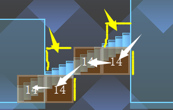{width="2.966666666666667in"
height="1.894475065616798in"}

而楼梯顶角占用的位置又不是阶梯区域，所以还要阻止上方进入，以及右方进入。

所以你需要对楼梯顶的图块稍微改一下 四通行 的设置。

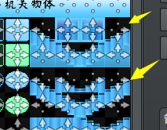{width="2.5166666666666666in"
height="1.9584590988626422in"}

**3）对角移动阻塞：**

正常地面中，如果对角移动，上方向和右方向阻塞，那么事件无法通过。

而在阶梯区域中，此穿透是被允许的。

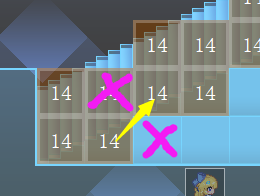{width="2.7083333333333335in"
height="2.0416666666666665in"}

所以你不用担心和你并排走的小爱丽丝会因阻塞而停下脚步。

### 阶梯画法

阶梯区域画时需要遵循一定的规律，否则会出现未知的走位问题。

你可以先看看前面章节，了解判定原理：[区域判定](#区域判定) 。

**1）必须画为 整块方形**

不要绘制不规则的阶梯区域，凹凸不平、中间有空洞、十字架形状等，都不要画。

即使是 并列+相连 的阶梯，也要按照其 阶数规律 来画，而不是随意画。

{width="2.3541666666666665in"
height="1.7188090551181103in"}
{width="2.825in"
height="1.9171773840769903in"}

**2）▂▅▇ 和 ▇▅▂ 不要连在一起**

两个不同的侧边阶梯，不要连一起，会影响系统中阶梯区域的识别。

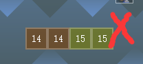{width="2.1666666666666665in"
height="0.9666666666666667in"}
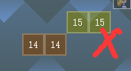{width="1.9666666666666666in"
height="1.0583333333333333in"}

**3）不同阶的阶梯不能相连**

比如 二阶 和 三阶 的阶梯，上下左右都不要相连，不然会出现高度适配错误。

{width="2.3916666666666666in"
height="1.2839479440069992in"}
{width="2.2666666666666666in"
height="1.292212379702537in"}

**4）不要把道路封死**

注意，红色为阶梯区域自动封死的路线，而黄色需要你手动用透明墙封死。

但注意楼梯接口处，不要错封了。

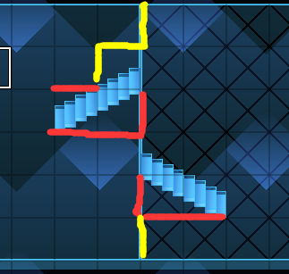{width="2.283333333333333in"
height="2.170297462817148in"}

### 注意事项

**1）阶梯上的强制跳跃**

强制跳跃将无视所有地形因素，直接跳跃到目的地。

rmmv默认的跳跃功能就为强制跳跃。

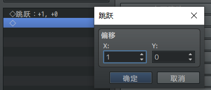{width="3.252083333333333in"
height="1.39375in"}

如果你在阶梯上使用强制跳跃，会看到 玩家/事件
的高度会出现严重的错位情况。

因此在游戏设计中，尽量避免跳跃。

**2）触发捕获**

虽然事件在阶梯上产生了一个"高度"，但其实际的位置仍然在脚下的图块。

下图的蓝色箭头就是真实所在图块位置。

{width="2.1145833333333335in"
height="1.2291666666666667in"}

因此，使用触发捕获时，要注意目的地的y轴坐标 差的问题。

**\
**

## 关于阶梯与其它能力组合

**阶梯上推箱子**：

从原理上说，阶梯和滑坡的区别并不大（见 [区域判定](#区域判定) ）

所以，箱子事件是可以被推上阶梯的。

但是注意，箱子处于对角位置时，如果用下面的纯事件指令，推动会出现偏差。

{width="2.625in"
height="1.0271741032370953in"}
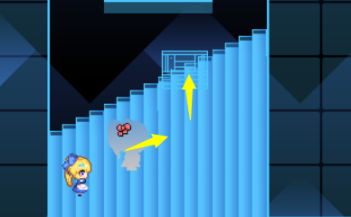{width="2.4166666666666665in"
height="1.4948458005249343in"}

使用下面的改进写法，就可以避免。

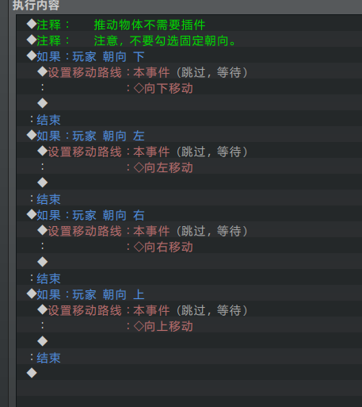{width="2.932202537182852in"
height="3.2916666666666665in"}

**阶梯上放炸弹**：

阶梯上可以放置炸弹，但注意炸弹爆炸后，爆炸位置和判定捕获位置会有偏差。

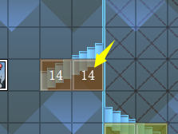{width="1.6893153980752407in"
height="1.2715277777777778in"}
{width="1.7094488188976378in"
height="1.2895833333333333in"}
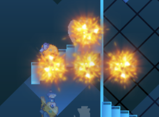{width="1.7115944881889764in"
height="1.2659722222222223in"}

**阶梯上举花盆**：

可以边举着花盆边上阶梯，并且在阶梯上还可以扔花盆。

（扔花盆也会产生高度偏差，不过没有玩家跳跃的偏差严重）

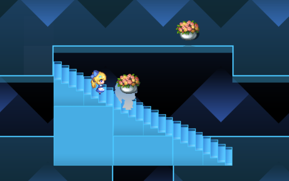{width="3.4916666666666667in"
height="2.187230971128609in"}

**阶梯与光滑图块**：

你可以使用R图块，设置同时具有 光滑地面+阶梯
的图块。从而做出可滑行的斜坡。

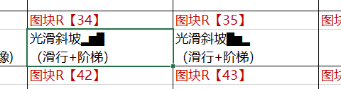{width="3.75in" height="0.9875in"}

图中是直接滑上去的，由于暂时没有准备滑坡素材，所以楼梯看起来有些突兀。

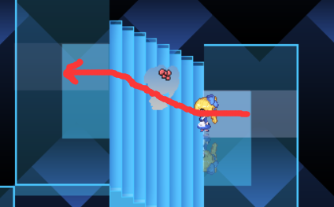{width="3.5416666666666665in"
height="2.198506124234471in"}
