## 概述

### 插件介绍

◆Drill_BombCore 炸弹人 - 游戏核心

◆Drill_BombCustomDefine 炸弹人 - 自定义炸弹

炸弹人是一系列综合后的游戏玩法，属于一个较大结构的插件系统。

### 控制方法

**插件基本控制：**

\* 键盘 - 无法控制。

\* 手柄 - 无法控制。

\* 鼠标 - 无法控制。

\* 触屏 - 无法控制。

更多控制内容，去看看"1.系统 \> 关于输入设备核心.docx"。

（核心本体不直接提供按键控制，需要使用辅助控制）

**辅助控制：**

可以通过Drill_OperateKeys按键修改修改器 插件获得按键支持。

\* 键盘 - 默认C

\* 手柄 - 默认 功能键+X

可以通过 Drill_OperateHud 鼠标辅助操作面板 插件获得辅助控制支持。

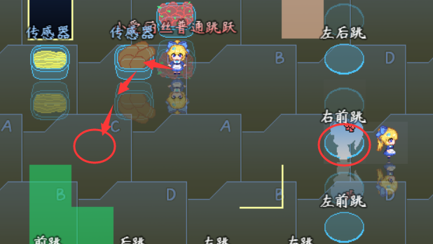{width="2.3020833333333335in"
height="1.5197353455818023in"}

### 插件关系

插件的关系如下，炸弹人核心插件需要5个基础插件，并且要求都放在那些插件后面：

关于插件的顺序，需要遵循上面图的箭头依赖关系，不要反向即可。

（注意，炸弹人-游戏核心 必须放在"键盘手柄修改器"插件的前面）

## 游戏硬性机制

**同一个位置不能放两个炸弹：**

炸弹人游戏的基本机制，并且炸弹会堵路。

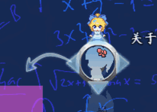{width="2.008507217847769in"
height="1.3584514435695538in"}

**已爆炸的炸弹会立即引爆范围内的炸弹：**

炸弹人游戏的基本机制，火力越大的炸弹，能连锁引爆更多的炸弹。

{width="3.4583333333333335in"
height="2.0031233595800524in"}

**主动触发的关键字固定为：\"炸弹人-爆炸\"：**

含有该标签的事件且在范围内，都会被炸到，同时，你还要给这个物体添加"可炸物"阵营，用于AI识别。

![C:\\Users\\Administrator\\AppData\\Roaming\\Tencent\\Users\\1355126171\\QQ\\WinTemp\\RichOle\\6)\[AB}4(\~7\[2\]4P215\$VQ71.png](./MediaFolder/media/image6.png){width="3.5087740594925636in"
height="1.0416666666666667in"}

**玩家与敌人穿透关系的标签固定为：\"炸弹人-角色\"：**

炸弹人之间可以相互穿透，但是炸弹人不能穿透地形、炸弹、可炸物。

{width="3.5166666666666666in"
height="0.6498184601924759in"}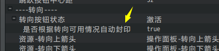{width="1.6583333333333334in"
height="1.4091940069991251in"}

**爆炸的激光穿透的标签固定为：\"炸弹人-角色\",\"炸弹人-透明墙\"：**

爆炸波可以穿透炸弹人和透明墙，但是可炸物可以阻挡爆炸波。

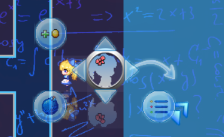{width="2.6333333333333333in"
height="1.8881561679790027in"}
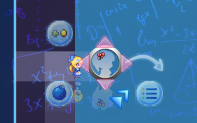{width="2.45in"
height="1.8798742344706911in"}

**炸弹拥有堵住爆炸波的能力：**

因为炸弹与爆炸波之间不能穿透，所以弱火力炸弹，可以挡住强火力的炸弹的冲击波。

（这个设定结果纯属我意料之外）

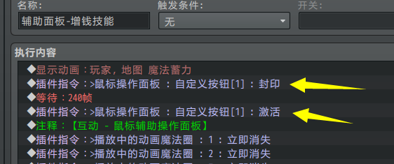{width="1.8666666666666667in"
height="2.066444663167104in"}

**跳跃时可以放置炸弹**：

跳跃过程中可以放置炸弹，并且放的是玩家当前位置的正下方。

{width="2.566666666666667in"
height="2.32661854768154in"}

**\
**

## 游戏属性

### 能力

能力包含两个：火力、炸弹数。

所有事件都可以设置这两种能力，包括炸弹自己。

### 阵营

阵营分为四种：仇恨单位、忽视单位、可炸物、自定义阵营名

**仇恨单位**：会被所有人敌对，\"仇恨单位\"也会主动攻击\"仇恨单位\"。

**忽视单位**：会被所有人忽视，即使\"忽视单位\"会主动攻击其他人。（所有事件默认为忽视单位）

**可炸物**：也会被所有人敌对，但是优先级最低，只有没敌人时，才会被攻击。

**自定义阵营名**：相同阵营名的单位不会相互攻击。

（一个事件可以同时拥有多个自定义阵营名，比如同时拥有\"A队\"和\"B队\"的属性，
那么\"A队\"和\"B队\"都不会攻击他。）

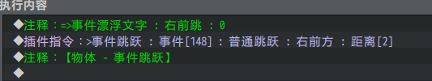{width="2.6979166666666665in"
height="1.2162762467191601in"}
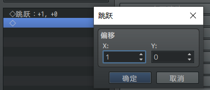{width="2.688636264216973in"
height="1.21875in"}

![C:\\Users\\Administrator\\AppData\\Roaming\\Tencent\\Users\\1355126171\\QQ\\WinTemp\\RichOle\\6)\[AB}4(\~7\[2\]4P215\$VQ71.png](./MediaFolder/media/image6.png){width="2.75in"
height="0.816405293088364in"}

另外，**穿透标签一般固定为"炸弹人-角色"，**如果没有这个标签，则小爱丽丝与玩家之间会相互堵路，这会增加复杂度。AI也会变得反应迟钝。

### 炸弹

核心中的炸弹，都为\"标准炸弹\"，与\"自定义炸弹\"区分。

标准炸弹有三个基本属性：**位置、火力、剩余时间**。并且，标准炸弹不分敌我，统一触发范围内事件的独立开关。主动触发的关键字为：\"炸弹人-爆炸\"。

**模板管理层有两个标准炸弹的模板，分别对应火力1和火力2，与炸弹核心中的炸弹内容一模一样，你可以用来做参考。**

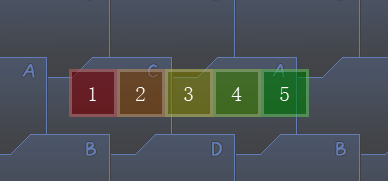{width="4.166146106736658in"
height="1.489397419072616in"}

关于如何设计自定义炸弹，依葫芦画瓢即可。要注意设置AI识别自定义炸弹与实际炸弹的爆炸效果相匹配。

## AI决策树

### 基本AI动作

在炸弹人游戏中，小爱丽丝AI一步能做的**有效动作**只有6种：发呆、放置炸弹、上移、下移、左移、右移。真正影响小爱丽丝智力取胜的关键，是她根据当前情况，在每一步中执行哪些有效动作。

核心提供了4种AI行为，你可以通过设置移动路线指令，来控制基本AI的思考方式：

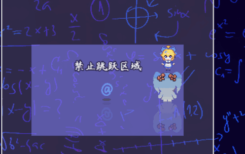{width="2.816666666666667in"
height="1.4232360017497814in"}
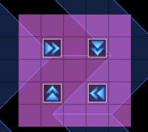{width="2.352321741032371in"
height="1.6979166666666667in"}

### AI识别

#### 自定义炸弹

你需要手动配置自定义炸弹的AI识别：（下图为斜向炸弹的爆炸区域识别）

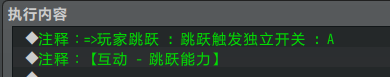{width="5.768055555555556in"
height="1.2777843394575679in"}

需要注意AI识别的爆炸时长，为： 这一页的等待指令时间 +
下一页的等待指令时间。炸弹核心基于 固定区域+激光区域
插件，具体区域原理需要去看看：

"关于物体触发-固定区域.docx"和"关于物体触发-激光区域.docx"。

**目前该设置可以使得AI具有躲避自定义炸弹的能力，但是AI还不具备使用自定义炸弹的能力**。

### AI行为

#### 躲避炸弹Lv0

通过设置移动路线，"躲避炸弹Lv0"即可根据决策执行一步动作。下图所示为执行一步动作出现的决策。该智能最弱，只考虑眼前，并且面对大范围爆炸时束手无策，有几率堵死自己。

（脚本函数为drill_BoC_avoidBombAI_Lv0，如果你有兴趣，你可以自己尝试写一个脚本ai决策。）

#### 躲避炸弹Lv1

躲避炸弹Lv1同样"目光短浅"，但是它会在遇到的情况中考虑**最优解**。

举个例子，下面的情况，三枚火力足够的炸弹，将整个小爱丽丝包围了起来。黄色的范围为**后放置**的炸弹，红色为**先放置**的炸弹。

Lv0的小爱丽丝只会惊慌失措，到处乱跑。

Lv1的小爱丽丝会保守移动，只在黄色区域内盘旋，**等待红色区域爆炸后，迅速离开黄色区域**。

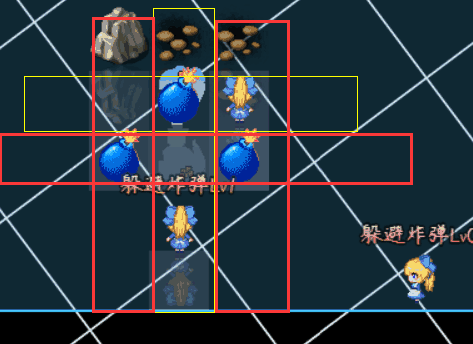{width="3.15in"
height="2.2909087926509186in"}

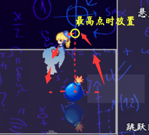{width="2.6416666666666666in"
height="1.8801049868766404in"}
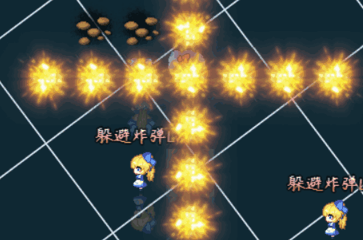{width="2.8583333333333334in"
height="1.8950623359580052in"}

#### 寻找目标Lv0

**需要注意的是，寻找目标和躲避炸弹是两件完全不同的事情，寻找目标时，不要做躲避炸弹的事。**寻找目标时,需要考虑较大范围,如果只考虑5个图块那完全是误打误撞。

#### 寻找目标Lv1

比较有趣的是，寻找目标Lv1虽然比Lv0考虑的更多，但是实际比赛起来，
Lv0属于莽打莽撞类型，不一定会比Lv1差。

需要注意的是，Lv1的决策，**随机性特别小**，如果两个相互对战的Lv1的小爱丽丝相遇了，那么很可能她们会重叠在一起，并且无休止地放置炸不到自己的炸弹。

### 关于AI扩展

你可以根据 躲避炸弹和寻找目标
出现的频率，将小爱丽丝分为两种性格：进攻型、求稳型。

毫无疑问，目前这种智力的小爱丽丝，顶多能与新手周旋一下。如果遇到老手，基本都是被碾压。

AI的决策可以向更加高级的方向发展：（也不知道这些坑我会不会填）

**强杀行为**：如果自己的速度比敌人快比较多，你会毫不犹豫地边冲边放炸弹，直到堵死敌人。

**锁时行为**：如果火力足够大，先放下一个炸弹，这个炸弹快爆炸时，放下另一个炸弹，通过缩短爆炸时间来对敌人进行瞬间进攻。

**暗算行为**：火力不够猛的初期，如果发现敌人放了一个炸弹，并且躲在死角。跑过去放一个炸弹堵死敌人，而且确保自己能躲开爆炸区域。

**勾引行为**：跑敌人面前，然后跑开，引诱敌人放下炸弹。超过2次勾引无效则放弃。

**同归于尽行为**：仗着自己的生命值比敌人高，与敌人在一起躲避时，会毫不犹豫地放下炸弹。

**胆小行为**：有多个敌人时，尽可能远离敌人，只剩下一个敌人或者迫不得已时，才进行进攻。

**经济行为**：捡道具为主要任务，达到一定的经济，才进行进攻。

**规划行为**：根据地图的大小以及障碍物的分布，合理规划道具是否要捡，多余的销毁。比如火力足够时，会炸掉继续加火力的道具。

总之，还有更多的套路可以设计，如果你有更好的想法，去尝试写脚本设计出最厉害的人工智能吧。

**不过，AI决策树范畴毕竟比较狭窄，你设计出来的套路，都是固定的行为公式**。如果你有想法，可以用另一个办法，机器学习，使用遗传算法对小爱丽丝的决策进行数千万次的训练，最终形成阿尔法狗级别的AI。(\*ˉ﹃ˉ)
