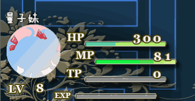
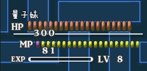
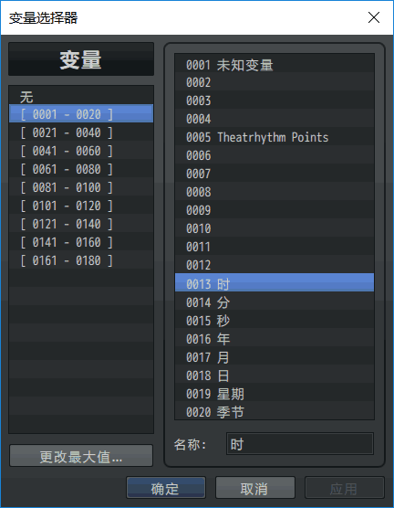
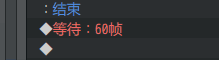
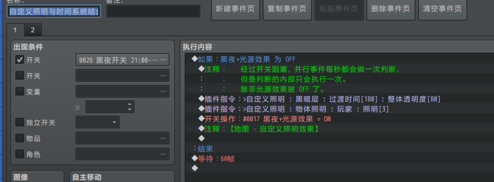
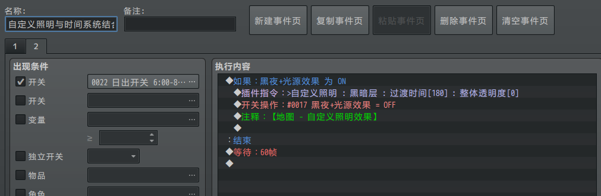

## 时间系统介绍

◆MOG_TimeSystem 地图UI - 时间系统

◆MOG_TimeSystem_Hud 地图UI - 时间系统固定框

下图时只开启时间系统，关闭时间系统固定框插件的效果。

{width="3.90625in"
height="3.13167760279965in"}

时间系统固定框插件是对时间系统进一步美化的插件。

{width="3.90625in"
height="3.13167760279965in"}

## 相关参数

时间系统将会占用大量开关和变量，在设置时请注意。

开关在指定时间内会一直on。

变量与时间系统是实时变化的，你可以直接获取变量来进行比较操作，判断时间。

{width="2.783333333333333in"
height="3.5822528433945755in"}
{width="2.7841721347331583in"
height="3.5833333333333335in"}

## 关于与 照明插件 组合方法

你需要**实时**确定当前是否为夜晚，这就要通过并行事件来处理。

**使用并行事件时，一定要加等待，否则并行事件会在每帧都执行一次，即1秒执行60次，会造成卡顿。**

加了等待效果，就变成每秒执行一次。

{width="2.280964566929134in"
height="0.624922353455818in"}

**下面是一个地图中事件的写法，公共事件的写法，在示例中的公共事件中去看**。

以下为开关调整示例：

{width="5.768055555555556in"
height="2.1277777777777778in"}

{width="5.768055555555556in"
height="1.8881944444444445in"}

不过，写在地图事件里面不是长远的方法，因为离开地图的时候，还要手动关闭光源。比如进入夜晚进入屋内，白天进入洞穴。**你可以把它写在公共事件里面，并且在公共事件里面添加对当前地图判断。如果地图id符合相关条件，则设置或者去除光源。**

具体实现要看你在游戏中是如何设计的。
