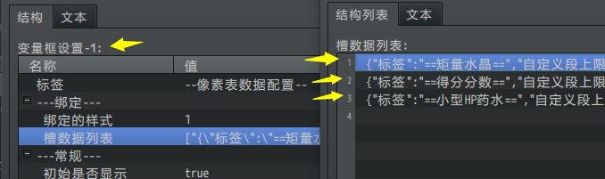
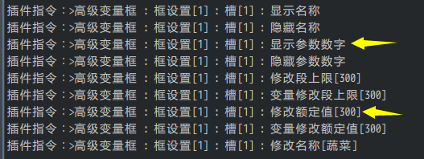

## 概述

### 插件介绍

参数数字的有许多作用范围，菜单界面、战斗界面、地图界面都可以作用到：

◆Drill_CoreOfGaugeNumber 系统 - 参数数字核心

以下是参数数字的子插件：

◆Drill_GaugeOfBufferTimeNum UI - 缓冲时间数字

◆Drill_GaugeForBoss.js UI -- 高级BOSS生命固定框

◆Drill_GaugeForVariable.js UI -- 高级变量固定框

**核心只对参数数字的各个部件进行详细说明，如果你想找"从零开始设计"教程，去看看子插件相关的文档说明**。

**注意，参数数字中，字符必须全部做成
图片，通过程序切割并使用字符图片切片，来实现自定义参数数字效果。**

### 名词索引

以下你可以按住ctrl键点击下面的词，可以直接定位到想了解的名词：

  -----------------------------------------------------------------------
  基本结构          [参数数字](#参数数字) [旋转角度](#旋转角度)
  ----------------- -----------------------------------------------------
  符号              [符号](#符号-1) [基本符号](#基本符号)
                    [扩展符号](#扩展符号) [滚动效果](#滚动效果-1)
                    [前缀](#前缀) [后缀](#后缀)

  排列              [对齐方式](#对齐方式-1) [宽度限制](#宽度限制)

  额定值            [额定值](#额定值-1) [额定符号](#额定符号-1)
  -----------------------------------------------------------------------

### 插件关系

参数数字核心的插件关系如下图。

## 主体

### 定义

[]{#参数数字
.anchor}**参数数字：**指用于实时显示某些参数数值的**整体结构**。比如实时显示生命值、魔法值、时间、变量值等参数。参数数字是贴图。

参数数字的结构如下图所示：

### 基本结构

参数数字有下列固定且硬性结构：

1.只能根据基本符号和扩展符号，显示内容。（你可以修改符号的资源图片）

2.只有一串裸露的数字符号，没有外框。（子插件会提供背景框架配置）

3.锚点根据对齐方式变化，只能 左右 挤占。

（参数数字的结构没有参数条那么复杂，不过参数数字的麻烦的地方在于确定坐标）

{width="5.768055555555556in"
height="1.1425317147856517in"}

你可以控制3个的基本参数：**X坐标, Y坐标, 旋转角度**

[]{#旋转角度 .anchor}**旋转角度：**你可以修改旋转角度使其看起来为
从右向左 或 从下往上
的伸缩结构：（还可以做垂直的结构、45度角斜向结构等）

{width="5.768055555555556in"
height="1.1425317147856517in"}

不过，由于旋转了一定角度，你适配的字符也要经过一定旋转处理，不然看起来就像下图旋转180度之后那样看不明白。

## 参数数字与外框

### 组合关系

参数数字主体是一个完全裸露的数字，没有外框，相比参数条，参数数字的外框没有那么重要。相关子插件会提供外框的设计：

**1) 2框+1参数数字**

以 Drill_GaugeOfBufferTimeNum UI-缓冲时间数字 插件为例，

{width="1.7918219597550307in"
height="1.0250885826771654in"}

图中设置了外框背景, 外框前景是空图片，并且使用了前缀扩展符号。

**2) 2框+6参数数字+3参数条**

以 Drill_GaugeForBoss UI-高级BOSS生命固定框 插件为例：

{width="4.033683289588802in"
height="0.8334055118110236in"}

图中有背景框，1个参数条，2个参数数字，其余的都未显示。

生命数字：右对齐

生命段数：右对齐 + "x"乘号前缀

{width="2.4502121609798775in"
height="1.108429571303587in"}

图中有背景框，2个参数条，2个参数数字，其余的都未显示。

生命数字：右对齐

魔法数字：右对齐

### 旋转关系

参数数字的旋转用的比较少，但是还是提及一下。

**分别配置**：如果参数数字和外框的参数是分开的，如果参数数字主体整体旋转了之后，外框是不会变化的。你需要另外控制外框的形状、或者旋转角度。

{width="1.616806649168854in"
height="0.8167377515310587in"}{width="3.4502985564304463in"
height="1.1000951443569553in"}

注意，时间数值因为只有一个参数数字，所以外框可以旋转，但是如果是很多个参数数字与外框，就要注意分配区间了，而不是直接旋转。

## 符号

### 定义

[]{#符号-1 .anchor}**符号**：表示 参数数字图片
被分割的贴图部分。符号是贴图。

[]{#基本符号
.anchor}**基本符号**：用于表示数字关系的基本符号，与参数值**有关**。图片资源会被分成14等分，分别表示数字和加减乘除（0123456789+-x/）。

[]{#扩展符号
.anchor}**扩展符号**：用于辅助显示某些图标的符号，与参数值**无关**。图片资源会被分成14等分，通过字母表示扩展符号（abcdefghijklmn）。扩展符号可以是任意图形。

{width="5.768055555555556in"
height="1.3847222222222222in"}

### 滚动效果

[]{#滚动效果-1
.anchor}**滚动效果**：参数值减少时，如果瞬间减少了大段数值（比如从200降到100）。弹性滚动设置下，显示的参数数字不会立即达到100，而是慢慢滚动到100。

参数数字的滚动效果，与参数条的缩短效果原理相似。

{width="3.0919346019247596in"
height="0.5917180664916886in"}

### 前缀后缀

[]{#前缀 .anchor}**前缀**[]{#后缀
.anchor}**后缀：**你可以在参数数字符号的基础上，额外添加基本符号或者扩展符号。这些符号可以用来表示图标、数字单位、额外内容等。

28个可用的符号为：

0123456789+-x/ （来自资源-基本符号）

> abcdefghijklmn （来自资源-扩展符号）
>
> {width="2.683566272965879in"
> height="0.3666983814523185in"}

（x和\*字符都可以转为乘号表示）

字符经过相互组合，得到最终显示的组合字符，比如 100d 和 ff10/20：

{width="5.65in"
height="0.9833333333333333in"}

## 排列

### 对齐方式

[]{#对齐方式-1
.anchor}**对齐方式**：符号根据中心锚点进行的对齐情况，分为右对齐、左对齐、居中三种。注意中心锚点的位置。

{width="5.768055555555556in"
height="1.9596150481189851in"}

另外，你可以设置符号之间的间距，可以为负数，负数的间距会相互挤在一起。

### 宽度限制

如果显示数字的宽度区域十分有限，你可以给参数数字添加宽度限制，宽度分为两种：缩放限制和挤压限制。

{width="5.768055555555556in"
height="1.2118055555555556in"}

如果字符能够在宽度内正常显示，则不会进行缩放或挤压。（示例中有说明）

## 额定值

### 定义

[]{#额定值-1
.anchor}**额定值**：额定值可以根据当前数值达到某些条件时，直接改变显示的符号的信息。你可以选择额定值显示或不显示，不显示则为"10"，显示则为"10/20"。

另外，额定值"/20"中的除号是随着额定值一起固定出现的。

{width="5.65in"
height="0.775in"}

### 额定符号

[]{#额定符号-1
.anchor}**额定符号**：是指满足条件后，基本符号切换后的新符号。包含额定基本符号和额定扩展符号。你也可以关闭额定符号的切换功能。

比如，在额定条件为
大于等于，额定值为20时，切换后的显示效果。其中红色的字符，就是额定符号中的字符。

{width="5.65in"
height="0.775in"}

额定符号的大小不一定要与基本符号一致，

甚至可以不是"0123456789+-x/"，而是"\-\-\-\-\-\-\-\-\--+-x/"。

另外，你还可以设置满足条件时，哪些符号将会变为额定符号：

{width="5.768055555555556in"
height="1.7940015310586177in"}

### 额定设计

比较常见的额定设计为：

1.额定值表示任务失败条件，满足了额定值，数字变红。

2.额定值表示任务完成条件，满足了额定值，数字变黄。

3.额定值表示生命最大值，生命满状态时，数字发光。
