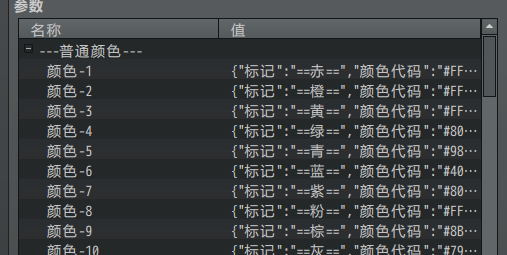
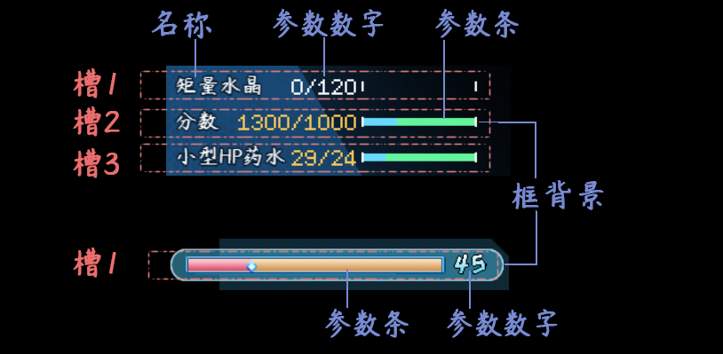
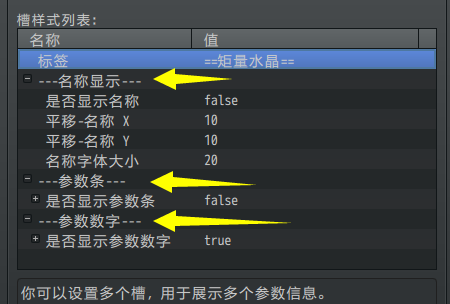
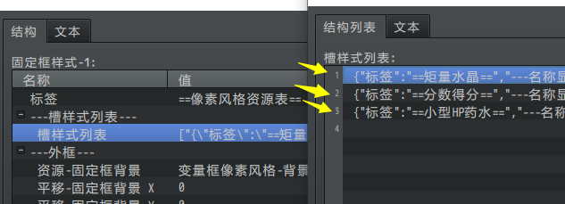
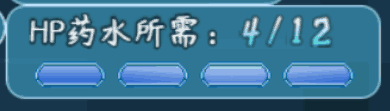
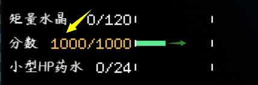
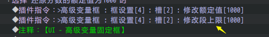

## 概述

### 插件介绍

设置颜色前，必须要颜色核心：

◆Drill_CoreOfColor 系统 - 颜色核心

以下是与颜色文本有关的插件：

◆Drill_EnemyTextColor UI -- 敌人文本颜色

◆Drill_ActorTextColor UI -- 角色文本颜色

◆Drill_ItemTextColor UI -- 物品+技能文本颜色

◆Drill_WindowLog 战斗UI -- 窗口提示消息

颜色核心定义了 高级颜色窗口字符，相关子插件可以使得 不支持颜色字符
的位置也能够支持颜色文本设置。

### 插件关系

插件的从属关系如下图：

需要说明的是，颜色核心只能提供 **静态** 的文本渐变色功能。

动态的颜色变换，需要通过滤镜实现，相关插件为：Drill_ItemTextFilter UI -
物品+技能文本的滤镜效果

## 窗口字符

### 颜色设置

你可以在窗口中使用 颜色设置 的窗口字符。

（窗口字符的定义，见："关于窗口字符.docx"）

其设置方式为：

\\c\[101\] 对应 颜色1；

\\c\[102\] 对应 颜色2；

......

{width="3.25in"
height="1.635252624671916in"}

\\c\[201\] 对应 高级颜色1；

\\c\[202\] 对应 高级颜色2；

......

{width="3.3in"
height="1.5171150481189852in"}

固定颜色与高级颜色99种设置配置。

### 绘制时的渐变色

根据窗口字符的原理，可知窗口字符是 一个个绘制 上去的。

（窗口字符的定义，见："关于窗口字符.docx"）

{width="3.3833333333333333in"
height="1.2885126859142608in"}

所以在战斗消息、对话窗口中，一个个绘制后，每个字都会包含一个渐变。

下图可以明显看到每个字都有斜向渐变，而不是三个字整体斜向渐变。

{width="2.175188101487314in"
height="0.733396762904637in"}

![C:\\Users\\lenovo\\AppData\\Roaming\\Tencent\\Users\\1355126171\\QQ\\WinTemp\\RichOle\\I)Q\]DFIB0F)1\[)X4S\~GUJ2X.png](./MediaFolder/media/image7.png){width="3.2869564741907262in"
height="1.116907261592301in"}

## 渐变设置

### 角度

渐变角度在0-180度范围之间。

将渐变设置为非常清晰的一根线，你可以看到下面的情况：

0度： {width="1.450125765529309in"
height="0.6083858267716535in"}

20度：{width="1.4417913385826773in"
height="0.7000601487314085in"}

50度：{width="2.2001902887139106in"
height="0.8500732720909886in"}

70度：{width="2.4168766404199475in"
height="1.0250885826771654in"}

### 节点颜色

你可以在高级颜色中设置多个节点，每个节点对应一种颜色。

{width="3.0166666666666666in"
height="2.022871828521435in"}

这种节点颜色设置，与ps、ai绘图工具的渐变性质一样。

如下图，设置了3个节点：

（最下面的节点值为0，最上面的节点值为1，中间则为0.5左右。）

{width="3.7503248031496064in"
height="2.1168503937007874in"}

对应的颜色也会在下面字体中体现：

{width="3.2169455380577427in"
height="1.2334405074365704in"}

另外，你可以通过插件指令切换颜色或者高级颜色。
