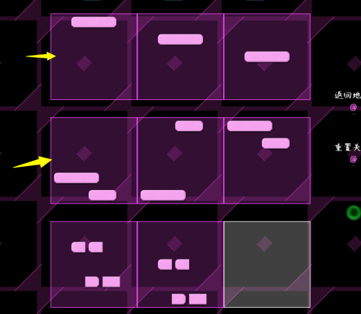
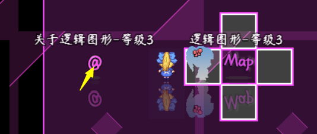
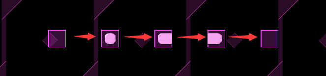
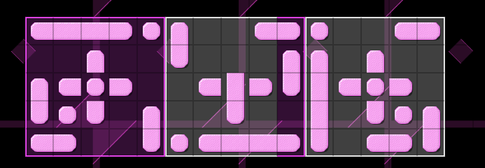
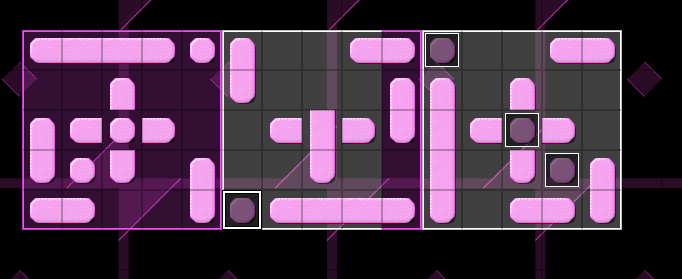
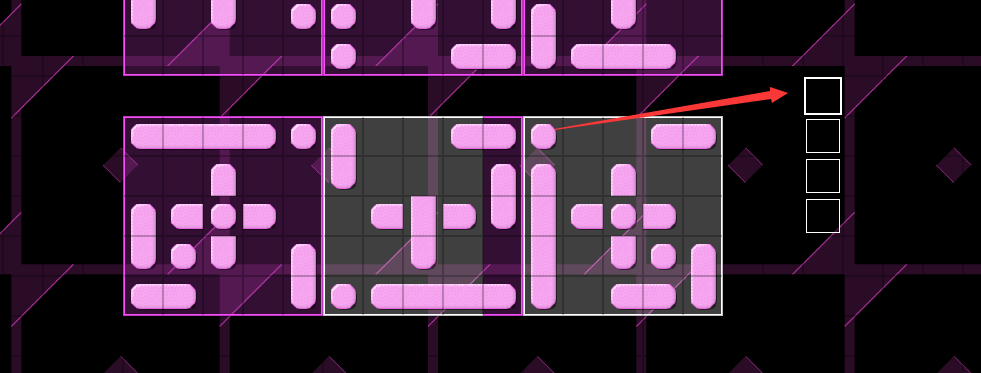

## 概述

### 相关插件

具有鼠标悬浮说明窗口的插件：

◆Drill_MiniPlateForState 鼠标 - 状态和buff说明窗口

◆Drill_MiniPlateForEvent 鼠标 - 事件说明窗口

◆Drill_MiniPlateForPicture 鼠标 - 图片说明窗口

◆Drill_X\_SceneShopDiscount 控件 - 商店节假日的折扣\[扩展\]

窗口会根据内容自动适应大小，并且在鼠标悬浮在指定区域时，会出现。

### 插件关系

这些插件都相互独立：

**\
**

## 鼠标悬浮窗口

### 布局模式

**1）默认窗口皮肤**

默认窗口皮肤，将使用默认img/system下的Window.png图片。

{width="1.725in" height="1.725in"}

**2）自定义窗口皮肤**

与窗口皮肤原理一样，可以设置不同的窗口皮肤。

注意，如果你改变了右下角的色卡，那么对应到的窗口字符（如\\c\[2\]）的颜色时，是按你当前皮肤为准的颜色。

{width="1.7083333333333333in"
height="1.7083333333333333in"}

**3）自定义背景图片**

设置自定义背景图片后，即可将窗口换成固定的背景贴图。

注意，由于窗口的大小是随时会改变的，而背景图片的大小不变，所以你需要考虑文本与背景的边界设计问题。

{width="4.085701006124235in"
height="1.2583333333333333in"}

**4）黑底背景**

纯粹涂黑的窗口背景。

{width="4.35in" height="0.97875in"}

{width="4.275in"
height="1.2105074365704287in"}

### 内容控制

**1）边间距**

由于变化的窗口的高度和宽度由文字的长短来决定，所以你还可以设置
**内边距、行间距、字体大小** 来控制窗口的宽度属性。

{width="3.191666666666667in"
height="0.6666666666666666in"}

**2）文本域**

文本域与内容字符写入后的宽度有关。

（文本域是指绘制文本、图标、图片字符的区域，详细原理介绍可以去看看"关于窗口字符.docx"。）

注意，由于是高宽自适应，所以悬浮窗口不支持固定窗口的宽高，且不支持自动换行。

{width="2.6770833333333335in"
height="1.0382042869641295in"}

**3）额外扩展高宽**

如果你在窗口中使用了某些特殊的窗口字符，比如 大图片字符。

这个图片字符的高宽时不会撑开内容，因此，你可以使用额外扩展高宽，拓宽显示区域。

注意，高宽只能向左和向下两个方向拓宽。

{width="2.033333333333333in"
height="1.0583333333333333in"}

{width="2.7916666666666665in"
height="0.45in"}

{width="1.1583333333333334in"
height="1.0166666666666666in"}

由于演示的图片"攻击锦囊"像素为100x100，所以大部分仍然被遮挡，只显示了一小部分，你可以将附加宽高改成100x100。

{width="4.691666666666666in"
height="0.48333333333333334in"}

{width="1.4666666666666666in"
height="1.5066152668416448in"}
