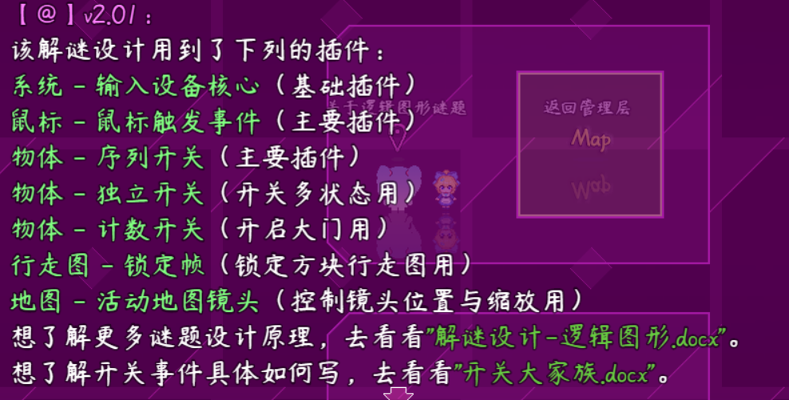
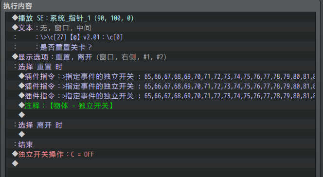
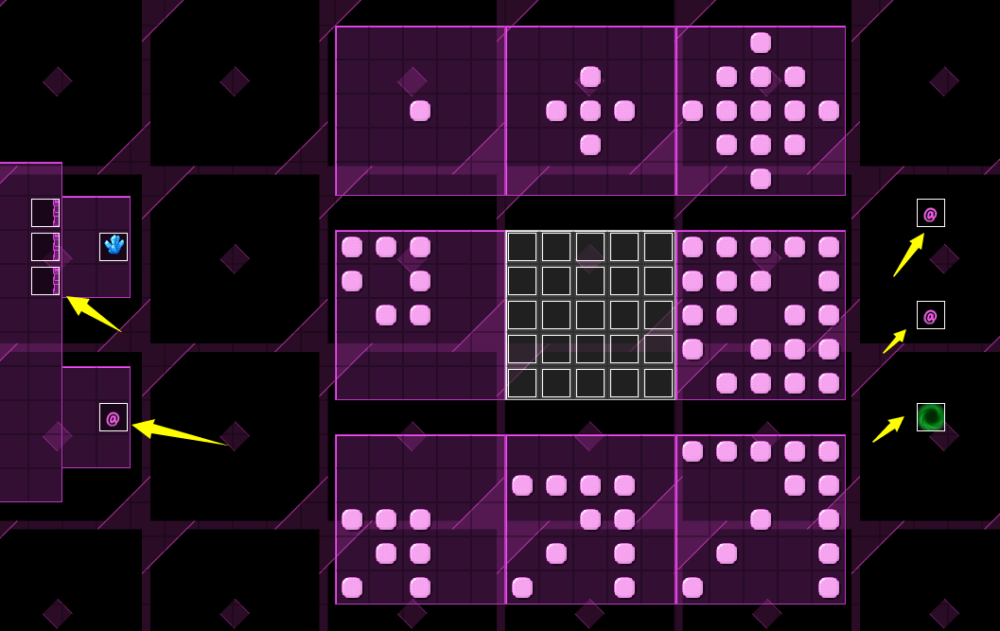
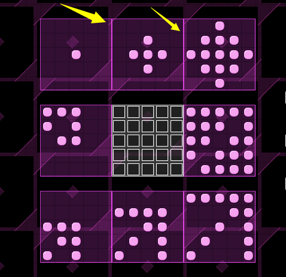
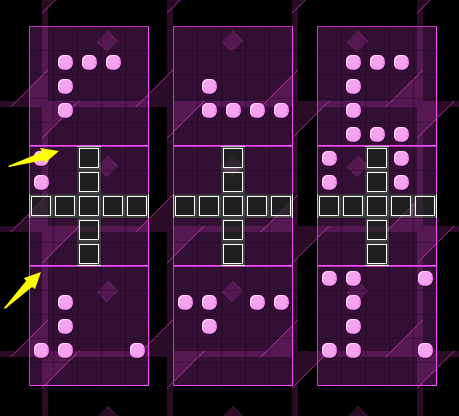
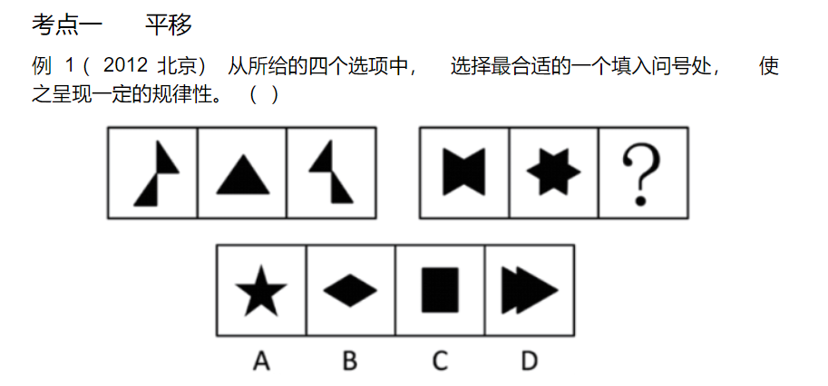
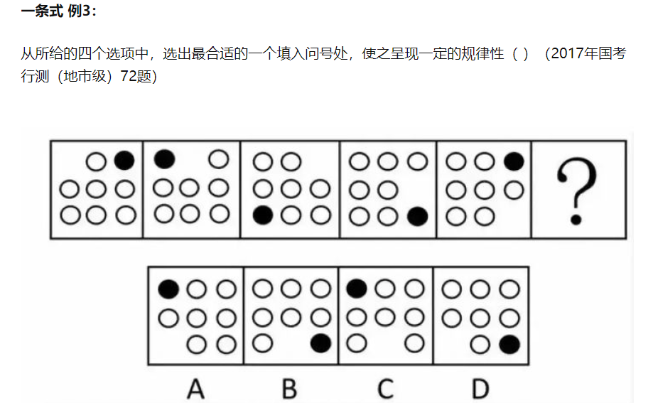
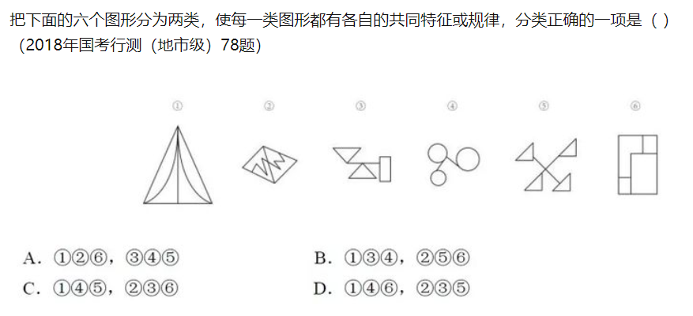

## 概述

### 基础插件

如果要从零开始设计 华容道 游戏，需要下图的插件：

{width="5.768055555555556in"
height="3.7395833333333335in"}

**注意，该文档只详细说明 整体设计思路 和 解谜方法 。**

**对于具体 事件如何写 ，需要去看看："关于开关大家族.docx"**

### 基础配置

具体注意示例下面的地方：

**1）位置重置**

游戏流程中，重置关卡 的事件，会手动批量控制所有事件的恢复到原来位置。

离开关卡或刷新地图，也会使得这些方块的位置重置。

（如果你要使得方块位置刷地图时不被重置，可以用"物体-位置存储器"插件）

{width="4.183333333333334in"
height="2.033241469816273in"}

**2）地图事件**

所有与该解谜相关的事件 ，都在地图"设计-华容道"中。

这里主要需留意六类事件：

门（触发器，计数开关插件 控制）

按压板（重力开关 控制，指定 重力钥匙 的事件才能起效）

目标方块（含有指定的 重力钥匙 ）

进入关卡（移动镜头、关闭鼠标左键控制）

离开关卡（恢复镜头、恢复鼠标左键）

重置关卡（重置中操作 当前关卡 所有方块归位 ）

{width="4.133333333333334in"
height="2.490152012248469in"}

**3）地形设计**

示例中的地形，不可通行 的部分可以用凹陷或者柱子代替。

另外注意，"@"按压板的位置，占了一块空间。这块空间在部分解谜中可以被利用起来

{width="3.933333333333333in"
height="2.4853477690288712in"}

**\
**

## 华容道-谜题设计

### 设计简介

**1）游戏规则**

纯鼠标控制的游戏，鼠标左键或右键拖拽方块。

只有含"@"符号的方块部分，压在了"@"的按压板上，才算通关。

玩家在游戏中可以意会到游戏规则，可以不作详细的规则说明。

**2）难度分配**

障碍方块的长短，能影响解谜的难度。

障碍方块的形状，能影响解谜的难度。

障碍方块放置后剩余的空间，能极大地影响解谜的难度。

**3）禁用能力**

无。

**4）卡关注意事项**

该解谜可随时用鼠标重置，不会卡关。

### 方块复制注意

使用事件一体化插件，可以使得多个方块组可以划分成一个群体。

复制多个方块时，要注意修改以下设置：

1.行走图

2.事件一体化标签

3.重力钥匙

作者在制作华容道关卡时，主要工作量都在这些方块标签"华容道_第xx关"的修改上，因为要确保这些方块为一个整体，又不能与其他方块错误绑定到一起。

{width="4.816666666666666in"
height="2.7556955380577426in"}

{width="2.733759842519685in"
height="2.1333333333333333in"}
{width="2.783333333333333in"
height="2.1114599737532807in"}

### 设计建议

**1）设计细节**

方块越短，灵活性越高。方块越长，难度越高。

设计中，最先考虑挖洞/建墙；再放置长方块；最后在能够确保通关的情况下，陆续加入小的短的方块，从而完善关卡设计。

**2）关卡安排建议**

如果你需要在你的游戏中添加该解谜类型，

关卡建议最多两关，难度最大到第四关，可作为 支线或主线谜题 。

第五关类似的可以作为 小分支或成就 。

第六关的设计难度和复杂度都很高，不建议加。

另外，此解谜游戏的设计 不要 在你的游戏主线中出现第二次，忌重复的玩法。

## 华容道-谜题解法

### 空位堵路预判法

华容道中，空位和堵路的数量直接决定了解谜的复杂度。

先考虑将所有 空位 集合在一起，再根据目标方块的堵路关系，构思移动路线。

大部分的解谜关卡的会预留很多空位，所以不用担心空位少谜题解不开的情况。

比如第五关，由于三个柱子挡道，可以确定目标大方块的路线是固定的。

由于大方块体积关系，每次前进都必须要有两个纵向的空位，因此大方块的前进路线中，一定不能有竖方块挡道。

所以需要想办法把所有竖方块转移到大方块后面，才能通过。

{width="4.6930555555555555in"
height="2.1357753718285215in"}
