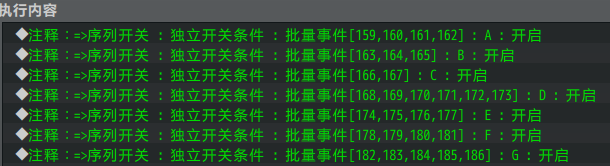
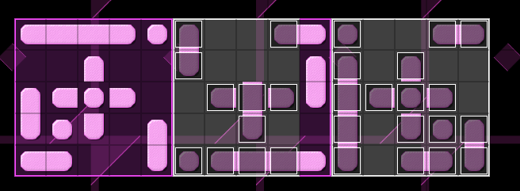
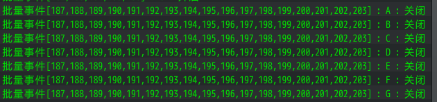

## 概述

### 基础插件

如果要从零开始设计 逻辑图形 游戏，需要下图的插件：

{width="5.768055555555556in"
height="2.923611111111111in"}

**注意，该文档只详细说明 整体设计思路 和 解谜方法 。**

**对于具体 事件如何写 ，需要去看看："关于开关大家族.docx"**

逻辑图形 是难度最为变态的谜题。这类谜题甚至变态到 公务员考试
都有个专门的题型分类：图形推理题。（你可以百度一下 "公务员图形推理" ）

### 基础配置

具体注意示例下面的地方：

**1）独立开关**

游戏流程中，重置关卡 的事件，会手动批量控制其他事件的独立开关。

这种操作是永久有效并且能被保存到存档中的，刷地图不会改变。

{width="4.066666666666666in"
height="2.2291754155730534in"}

**2）地图事件**

所有与该解谜相关的事件 ，都在地图"设计-逻辑图形"中。

这里主要需留意五类事件：

门（触发器，计数开关插件 控制）

提示灯（触发器，计数开关插件 控制，正确后会有提示音）

进入关卡（移动缩放镜头、关闭鼠标左键控制）

离开关卡（恢复镜头、恢复鼠标左键）

重置关卡（重置中操作 当前关卡 所有砖块的 事件id ）

{width="4.208333333333333in"
height="2.6569346019247595in"}

**3）地形设计**

逻辑变换有两种关系：

公式推进关系： A1 -\> A2 -\> A3；

公式等式关系： A1 + A2 = A3；

而下图的紧贴在一起的地形，表示一个公式，可以横着也可以竖着。

{width="2.548611111111111in"
height="2.467635608048994in"}
{width="2.716666666666667in"
height="2.4610925196850393in"}

**\
**

## 逻辑图形-谜题设计

### 设计简介

**1）游戏规则**

纯鼠标控制的游戏，鼠标左键点击切换答案板上的内容。

需要了解上下文中的图形，找到一个规律。

根据规律，填完白色部分的内容。

若填入的结果正确，则关卡通过。

逻辑图形的有以下类型规律：
平移、旋转、对称、循环、缩放、并集、交集、差集、等式推理（A+B=C）、形状表示某数字。

玩家在游戏中难以理解其中的游戏规则，你必须给予足够的提示和说明。

**2）难度分配**

玩家不能通过一个个试来完成关卡，这就使得难度陡增。

玩家找不到规律，则会按自我的想法来填，这使得难度进一步陡增。

只有不断提示，把谜题本身简单化，才能降低难度。

**3）禁用能力**

无。

**4）卡关注意事项**

该解谜可随时用鼠标重置，不会卡关。

### 真题示意

文档看到这里，你先做做下面几个真题，做错也没关系。答案在后面章节。

{width="4.929166666666666in"
height="2.2984186351706035in"}

{width="5.273970909886264in"
height="3.254166666666667in"}

{width="5.268055555555556in"
height="2.4082360017497813in"}

### 真题分析

**1）答案公布**

答案：

1.  B

2.  C

3.  A

对比答案后，你的想法是下面哪一种呢？

\> 初看十分有挑战性，但只要找到了规律，就简单多了。

\> 看起来是好像有一些规律，但是为什么我做错了呢？

\> 这种逻辑图形太扯了，什么乱七八糟的瞎编在一起，让人怎么猜。

**2）原因分析**

下面从游戏设计角度来看第一题：

{width="4.429166666666666in"
height="2.065274496937883in"}

这个题目有以下特征：

1\. 只提供一个公式，然后让你写答案。

2\. 题目中没有"平移"规律的提示。真实的考试中，无法确定规律是什么。

3\. 图中是两个不同物体的平移，但由于都是黑影，很容易被看做为一个物体。

4\. 公式一物体移动的方向 和 公式二的移动方向不同。

5\. 公式能给人"镜像"规律的错觉。

6\. 这个题目是为了筛选人而存在的。

上述的特征，每一个都是坑玩家的大忌，所以你必须通过各种各样方法提示玩家线索，才能降低题目难度。

+-----------------------------------------------------------------------+
| 因此，该类型的谜题，涉及到一个难度的把握问题：                        |
|                                                                       |
| \> 千万不要高估玩家的智力程度，作为一款游戏，你一定要多照顾玩家。     |
|                                                                       |
| \> 直接上考题，必然劝退一大批人。                                     |
|                                                                       |
| \> 大部分人猜到了其中的一二，但是并不能找准具体的规律，只能捕风捉影。 |
|                                                                       |
| \> 你需要提供大量线索，来映射你的正确答案。                           |
+=======================================================================+
+-----------------------------------------------------------------------+

**3）示例中的提示信息**

为了降低难度，作者我在解谜中添加了一些提示：

（作者我自己的提示系统做的还不是很好，只给你们提供简单参考）

1\. 每关提供两个完整的公式，能更快地摸索出公式。

{width="2.6592858705161855in"
height="2.3151082677165356in"}

2\. 每一关前，都有比较随意的 说明 和 规律提示线索。

3\.
解谜难度依次递增，这能让玩家知道每关必然遵循一个规律，而不是乱填就能过。

{width="3.9in"
height="1.6605697725284339in"}

### 图形绘制细节

这里说明一下 图形答案 的 事件设置方法：

1\. 确定答案有几种形状：

（比如下图，就3种形状）

{width="4.551388888888889in"
height="1.0707217847769028in"}

2\. 把答案画好：

（直接用图块画好，然后再去掉）

{width="4.266666666666667in"
height="1.4778718285214347in"}

3\. 把形状1标出来：

（答案中相同的形状都用事件标出来，一个个复制）

{width="4.258333333333334in"
height="1.7420920822397201in"}

4\. 把形状拿出去，看看事件的id。

（比如id分别为：159,160,161,162）

{width="4.8in"
height="1.8244149168853894in"}

5\. 使用同样的方式，标记形状2、形状3，以此类推。

{width="5.308333333333334in"
height="1.7933038057742783in"}

6\. 序列开关条件中，记录答案的所有形状：

{width="5.308333333333334in"
height="1.446913823272091in"}

7\. 把拿出来的事件，一个个放回去：

{width="5.358333333333333in"
height="1.966958661417323in"}

8\. 最后补足 空形状事件 的序列开关和事件。

（ 空形状事件 的序列开关条件 为 独立开关全部关闭。）

{width="5.768055555555556in"
height="1.3465277777777778in"}

### 设计建议

**1）设计细节**

逻辑图形 是难度最为变态的谜题。这类谜题甚至变态到 公务员考试
都有个专门的题型分类：图形推理题。

设计可以直接参考 考试题 ，然后将其转化为开关谜题。

但在此之前，你先去 [真题示意](#真题示意) 中 了解作为玩家一方 的行为。

**2）关卡安排建议**

如果你需要在你的游戏中添加该解谜类型，

关卡建议最多一关，难度最大到第四关，可作为 支线或主线谜题 。

第五关以后的所有关卡，都建议不加。

此类解谜游戏最大的问题，就是难度太高，劝退休闲类玩家。

不过，如果作为高难度的解谜游戏，许多解谜爱好者还是会跃跃欲试的。

## 逻辑图形-谜题解法

### 找真题练习

这种逻辑图形的推理，有一部分是需要当成一项技能去学的。

不妨可以去看看一些干货：

+-----------------------------------------------------------------------+
| 公务员考试学透这些技巧图形推理必拿满分 - 追梦老师的文章 - 知乎        |
|                                                                       |
| <https://zhuanlan.zhihu.com/p/59582638>                               |
+=======================================================================+
+-----------------------------------------------------------------------+

+-----------------------------------------------------------------------+
| 公务员考试中图形推理类题目，有什么解题的思路与技巧？ - 西瓜的回答 -   |
| 知乎                                                                  |
|                                                                       |
| <https://www.zhihu.com/question/30130622/answer/352663307>            |
+=======================================================================+
+-----------------------------------------------------------------------+
