**概述**

**简介**

窗口字符，即绘制在窗口中的字符。

并不是所有字符在窗口中绘制的结果都一样，不同的字符有着特定的功能效果。

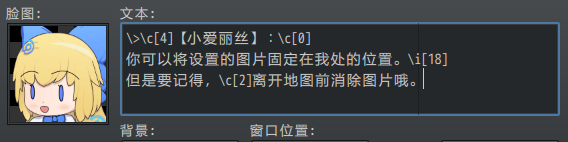{width="4.73374343832021in"
height="1.1834361329833771in"}

{width="4.716666666666667in"
height="0.9670702099737533in"}

**作用域**

**1）留意窗口的支持情况**

注意，并不是所有文本都可以随意添加窗口字符。

具体要看实际游戏中，哪些窗口能够支持指定的 窗口字符 。

下图的窗口字符，因为不支持，所以直接原封不动地显示了。

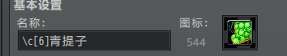{width="2.808333333333333in"
height="0.5568930446194226in"}

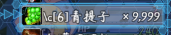{width="2.8335793963254594in"
height="0.5833836395450569in"}

**2）脚本相关**

脚本开发者注意，单张Sprite贴图中画的字符，**不能** 实现窗口字符的功能。

窗口字符顾名思义，只能在窗口中用的字符。

如果你希望贴图中能够实现窗口字符以及其各项功能，那么你必须建立一个窗口Window_base来当做贴图使用。

**窗口字符**

[]{#文本域与光标 .anchor}**原理**

你可以把一个窗口看成一个记事本，记事本里面有 **文本域和光标** 。

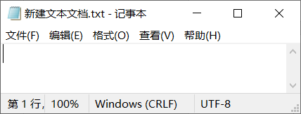{width="3.3583333333333334in"
height="1.2789916885389325in"}

每输入一个字符，光标就能向前移动。

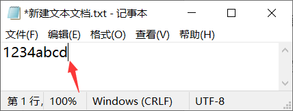{width="3.3833333333333333in"
height="1.2885126859142608in"}

如果我输入一个图标\\i\[4\]，那么就会变成下图。

（记事本并不能真的放图片，这里只是举例。）

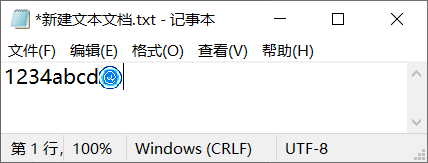{width="3.3833333333333333in"
height="1.2908475503062118in"}

如果我按一下回车键，那么就换行。

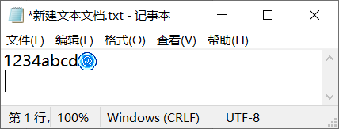{width="3.375in"
height="1.287571084864392in"}

下面，我们可以总结出一些简单的结论：

1.窗口字符必须绘制在文本域中，每个字符的位置与光标有关系。

2.字符可以换行，换行位置与文本域相关。

3.每个字符都有宽度，这个宽度由字符自己决定，图标字符也占宽度。

**定义**

**文本域**：是指绘制文本、图标、图片字符的区域，文本域有高度和宽度，字符如果越出了高宽边界，则会被遮挡。

**光标**：文本域中确定下一个字符位置的竖线，光标根据字符的宽度确定下一个位置，并且光标可以换行。

所有窗口都具有 文本域和光标 。

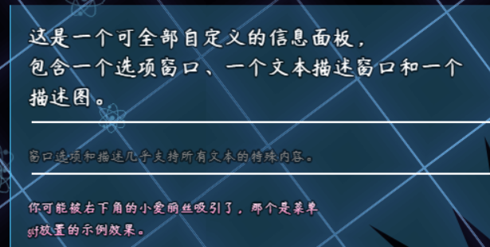{width="3.80667104111986in"
height="1.925in"}

窗口有许多有趣的扩展字符，但是，它的底层依然是文本域和光标，不能跳出这个范围玩出新花样。

比如，窗口中**无法绘制**出动态字符、动态图片。

再比如，窗口**无法显示**超出文本域边界外的字符。

（选项窗口切换时，是将字符全部清理，再全重新绘制一遍，所以看起来好像能超边界）

**字符分类**

窗口中所有的字符，可以分成三类：一般字符、指代字符、效果字符。

**一般字符**：常规绘制的字符。

**指代字符**：用于表示一串字符串的字符，比如数字的值、名称等。

**效果字符**：用于表示执行一个具体功能的字符，比如消息输入、修改颜色、缩放、绘制图标等。（消息输入字符
属于 效果字符）

**Rmmv中默认字符**

所有窗口字符可以去看看[窗口字符表](#综合字符表)。

Rmmv中默认提供的窗口字符如下图所示：

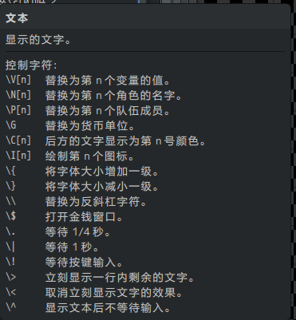{width="3.091666666666667in"
height="3.2in"}

**消息输入字符**：用于对话框一个输入/等待功能的字符，只在 对话框
中有效。

（上图中"\\."之后的字符都是消息输入字符）

**插件扩展字符**

**相关插件**

与窗口字符相关的插件如下：

Drill_CoreOfColor 系统 - 颜色核心

YEP_MessageCore 对话框 - 消息核心

Drill_DialogSpecialCharSize 对话框 - 特殊字符大小控制器

Drill_DialogTextAlign 对话框 - 文本居中

Drill_DialogTextBigImage 对话框 - 大图片字符

Drill_DialogReferenceChar 对话框 - 自定义指代字符

具体扩展的额外窗口字符可以去看看[窗口字符表](#综合字符表)。

**表达式（窗口辅助核心）**

表达式 和 窗口字符 是不同的两个结构，功能相似，但作用域不一样。

**1）写法区别**

表达式的格式为"\<某功能:...:...>"。

窗口字符的格式为"\\xxx"或"\\xxx\[10\]"。

**2）只特定位置有效**

只有 窗口辅助核心的特定子插件 才能使用表达式。

在一般的窗口中**无效**。

相关子插件会对表达式的支持情况进行说明。

（下图为全自定义面板的表达式转换功能。）

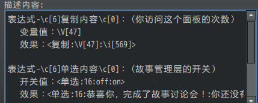{width="3.783333333333333in"
height="1.5168613298337708in"}

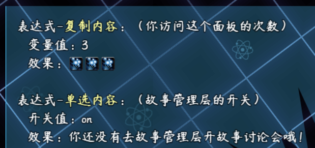{width="3.725in"
height="1.749180883639545in"}

[]{#光标偏移字符 .anchor}**光标偏移字符**

你需要先了解 [文本域与光标](#文本域与光标) ，不要急。

光标字符 \\px\[10\] 和 \\py\[10\]（单位像素）
可以将指定的图片绘制在文本域中。

注意，偏移位置不能填负数。

**1）位置影响**

偏移字符能够直接修改光标的位置，如下图，设置了\\px\[50\]\\py\[18\]，即光标左移50像素（绿色线），下移18像素（青色线）。

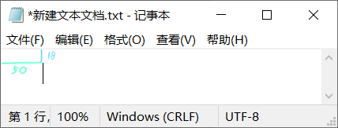{width="3.316666666666667in"
height="1.2654122922134734in"}

后面打出的字符，就是下面的情况：

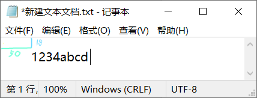{width="3.308333333333333in"
height="1.2622331583552056in"}

**2）换行影响**

光标偏移后，能够直接对整行的位置造成影响，如下图。

注意，光标偏移的px像素值（绿色线）会清零，偏移的py值（蓝色线）会叠加。

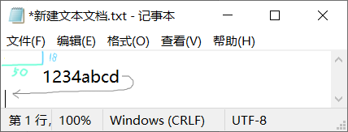{width="3.3417979002624674in"
height="1.275in"}

**3）断行影响**

如果光标偏移字符写在中间，比如"1234\\px\[50\]abcd"，可以造成"断开"的情况：

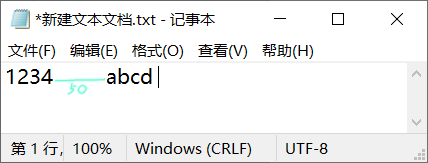{width="3.429163385826772in"
height="1.3083333333333333in"}

**文本居中**

你需要先了解 [文本域与光标](#文本域与光标) ，不要急。

文本居中，能根据当前的宽度

**1）居中原理**

居中与光标偏移性质一样，识别窗口的宽度和字符的宽度后，自动偏移合适的距离。

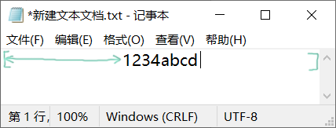{width="3.2583333333333333in"
height="1.2431561679790026in"}

这也是不能同时写两个\\dac\\dac字符的原因，因为光标距离叠加后，会出界。

**2）使用注意**

在使用文本居中插件时，如果隔行进行居中，那么第二行要 加空格
，不然就会造成居中失效。（居中插件不能识别空行情况，必须要有字符。）

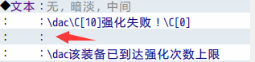{width="2.641895231846019in"
height="0.6500568678915135in"}

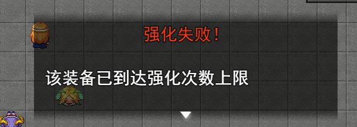{width="3.8in"
height="1.3491699475065617in"}

加上空格后就能正常居中了。

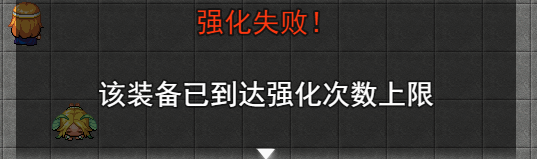{width="3.7666666666666666in"
height="1.117088801399825in"}

[]{#大图片字符 .anchor}**大图片字符**

你需要先了解 [文本域与光标](#文本域与光标) ，不要急。

图片字符 \\dimg\[1\]（直接绘制图片） 或
\\dimg\[10,10,1\]（偏移一段距离后绘制图片）
可以将指定的图片绘制在文本域中。

由于是绘制在文本域，所以经常会出现以下现象：

**1）图片只有一半**

因为文本域的宽度不够，所以只能看到一部分，加高窗口即可。

（另外，大图片不占字符宽度，所以光标仍然停留在原位置。）

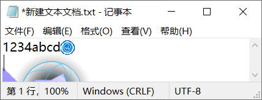{width="3.4946883202099737in"
height="1.3333333333333333in"}

**2）图片遮挡了前面的字符**

由于可以通过 \\dimg\[-80,0,1\]
设置图片的偏移位置，所以在绘制时，当前光标的字符可以挡住前面的字符。属于正常现象。

当然，遮挡后，就不能再还原了，只能重新绘制。

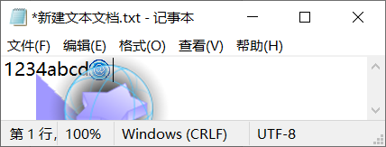{width="3.5in"
height="1.335359798775153in"}

所以一般都把 图片字符
放在最前面绘制，你也可以根据这个原理主动设置前面的字符的被遮挡效果。（对话管理层以此制作了
阅后即焚 的效果，你可以去看看。）

同样的，后面的图片字符，可以遮挡前面绘制的图片。

[]{#字符串核心 .anchor}**字符串核心**

字符串的窗口字符可以与变量字符组合\"\\str\[\\v\[21\]\]\"。

通过变量的值来修改不同情况下的字符串。

**1）自定义技能名**

技能块元素可以支持自定义的字符串。（原rmmv窗口不能支持）

修改字符串，切换不同的名字。

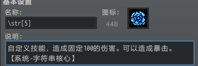{width="3.3919608486439197in"
height="1.1417650918635172in"}

**2）自我嵌套**

字符串内部可以也用\\str\[\]字符进行反复嵌套，但是要注意不能死循环嵌套。

比如3中有\\str\[2\]，2中有\\str\[1\]，而1中又有\\str\[3\]，则会构成死循环嵌套。

图中的字符串7，套用了前面2、5字符串中的内容。

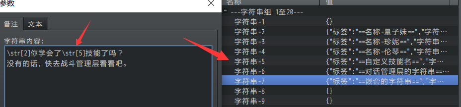{width="5.768055555555556in"
height="1.3423611111111111in"}

**3）随时修改**

你可以使用插件指令随时修改字符串的内容，包括嵌套其他字符串的内容。

你还可以让用户自己输入字符串，实现更多组合功能。

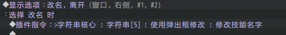{width="4.632344706911636in"
height="0.575in"}

[]{#综合字符表 .anchor}**窗口字符表**

所有可用的窗口字符表如下表所示：

（斜杠后面的字符可大写也可小写）

+------+---+-----------------------+-------+---------+------------------+
| **字 |   | **描述**              | **作  | *       | **所属插件**     |
| 符** |   |                       | 用范  | *类型** |                  |
|      |   |                       | 围**  |         |                  |
+======+===+=======================+=======+=========+==================+
| \    |   | 替换为第n个变量的值。 | 所有  | 指      | Rmmv默认功能     |
| \v\[ |   |                       | 窗口  | 代字符  |                  |
| 21\] |   |                       |       |         |                  |
+------+---+-----------------------+-------+---------+------------------+
| \\n\ |   | 替                    | 所有  | 指      | Rmmv默认功能     |
| [5\] |   | 换为第n个角色的名字。 | 窗口  | 代字符  |                  |
+------+---+-----------------------+-------+---------+------------------+
| \\p\ |   | 替换为                | 所有  | 指      | Rmmv默认功能     |
| [1\] |   | 第n个队伍成员的名字。 | 窗口  | 代字符  |                  |
+------+---+-----------------------+-------+---------+------------------+
| \\g  |   | 替换为货币单位。      | 所有  | 指      | Rmmv默认功能     |
|      |   |                       | 窗口  | 代字符  |                  |
|      |   | （ 数据库>系统        |       |         |                  |
|      |   | 中设置单位）          |       |         |                  |
+------+---+-----------------------+-------+---------+------------------+
| \\\\ |   | 替换为\               | 所有  | 指      | Rmmv默认功能     |
|      |   | '\\\'反斜杠字符本身。 | 窗口  | 代字符  |                  |
+------+---+-----------------------+-------+---------+------------------+
| \\c\ |   | 之后                  | 所有  | 效      | Rmmv默认功能     |
| [0\] |   | 文字显示为第n个颜色。 | 窗口  | 果字符  |                  |
| -    |   |                       |       |         |                  |
| \    |   |                       |       |         |                  |
| \c\[ |   |                       |       |         |                  |
| 31\] |   |                       |       |         |                  |
+------+---+-----------------------+-------+---------+------------------+
| \\   |   | 绘制第n个图标。       | 所有  | 效      | Rmmv默认功能     |
| i\[1 |   |                       | 窗口  | 果字符  |                  |
| 36\] |   |                       |       |         |                  |
+------+---+-----------------------+-------+---------+------------------+
| \\{  |   | 将字体放大一级。      | 所有  | 效      | Rmmv默认功能     |
|      |   |                       | 窗口  | 果字符  |                  |
+------+---+-----------------------+-------+---------+------------------+
| \\}  |   | 将字体缩小一级。      | 所有  | 效      | Rmmv默认功能     |
|      |   |                       | 窗口  | 果字符  |                  |
+------+---+-----------------------+-------+---------+------------------+
| \\\$ |   | 打开金钱窗口。(对     | 只对  | 效      | Rmmv默认功能     |
|      |   | 话中右上角出现一个金  | 话框  | 果字符  |                  |
|      |   | 钱窗口,结束对话消失)  |       |         |                  |
+------+---+-----------------------+-------+---------+------------------+
| \\.  |   | 等待 15               | 只对  | 消息输  | Rmmv默认功能     |
|      |   | 帧，四分之一秒。      | 话框  | 入字符  |                  |
+------+---+-----------------------+-------+---------+------------------+
| \\\| |   | 等待 60 帧，一秒。    | 只对  | 消息输  | Rmmv默认功能     |
|      |   |                       | 话框  | 入字符  |                  |
+------+---+-----------------------+-------+---------+------------------+
| \\!  |   | 等待按键输入。        | 只对  | 消息输  | Rmmv默认功能     |
|      |   |                       | 话框  | 入字符  |                  |
+------+---+-----------------------+-------+---------+------------------+
| \\\> |   | 立刻显示              | 只对  | 消息输  | Rmmv默认功能     |
|      |   | 后面文字。（一行内）  | 话框  | 入字符  |                  |
+------+---+-----------------------+-------+---------+------------------+
| \\\< |   | 取消立刻显示。        | 只对  | 消息输  | Rmmv默认功能     |
|      |   |                       | 话框  | 入字符  |                  |
+------+---+-----------------------+-------+---------+------------------+
| \\\^ |   | 显                    | 只对  | 消息输  | Rmmv默认功能     |
|      |   | 示文本后不等待输入。  | 话框  | 入字符  |                  |
+------+---+-----------------------+-------+---------+------------------+
|      |   |                       |       |         |                  |
+------+---+-----------------------+-------+---------+------------------+
| \\   |   | 之后文                | 所有  | 效      | D                |
| c\[1 |   | 字显示为自定义颜色。  | 窗口  | 果字符  | rill_CoreOfColor |
| 01\] |   |                       |       |         |                  |
| -    |   | 见                    |       |         | 系统-颜色核心    |
| \\   |   | "关于文本颜色.docx"   |       |         |                  |
| c\[1 |   | 。                    |       |         |                  |
| 99\] |   |                       |       |         |                  |
+------+---+-----------------------+-------+---------+------------------+
| \\   |   | 之后文字              | 所有  | 效      | D                |
| c\[2 |   | 显示为自定义渐变色。  | 窗口  | 果字符  | rill_CoreOfColor |
| 01\] |   |                       |       |         |                  |
| -    |   | 见                    |       |         | 系统-颜色核心    |
| \\   |   | "关于文本颜色.docx"   |       |         |                  |
| c\[2 |   | 。                    |       |         |                  |
| 99\] |   |                       |       |         |                  |
+------+---+-----------------------+-------+---------+------------------+
| \    |   | 该字                  | 所有  | 效      | Drill            |
| \dal |   | 符之后的文字左对齐。  | 窗口  | 果字符  | _DialogTextAlign |
|      |   |                       |       |         |                  |
|      |   | 见                    |       |         | 对话框-文本居中  |
|      |   | [文本                 |       |         |                  |
|      |   | 居中](#光标偏移字符)  |       |         |                  |
|      |   | 。                    |       |         |                  |
+------+---+-----------------------+-------+---------+------------------+
| \    |   | 该                    | 所有  | 效      | Drill            |
| \dac |   | 字符之后的文字居中。  | 窗口  | 果字符  | _DialogTextAlign |
|      |   |                       |       |         |                  |
|      |   | 见                    |       |         | 对话框-文本居中  |
|      |   | [文本                 |       |         |                  |
|      |   | 居中](#光标偏移字符)  |       |         |                  |
|      |   | 。                    |       |         |                  |
+------+---+-----------------------+-------+---------+------------------+
| \    |   | 该字                  | 所有  | 效      | Drill            |
| \dar |   | 符之后的文字右对齐。  | 窗口  | 果字符  | _DialogTextAlign |
|      |   |                       |       |         |                  |
|      |   | 见                    |       |         | 对话框-文本居中  |
|      |   | [文本                 |       |         |                  |
|      |   | 居中](#光标偏移字符)  |       |         |                  |
|      |   | 。                    |       |         |                  |
+------+---+-----------------------+-------+---------+------------------+
| \\d  |   | 在                    | 所有  | 效      | Drill_Di         |
| img\ |   | 光标位置绘制大图片。  | 窗口  | 果字符  | alogTextBigImage |
| [1\] |   |                       |       |         |                  |
|      |   | 见                    |       |         | 对               |
|      |   | [大图                 |       |         | 话框-大图片字符  |
|      |   | 片字符](#大图片字符)  |       |         |                  |
|      |   | 。                    |       |         |                  |
+------+---+-----------------------+-------+---------+------------------+
| \\di |   | 在光标                | 所有  | 效      | Drill_Di         |
| mg\[ |   | 位置偏移一点绘制大图  | 窗口  | 果字符  | alogTextBigImage |
| 5,-5 |   | 片，不影响光标位置。  |       |         |                  |
| ,1\] |   |                       |       |         | 对               |
|      |   | 见                    |       |         | 话框-大图片字符  |
|      |   | [大图                 |       |         |                  |
|      |   | 片字符](#大图片字符)  |       |         |                  |
|      |   | 。                    |       |         |                  |
+------+---+-----------------------+-------+---------+------------------+
| \\   |   | 替换为插件中          | 所有  | 效      | Dr               |
| str\ |   | 自定义配置的字符串。  | 窗口  | 果字符  | ill_CoreOfString |
| [1\] |   |                       |       |         |                  |
|      |   | 见                    |       |         | 系统-字符串核心  |
|      |   | [字符                 |       |         |                  |
|      |   | 串核心](#字符串核心)  |       |         |                  |
|      |   | 。                    |       |         |                  |
+------+---+-----------------------+-------+---------+------------------+
| \    |   | 替换                  | 所有  | 指      | YEP_MessageCore  |
| \ac\ |   | 为第n个角色的职业名。 | 窗口  | 代字符  |                  |
| [1\] |   |                       |       |         | 对话框-消息核心  |
+------+---+-----------------------+-------+---------+------------------+
| \    |   | 替换为第              | 所有  | 指      | YEP_MessageCore  |
| \an\ |   | n个角色的昵称（小名） | 窗口  | 代字符  |                  |
| [1\] |   |                       |       |         | 对话框-消息核心  |
+------+---+-----------------------+-------+---------+------------------+
| \    |   | 替换为                | 所有  | 指      | YEP_MessageCore  |
| \pc\ |   | 第n个队伍成员的职业名 | 窗口  | 代字符  |                  |
| [1\] |   |                       |       |         | 对话框-消息核心  |
+------+---+-----------------------+-------+---------+------------------+
| \    |   | 替换为第n个队         | 所有  | 指      | YEP_MessageCore  |
| \pn\ |   | 伍成员的昵称（小名）  | 窗口  | 代字符  |                  |
| [1\] |   |                       |       |         | 对话框-消息核心  |
+------+---+-----------------------+-------+---------+------------------+
| \    |   | 替换为第n个职业的名字 | 所有  | 指      | YEP_MessageCore  |
| \nc\ |   |                       | 窗口  | 代字符  |                  |
| [1\] |   |                       |       |         | 对话框-消息核心  |
+------+---+-----------------------+-------+---------+------------------+
| \    |   | 替换为第n个物品的名字 | 所有  | 指      | YEP_MessageCore  |
| \ni\ |   |                       | 窗口  | 代字符  |                  |
| [1\] |   |                       |       |         | 对话框-消息核心  |
+------+---+-----------------------+-------+---------+------------------+
| \    |   | 替换为第n个武器的名字 | 所有  | 指      | YEP_MessageCore  |
| \nw\ |   |                       | 窗口  | 代字符  |                  |
| [1\] |   |                       |       |         | 对话框-消息核心  |
+------+---+-----------------------+-------+---------+------------------+
| \    |   | 替换为第n个防具的名字 | 所有  | 指      | YEP_MessageCore  |
| \na\ |   |                       | 窗口  | 代字符  |                  |
| [1\] |   |                       |       |         | 对话框-消息核心  |
+------+---+-----------------------+-------+---------+------------------+
| \    |   | 替换为第n个技能的名字 | 所有  | 指      | YEP_MessageCore  |
| \ns\ |   |                       | 窗口  | 代字符  |                  |
| [1\] |   |                       |       |         | 对话框-消息核心  |
+------+---+-----------------------+-------+---------+------------------+
| \    |   | 替换为第n个状态的名字 | 所有  | 指      | YEP_MessageCore  |
| \nt\ |   |                       | 窗口  | 代字符  |                  |
| [1\] |   |                       |       |         | 对话框-消息核心  |
+------+---+-----------------------+-------+---------+------------------+
| \    |   | 替换为第n个物品的名字 | 所有  | 指      | YEP_MessageCore  |
| \ii\ |   | + 图标                | 窗口  | 代字符  |                  |
| [1\] |   |                       |       |         | 对话框-消息核心  |
+------+---+-----------------------+-------+---------+------------------+
| \    |   | 替换为第n个武器的名字 | 所有  | 指      | YEP_MessageCore  |
| \iw\ |   | + 图标                | 窗口  | 代字符  |                  |
| [1\] |   |                       |       |         | 对话框-消息核心  |
+------+---+-----------------------+-------+---------+------------------+
| \    |   | 替换为第n个防具的名字 | 所有  | 指      | YEP_MessageCore  |
| \ia\ |   | + 图标                | 窗口  | 代字符  |                  |
| [1\] |   |                       |       |         | 对话框-消息核心  |
+------+---+-----------------------+-------+---------+------------------+
| \    |   | 替换为第n个技能的名字 | 所有  | 指      | YEP_MessageCore  |
| \is\ |   | + 图标                | 窗口  | 代字符  |                  |
| [1\] |   |                       |       |         | 对话框-消息核心  |
+------+---+-----------------------+-------+---------+------------------+
| \    |   | 替换为第n个状态的名字 | 所有  | 指      | YEP_MessageCore  |
| \it\ |   | + 图标                | 窗口  | 代字符  |                  |
| [1\] |   |                       |       |         | 对话框-消息核心  |
+------+---+-----------------------+-------+---------+------------------+
| \\fr |   | 重设之                | 所有  | 效      | YEP_MessageCore  |
|      |   | 后文字的字体为默认。  | 窗口  | 果字符  |                  |
|      |   |                       |       |         | 对话框-消息核心  |
+------+---+-----------------------+-------+---------+------------------+
| \\fn |   | 指定之后的文字字体。  | 所有  | 效      | YEP_MessageCore  |
| \<微 |   |                       | 窗口  | 果字符  |                  |
| 软雅 |   |                       |       |         | 对话框-消息核心  |
| 黑>  |   |                       |       |         |                  |
+------+---+-----------------------+-------+---------+------------------+
| \\   |   | 指定之                | 所有  | 效      | YEP_MessageCore  |
| fs\[ |   | 后的文字字体大小为n。 | 窗口  | 果字符  |                  |
| 20\] |   |                       |       |         | 对话框-消息核心  |
+------+---+-----------------------+-------+---------+------------------+
| \\fb |   | 之后的文字字体加粗。  | 所有  | 效      | YEP_MessageCore  |
|      |   |                       | 窗口  | 果字符  |                  |
|      |   | （如果要还原，就加    |       |         | 对话框-消息核心  |
|      |   | \\fr ）               |       |         |                  |
+------+---+-----------------------+-------+---------+------------------+
| \\fi |   | 之后的文字字体倾斜。  | 所有  | 效      | YEP_MessageCore  |
|      |   |                       | 窗口  | 果字符  |                  |
|      |   | （如果要还原，就加    |       |         | 对话框-消息核心  |
|      |   | \\fr ）               |       |         |                  |
+------+---+-----------------------+-------+---------+------------------+
| \    |   | 之后的 文字边线       | 所有  | 效      | YEP_MessageCore  |
| \oc\ |   | 为第n个颜色。         | 窗口  | 果字符  |                  |
| [6\] |   |                       |       |         | 对话框-消息核心  |
|      |   | (只                   |       |         |                  |
|      |   | 能填rmmv默认颜色0-31) |       |         |                  |
+------+---+-----------------------+-------+---------+------------------+
| \    |   | 之后的 文字边线       | 所有  | 效      | YEP_MessageCore  |
| \ow\ |   | 厚度为n像素。         | 窗口  | 果字符  |                  |
| [3\] |   |                       |       |         | 对话框-消息核心  |
|      |   | (标准为1像素)         |       |         |                  |
+------+---+-----------------------+-------+---------+------------------+
| \\   |   | 断行，设置当前字符    | 所有  | 效      | YEP_MessageCore  |
| px\[ |   | 偏移的x值，单位像素。 | 窗口  | 果字符  |                  |
| 10\] |   |                       |       |         | 对话框-消息核心  |
|      |   | 见                    |       |         |                  |
|      |   | [光标偏移             |       |         |                  |
|      |   | 字符](#光标偏移字符)  |       |         |                  |
|      |   | 。                    |       |         |                  |
+------+---+-----------------------+-------+---------+------------------+
| \    |   | 断行，设置当前字符    | 所有  | 效      | YEP_MessageCore  |
| \py\ |   | 偏移的y值，单位像素。 | 窗口  | 果字符  |                  |
| [5\] |   |                       |       |         | 对话框-消息核心  |
|      |   | 见                    |       |         |                  |
|      |   | [光标偏移             |       |         |                  |
|      |   | 字符](#光标偏移字符)  |       |         |                  |
|      |   | 。                    |       |         |                  |
+------+---+-----------------------+-------+---------+------------------+
| \    |   | 该字符把对话框脸图    | 只对  | 效      | YEP_MessageCore  |
| \af\ |   | 换成第n个角色脸图。   | 话框  | 果字符  |                  |
| [5\] |   | (只对话框有效)        |       |         | 对话框-消息核心  |
+------+---+-----------------------+-------+---------+------------------+
| \    |   | 该字符把对话框脸图    | 只对  | 效      | YEP_MessageCore  |
| \pf\ |   | 换成第n个队伍成员     | 话框  | 果字符  |                  |
| [1\] |   | 脸图。(只对话框有效)  |       |         | 对话框-消息核心  |
+------+---+-----------------------+-------+---------+------------------+
| \    |   | 等待 n 帧。           | 只对  | 消息输  | YEP_MessageCore  |
| \w\[ |   |                       | 话框  | 入字符  |                  |
| 60\] |   |                       |       |         | 对话框-消息核心  |
+------+---+-----------------------+-------+---------+------------------+
| \\n  |   | 建                    | 只对  | 效      | YEP_MessageCore  |
| \<小 |   | 立一个靠左的姓名框。  | 话框  | 果字符  |                  |
| 爱丽 |   |                       |       |         | 对话框-消息核心  |
| 丝>  |   |                       |       |         |                  |
+------+---+-----------------------+-------+---------+------------------+
| \\nc |   | 建                    | 只对  | 效      | YEP_MessageCore  |
| \<小 |   | 立一个居中的姓名框。  | 话框  | 果字符  |                  |
| 爱丽 |   |                       |       |         | 对话框-消息核心  |
| 丝>  |   |                       |       |         |                  |
+------+---+-----------------------+-------+---------+------------------+
| \\nr |   | 建                    | 只对  | 效      | YEP_MessageCore  |
| \<小 |   | 立一个靠右的姓名框。  | 话框  | 果字符  |                  |
| 爱丽 |   |                       |       |         | 对话框-消息核心  |
| 丝>  |   |                       |       |         |                  |
+------+---+-----------------------+-------+---------+------------------+
