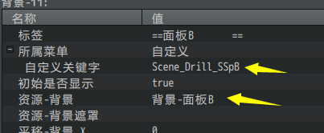
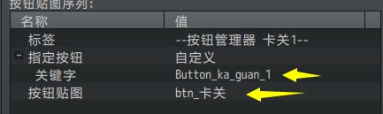
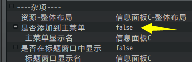
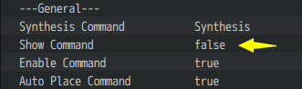
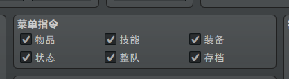
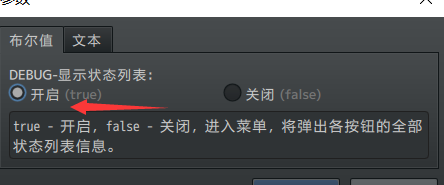
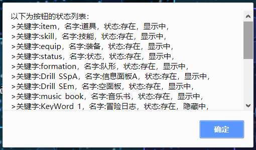
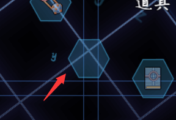
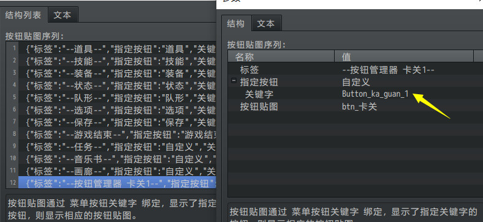
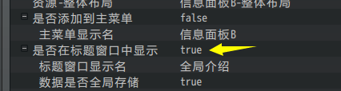

## 概述

### 概念介绍

**关键字**：与id一样，通过唯一标识，在两个不同模块之间进行相互关联。

当前文档提及的都是与菜单界面相关的关键字，分为 界面关键字 和
按钮关键字。

### 快速区分

**界面关键字**：背景、魔法圈等装饰常用的关键字，用于连接图层并找到界面。

{width="2.8191491688538934in"
height="1.16123687664042in"}

{width="3.595744750656168in"
height="1.4900732720909886in"}

**按钮关键字**：按钮功能用的关键字，用于关联一个具体窗口的相关按钮。

{width="2.8916666666666666in"
height="0.8614884076990377in"}

{width="1.3690485564304462in"
height="1.6666666666666667in"}

### 思维导图

按钮关键字的思维导图如下：（调整一下word右下角的缩放率，可以看清小字）

## 关键字

### 界面关键字

#### 相关插件

界面关键字的相关插件如下：

Drill_MenuBackground 主菜单 - 多层菜单背景

Drill_MenuParticles 主菜单 - 多层菜单粒子

Drill_MenuCircle 主菜单 - 多层菜单魔法圈

Drill_MenuGIF 主菜单 - 多层菜单GIF

Drill_MenuVideo 主菜单 - 多层菜单视频

Drill_MenuBackButton 主菜单 - 返回按钮

......（还有其他插件可以使用界面关键字进行关联，这里不再列举）

上述插件，通过界面关键字，分别装饰不同的菜单界面的内容：

#### 列表

以下是所有界面的界面关键字：（界面的概念可以去看看"界面.docx"）

  ---------------------------------------------------------------------------------------------------------
  **类型**   **界面关键字**              **介绍**          **控制插件**              **是否可被插件装饰**
  ---------- --------------------------- ----------------- ------------------------- ----------------------
  战斗       Scene_Battle                战斗界面          无                        √(多层战斗背景)

  地图       Scene_Map                   地图界面          无                        √(多层地图背景)

  菜单       Scene_Menu                  主菜单界面        面板-全自定义主菜单       √

             Scene_Item                  物品界面          面板-全自定义物品界面     √

             Scene_Skill                 技能界面          面板-全自定义技能界面     √

             Scene_Equip                 装备界面          面板-全自定义装备界面     √

             Scene_Status                状态界面          面板-全自定义状态界面     √

             Scene_Options               选项界面          无                        √

             Scene_Load                  读档界面          面板-全自定义存档界面     √

             Scene_Save                  存档界面          面板-全自定义存档界面     √

             Scene_GameEnd               游戏结束界面      无                        √

             Scene_Shop                  商店界面          面板-全自定义商店界面     √

             Scene_Title                 标题界面          标题-标题窗口             √(多层标题背景)

             Scene_Name                  输入名称界面      无                        √

             Scene_Debug                 测试查值界面      无                        √

             Scene_Gameover              战斗失败界面      无                        x

                                                                                     

  菜单       Scene_Party                 Mog主菜单队形     面板-全自定义主菜单       √

             Scene_Drill_SMa_Formation   Drill主菜单队形   面板-全自定义主菜单面板   √

             Scene_Picture_Gallery       画廊界面          面板-画廊                 √

             Scene_Music_Book            音乐书界面        面板-音乐书               √

             Scene_Fast_Travel           世界地图界面      面板-世界地图             x

             Scene_CharSelect            角色选择界面      面板-角色选择界面         x

             Scene_Drill_SEm             自定义空面板      面板-全自定义空面板       √

             Scene_Drill_SSpA            自定义面板A       面板-全自定义信息面板A    √

             Scene_Drill_SSpB            自定义面板B       面板-全自定义信息面板B    √

             Scene_Drill_SSpC            自定义面板C       面板-全自定义信息面板C    √

             Scene_Drill_SSpD            自定义面板D       面板-全自定义信息面板D    √

             Scene_Drill_SSpE            自定义面板E       面板-全自定义信息面板E    √

             Scene_Drill_SSpF            自定义面板F       面板-全自定义信息面板F    √

             Scene_Drill_SSpG            自定义面板G       面板-全自定义信息面板G    √

             Scene_Drill_SSpH            自定义面板H       面板-全自定义信息面板H    √

             Scene_Drill_SSpI            自定义面板I       面板-全自定义信息面板I    √

             Scene_Drill_SSpJ            自定义面板J       面板-全自定义信息面板J    √

             Scene_Drill_SLS             限量商店          面板-限量商店             √

             Scene_Drill_SCr             制作组界面        标题-制作组               √

             Scene_EnemyBook             敌人图鉴界面      敌人图鉴                  √

             Scene_ItemBook              道具图鉴界面      道具图鉴                  √

             Scene_Lagomoro_Mission      小优任务界面      Lagomoro任务系统          √

             Scene_Synthesis             物品合成界面      YEP_物品合成              √

             Scene_Quest                 YEP任务界面       YEP_任务系统              √
  ---------------------------------------------------------------------------------------------------------

1\.
除了上述关键字，还有：Scene_Base、Scene_Boot，Scene_File、Scene_MenuBase、Scene_ItemBase这些属于脚本层面的特殊类，单独也不能被调用，这里只提及一下。

2\.
存档界面和读档界面是两个界面，但是由于功能和结构都一样，所以基本注意不到其区别，不过你可以把他们分别装饰。

3\.
战斗失败界面也属于菜单，因为在地图界面中，如果全部角色死亡，也会直接战斗失败，进入游戏标题界面。

4\.
输入名称界面，即："事件指令>场景控制>名字输入处理"执行后，进入的界面。

5\. 测试查值界面，即在测试游戏时，按F9进入的界面，可以查看变量的状态。

6\. 全自定义信息面板的介绍，可以去看看\"关于全自定义信息面板.docx\"。

### 按钮关键字 - 主菜单面板

#### 相关插件

主菜单面板按钮的相关插件如下：

MOG_SceneMenu 面板 - 全自定义主菜单

Drill_SceneMain 面板 - 全自定义主菜单面板

Drill_WindowMenuButton 控件 - 主菜单选项按钮管理器

面板插件可以使用 按钮关键字 将按钮组的贴图资源 关联 已添加到主菜单
的按钮。

管理器插件可以使用 按钮关键字
添加额外可用的主菜单按钮，并执行相关公共事件。

（具体方法可以见后面章节[主菜单按钮关联方法](#主菜单按钮关联方法)）

注意，如果相关面板插件中，有**"添加到主菜单"**的按钮功能，那么这个面板的按钮才能有效，并关联。

{width="2.4662893700787403in"
height="0.7979166666666667in"}
{width="2.7585728346456695in"
height="0.8167377515310587in"}

#### 列表

以下是所有主菜单的按钮关键字：

（关键字的大小写敏感，必须完全匹配。加前缀 "Button\_" 或者 不加
都可以。）

  ------------------------------------------------------------------------------------------------
  **类型**   **按钮关键字(主菜单)**   **介绍**       **控制插件**             **是否可添加按钮**
  ---------- ------------------------ -------------- ------------------------ --------------------
  战斗       /                        战斗界面       无                       x

  地图       /                        地图界面       无                       x

  菜单       /                        主菜单界面     面板-全自定义主菜单      x

             item                     物品界面       面板-全自定义物品界面    √

             skill                    技能界面       面板-全自定义技能界面    √

             equip                    装备界面       面板-全自定义装备界面    √

             status                   状态界面       面板-全自定义状态界面    √

             formation                主菜单队形     面板-全自定义主菜单      x

             options                  选项界面       无                       √

             save                     存档界面       面板-全自定义存档界面    √

             gameEnd                  游戏结束界面   无                       √

             /                        商店界面       面板-全自定义商店界面    x

             /                        标题界面       标题-标题窗口            x

             /                        输入名称界面   无                       x

             /                        测试查值界面   无                       x

             /                        战斗失败界面   无                       x

                                                                              

  菜单       picture_gallery          画廊界面       面板-画廊                √

             music_book               音乐书界面     面板-音乐书              √

             Fast_Travel              世界地图界面   面板-世界地图            √

             /                        角色选择界面   面板-角色选择界面        x

             Drill_SEm                自定义空面板   面板-全自定义空面板      √

             Drill_SSpA               自定义面板A    面板-全自定义信息面板A   √

             Drill_SSpB               自定义面板B    面板-全自定义信息面板B   √

             Drill_SSpC               自定义面板C    面板-全自定义信息面板C   √

             Drill_SSpD               自定义面板D    面板-全自定义信息面板D   √

             Drill_SSpE               自定义面板E    面板-全自定义信息面板E   √

             Drill_SSpF               自定义面板F    面板-全自定义信息面板F   √

             Drill_SSpG               自定义面板G    面板-全自定义信息面板G   √

             Drill_SSpH               自定义面板H    面板-全自定义信息面板H   √

             Drill_SSpI               自定义面板I    面板-全自定义信息面板I   √

             Drill_SSpJ               自定义面板J    面板-全自定义信息面板J   √

             /                        限量商店       面板-限量商店            x

             /                        制作组界面     标题-制作组              x

             /                        敌人图鉴界面   敌人图鉴                 x

             /                        道具图鉴界面   道具图鉴                 x

             Lagomoro_Mission         小优任务界面   Lagomoro任务系统         √

             Synthesis                物品合成界面   YEP_物品合成             √

             Quest                    YEP任务界面    YEP_任务系统             √
  ------------------------------------------------------------------------------------------------

#### 主菜单按钮关联方法

1.基本的六个按钮，可以在下面的勾选中控制，也可以通过**按钮窗口管理器**控制。

{width="3.475300743657043in"
height="0.9500820209973754in"}

2.你可以通过 按钮管理器
的debug查看功能，显示所有关键字，以及按钮的状态。

{width="3.325in"
height="1.3854166666666667in"}

{width="4.25036854768154in"
height="2.5002165354330708in"}

3.首先，你要确定按钮**是否被添加**到主菜单中：

如果你想通过按钮执行自定义公共事件，可以在 主菜单选项按钮管理器
插件中添加自定义按钮。

如果按钮被添加了，一定会出现对应默认图片的按钮。

{width="2.7in"
height="0.8735290901137358in"}{width="2.7585728346456695in"
height="0.8167377515310587in"}

{width="2.091666666666667in"
height="1.4234951881014872in"}

关掉 全自定义主菜单 插件是这样的：

（关掉插件时，直接显示文本，所以不需要对应按钮图片。）

{width="2.4583333333333335in"
height="2.7526410761154856in"}

4.下图为 菜单选项按钮组 \> 按钮贴图序列 的 **贴图关联** 配置。

{width="5.768055555555556in"
height="2.6569444444444446in"}

如果需要对应按钮图片，你需要在旧插件MOG_SceneMenu全自定义主菜单中，在关键字的基础上额外加"Button\_"前缀。（Drill_SceneMain插件可加可不加）

比如信息面板的按钮关键字为Drill_SSpA，那么你要写Button_Drill_SSpA。

### 按钮关键字 - 标题面板

#### 相关插件

标题面板按钮的相关插件如下：

Drill_TitleScene 面板 - 全自定义主菜单面板

面板插件可以使用 按钮关键字 将按钮组的贴图资源 关联 已添加到标题
的按钮。

注意，如果面板插件中，有**"是否在标题窗口中显示"**的功能，那么该面板按钮才能有效。

（由于标题界面属于全局，所以只有能进行全局存储的插件才有机会添加到标题。）

{width="3.25in"
height="0.8697178477690288in"}

#### 列表

以下是所有 标题 的按钮关键字：

（关键字的大小写敏感，必须完全匹配。加前缀 "Button\_" 或者 不加 都可以）

  ----------------------------------------------------------------------------------------------------
  **类型**   **按钮关键字(标题)**   **介绍**       **控制插件**              **是否可添加/去除按钮**
  ---------- ---------------------- -------------- ------------------------- -------------------------
  菜单       new                    新游戏         无                        x

             continue               继续           无                        √

             options                选项           无                        √

             Drill_TSc_Quit         退出           面板-全自定义主菜单面板   √

             Drill_SCr_command      制作组界面     标题-制作组               √

             Drill_SEm              自定义空面板   面板-全自定义空面板       √

             Drill_SSpA             自定义面板A    面板-全自定义信息面板A    √

             Drill_SSpB             自定义面板B    面板-全自定义信息面板B    √

             Drill_SSpC             自定义面板C    面板-全自定义信息面板C    √

             Drill_SSpD             自定义面板D    面板-全自定义信息面板D    √

             Drill_SspE             自定义面板E    面板-全自定义信息面板E    √

             Drill_SSpF             自定义面板F    面板-全自定义信息面板F    √

             Drill_SSpG             自定义面板G    面板-全自定义信息面板G    √

             Drill_SSpH             自定义面板H    面板-全自定义信息面板H    √

             Drill_SspI             自定义面板I    面板-全自定义信息面板I    √

             Drill_SSpJ             自定义面板J    面板-全自定义信息面板J    √

             PictureGallery         画廊界面       面板-画廊                 √

             MusicBook              音乐书界面     面板-音乐书               √
  ----------------------------------------------------------------------------------------------------
