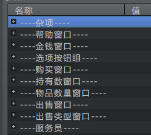

## 插件介绍

◆MOG_FastTravel 面板 -- 世界地图

**世界地图实际上是一个菜单面板，关键字是：Fast_Travel**

不过世界地图自己设置了背景，菜单粒子和菜单背景插件都不能在世界地图中体现。

配置分为五个部分，坐标组、地图、类型按钮、坐标窗口、杂项数据。

你可以设置坐标窗口为多列，具体内容去看看"窗口与布局"。

{width="3.2419477252843394in"
height="1.7084809711286089in"}

点击旁边的小按钮可以将它们收起。

## 关于世界地图素材

╭(°A°\`)╮我其实非常想在网上找现成的免费素材，然而百度的图片真的完全是鱼龙混杂。

于是我得出了最后的结论：

**世界地图只有自己画才合适。**

ヽ(#\`Д´)ノ我试过很多别人的素材进行拼接、磨合。然而这些工作量都白白浪费了。

因为看起来各有风格的两张图片拼合到一起，会变得非常难看......

风格统一是最大的难点。举个栗子：【我并不是专业画画的，只是跟着感觉走】

2d素材 和3d素材不能搭配。

低分辨率 和 高分辨率 不能搭配。

单色图 和 彩色图 不能搭配。

简单形状 和 复杂形状 不能搭配。

渐变 和 杂线条 不能搭配。

粗线条 和 细线条 不能搭配。

像素图 和 实物图 不能搭配。

机械风 和 复古风 不能搭配。

局部图 和 整体图 不能搭配。（比如半身像和全身像）

要找到与自己风格相符的素材，只有自己画才合适。╭(°A°\`)╮

**另外，世界地图的边缘最好透明化。地图坐标如果设置超出了边界，是可以看到地图的边缘被切断的部分的。**

{width="4.406820866141732in"
height="2.09375in"}

## 关于类型按钮

**mog脚本中固定了三种类型：城镇、迷宫、其他。三者实际上只是个分类，没有实际区别。**

{width="3.968254593175853in"
height="1.895596019247594in"}

（这里我在图片上对应编辑了文字：管理层、世界、其他，从玩家角度是看不出原来的分类的。）

## 关于取消事件

注意，**世界地图的菜单是可以被取消的。**

如果要设置的是某些消耗物、改变天气、设置光源的绑定事件。那么你必须捕获取消菜单的情况。以免出现问题。

{width="2.8284831583552057in"
height="0.8666666666666667in"}

{width="4.1in"
height="1.8325218722659669in"}

这里还有一种情况，就是：

**玩家在光源管理层，但是玩家传送的时候又一次选择了光源管理层。**

这个条件也要捕获到，及时防范。

{width="4.65873687664042in"
height="1.8918307086614172in"}

（玩家的操作是完全不可预测的，说不定他们用发现的bug能破坏整个游戏的玩法。）
