## 概述

### 插件介绍

所有自定义信息面板插件如下：

◆Drill_SceneEmpty 面板 - 全自定义空面板

◆Drill_SceneSelfplateA、B 面板 - 全自定义信息面板A、B

◆Drill_SceneSelfplateC、D 面板 - 全自定义信息面板C、D

◆Drill_SceneSelfplateE、F 面板 - 全自定义信息面板E、F

◆Drill_SceneSelfplateG、H 面板 - 全自定义信息面板G、H

◆Drill_SceneSelfplateI、J 面板 - 全自定义信息面板I、J

◆Drill_SceneSelfplateK、L 面板 - 全自定义信息面板K、L

◆Drill_SceneSelfplateM、N 面板 - 全自定义信息面板M、N

所有信息面板，都会建立一个新的界面。进入信息面板后，其他界面全部处于暂停状态。

注意，信息面板只提供 静态的 固定的 数字、文本、图像的展示。

不适合
做galgame、视觉小说等动态文本的类型。如果要做galgame、视觉小说类型的游戏，去示例中的
对话管理层 看看。

### 快速区分

插件的功能如下：

  -------------------------------------------------------------------------------------------------------------------
  **名称**            **部件**                                                 **特殊功能**
  ------------------- -------------------------------------------------------- --------------------------------------
  全自定义空面板      空                                                       无

  全自定义信息面板A   1个选项窗口+1个文本描述窗口+1个描述图                    可全局存储

  全自定义信息面板B   1个选项窗口+1个文本描述窗口+1个描述图                    可全局存储

  全自定义信息面板C   1个选项窗口+1个文本描述窗口+1个描述图+4个箭头            可全局存储

  全自定义信息面板D   1个选项窗口+1个文本描述窗口+1个描述图+4个箭头            可全局存储

  全自定义信息面板E   1个滚轴式长画布                                          无

  全自定义信息面板F   1个滚轴式长画布                                          无

  全自定义信息面板G   1个选项窗口+1个文本描述窗口+1个描述图+4个箭头+流程锁定   可全局存储

  全自定义信息面板H   1个选项窗口+1个文本描述窗口+1个描述图+4个箭头+流程锁定   可全局存储

  全自定义信息面板I   1个选项窗口+1个按钮组+1个文本描述窗口+1个描述图          可全局存储

  全自定义信息面板J   1个选项窗口+1个按钮组+1个文本描述窗口+1个描述图          可全局存储

  全自定义信息面板K   1个选项窗口+1个按钮组+1个文本描述窗口+1个描述图          选项点击可触发公共事件；不能全局存储

  全自定义信息面板L   1个选项窗口+1个按钮组+1个文本描述窗口+1个描述图          选项点击可触发公共事件；不能全局存储

  全自定义信息面板M   1个选项窗口+1个按钮组+4个文本描述窗口+4个描述图          可全局存储

  全自定义信息面板N   1个选项窗口+1个按钮组+4个文本描述窗口+4个描述图          可全局存储
  -------------------------------------------------------------------------------------------------------------------

如果你觉得A、B同功能的两个插件太少了，还需要更多的面板插件，可以去看看后面的章节：
[复制面板插件](#复制面板插件) 。

### 插件关系

信息面板的结构是一颗大树。（蓝色表示相关插件，白色表示外部插件。）

**思维导图**

自定义信息面板的思维导图如下：（调整一下word右下角的缩放率，可以看清小字）

## 面板

### 窗口

\> 如果你只要一个单独的描述窗口：

设置一个选项，然后把选项窗口设置y1000看不见即可。

\> 如果你要做像任务激活那种形式：

设置两个选项，一个激活，一个未激活（灰色），

通过插件指令显示/隐藏两个按钮,只显示一个,使其看起来像一个选项。

信息面板具有当前页记忆，如果你修改了一些选项，你需要用插件指令调整一下当前选中页。

{width="3.5729166666666665in"
height="0.8958333333333334in"}

### 内容

**1）窗口字符**

内容可以填各种特殊字符：

\\c\[n\] 变颜色 \\i\[n\] 显示图标 \\{\\} 字体变大变小

\\V\[n\] 显示变量 \\N\[n\] 显示角色名 \\G 显示货币单位

具体可以去看看文档介绍："关于窗口字符.docx"

这些字符在很多窗口中适用，可以灵活使用：

{width="4.508333333333334in"
height="0.9497255030621172in"}

{width="4.525in"
height="0.9593000874890638in"}

**2）选项内容**

默认的选项，是以选项名来显示的，如果你想显示多行长文本式的选项内容，可以去开启"选项内容"的设置，这样所有选项都将使用选项内容。

{width="3.183608923884514in"
height="0.9167465004374453in"}

{width="5.567148950131234in"
height="1.125097331583552in"}

{width="5.541666666666667in"
height="1.0121248906386702in"}

### 表达式

描述窗口中支持一些简单的表达式，表达式可以识别内容并转换成特定形式，如下：

**1) 复制内容**

\<复制:2:文字>

\<复制:\\v\[21\]:文字>

中间填2，表示内容复制2个，比如，\"ii\<复制:2:aaa>ii\" = \"iiaaaaaaii\"

中间填\\v\[21\]变量，则会根据变量值，复制指定变量的数量。比如\"\<复制:\\v\[21\]:#\>\"，#号将会被复制变量21的值的数量。

**2) 单选内容**

\<单选:21:结果A:结果B>

数字表示开关id，如果开关为on，则会输出结果A，如果开关为off，则输出结果B。

**3) 分隔符**

\<分隔:0:1>

中间的数字表示颜色数字，后面的数字表示分隔线厚度。比如\"\<分隔:0:1>\"，整行会变成一条厚度为1，颜色为0（白色）的分隔线。

{width="3.7395833333333335in"
height="2.2395833333333335in"}

### 箭头

选项窗口的可以是1列多行的竖条窗口，也可以是多列1行的横条窗口，也可以是m\*n的矩阵。

**上下左右箭头会自动根据当前处在的矩阵位置，判断所处边缘，自动显示。**

如果你设置选项为2列，则下图为处在右上角的位置：

{width="4.260416666666667in"
height="1.8645833333333333in"}

{width="3.2395833333333335in"
height="2.21875in"}

需要注意的是，你在信息面板中设置了**列数**之后，**是无法在游戏中修改的**，所以如果你有不同想法的设计矩阵，可以考虑在另一个面板D中设计。

面板C和面板D是一模一样的功能。

### 长画布

去看看 "关于滚轴式长画布.docx" 中的 **长画布** 章节。

### 按钮组

按钮组的介绍，可以去看看 "关于按钮组核心.docx"。

其中包含各种排列方式，下图为直线排列：

{width="3.225in"
height="1.0030741469816273in"}

### 触发公共事件

信息面板K和L可以支持选项按键后，返回地图界面，执行相应的公共事件。

具体触发原理可以去看看"关于公共事件与并行.docx"。

{width="5.55in"
height="1.5796052055993002in"}

## 从零开始设计

### 灵感提示

使用全自定义信息面板制作，

+-----------------------------------------------------------------------+
| 优点：                                                                |
|                                                                       |
| 1.贴图层次结构灵活，可以贴大量背景、粒子、魔法圈。                    |
|                                                                       |
| 2.框架成形，制作固定画面的图层非常简单，ps解决一切。                  |
|                                                                       |
| 3.游戏性能消耗低。                                                    |
|                                                                       |
| 缺点：                                                                |
|                                                                       |
| 1.用户交互能力受限，不能制作复杂的事件响应。                          |
|                                                                       |
| 2.每个面板都是独立的界面，进入该界面后，其它界面必然暂停。            |
+=======================================================================+
+-----------------------------------------------------------------------+

也可以使用地图界面+事件来做类似菜单功能：

+-----------------------------------------------------------------------+
| 优点：                                                                |
|                                                                       |
| 1.交互能力可以高度自定义。                                            |
|                                                                       |
| 2.可以使用事件制作鼠标按钮点击效果。                                  |
|                                                                       |
| 缺点：                                                                |
|                                                                       |
| 1.框架混乱，用事件写出来的指令，不能很好地复用、转移。                |
|                                                                       |
| 2.需要许多并行事件支撑，容易出现bug；                                 |
|                                                                       |
| 容易劝退对 事件指令、插件指令 了解不深的萌新。                        |
|                                                                       |
| 3.游戏性能消耗高。                                                    |
+=======================================================================+
+-----------------------------------------------------------------------+

+-----------------------------------------------------------------------+
| **关于审美：**                                                        |
|                                                                       |
| 经过群友提醒，作者我才注意到，设计出来的框架可能【不好看】。          |
|                                                                       |
| 这是因为作者我编                                                      |
| 写文档时，是以一个开荒者的角度思考问题的。开荒者关注的侧重点是一个满  |
| 足功能的框架和一个完整的教程说明，美感是次要因素，所以自然显得难看。  |
|                                                                       |
| 作为读                                                                |
| 者的你们，更多要关注的是游戏的细节和UI的设计。所以，千万不要把我的拙  |
| 劣的美术当成UI的能力上限。希望你们能在此教程基础上设计出更漂亮的UI。  |
+=======================================================================+
+-----------------------------------------------------------------------+

### 信息面板A

#### 1. 设置一个目标

首先要想明白自己想创建一个什么样的展示面板，这一点非常重要。注意必须是
静态的、固定的 面板展示，展示信息内容为主。

这里，我使用信息面板B，来模仿rabiribi游戏中的菜单设计。

{width="4.6in"
height="2.589646762904637in"}

#### 2. 结构分解，规划区域

根据设计灵感，我考虑设计这样一个窗口，如下图，固定3个选项，每个选项都配备图文描述：（灰色部分为布局的遮角，原rabiribi整个面板是动态的，只有一个选项按钮。这里考虑到要介绍显示信息，做成了3个选项结构。）

{width="4.608333333333333in"
height="2.4152121609798773in"}

#### 3. 配置背景

全自定义信息面板B可以被菜单背景、菜单魔法圈等插件作用到。插件中会有相关说明，关键字为：Scene_Drill_SSpB。

注意资源文件夹：

背景、粒子的资源文件夹在Menu\_\_layer或Menu\_\_layer_gif；

信息面板的资源文件夹在Menu\_\_self。

示例中，配置了背景：

{width="5.53125in"
height="2.4161778215223095in"}

注意图中的红箭头：

a）菜单关键字需要匹配上。

b）如果你不设置，背景、粒子会自动使用默认配置。

配置后如下图所示，目前只看背景和粒子配置。

（如果你觉得布局和内容比较碍事，可以先把窗口都设置y1000）

{width="3.7981649168853893in"
height="2.875in"}

#### 4. 布局调整

设置选项窗口和内容窗口的布局为 隐藏布局 ，铺上整体布局的图片，看看效果：

{width="4.258333333333334in"
height="3.27293416447944in"}

经过分析，初步确定窗口的坐标，通过ps获取坐标位置。右图为第一个蓝色的点的坐标。黑色方框为预估的窗口高宽。

{width="2.8333333333333335in"
height="2.1041666666666665in"}
{width="2.0729166666666665in"
height="1.4375in"}

设置布局为默认皮肤（旧版选择"不使用布局"），rmmv默认的窗口框架就会显示出来，如下图所示，可以确定窗口大小已经比较规整了。

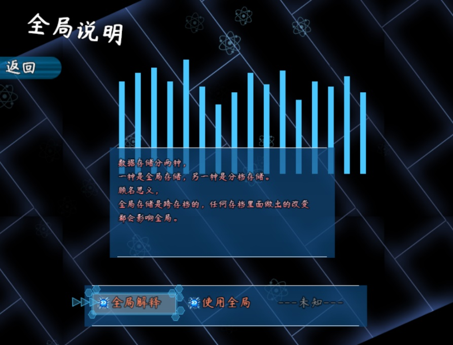{width="4.052083333333333in"
height="3.0833333333333335in"}

（图中描述图的位置也正确了，但是由于描述图资源图片的大小不对，所以存在错位情况，这个时候，需要修改的是描述图资源图片，而不是坐标。）

#### 5. 内容章节

经过了上面的规划，基本结构已经完成了。接下来是内容的构造。

经过了前面的步骤，你应该已经察觉到，**规划合不合理一点都不重要，重要的，是一张皮**。只要皮一换，瞬间就可以变成了一个崭新的游戏。

{width="4.416666666666667in"
height="3.2688845144356957in"}

有几个简单的定理可以使得你的设计变得很快很容易：

1). 背景、布局的整体颜色不超过两种。

2).
内容的字体颜色两个最合适，第一种颜色为主要内容，第二种颜色为标题、划分类别的内容。（第二种颜色的字数要尽可能少）

3).
描述图的边缘最好加上一层发光体或者黑色投影，这样可以使得图片突出于界面，也不会和背景的色调冲突。

4). 空白的空间要多一点，显得整个界面很干净。

另外，这张面板从灵感设计到完成绘画，花了整整一天的时间，消耗较多的地方不是在布局，而是在整体图片配色上。想要制作一个好游戏，在细节上花费时间是必要的。

### 信息面板E

信息面板E是一个长画布，画布会自动根据滚轴进行滚动。

长画布的配置结构如下：

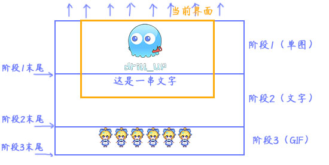{width="5.768055555555556in"
height="2.90625in"}

具体去看看 "关于滚轴式长画布.docx" 中的 **开始设计一个长画布** 的章节。

### 信息面板I

#### 1. 设置一个目标

首先要想明白自己想创建一个什么样的展示面板，这一点非常重要。注意必须是
静态的、固定的 面板展示，展示信息内容为主。

由于之前都设计了差不多相似的面板，这次，换个思路，我们做ppt。

从本质上来看，信息面板已经相当接近ppt了，只不过信息面板很多功能有限，各类图标和排版都需要ps来辅助。

{width="5.768055555555556in"
height="4.817361111111111in"}

#### 2. 结构分解，规划区域

注意，按钮组的结构需要在核心中配置。

初步想法，使用按钮组一线排在顶端，把原始的挡视线的布局去掉，使得周围看起来干净一些。

{width="3.8666666666666667in"
height="3.099479440069991in"}

紫红色部分就完全放置描述图，把文字直接画在描述图中，会灵活许多。

描述窗口暂时用不上，内容也不好排版。直接隐藏。

#### 3. 起草资源

**1）按钮**

按钮全部用默认的按钮即可，如果有必要再单独制作指定的按钮。

{width="3.2946128608923884in"
height="0.7916666666666666in"}

这里画一个新的圆形按钮，默认主菜单的六角形按钮已经看腻了......

{width="2.25in"
height="1.6408836395450568in"}
{width="1.8686843832020998in"
height="1.6495975503062117in"}

**2）描述图**

所有ppt内容都是一张图，所以这里完全靠自由发挥。

这里我使用ai（Adobe
Illustrator）画魔法圈，仿造一个ppt的样子，列出标题、主讲人、以及各种没什么意义的图表。

{width="4.604166666666667in"
height="2.591463254593176in"}

通过ai画完了相关圆圈之类的背景，再用ps进行一些内容添加。

{width="3.1875in"
height="2.546438101487314in"}

**3）描述窗口**

由于所有内容直接通过ps图片进行体现就可以实现，这里描述窗口相当于累赘，所以设置y1000，看不见即可。

#### 4. 配置实例

这里设置直线排列。

由于直线排列的结构，按钮会向左边伸展，所以按钮组排靠左上角的位置。主体中按钮移动动画中可以设置按钮出现延迟，这可以使得按钮一个个依次出现，有先后顺序。

{width="3.4836351706036743in"
height="1.9251673228346458in"}

选中按钮效果，设置出列。（出列可以让按钮额外动画移动一小段位置）

{width="2.950255905511811in"
height="1.9835050306211723in"}

上述的配置在按钮组核心配好后，按钮组样式id为5。

在信息面板I中填写样式绑定即可。

{width="3.191666666666667in"
height="1.4686023622047244in"}

填充内容：

{width="3.7416666666666667in"
height="1.2576377952755906in"}

由于描述图的资源，是直接按照816x624屏幕制作的，所以这里直接设置0。

{width="3.900337926509186in"
height="1.1751017060367455in"}

需要注意的是，由于按钮组的原型是选项窗口，虽然窗口已不可见，但窗口的列数会影响键盘上下左右移动的设置，所以这里调整列数24，使得能够按钮能够左右键盘切换。

{width="3.908672353455818in"
height="1.6668110236220472in"}

接下来就可以看到效果了。

{width="4.435282152230971in"
height="3.225in"}

#### 5. 细节调整

由于背景和粒子在面板中都有些不搭调，这里需要去掉粒子，调整背景颜色。

打开 多层菜单背景 和 多层菜单粒子 修改。

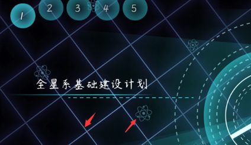{width="3.533639545056868in"
height="2.050177165354331in"}

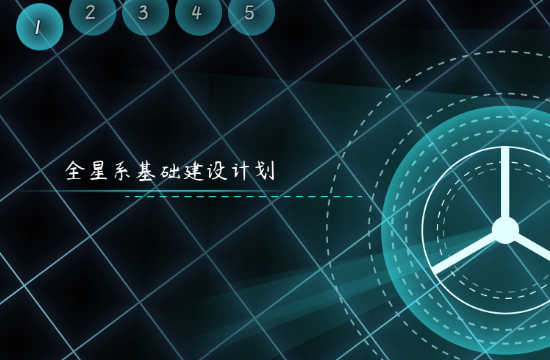{width="3.566666666666667in"
height="2.3345461504811897in"}

由于按钮组核心极度灵活，上述只是将按钮直线排列。

你还可以设置 按钮环形排列、鼠标接近按钮自动选中
等额外设置，具体可以去看看

"关于按钮组核心.docx"。

### 信息面板K

#### 设置一个目标

从信息面板k开始，就开始有某种特定的功能了，不再是一个基础的看板。你需要实现的是一项功能的菜单展示。由于插件的动态展示的能力有限，所以建议以静态属性设置为主。

**注意，你需要先了解"关于窗口字符.docx"作为知识铺垫，再进行信息面板K的设计。**

最近看了游戏视频《哈迪斯
Hades》，感觉其ui风格和配色非常不错，所以尝试模仿一下。

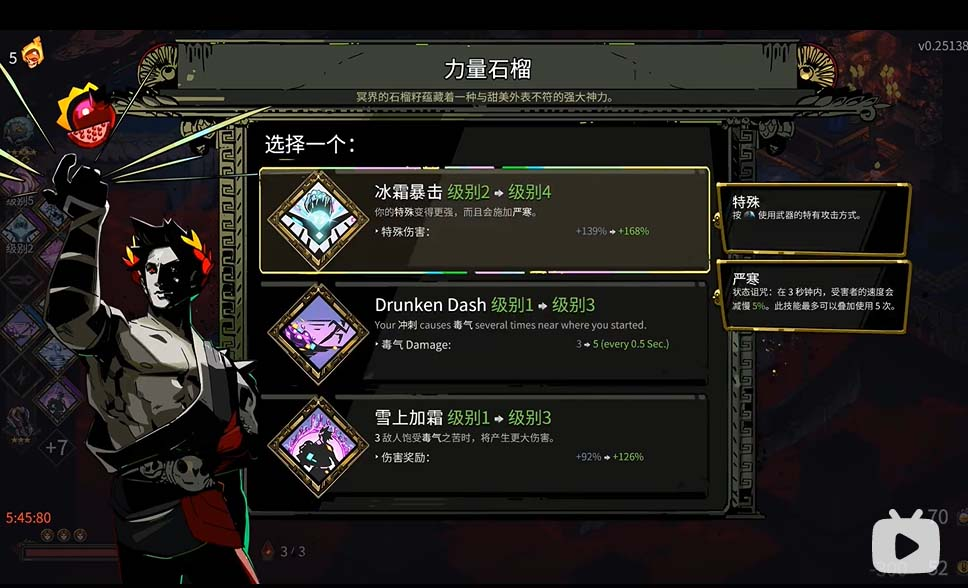{width="5.25in"
height="3.1894411636045494in"}

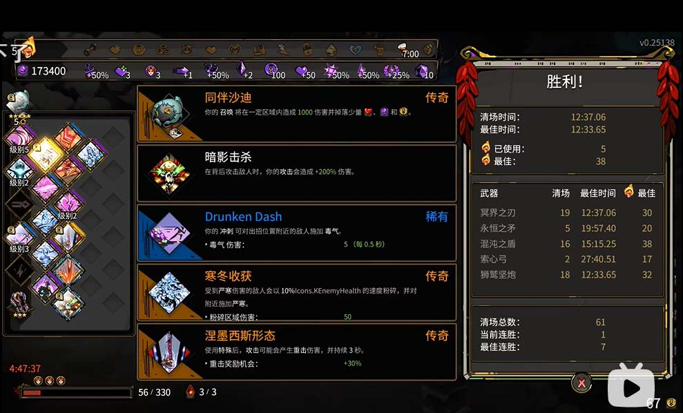{width="5.275in"
height="3.1912926509186352in"}

#### 2. 结构分解，规划区域

由于插件能提供制作的内容比较有限，所以这里从它的可选项功能设计上开始。

下图中，每个选项都包含了特别多的描述，单纯使用插件实现**其中的文字**是绰绰有余的。而选项旁边的图片，可能只能用一个硬性画好的图片背景来代替了。

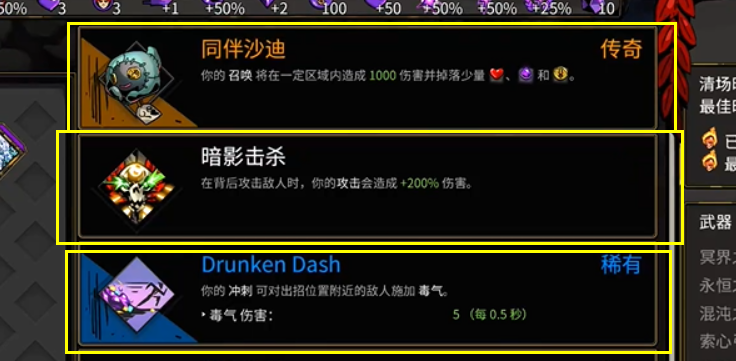{width="4.858333333333333in"
height="2.3829582239720035in"}

另外，除了文本，我们还要实现特定的功能：

选择选项点击确定之后，对应的公共事件需要被实际执行。

目前规划的功能为：

无能力（什么都不选时，撤销能力）

强化能力（公共事件开启开关，该开关在战斗时给予角色强化）

加速能力（提高玩家在地图的移动速度）

补给能力（给限量商店增加补给上限）

#### 3. 起草资源

**1）简单选项布局**

首先，直奔主题，直接用插件写文本，看看是否能够比较好的模仿。

描述图不要，描述窗口不要。只要选项窗口，开启窗口模式。

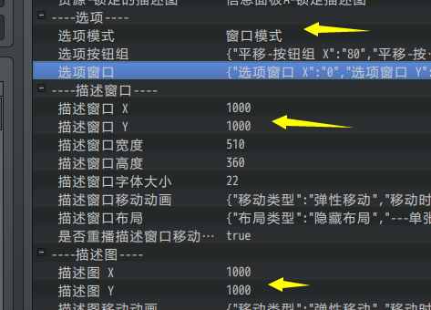{width="3.591666666666667in"
height="2.581748687664042in"}

下图中，通过使用效果字符，强制设置字体大小，并设置颜色。

（如果你要了解更多字符，去看看"关于窗口字符.docx"）

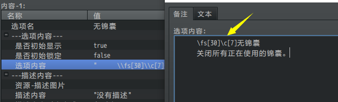{width="5.241666666666666in"
height="1.5886165791776028in"}

得到初步结果：

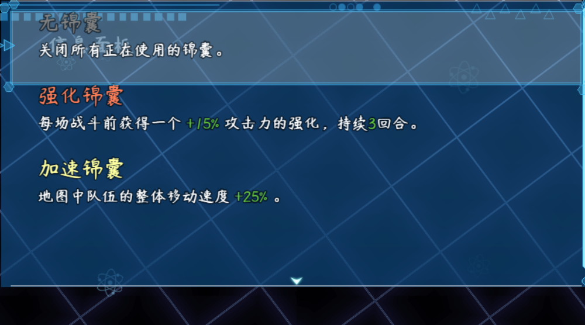{width="4.283333333333333in"
height="2.381463254593176in"}

**2）起草选项背景**

打开ps软件，初步估计，整个界面留100像素的内边距，然后建立一个600x400的画布。

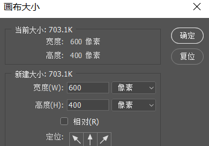{width="2.891917104111986in"
height="2.0335094050743656in"}

分成四份，然后每份100像素的高度空间，然后画上第一个黑长方形。

（这个黑长方形描边1像素的蓝色外壳）

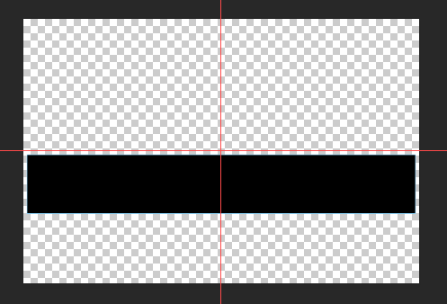{width="4.142025371828521in"
height="2.816910542432196in"}

随便画一个三角形，新建图层然后填充（后期要改颜色，所以新建图层）

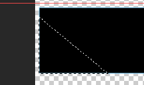{width="2.050177165354331in"
height="1.2084383202099738in"}

然后得到三个图层，分别为
黑长方形、长方形描边线、三角形的内容。设成一组。

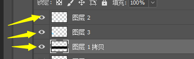{width="3.1586067366579176in"
height="0.975084208223972in"}

复制四份，保存为背景。

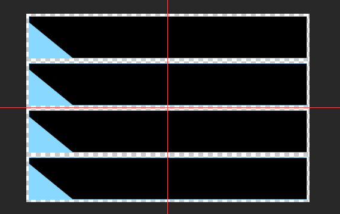{width="4.025in"
height="2.5394991251093613in"}

#### 4. 配置实例

将选项窗口的背景换成单张背景，然后关闭指针和边框的装饰。

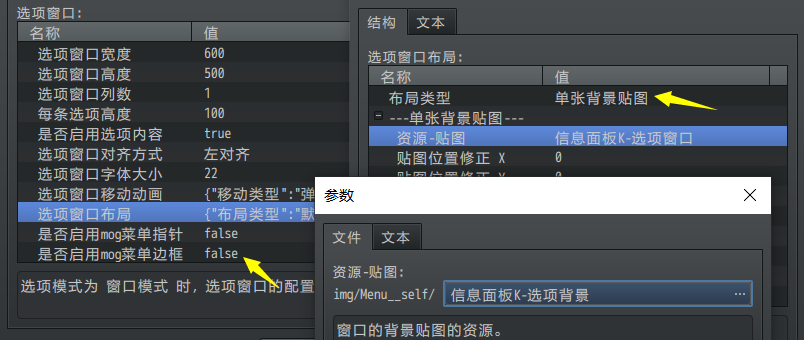{width="4.925in"
height="2.082422353455818in"}

初步观察，窗口默认闪烁的白色方块与背景规划的方块不吻合。

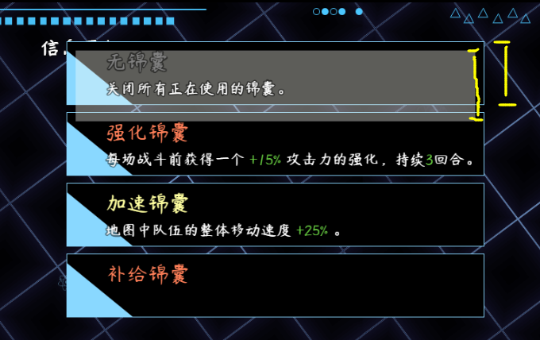{width="4.525in"
height="2.848089457567804in"}

#### 5.细节调整

这一个部分工作量比较大，虽然打好了初稿结构，但是很多地方可能要多次重绘或重新规划。

**1）重新规划**

首先，600x100的选项长方形显得太细长了，只能显示一行文字，这里稍微加宽一点，设为600x120。需要将"每条选项高度"改成120，同时背景资源宽度改为480。

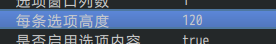{width="2.3001990376202976in"
height="0.3666983814523185in"}

另外，将游戏**截图**，然后放到背景框中，通过这种方式，获取到闪烁长方形的实际所在位置和长宽。然后重新绘制一个新的长方形。

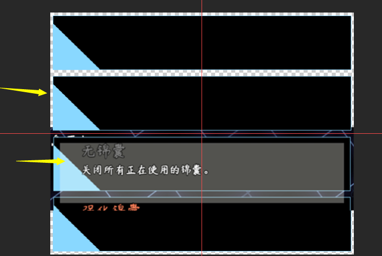{width="3.558333333333333in"
height="2.3926432633420824in"}

经过游戏中测试查看长方形后发现，长方形之间**没有缝隙**。所以需要将其紧凑地放在一起。

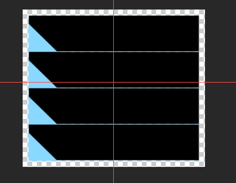{width="3.3002865266841646in"
height="2.5668886701662292in"}

**2）文字规划**

每个选项的文字，贴顶部太近了，这个可以通过设置字符"\\py\[20\]"，手动控制每行的偏移多20像素。（如果你要了解更多字符，去看看"关于窗口字符.docx"）

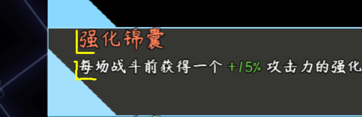{width="3.8666666666666667in"
height="1.2552471566054244in"}

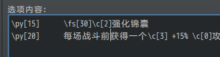{width="3.0919346019247596in"
height="0.808403324584427in"}

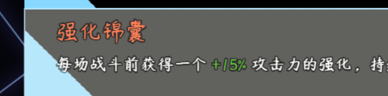{width="4.35in"
height="1.080617891513561in"}

由于每个方块都贴的太紧了，不太适合查看，于是将外面的1像素边框去掉，然后，换上与文字颜色一模一样的三角形颜色。

{width="2.4166666666666665in"
height="2.0971916010498686in"}

得到的结果如下，中规中矩的框。

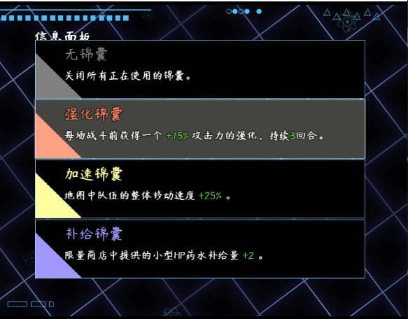{width="3.216666666666667in"
height="2.515952537182852in"}

**3）图标规划**

只有光秃秃的文字，还缺了许多，接下来，需要绘制一些物品的图标。

打开Ai，然后随便画几根线，随便画个3d物体，就完成了图标。

你们可能会想打我，但这真就是随便画画，不考虑画的好不好那种瞎画的那种......

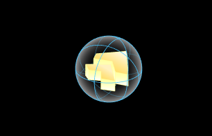{width="2.550220909886264in"
height="1.6418088363954506in"}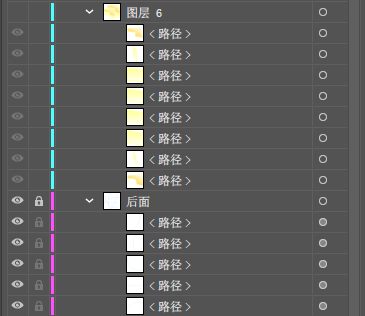{width="2.299965004374453in"
height="1.9912029746281714in"}

加了图标之后，只打空格还是太麻烦了，所以直接加个\\px字符，跳100像素。

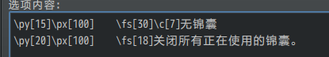{width="3.4586329833770777in"
height="0.6000524934383202in"}

效果如下。

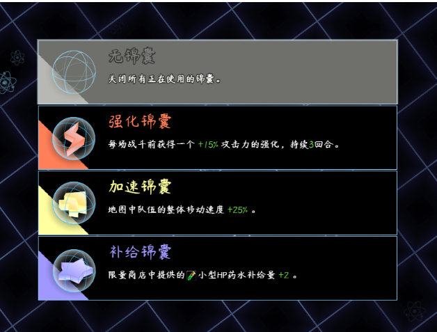{width="3.5833333333333335in"
height="2.721735564304462in"}

**4）多选项时滚动规划**

在这里，发现了一个问题，如果这个图标这样直接绘制在背景上，那么如果我有5个选项，怎么办？

这里，可以考虑将图片变成
**大图片字符**，将这些大的装饰用的图标，配置到字符表中：

要了解相关装饰用的窗口字符，可以去看看"关于窗口字符.docx"。

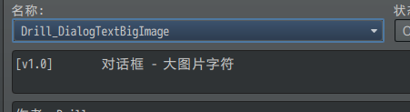{width="2.841666666666667in"
height="0.775in"}

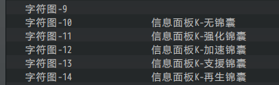{width="2.85in"
height="0.8753073053368329in"}

将这个图片配置到字符中，这样切换选项时，所有内容也可以跟着变化了。

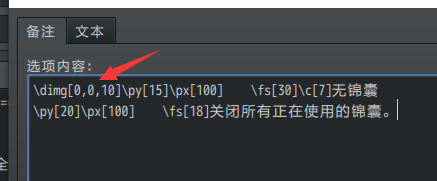{width="3.425in"
height="1.4185936132983377in"}

刚放上去后，会发现没有完全吻合，这时，使用偏移进行微调，使其吻合。

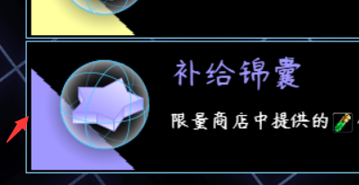{width="3.1333333333333333in"
height="1.617711067366579in"}

经过反复测试微调，设置偏移(-4,2)之后，可以完全吻合。

**5）扩展想法**

因为这些字符都是一个个绘制上去的，所以完全支持 **指代字符**。

也就是说，你完全可以将这些设置的绿色字符换成 变量 ，制作 锦囊升级
等功能效果。

#### 6.功能测试

别忘了插件还有具体要实现的对应功能。

需要开启 执行公共事件 ，然后设置对应执行的公共事件。

{width="4.108333333333333in"
height="1.5406255468066492in"}

实际的功能效果需要在游戏测试中试试，看看是不是替换锦囊后属性还原了。

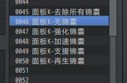{width="2.1501859142607174in"
height="1.408455818022747in"}

#### 7.收尾工作

完成了功能和ui后，就是其他一些细节性的功能了。

这里我考虑到，装备了某个锦囊之后，玩家是不知道自己装备了啥，所以我考虑到，直接在地图界面中放一个图片，用来表示这个锦囊的装备状态，就完美了。

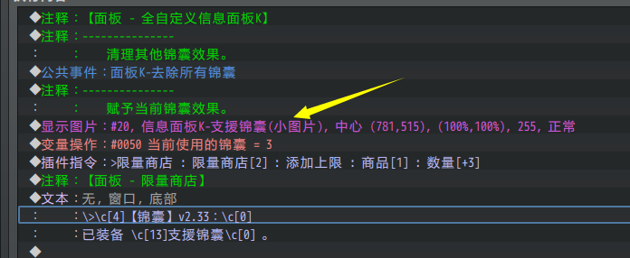{width="4.025in"
height="1.6539031058617673in"}
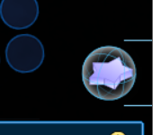{width="1.4167891513560804in"
height="1.2501082677165354in"}

#### 8.其他说明

选项窗口经常会遇到挤占后显示不多的问题，比如高度500，每条选项高度120时，有时候想想留有20像素的冗余，似乎可以完整显示。

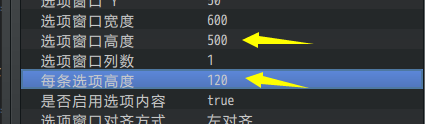{width="3.5419739720034995in"
height="1.033423009623797in"}

而实际上，还是被挤占了，空间不够，只显示了3条，出现了滚动条和往下翻的按键。需要再加宽。（设置高度520时，空间就够了。）

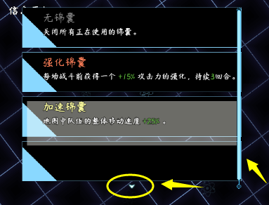{width="3.066666666666667in"
height="2.3380336832895887in"}

另外，如果你用鼠标靠近图片，你会发现出现了图片说明窗口，这个窗口是由插件：

鼠标 - 图片说明窗口 单独做成的。

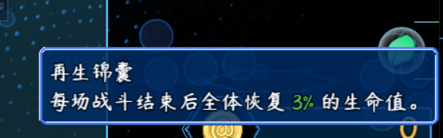{width="3.6416666666666666in"
height="1.1412543744531933in"}

### 信息面板M

由于近期没什么特别的设计灵感，这里就不具体设计了。

信息面板在A的基础上，不仅有按钮组功能，描述图和描述窗口x4倍。

注意，工作量也可能x4倍。

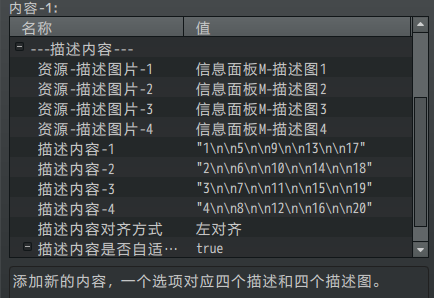{width="3.2083333333333335in"
height="2.203882327209099in"}

你可以只用其中的两个窗口做成主内容与辅助内容。

也可以像示例中，做成列表，将表格分成四列，这样有助于排版。

将所有窗口都设置成默认皮肤，你可以看到下图：

{width="5.233333333333333in"
height="3.856007217847769in"}

划分后，你可以使用 居中窗口字符 实现"表格列居中"效果。

### 复制面板插件

所有 自定义信息面板 插件都遵循统一独立函数名的规则。

通过这个规则，你可以通过脚本字符串替换，把 信息面板A 变成 信息面板
A1，A2，A3 等新插件。

将面板A改为A2的方法如下：

1）选中一个信息面板插件，复制，改名为A2

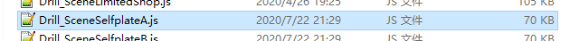{width="5.541666666666667in"
height="0.40012029746281713in"}

{width="5.229166666666667in"
height="0.4813856080489939in"}

2）用notepad++打开 A2插件

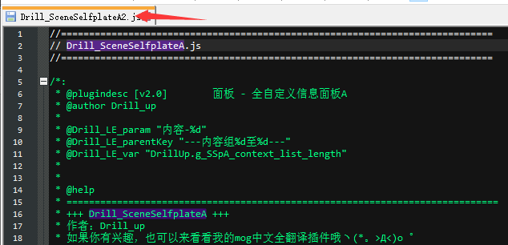{width="5.020833333333333in"
height="2.4241633858267715in"}

3）将插件全名 "Drill_SceneSelfplateA" 整体替换为
"Drill_SceneSelfplateA2"

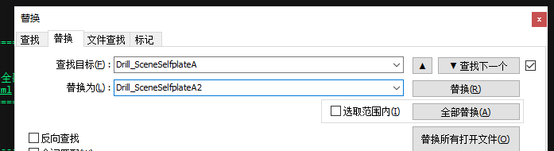{width="5.052083333333333in"
height="1.3770122484689413in"}

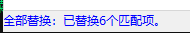{width="1.9791666666666667in"
height="0.34375in"}

4）接下来替换下面两个关键字："SSpA"和"信息面板A"，

替换为"SspA2"和"信息面板A2"。

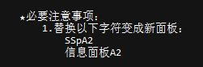{width="2.6142563429571304in"
height="0.8644750656167979in"}

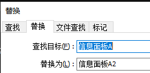{width="2.5729166666666665in"
height="1.25in"}

5）保存，插件 面板A2 即完成

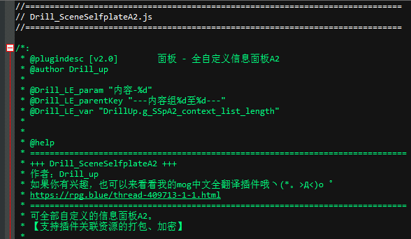{width="4.354166666666667in"
height="2.532504374453193in"}

6）打开插件，可以看到所有 插件指令 与 配置 也都变为A2

（建议替换为A1，A2，而不是N、M单字母，因为后续更新可能会更新到这些单字母。）

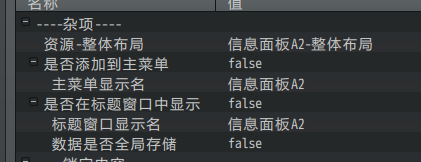{width="3.0729166666666665in"
height="1.1799311023622048in"}

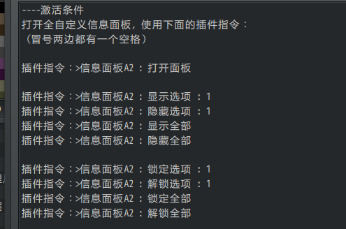{width="3.09375in"
height="2.0478729221347334in"}
