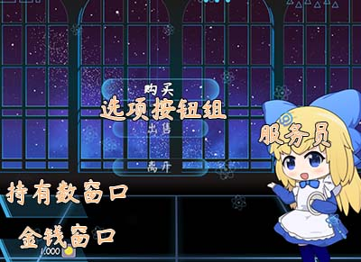
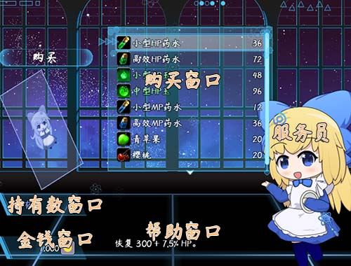
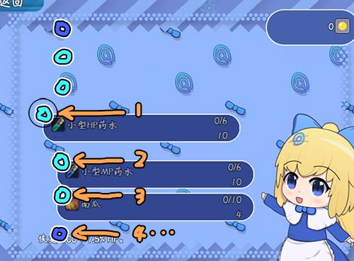
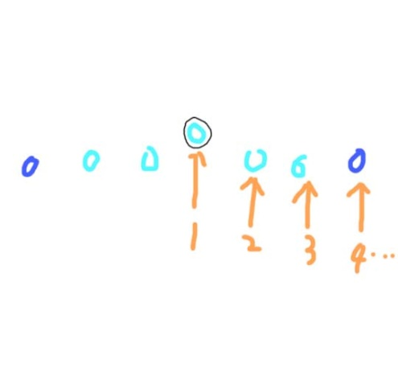
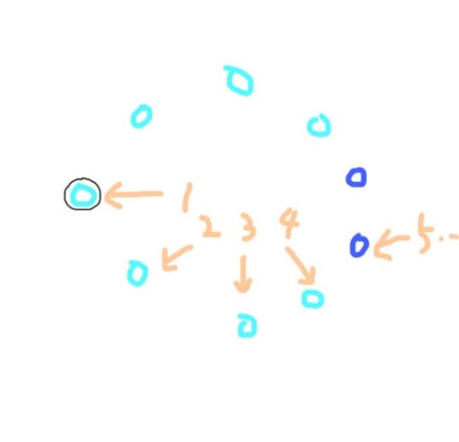
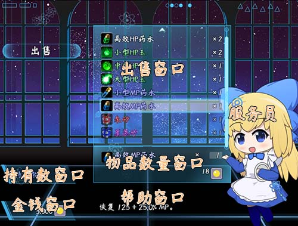

**概述**

**插件介绍**

基础插件：

◆Drill_CoreOfWindowAuxiliary 系统 - 窗口辅助核心

◆Drill_CoreOfWaitressSprite 主菜单 - 服务员核心

相关插件：

◆Drill_SenceShop 面板 - 全自定义商店界面

◆Drill_SceneLimitedShop 面板 - 限量商店

由于插件内容非常多，这里只针对 **全自定义商店界面** 进行说明。

**快速区分**

  --------------------------------------------------------------------------------------------------------------------------------------------
         商店界面                                                           限量商店
  ------ ------------------------------------------------------------------ ------------------------------------------------------------------
  特点   Rmmv默认的商店模式，可多买。                                       只能购买，一个一个买，且限量。

  结构   7个窗口 + 1个按钮组 + 1个服务员                                    4个窗口 + 1个按钮组 + 1个服务员

  参数   {width="2.1585203412073493in"   {width="2.3252012248468943in"
         height="1.9251673228346458in"}                                     height="1.933500656167979in"}
  --------------------------------------------------------------------------------------------------------------------------------------------

**\
**

**插件关系**

商店插件之间的关系如下：（两个商店界面功能相似，但实际并没有任何关系。）

## **商店**

**结构/流程**

注意，**流程**是程序内部无法改变的固定业务逻辑结构，你可以换界面、换外皮，但是无法改变流程，除非新写插件。

#### Rmmv默认购买流程

购买物品关系了6个窗口（空白窗口不算）。购买流程中看到的窗口如下：

![H:\\rpg mv
箱\\U\$A{ZEGK4XY6KUSYNZS\~3\]L.jpg](./MediaFolder/media/image5.jpeg){width="2.8333333333333335in"
height="2.1048534558180227in"} {width="2.8541666666666665in"
height="2.126761811023622in"} {width="2.8854166666666665in"
height="1.7778827646544182in"}

1).进入界面 \> 帮助窗口 + 金钱窗口 + 选项窗口 + 空白窗口

2).点击购买 \> 帮助窗口 + 金钱窗口 + 选项窗口 + 购买窗口 + 持有数窗口

3).选择一个物品 \> 帮助窗口 + 金钱窗口 + 选项窗口 + 物品数量窗口 +
持有数窗口

4).购买完毕 \> 返回流程2)

#### Rmmv默认出售流程

出售物品流程关系了7个窗口（空白窗口不算）。出售流程中看到的窗口如下：

![H:\\rpg mv
箱\\U\$A{ZEGK4XY6KUSYNZS\~3\]L.jpg](./MediaFolder/media/image5.jpeg){width="2.8333333333333335in"
height="2.1048534558180227in"} ![H:\\rpg mv
箱\\AEZPJ%S%QPX0{H4@}9\]H\~32.jpg](./MediaFolder/media/image8.jpeg){width="2.83009842519685in"
height="2.125in"} ![H:\\rpg mv
箱\\N\`\_F_2C\]LSZRE3OSB4\~P%0K.jpg](./MediaFolder/media/image9.jpeg){width="2.7896478565179352in"
height="2.123979658792651in"}

1).进入界面 \> 帮助窗口 + 金钱窗口 + 选项窗口 + 空白窗口

2).点击出售 \> 帮助窗口 + 金钱窗口 + 选项窗口 + 出售类型窗口 + 出售窗口

3).选择一个类型 \> 帮助窗口 + 金钱窗口 + 选项窗口 + 出售类型窗口 +
出售窗口

4).选择一个物品 \> 帮助窗口 + 金钱窗口 + 选项窗口 + 物品数量窗口 +
持有数窗口

5).出售完毕 \> 返回流程3)

#### 插件的购买流程

购买物品关系了6个窗口，其中选项窗口变成了选项按钮组，并且添加了服务员。购买流程中看到的插件内容如下：

{width="3.0981474190726157in"
height="2.2527777777777778in"}
{width="3.055942694663167in"
height="2.3222222222222224in"}
{width="3.05in"
height="2.259122922134733in"}

1).进入界面 \> 服务员 + 金钱窗口 + 持有数窗口 + 选项按钮组

2).点击购买 \> 服务员 + 金钱窗口 + 持有数窗口 + 购买窗口 + 帮助窗口
+（选项按钮）

3).选择一个物品 \> 服务员 + 金钱窗口 + 持有数窗口 + 购买窗口 +
物品数量窗口 + 帮助窗口 +（选项按钮）

4).购买完毕 \> 返回流程2)

#### 插件的出售流程

出售物品关系了7个窗口，其中选项窗口变成了选项按钮组，并且添加了服务员。出售流程中看到的插件内容如下：

{width="2.168720472440945in"
height="1.576955380577428in"}
{width="2.2916666666666665in"
height="1.6864260717410324in"}
{width="2.2416666666666667in"
height="1.7169061679790025in"}
{width="2.2333333333333334in"
height="1.6944378827646545in"}

1).进入界面 \> 服务员 + 金钱窗口 + 持有数窗口 + 选项按钮组

2).点击出售 \> 服务员 + 金钱窗口 + 持有数窗口 + 出售类型窗口

3).选择一个类型 \> 服务员 + 金钱窗口 + 持有数窗口 + 出售窗口 + 帮助窗口
+（选项按钮）

4).选择一个物品 \> 服务员 + 金钱窗口 + 持有数窗口 + 出售窗口 +
物品数量窗口 + 帮助窗口 +（选项按钮）

5).出售完毕 \> 返回流程3)

**\
**

**价格变动**

无论是购买还是出售，他们的公式是一样的：

{width="4.1in"
height="1.0178423009623796in"}

{width="4.141666666666667in"
height="1.028186789151356in"}

这里的出售额外价格，用-5，因为如果为正数，便宜的东西可能反而能卖到更多的钱。

注意，**倍率计算后，小数点后面只要存在位数，就会进1位**。通过倍率计算/价格调整后的最小价格为1。

{width="2.466666666666667in"
height="1.898996062992126in"}

由于变量不能表示小数，这里的倍率变量取千分之一。假设变量\[49\]值为 1100
，则倍率为 110.0%，也就是1.10。

{width="3.658333333333333in"
height="1.1184251968503938in"}

注意，**由于物品是可以批量购买多个的，所以该商店不支持越买越贵功能**。

**物品兑换**

使用指令切换商店后，只是把 金钱 换成了
樱桃（38号物品）交易。倍率/额外价格还是原来的，你需要手动调整新的倍率/额外价格。

示例中，购买和出售的倍率调成了一样的，所以购买然后卖出不会损失樱桃。

{width="5.057836832895888in"
height="0.5583333333333333in"}{width="1.6602416885389326in"
height="0.6083333333333333in"}

根据倍率计算，高效HP药水原价72。 72\*0.05+0 = 3.6 -\> 4。

(倍率计算后，小数点后面只要存在位数，就会进1位)

{width="3.6253138670166227in"
height="1.4751279527559056in"}

另外，交换商店的"\\I\[546\]"可以直接写成文字：

{width="3.475300743657043in"
height="0.3333617672790901in"}
{width="1.6583333333333334in"
height="0.5676170166229222in"}

**服务员**

服务员可以对以下情况作出不同gif动作：

\"欢迎光临\"：刚进入界面时触发。

\"购买一个物品\"：玩家购买了一个物品时触发。

\"出售一个物品\"：玩家出售了一个物品时触发。

\"余额不足\"：玩家买不起时点击购买触发。

\"余额不足(交换物)\"：玩家物品不足时点击购买触发。

{width="1.7583333333333333in"
height="3.632919947506562in"}
{width="3.4583333333333335in"
height="3.602777777777778in"}

配置中稍微有些绕，你可以参考示例中的配置，多试试就能熟悉。

## **其它说明**

**物品类型**

商店界面的**购买窗口不区分物品类型。**

但是商店的**出售窗口会区分物品类型。**

这里使用的是扩展插件：Drill_ItemCategory 主菜单 -
物品类型。该插件也可以在关闭全自定义商店插件中单独运行。效果为下图：

{width="5.768055555555556in"
height="2.70244094488189in"}

**持有数窗口**

持有数窗口这里被缩放得非常小，只有金钱窗口那么大。

实际上，持有数窗口还显示增加的装备的能力值的数据，由于窗口放不下，设置了高度太小，这些数据都被遮住了。
