**概述**

### **插件介绍**

基础插件：

◆Drill_CoreOfInput 系统 - 输入设备核心

◆Drill_CoreOfWindowAuxiliary 系统 - 窗口辅助核心

◆Drill_CoreOfSelectableButton 系统 - 按钮组核心

主要插件：

◆Drill_SceneGalleryA、B 面板 - 全自定义画廊A、B

◆Drill_SceneGalleryC、D 面板 - 全自定义画廊C、D

你可以使用画廊插件，来设计游戏中的 单立绘展示功能 或 收藏列表功能。

**\
**

### **快速区分**

插件的功能如下：

  -----------------------------------------------------------------------------
  **名称**        **部件**                                  **特殊功能**
  --------------- ----------------------------------------- -------------------
  全自定义画廊A   1个选项窗口 + 1个按钮组 + 1个文本描述窗口 可全局存储
                  + 1个完成度窗口 + 1个缩略图 +             
                  1个原图查看器                             

  全自定义画廊B   1个选项窗口 + 1个按钮组 + 1个文本描述窗口 可全局存储
                  + 1个完成度窗口 + 1个缩略图 +             
                  1个原图查看器                             

  全自定义画廊C   1个选项窗口 + 4个箭头 + 1个文本描述窗口 + 可全局存储
                  1个完成度窗口 + 1个缩略图 + 1个原图查看器 

  全自定义画廊D   1个选项窗口 + 4个箭头 + 1个文本描述窗口 + 可全局存储
                  1个完成度窗口 + 1个缩略图 + 1个原图查看器 
  -----------------------------------------------------------------------------

如果你觉得A、B同功能的两个插件太少了，还需要更多的面板插件，可以去看看后面的章节：[复制画廊插件](#复制画廊插件)
。

### **插件关系**

画廊插件之间的关系如下：

## **画廊**

### **结构/流程**

注意，**流程**是程序内部无法改变的固定业务逻辑结构，你可以换界面、换外皮，但是无法改变流程，除非新写插件。

#### 一般模式流程

一般模式关系了5个对象。流程中可看到的如下：

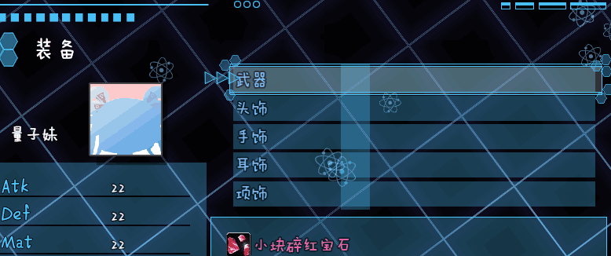{width="2.7083333333333335in"
height="2.0687346894138234in"}
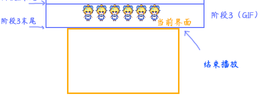{width="2.691666666666667in"
height="2.0522298775153107in"}

1).进入界面 \> 选项窗口 + 描述窗口 + 缩略图 + 完成度窗口

2).选择一个选项 \> 原图查看器

3).取消查看 \> 返回流程1)

#### 单图模式流程

在单图模式下，流程中看到的如下：

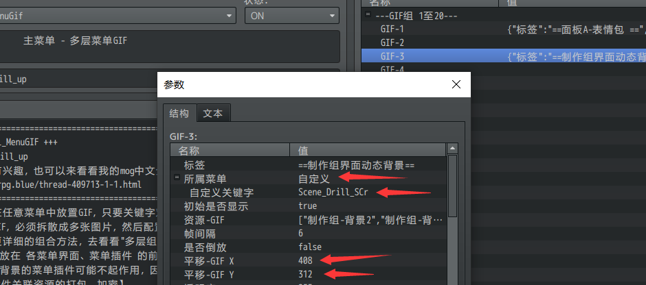{width="4.308333333333334in"
height="0.3060979877515311in"}

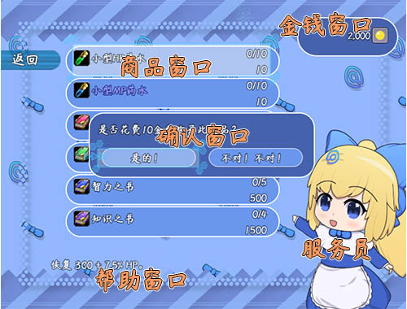{width="3.1333333333333333in"
height="2.361558398950131in"}

1).进入界面 \> 原图查看器

2).取消查看 \> 退出界面

**\
**

### **缩略图**

**1）缩略图**

缩略图是指单独摆出来的一个缩略图贴图对象。

根据选项变化，会切换不同的图像缩略图。

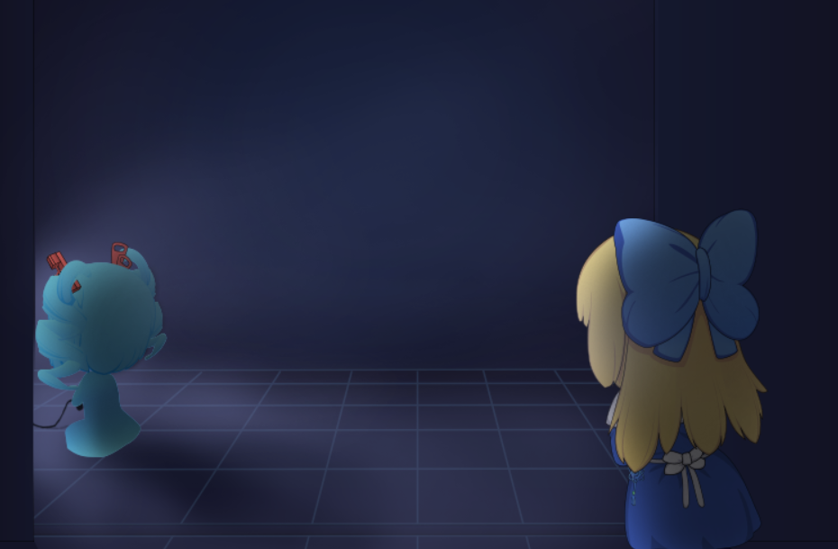{width="2.966666666666667in"
height="1.78in"}
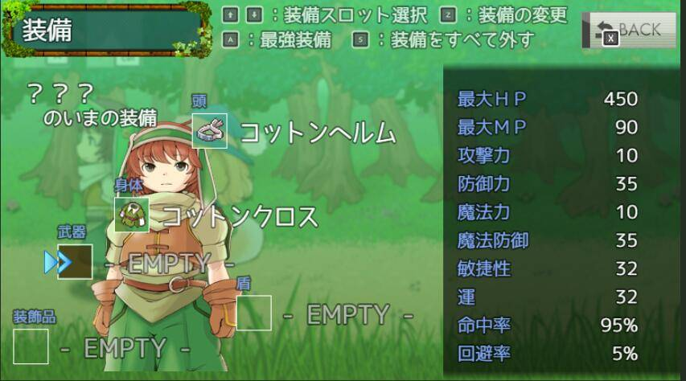{width="2.337422353455818in"
height="1.7854166666666667in"}

**2）选项窗口中的小缩略图**

小缩略图需要在选项窗口中进行配置，需要注意的是，选项的列数和选项的高度
会影响小缩略图的高宽。

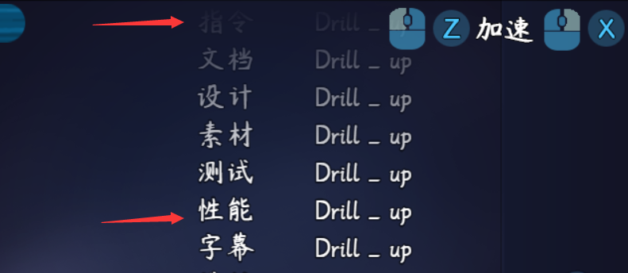{width="3.1in"
height="1.9361023622047244in"}

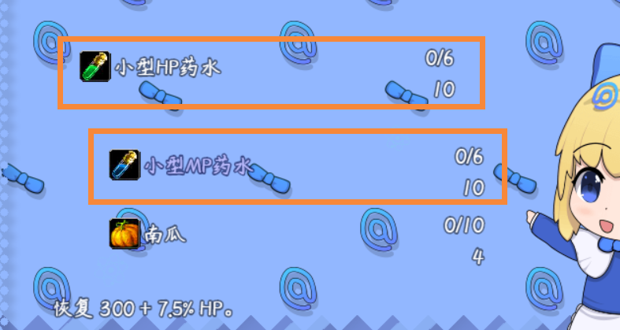{width="5.158333333333333in"
height="1.2575995188101488in"}

\]

### **原图查看器**

**1）按键拖动**

原图查看器中，可以通过鼠标拖动或键盘十字键在原图中移动镜头。

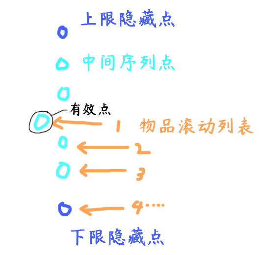{width="2.6666666666666665in"
height="0.5333333333333333in"}

**2）自适应模式**

按w键，或者鼠标中键，可以将图片自适应为窗口的高宽。

{width="4.643055555555556in"
height="3.537353455818023in"}

注意，如果你的 原图的高宽 比 窗口的高宽 都要小，则无法控制拖动。

自适应模式也没有效果。

### **完成度窗口**

注意，完成度窗口的显示信息，是以 "未锁定且显示的图片 / 显示的图片"
而定的。

也就是说，如果你隐藏图片，是不会被统计到完成度中的。

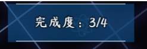{width="2.0585115923009623in"
height="0.6917268153980752in"}

## **从零开始设计**

### **灵感提示**

**1）纯菜单设计**

纯菜单设计顾名思义，即在主菜单界面或者标题界面，开启一个画廊按钮。

点击画廊按钮后，进入画廊列表，以供玩家查看。

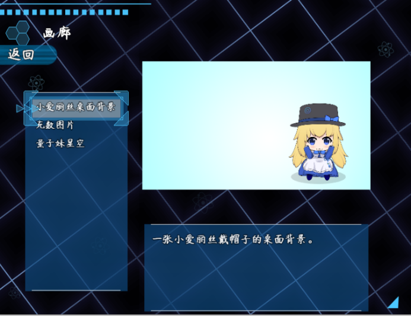{width="3.12996719160105in"
height="2.408333333333333in"}

**2）单图模式+地图事件 设计**

由于画廊可以直接用单图模式表示。

你可以设计一面放有画框的大墙，玩家接近后，可以进入画廊界面，查看绘画细节。

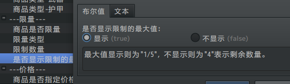{width="2.5499376640419946in"
height="1.55625in"}

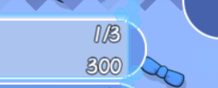{width="3.283333333333333in"
height="0.4272834645669291in"}

+-----------------------------------------------------------------------+
| **关于审美：**                                                        |
|                                                                       |
| 经过群友提醒，作者我才注意到，设计出来的框架可能【不好看】。          |
|                                                                       |
| 这是因为作者我编                                                      |
| 写文档时，是以一个开荒者的角度思考问题的。开荒者关注的侧重点是一个满  |
| 足功能的框架和一个完整的教程说明，美感是次要因素，所以自然显得难看。  |
|                                                                       |
| 作为读                                                                |
| 者的你们，更多要关注的是游戏的细节和UI的设计。所以，千万不要把我的拙  |
| 劣的美术当成UI的能力上限。希望你们能在此教程基础上设计出更漂亮的UI。  |
+=======================================================================+
+-----------------------------------------------------------------------+

### **画廊C**

#### 1. 设置一个目标

首先要想明白自己想创建一个什么样的画廊展示，这一点非常重要。

注意必须是 静态的、固定的 面板展示，展示画作内容为主。

这里，我想模仿百度的图片查看器，这种横向滚动画布选择查看的画廊。

（百度这两个左右按钮，害我又挖了坑，写了C、D，原先都没想要加新画廊插件）

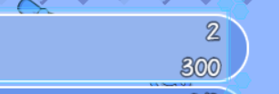{width="4.741666666666666in"
height="2.6528444881889763in"}

#### 2. 结构分解，规划区域

根据设计灵感，我考虑设计这样一个窗口，如下图：

（原先没有考虑到箭头，使用的是画廊A，后来改用了画廊C，把箭头功能加上。）

{width="3.9583333333333335in"
height="3.0271303587051617in"}

#### 3. 配置窗口

**1）确定部件位置**

确定了位置后，在ps中，查看这个像素点的信息，确定缩略图的xy和高宽。

{width="2.808333333333333in"
height="1.3788987314085739in"}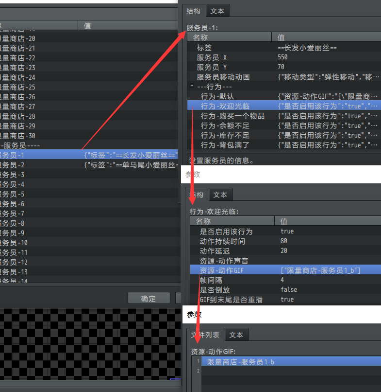{width="2.7495767716535435in"
height="1.7166666666666666in"}

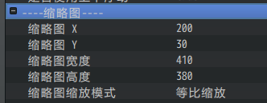{width="3.283333333333333in"
height="1.2737751531058619in"}

**2）显示窗口皮肤**

描述窗口、选项窗口、完成度窗口 都把皮肤开了，方便查看窗口规划的高宽。

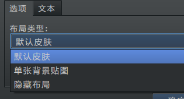{width="2.8666666666666667in"
height="1.5424704724409448in"}

**3）箭头**

箭头只要左右箭头，上下箭头设置y1000以上看不见即可。

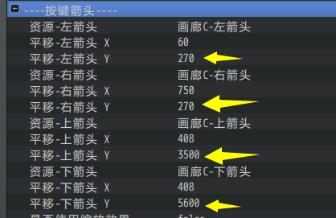{width="3.6166666666666667in"
height="2.3487543744531933in"}

**4）开启选项窗口小缩略图**

开启前，先把选项的高度给增高。

注意，窗口高度和选项高度相差40像素左右比较合理，（窗口有18像素内边距）

不然选项比窗口还高，会很突兀。

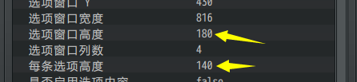{width="4.291666666666667in"
height="0.992159886264217in"}

太高会变成下图样子：

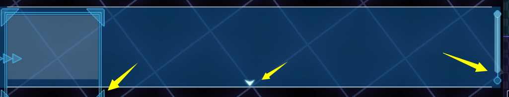{width="4.826388888888889in"
height="0.9268110236220473in"}

开启小缩略图。

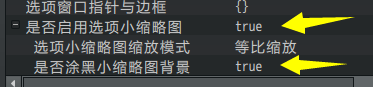{width="3.1086023622047243in"
height="0.7250623359580053in"}

**5）内容添加**

添加方式就不赘述了。

不过，添加时要注意
内容是选项窗口的，还是描述窗口的，不要填错参数位置了。

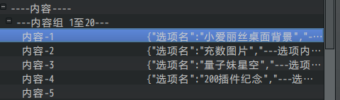{width="4.208333333333333in"
height="1.2414588801399824in"}

#### 4. 初步测试

配置了大概的布局后，打开面板看看效果：

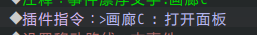{width="2.675in"
height="0.36666666666666664in"}

{width="4.308333333333334in"
height="3.1775656167979003in"}

初步的效果最好先截个图。

经过初步判断，缩略图和箭头的位置正好，但是描述窗口宽了，完成度窗口还需要靠边。

选项窗口高了点，需要设置5列。

#### 5. 布局调整

确认要调整的地方后，根据截的图片，进行位置微调。

把选项窗口改成5列，调小每个选项的高度，得到下面的图像：

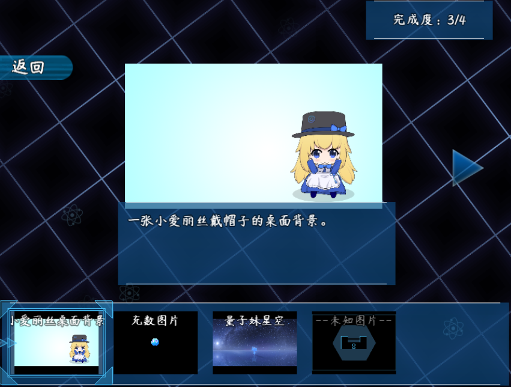{width="4.064441163604549in"
height="3.075in"}

确认最终效果后，隐藏 选项窗口的布局 和 描述窗口的布局。

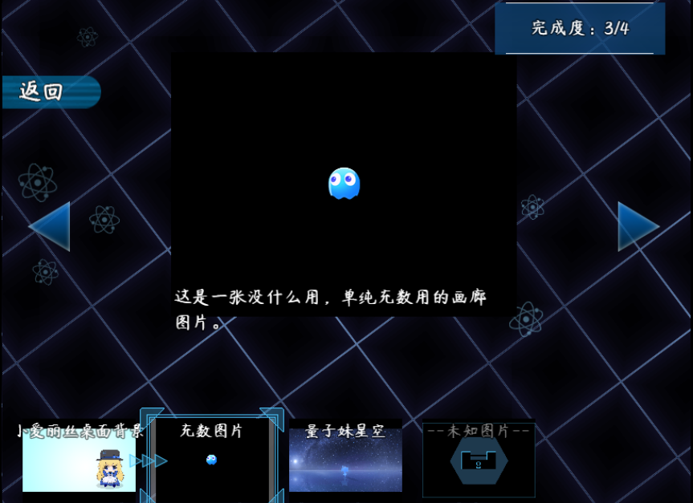{width="4.381237970253718in"
height="3.183333333333333in"}

### **复制画廊插件**

所有 自定义画廊 插件都遵循统一独立函数名的规则。

通过这个规则，你可以通过脚本字符串替换，把 画廊A 变成 画廊 A1，A2，A3
等新插件。

将面板A改为A2的方法如下：

1）选中一个信息面板插件，复制，改名为A2

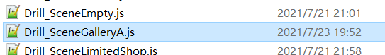{width="4.849997812773403in"
height="0.7in"}

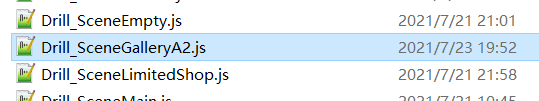{width="4.566666666666666in"
height="0.8537106299212598in"}

2）用notepad++打开 A2插件

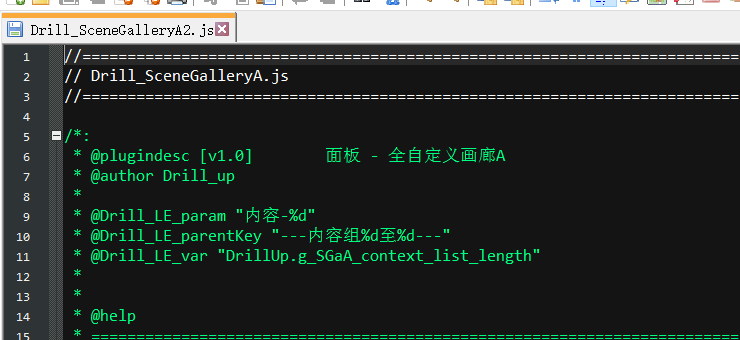{width="4.6in"
height="2.1133639545056866in"}

3）将插件全名 "Drill_SceneGalleryA" 整体替换为 "Drill_SceneGalleryA2"

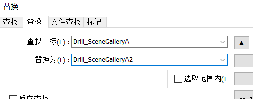{width="4.297378608923885in"
height="1.6916666666666667in"}

4）接下来替换下面两个关键字："SGaA"和"画廊A"，

替换为"SGaA2"和"画廊A2"。

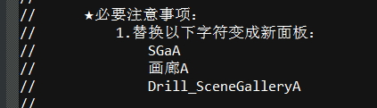{width="3.825in"
height="1.0918241469816272in"}

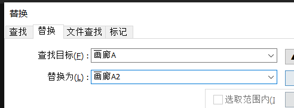{width="3.216666666666667in"
height="1.1820592738407698in"}

5）保存，插件 画廊A2 即完成

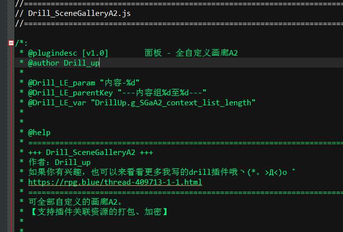{width="4.059722222222222in"
height="2.7410214348206474in"}

6）打开插件，可以看到所有 插件指令 与 配置 也都变为A2

（建议替换为A1，A2，而不是N、M单字母，因为后续更新可能会更新到这些单字母。）

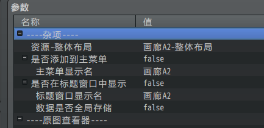{width="3.2177799650043744in"
height="1.5583333333333333in"}
