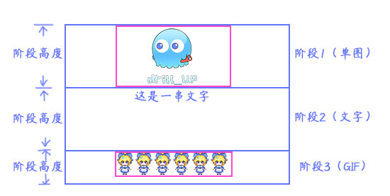
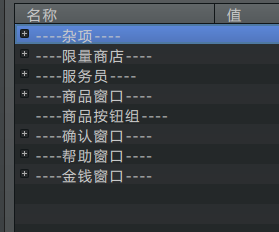
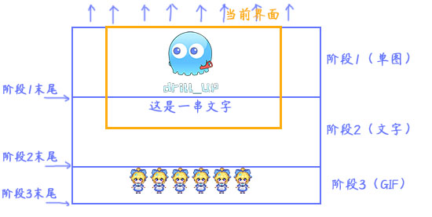
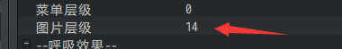
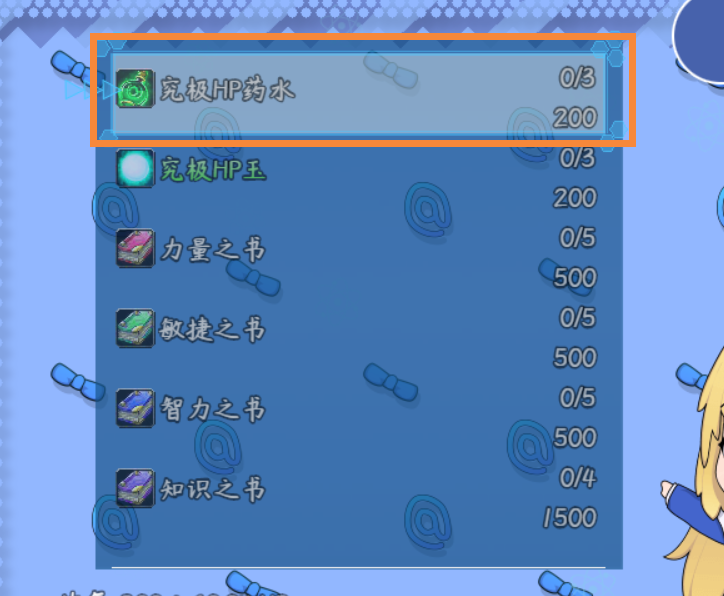

## 概述

### 插件介绍

核心插件：

◆Drill_CoreOfScreenRoller 系统 - 滚轴核心

子插件：

◆Drill_SceneCredits 标题 - 制作组

◆Drill_SceneSelfplateE 面板 - 全自定义信息面板E

◆Drill_SceneSelfplateF 面板 - 全自定义信息面板F

核心插件单用没有效果。长画布需要在各个子插件中进行设计。

## 长画布

### 阶段

**阶段的单图、文字、GIF的X轴方向都为居中，Y轴方向贴顶**。

如下图所示，你可以控制每个阶段的高度，但是不一定要与图片的高度（紫红色方框）一致。

{width="5.768055555555556in"
height="2.90625in"}

你可以设置某阶段的高度为0，与后一个阶段重叠到一起：

{width="5.768055555555556in"
height="1.6791666666666667in"}

### 滚轴

画布初始与界面的上沿重合，随后固定向上滚动。

**以上沿为准，上沿所处在哪个阶段，那么就以这个阶段的速度进行移动**。

{width="5.768055555555556in"
height="2.90625in"}

**当上沿离开最后一个阶段的末尾后，滚轴结束播放**。

{width="5.768055555555556in"
height="2.138888888888889in"}

另外，在阶段滚动前，有一段初始化显示的过程，你可以选择关掉显示过程。

你还可以直接把阶段1设置为空白，阶段2才有内容。

## 开始设计一个长画布

### 1．背景

这里以制作组的设计为例。

制作组属于菜单面板，可以被菜单背景、菜单魔法圈等插件作用到。插件中会有相关说明，关键字为：Scene_Drill_SCr。

示例中，配置了菜单GIF：

{width="5.733333333333333in"
height="2.5374103237095365in"}

{width="2.966666666666667in"
height="0.42938648293963255in"}

注意图中的红箭头：

a）菜单关键字需要匹配上。

b）GIF是以圆心为基准的，需要放在地图的正中间。

c）图片层级设置的高一点，**用于挡住**默认的菜单背景和菜单粒子效果。你也可以手动设置空，不过那样比较麻烦。

配好后，如下图所示，没有粒子、背景等的干扰。

{width="3.56327646544182in"
height="2.3333333333333335in"}

### 2．整体布局 和 内容遮罩

整体布局就是在内容的最外层套一层静态图片框架，示例中作为了按键帮助信息。

内容遮罩的作用为：**白色部分的内容不透明，黑色部分内容完全透明**。可以做出内容淡出的效果。

{width="4.191666666666666in"
height="2.046563867016623in"}

{width="4.158333333333333in"
height="1.8083191163604548in"}

### 3．内容规划

内容规划见长画布的阶段和滚轴的结构。

{width="5.768055555555556in"
height="2.90625in"}

需要注意的是，内容都是X轴方向居中，Y轴方向贴顶。

并且阶段的高度可以设置为0。实现两个阶段的内容重叠在一起。

另外，由于文字居中，可能会存在英文字符和中文字符的宽度不一致形成长短不一的情况，字体并不是
两个英文字符 = 一个中文字符。

{width="3.3333333333333335in"
height="1.834861111111111in"}

为了规避这类情况，你可以使用中文空格" 　"和英文空格"
"两个一起来控制整体内容。
