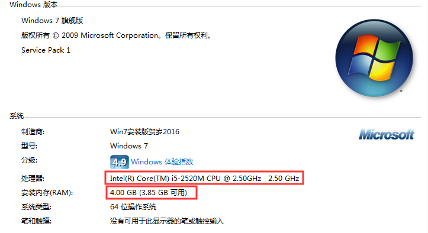
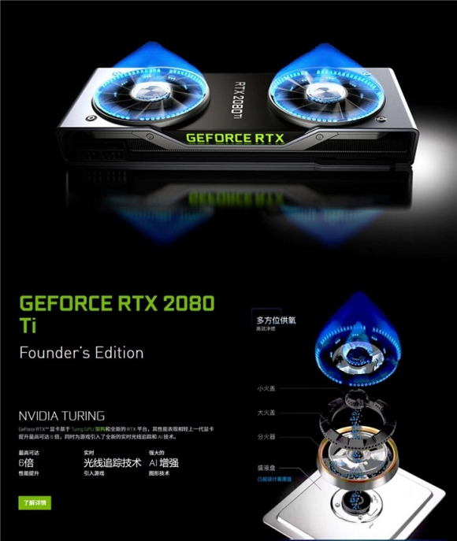

## 概述

### 概念介绍

**插件性能：**指在游戏中，用来衡量插件所消耗的运行速度的量。

插件性能被定为4个等级：无消耗、低消耗、中消耗、高消耗。

**插件性能单位**：指在游戏中每20秒（20000ms）执行特定插件时所占用的响应时间。

20秒是作者我在性能测试时固定的测试时间。根据统一的20秒时间，可以判断一个插件的消耗程度。

| 响应时间           | 插件性能   |
|--------------------|------------|
| 0.00ms - 40.00ms   | 几乎无消耗 |
| 40.00ms - 80.00ms  | 低消耗     |
| 80.00ms - 120.00ms | 中消耗     |
| 120.00ms以上       | 高消耗     |

虽然有部分插件可以起到优化性能作用，但是插件加的越多，性能消耗会越来越大。

### 名词索引

以下你可以按住ctrl键点击下面的词，可以直接定位到想了解的名词：

| 基本概念 | [硬件](#硬件) [软件](#软件) [硬件性能](#硬件性能) [软件性能](#软件性能) [响应时间](#响应时间)  |
|----------|------------------------------------------------------------------------------------------------|
| 性能测试 | [硬件性能测试](#硬件性能测试) [软件性能测试](#软件性能测试) [内存](#内存)                      |
| 插件     | [插件性能](#插件性能) [插件性能单位](#插件性能单位)                                            |
| 图形处理 | [像素](#像素) [图形](#图形) [图形处理](#图形处理) [帧数](#帧数) [掉帧](#掉帧)                  |
| 其他     | [贴图处理](#贴图处理)                                                                          |

### 快速区分

要查看哪些插件是低、中、高消耗的插件，去看看” 性能测试统计表.xlsx”。

后面会介绍一大堆概念，可能会比较难理解。这里先说结论：

**1.如果你的游戏考虑手机端，低消耗流畅运行**，你需要：

a.确保每张地图的事件 \< 80个。

b.确保单次插件指令执行数量 \< 40个。

c.少用或者不用 中等消耗 或 高消耗 的插件。

d.并行事件尽可能 \< 10个。

**2.如果你的游戏考虑PC电脑端，但是低配电脑也要流畅运行**，你需要：

a.确保每张地图的事件 \< 200个。

b.确保单次插件指令执行数量 \< 80个。

c.少用或者不用 高消耗 的插件。

**3.如果你的游戏几乎不考虑性能**，在较高配置的游戏本中运行，以上问题你全部不需要担心，直接肝就是了。

**  
**

### 思维导图

插件性能的思维导图如下：（调整一下word右下角的缩放率，可以看清小字）

**  
**

## 概念

### 硬件与软件

**硬件**：是电子设备的统称，包括计算机、机械、光学控件等。

**软件：**是计算机数据和指令的集合，包括应用程序、游戏、系统等，数据也属于软件，不过我们通常称的软件都是应用程序。

**硬件性能**：硬件的配置决定了性能的上限，高配电脑的性能好，低配电脑的性能差。

要查看硬件性能，可以进入设备管理器，或者进入控制面板查看系统。

图中是测试插件性能时用的低配电脑╭(°A°\`)╮。

（该电脑跑不动吃鸡，大型3d游戏都带不动，只能玩一些中低端的3d游戏。然而，该电脑却出人意料地能流畅运行英雄联盟，这令我有些敬佩。）

**软件性能**：是指软件在能完成某个功能的前提下，速度快不快的能力。

能够完成功能，且速度又快，就说明软件的性能好，反之性能不好。

**响应时间**：是指软件完成某个功能所消耗的时间。

通过比较 相同功能软件 的响应时间，可以评估出该软件的软件性能。

需要注意的是，响应时间
是软件和硬件共同的结果，同样的插件，在低配电脑消耗为20.23ms，而在高配电脑的消耗为9.14ms。所以，要评估一个软件，必须要统一性能测试的环境。

图中是使用火狐浏览器的检测工具测出的插件 响应时间╭(°A°\`)╮。

### 电脑硬件性能

**硬件性能测试**：是指对硬件真实物理意义上的性能测试，比如耐热性、防水性、抗压性、抗震性、电磁兼容性，另外还包括对工作期间的运行速度、稳定性、极限负荷运行下的能力等。

专业的硬件性能测试流程非常复杂，我们一般人也很少接触这些专业性太强的知识。不过，这里有一个简单易懂的做法：跑分。

**低配电脑跑分**：

相比于专业硬件性能测试，跑分只能算其中的小小一环，但是对于我们来说，知道一个分数就足够了，通过比较，就能知道自己的电脑是好是坏。

下图为 低配电脑 的鲁大师跑分：（综合分数为48456）

下图为 低配电脑 的3dmark跑分：（综合分数为571）

（结果在3dmark可查： <https://www.3dmark.com/3dm11/13658378> ）

**中配电脑跑分**：

另外，介绍一下标准游戏本的分数：（2018年的新本，7000左右软妹币）

下图为 中配电脑（游戏本） 的鲁大师跑分：（综合分数为201441）

下图为 中配电脑（游戏本） 的3dmark跑分：（综合分数为5559）

（结果在3dmark可查： <https://www.3dmark.com/3dm11/13658876> ）

**高配电脑跑分**：

没有。W(ﾟДﾟ)w我穷。

### 硬件内存

**内存：**是指软件在系统中占用的空间。软件每次需要临时使用新数据时，都会向内存请求开辟空间放数据以供随时使用。

打开win10的任务管理器（快捷键 Ctrl + Shift +
Esc），可以看到所有程序的CPU和内存的关系。

内存属于瞬间爆炸型，系统的内存空间不够了，软件继续如果要求内存，会直接软件停止工作或死机。

相对而言，性能和内存的关系并不紧密，但是内存小了，肯定会影响性能和速度。作者我这里进行测试时，只关注插件的性能占用情况，插件请求的内存空间不在考虑内。

如果你是低配电脑，最好将其他的大软件关闭，这样可以确保游戏运行时不会被抢内存资源。

## 插件性能

### 详解

**软件性能测试**：是指通过模拟一些极端场景，对具体软件的功能进行测试，判断其软件性能与边界，以及在极限性能边界上软件的运行状态。一般包括
负载测试、响应时间测试（速度测试）、压力测试（浪涌测试）三种。

1）负载测试，就是在开了一大堆大软件的同时，测试插件的性能。这个用不上，因为rmmv游戏遇到大软件抢资源时，会自己突然去世，闪退。

2）压力测试，又称浪涌测试，即使用一个超级触发装置，对插件的指定功能，在极短时间内触发执行100000次。这个也用不上，因为我的电脑受不了。

3）响应时间测试，又称速度测试，这个最简单，在执行时多次记录响应时间，统计后取平均值就可以了。

作者我经过响应时间测试后，将所有时间数据通过统一的表列出来（见”性能测试统计表.xlsx”），哪些插件的性能消耗如何，通过列表数据便能一目了然。

**插件性能：**指在游戏中，用来衡量插件所消耗的运行速度的量。

插件性能分为4个等级：无消耗、低消耗、中消耗、高消耗。

大多数插件都
几乎无消耗，并且不再特定的条件下，这些插件都是不工作的，所以rmmv加800个以上的低消耗插件，都不会造成游戏进不去、卡死的情况。

另外，高消耗没有上限，一个插件如果拥有直接让整个电脑死机的消耗能力，那也只算高消耗插件。因为消耗能力超出一定的范围后，更多不稳定性的问题都会加大这个插件消耗能力，从而消耗爆炸。

毕竟软件的优化性能能力有限，部分功能一定吃大量电脑性能，我们是拦不住的。

**插件性能单位**：指在游戏中每20秒（20000ms）执行特定插件时所占用的响应时间。

20秒是作者我在性能测试时固定的测试时间。根据统一的20秒时间，可以判断一个插件的消耗程度。

理论上来说，插件数量足够多的时候，20000ms可以被填满，使得电脑变为满负荷工作，这个时候，游戏是会直接卡死的（100%CPU，程序写了死循环那种卡死）。不过一般都到不了那种情况，因为插件工作的范围都有限，多数情况下插件都是不工作的。

**性能测试方法**：

由于的插件特别多，有许多插件计算量大，混杂在里面难以被发现。

单独关掉一个插件，也看不出明显的卡顿，所以必须通过内存工具来找。

打开火狐浏览器，按F12，点击性能选项卡，即可开始测试性能了。

图中，Drill_SecretCode插件在执行updateInput函数时，耗时20.23ms，正常消耗。

而部分插件，能够明显看到高消耗，比如下图的MOG_Scrollbar插件，执行updateButton却占用了148.55ms：（该插件已被推翻并优化）

参照下面的20000.00ms检测条件的对照表可知，MOG_Scrollbar（菜单滚动条）插件是一个高消耗插件，需要进行算法优化：

| 响应时间           | 插件性能   |
|--------------------|------------|
| 0.00ms - 40.00ms   | 几乎无消耗 |
| 40.00ms - 80.00ms  | 低消耗     |
| 80.00ms - 120.00ms | 中消耗     |
| 120.00ms以上       | 高消耗     |

另外，需要提一下的是，pixi.js也有很高的消耗：142.36ms。

这是因为pixi的函数是底层函数，非常多的插件都在反复使用该函数。所以它的消耗自然是最大的，因为集合了树枝树叶所有的计算量。

你可以点击图中的灰色的三角形，展开看到这个树根函数下面还有哪些其他子函数。由于插件之间有非常多的函数继承关系，所以这个树根下面非常深。

### 图形处理

**像素**：是图形的最小基本单位。计算机中所有图形都是由 像素小方格
构成，每个像素包含rgb三个基本颜色值数据属性。部分像素还包括rgba的a透明度数据属性。

**图形**：是游戏中构成场景的基本单位。与 贴图
的定义相似，但是图形是纯数据体。而贴图是一套封装好的图形处理对象。

比如，一张100x100的图片，是由10000个像素构成的图形。计算机获取到图形后，要将这10000个像素全部渲染到计算机的显示屏上。

假设每个像素存的是rgb三个颜色值，每个颜色值占1个字节（1B），那么100x100的图像字节就占100x100x3x1
=
30KB的字节，这只是100x100的小图，如果是1000x1000的图片，就是3MB。而一般的游戏，少说也要同时绘制200张图片（地图里放一堆事件），那么就接近0.6GB。如果要将所有图片全都渲染到屏幕上，可想而知，图形处理的性能消耗量是多么庞大。

**图形处理**：也称图像处理，是指将图形最终渲染到电脑屏幕上的过程。通过使用数学算法将二维或三维图形进行转化处理，生成最终的计算机图形画面。

之所以需要提到图形处理，是因为这个部分的 性能消耗
是真的太庞大了，大半性能都用来渲染图形。为此还有一门专业学科，叫计算机图形学。

软件条件下做图形处理计算量太庞大了，那么有没有专门解决图形计算的硬件呢？当然有啦。

**图形处理器**：也称GPU、显卡，是一个专门用来做图像和图形相关运算工作的微处理器。

我们经常说的n卡（nVIDIA）和a卡（AMD）就是图形处理器硬件。

有趣的是，GPU有芯片级别的硬件：

也有煤气灶级别的硬件（误）：

具体显卡是如何工作，怎样选择显卡能够加强游戏性，你可以百度查查，或者去问问显卡大佬哦。

**中央处理器**：也称CPU，是计算机系统的运算和控制核心，也是信息处理、程序运行的最终执行单元。

相对于GPU处理图形，CPU是真正进行主要运算的核心，好的CPU能够极大地提升电脑的硬件性能。插件中的非贴图功能，都是通过CPU来运行计算的。

### 帧数

**帧数**：即每秒传输帧数（Frames Per
Second），也称刷新率。是图形处理领域的标准定义。每秒钟帧数越多，所显示的图形动作就会越流畅。一般标准为60帧。

在游戏中 按F2 可以调出检测帧数变化窗口。

**掉帧**：即 图形处理
自我优化并对帧数进行减少后的现象。掉帧是以减少图形渲染为代价，而增加
主程序计算时间 的一种方法。掉帧是正常现象。

以下是个人总结的FPS观感与体验：

| 效果                                            | 帧数   | 感受         |
|-------------------------------------------------|--------|--------------|
|  | 50\~60 | 完美运行     |
|  | 40\~50 | 稳定运行     |
|  | 30\~40 | 流畅运行     |
|                                                 |        |              |
|  | 26\~30 | 轻微卡顿     |
|  | 22\~26 | 掉帧严重     |
|  | 20\~22 | 卡成狗       |
|  | 18\~20 | 卡成翔       |
|  | 15\~18 | 卡成PPT      |
|  | 15以下 | 游戏没法玩了 |

如果帧数一直在30帧以上，还是比较靠谱的，人眼在30帧与60帧之间的感受差距不大。

然而只要帧数低于30帧，游戏时就能逐步感受到部分卡顿，对于玩家来说，极可能会影响游戏体验。

在加载界面中，帧数可能会突然掉很多，这是因为加载时要初始化大量数据，分配内存，属于正常现象，加载完毕后会恢复稳定帧数。

## 其他相关

### 变速齿轮

变速齿轮，是另一个特殊的性能影响因素。

之前提到的 硬件、内存、图形处理
都在各个方面影响性能，而变速齿轮能够直接强制改变帧数，设置的速度越快，性能消耗越大，并且是爆炸式上升。

（高配电脑都能卡成2帧……）

### 并行事件与插件

值得一提的是，并行事件 与 持续执行的插件 在功能上是等效的。

但不同的是，插件由于是独立出去的脚本模块，可以进行性能监听或算法优化。

而并行事件基于纯事件的设置，**执行次数不可把控**，在优化性能上存在明显劣势。如果你会js脚本，最好自己写相关插件去实现。

### 切换菜单时掉帧现象

文档”界面.docx”中有介绍。切换界面后，上一个界面所有数据任务处于暂停状态。所有计算量都转移到下一个界面的刷新。

切换菜单掉帧属于正常现象。切换掉帧后，会恢复平稳状态。

从脚本层面上看，每个界面都是一个相对独立的图形处理系统，界面切换之后，原界面的所有图形的工作和内存都会被释放。而进入新的界面后，所有图形需要重新构建，这也就造成了帧数骤降。

这种重建现象非常常见，所有游戏都需要重建。

只是不同的游戏重建的时间非常长，以3d游戏为例，为了初始化3d贴图资源，通常会让用户进入一个非常长的载入界面。Rmmv为2d，所以不需要担心出现长时间重建。

### 贴图处理的性能

**贴图处理**：在作者我的插件测试说明中，你会发现部分插件的时间复杂度有
”o(贴图处理)” 参数。

贴图处理是最难评估插件性能的一个参数。下面因素会影响性能：

1.插件对贴图进行平移、变换、缩放等控制的计算量。可能为o(n) \~ o(n\^2)

2.图像投射显示的面积。可能为o(n) \~ o(n\^2)

3.图像刷新的频率。可能为o(1) \~ o(n\^3)

上面的因素叠加到一起，你会发现，与事件毫不相干的插件，只因为有贴图处理这一项，而造成很大的波动。在50个事件、100事件、200个事件的情况下，插件消耗截然不同，既不是一般线性关系，也不是单纯的指数关系。

作者推测，这里可能有两个原因，一是计算机计算量(CPU)有限，大量事件的计算挤兑了资源分配，其他插件的需要更多时间等待资源分配。二是图形显示计算(GPU)有限，图片越多，GPU的显示控制的负担就越大。

介于之前提及的 [图形处理](#图形处理) 和 [掉帧](#掉帧)
可知，贴图处理的计算量是一个不稳定的量，而真实游戏中很容易执行各种不同情况的变化，所以这里我们会将事件的数量作为一个特殊的条件，进行多次测试。
