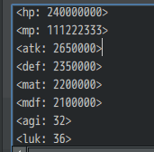
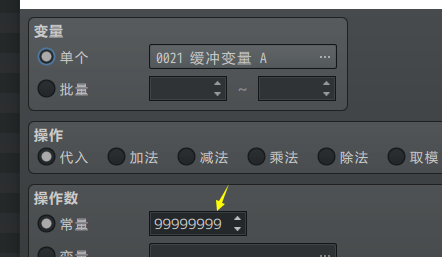
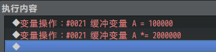

## 概述

### 相关插件

数值破限的插件：

YEP_CoreEngine 系统 - 引擎核心

数值破限之后，能力值可以非常爆炸非常大，但是数值是有上限的。

js程序允许的数值最大的值为9007199254740992，（2的53次方，16位数）

超过这个数字之后，程序计算会发生数据溢出情况。

## 数值设计

从理论上来说，使用 线性增长 的数值，可以极大地拉长玩家刷刷刷的时间。

（比如，从200生命的小萝莉，成长到2,000,000,000的女王，这种落差的满足感对玩家是梦寐以求的，也是刷刷刷游戏的精髓所在。）

刷子游戏真正想让玩家投入，讲究的是每做完任务/升级技能，属性增长的速度能够更进一步爆炸。拼的已经不是单纯的
+2 +2 +2 +2 的攻击力累加，而是每次 +2 +3 +4 +5 +6 这种 加速度增长
属性的刷数值方法。

{width="4.825in"
height="0.6575853018372704in"}

{width="4.850618985126859in"
height="0.7416666666666667in"}

但是对于 敏捷、幸运
这些非线性数值，最好保持原来样子。（atb模式里面对敏捷极为敏感，20000000的敏捷，敌方基本不用等了，直接一套招式不停地用。）

{width="1.425123578302712in"
height="1.4001213910761154in"}

你可以先使用hp 2400、atk
26这种小数字来模拟战斗的平衡性，确认好后，直接将所有线性能力\*100,000。

另外，角色的能力中，经验值是最容易达到程序上限的数值，默认系统对经验值的关系是**指数增长，**如果每级的经验都是固定值增长，则这样可升级到1,000,000,000级。或者直接固定满级1000级，其他能力通过买药获得。

## 变量的数值

rmmv里面变量最大赋值为8位，但实际上变量的值可以超过8位。

{width="3.4024146981627297in"
height="1.975in"}

如果你要赋值200,000,000,000 可以使用变量相乘来赋值：2,000,000 \*
100,000。

{width="3.433333333333333in"
height="0.8297856517935258in"}
