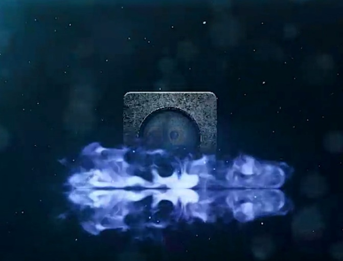
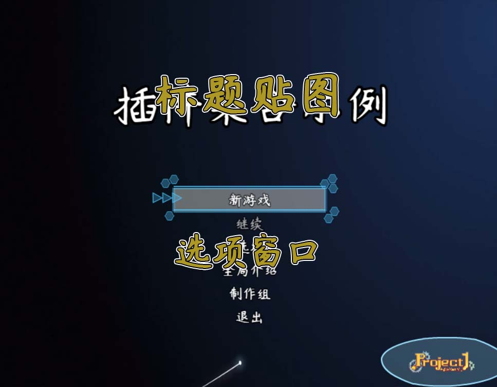
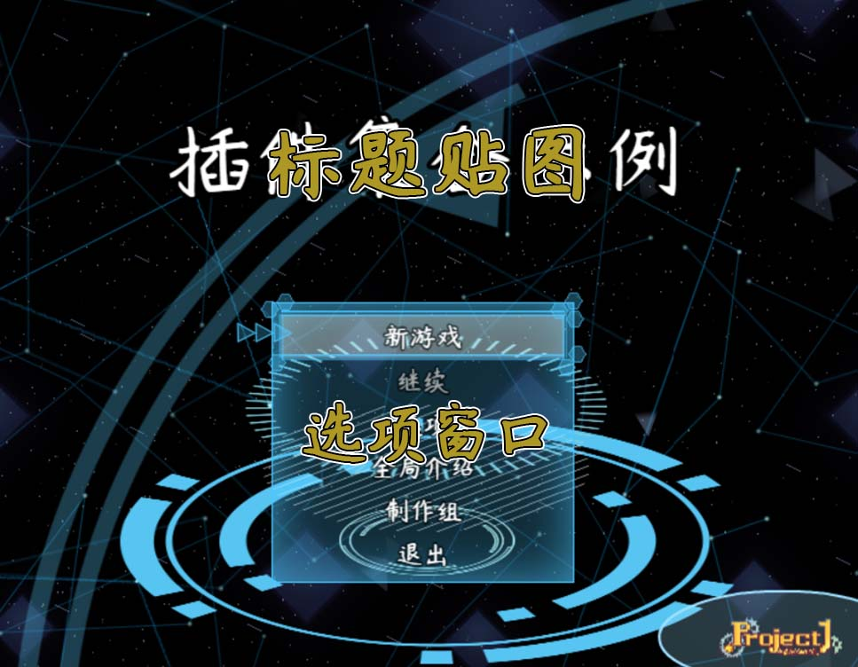
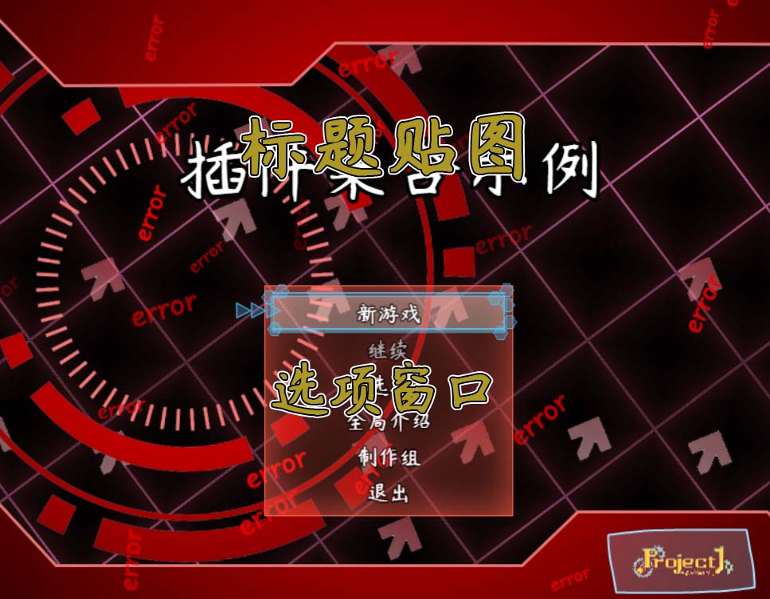
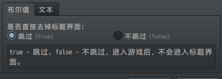
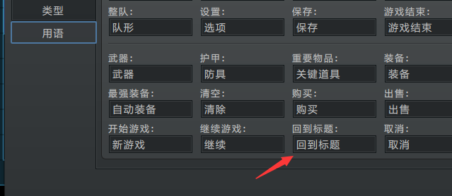
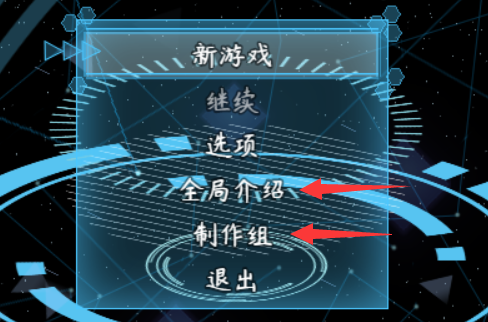
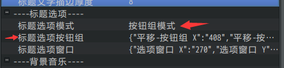
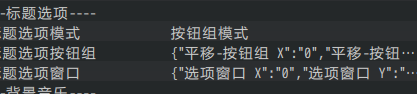
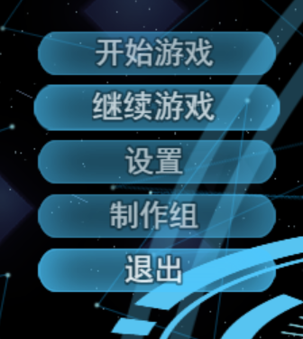

**概述**

**插件介绍**

基础插件：

◆Drill_CoreOfWindowAuxiliary 系统 - 窗口辅助核心

相关插件：

◆Drill_TitleScene 面板 - 全自定义标题界面

◆Drill_TitleBootScene 面板 - 启动界面

标题界面之所以与一般菜单界面要区分开来，是因为标题具有全局存储的特性。你可以去看看"关于全局存储.docx"。

**\
**

**插件关系**

插件之间的关系如下：

## **启动界面**

**流程**

注意，**流程**是程序内部无法改变的固定业务逻辑结构，你可以换界面、换外皮，但是无法改变流程，除非新写插件。

**启动界面流程**：启动界面如下。

{width="3.033333333333333in"
height="2.307011154855643in"}
{width="2.8385334645669293in"
height="2.26875in"}

1).进入界面 \> 开始阶段1

2).阶段 \> 依次进入阶段2、3、4......

3).到达末尾阶段 \> 结束流程

点击 跳过键 可以**跳阶段**，如果遇到了 "当前阶段至少播放时长"
的阶段，跳阶段的功能会暂时无效。

如果2、3、4的 "当前阶段至少播放时长" 为0，则会一路跳至末尾阶段。
结束流程后，可进入标题界面。

**结构**

启动界面，在Rmmv原有的结构中，为：Scene_Boot场景。

该界面这是一个检查数据载入的临时界面。

如果缺少游戏必要文件，会显示黄色报错信息。

如果通过了数据检查，则直接转到下一个界面。

启动界面插件能够将原功能扩展，加入logo以及初始视频播放的功能。

如果你不想要启动界面，直接把启动界面的插件关闭就可以了。

## **标题界面**

**流程**

**标题界面流程**：标题界面如下。

标题界面只有一个流程，但是经过**换皮**，可以做出看起来像3个完全不同的界面：

{width="2.908333333333333in"
height="2.2605850831146106in"}
{width="2.895533683289589in"
height="2.2506364829396324in"}
{width="2.877739501312336in"
height="2.2368055555555557in"}

1).进入界面 \> 标题贴图 + 选项窗口

2).选择一个跳转项 \> 结束流程

换皮的操作可以去示例中的初始点，"变化的标题"小爱丽丝下方的事件看看。

**去掉标题流程**

直接在全自定义标题界面的参数中勾选就可以了，勾选后，标题界面的所有内容都可以不用配置了。

{width="2.875in"
height="1.0267869641294838in"}

+-----------------------------------------------------------------------+
| 去掉界面后，将切断下面两个路线：                                      |
|                                                                       |
| **启动界面 -\> 标题界面 -\> 新游戏**                                  |
|                                                                       |
| **游戏结束界面 -\> 标题界面 -\> 退出游戏**                            |
|                                                                       |
| 变为：                                                                |
|                                                                       |
| **启动界面 -\> 新游戏**                                               |
|                                                                       |
| **游戏结束界面 -\> 退出游戏**                                         |
+=======================================================================+
+-----------------------------------------------------------------------+

另外注意：

1.**标题界面的"继续"功能会进入读档界面**，如果去掉标题，那么按照流程，游戏只能保存，不能读取存档。你可以把保存按钮去掉，或者在游戏中通过脚本进入读档界面。

2.去掉标题后，你需要去 数据库>用语
中修改\"回到标题\"的字符串。因为回到标题的功能已经变成直接退出游戏。

{width="4.216666666666667in"
height="1.834481627296588in"}

**\
**

**标题选项**

新游戏、继续、选项的三个按钮的顺序是固定的。

全局介绍（面板-全自定义选项面板B）、制作组（标题-制作组）、退出
的三个选项，是根据**插件顺序**排列的。

如果你要在标题界面中添加按钮，需留意面板插件中"是否在标题窗口中显示"
的功能。

可见："菜单关键字.docx"的 按钮关键字-标题面板 章节。

{width="3.0104166666666665in"
height="1.9863823272090988in"}

如果你的面板B面板C都加了标题选项，并且想要C选项在B选项的上面，交换插件顺序就可以了。

**标题按钮组**

你可以使用按钮组核心将每个按钮都对应到每个标题按钮的选项，将窗口选项变成一排独立可选的按钮。

标题按钮资源对应方式可见 "菜单关键字.docx"。

{width="4.177083333333333in"
height="1.0088713910761156in"}

**\
**

## **其它说明**

**修改参数不生效**

许多群友经常重复出现这个问题：

修改按钮组的x和y，没有变化，改成0也不行。

{width="3.8833333333333333in"
height="0.8720723972003499in"}

{width="1.7666666666666666in"
height="1.9727777777777777in"}

这是因为，选项按钮组的位置，是存储到**全局参数**中的，

要解决也非常简单：**删除旧存档** 即可。

另外，位置参数也可以由下面的插件指令控制：

">标题界面 : 标题选项按钮组 : 改变位置\[608,312\]"

修改后，永久有效，且跨存档。
