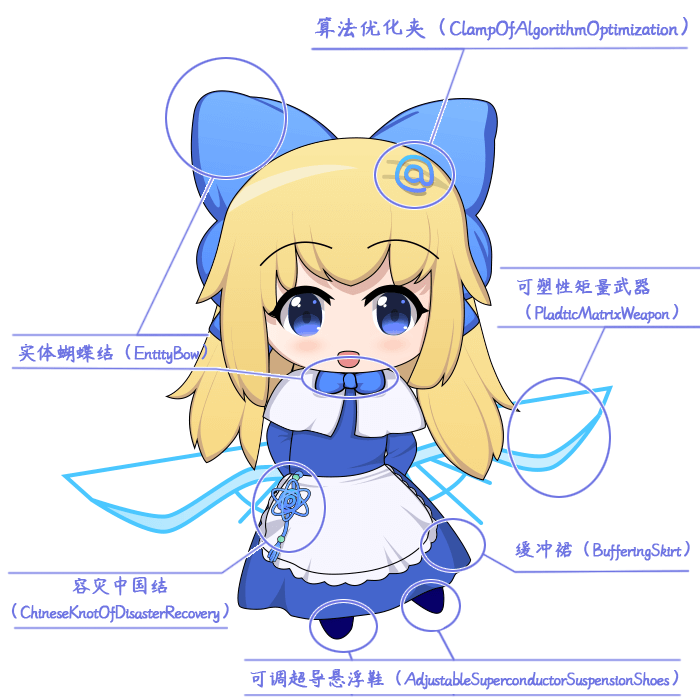
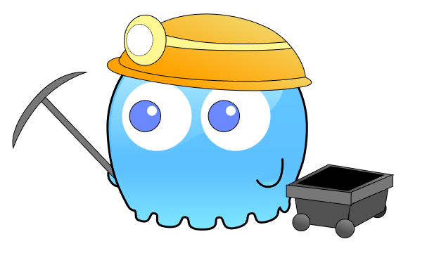
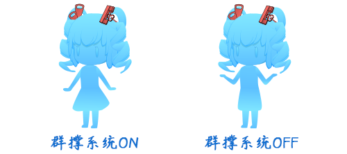

## 关于人设

**具体人设这里并不做硬性规定**。

量子妹和小爱丽丝可以是机器人，也可以是人类，或者是外星生物。你可以任意开启你的想象力，让她们能在你的游戏中跃然纸上。

原设定里，她们都是程序软件的具象化，小爱丽丝是系统实例化的一个对象，量子妹是系统管理员。后面有具体的介绍与标识。

## 量子妹

### 特征设定

{width="5.768055555555556in"
height="5.768055555555556in"}

**断点夹（BreakPointClamp）**：用于调试程序bug经常使用的控制夹。通常只要在脚本旁边夹上一下，就可以让程序在断点夹处停止，并以此来进行程序状态监控。以前量子妹戴着很多夹子，由于每跑一次程序都会被一堆夹子拦截，造成了许多麻烦。于是量子妹养成了习惯，一次最多只戴两个断点夹。

**同步锁（SynchronizedLock）**：两个不同星系之间，一定会发生频繁的钟慢效应。这种效应非常容易破坏程序之间的时间同步运行的稳定性。同步锁用于锁住二者之间的时间先后关系，防止系统之间产生时间差。（如果未锁定，严重的可能造成时空裂痕，出现两个星系相差1年时间的情况。）越古老越厚重的锁，越经得起历史的检验，这也是她选择古锁的原因。

**螺旋模型（SpiralModel）**：螺旋模型是一套成熟的软件开发方法模型。最大的特点是时刻对软件进行风险分析，在无法排除重大风险时有机会立即停止软件开发。这种模型结构也极大影响了量子妹做事风格，使得她更多地顾全事物的诸多方面，性格沉稳，在关键时刻会果断做出决定。不过，很多时候她实际做的决定并没有想象中那么沉稳，由于她的面部表情不明显，看似很稳，实际很慌。

**可视化连衣裙（VisibleDress）**：穿上了这个连衣裙，能让其他小爱丽丝能够看见她，这种连衣裙可以将物体具象化。该裙子还具备缓冲裙功能。能够在高处落下时自动撑开成降落伞的形状，进而减小降落的速度。只不过，这条裙子是全蓝色的，具象化后的量子妹是蓝色的。（换条红裙子，量子妹就是红色的啦。）至于量子妹本体是什么样的，或许本身就不可见？又或许是不明能量体的交织态？这个就不清楚了。

+-----------------------------------------------------------------------+
| **没什么用的灵感：**                                                  |
|                                                                       |
| "量子妹"是一个随意创造出来的词                                        |
| ，如果作者我不是在rpg游戏领域开坑的话，或许她可能会叫别的名字，比如： |
|                                                                       |
| 量子少女（歌姬类游戏）                                                |
|                                                                       |
| 量子萝莉（日系养成游戏）                                              |
|                                                                       |
| 量子女孩（欧美游戏）                                                  |
|                                                                       |
| 量子姬（国产手游）                                                    |
|                                                                       |
| 量子伊人（古典风游戏）                                                |
|                                                                       |
| 小量量（上世纪主机游戏："小量量大冒险"）                              |
|                                                                       |
| 量子妈（广场舞？健美操？主播？...）                                   |
|                                                                       |
| ......                                                                |
+=======================================================================+
+-----------------------------------------------------------------------+

### 社会关系设定

**管理员（administrator）**：管理员是控制系统空间世界中的最高权限，也是系统空间世界中所有星系的最高领导者。小爱丽丝们尊称量子妹为"管理员小姐"。

**量子妹的伪装**：可视化连衣裙有小爱丽丝版本的。穿上伪装后，外观是一只普通的有着螺旋双马尾发型的小爱丽丝。作星系的最高领导者，不伪装意味着以一种政治身份进行出席，会吸引大批小爱丽丝民众与媒体狗仔队，需要大量维护人员开道，甚至包场。所以，出门伪装是为了防止自己的行为给所在城市造成不必要的压力。

## 小爱丽丝

### 特征设定

{width="5.768055555555556in"
height="5.768055555555556in"}

**实体蝴蝶结（EntityBow）**：系统每次实例化一个新的小爱丽丝时，都会自动分配多个实体蝴蝶结，作为系统的标识（id）。蝴蝶结是系统识别用的一个指针，相当于实时GPS定位系统。如果你想找一个指定的小爱丽丝，只需要输入蝴蝶结的id，就可以找到她所在的位置。通常的小爱丽丝都会戴一个大蝴蝶结和一个备份用的小蝴蝶结。当然，有时候也存在小爱丽丝自己摘下所有蝴蝶结，跑到哪里都不知道的情况。

**算法优化夹（ClampOfAlgorithmOptimization）：**
该夹子是一套精密的优化算法程序，用于加强小爱丽丝进行思考、处理信息的泛化能力。夹子的本体是"@"，内部装有数学家和计算机学家编写的大量算法dll动态链接库，能极大提升小爱丽丝的思考能力。夹在其它地方也有效，不一定非要头发上。只要戴一个就可以啦，多带没有叠加效果。每次系统进行更新或者升级时，小爱丽丝都可以去拿夹子去升级。据说，如果小爱丽丝不戴夹子，智力水平会下降一半。

**可塑性矩量武器（PladticMatrixWeapon）：**由可塑性矩量晶体制作而成的武器。在系统空间世界里，大量存在这种晶体，通常的状态是透明天蓝色。实际触摸感觉与塑料等高分子聚合物一样，且重量轻。该晶体有很多不同种的形状、硬度、颜色，取决于晶体内在的数据矩阵排列方式。经过加工处理后，可以做成容器、软板、日用品等各种用具，统称为"矩量制品"。

**容灾中国结（ChineseKnotOfDisasterRecovery）：**容灾中国结的主要功能用于数据容灾。它能实时备份小爱丽丝现有的重要数据，在小爱丽丝遇到意外情况造成数据丢失时，能够及时进行数据还原。简单来说，就是小爱丽丝保命复活用的神器。

**可调超导悬浮鞋（AdjustableSuperconductorSuspensionShoes）**：可调超导悬浮鞋是使用了超导体在磁性地面上悬浮的特性，能够让小爱丽丝悬浮至地面一定高度，相对于一般步行，超导鞋有利于快速移动。不过，并不是所有小爱丽丝都会穿这种鞋子的，因为垫一块坚硬的超导片在脚下，磕脚，不舒服。

**缓冲裙（BufferingSkirt）**：该设计来源于二十世纪爱丽丝穿的裙子材质结构，从极深的兔子洞中下落时，该裙子能够控制展开成降落伞的形状，从而减缓落地的速度，防止摔伤。该设计只在小爱丽丝从非常高的地方降落才能发挥作用，在一般的rpg游戏中是看不出效果的。

### 社会关系设定

**庞大的数量**：小爱丽丝的数量多到数不清，在任何地方都能找到她的身影，是一个横跨多个星系生活的巨大族群。

**社会制度：**小爱丽丝之间是可以存在各种各样多元化的社会制度的，包括社会的经济、政治、法律、文化、教育等制度。经济基础决定上层建筑。

需要提及的是，我们在独立游戏的开发中，经常会因为偏激的个人情绪意识流，将游戏中的社会制度与世界观描述的混乱不堪。反派毫无理由地与玩家为敌，使得自己的游戏缺少艺术升华的主题。所以，在设计游戏前，最好先补补功课预设好其中的社会制度。

**阶层理论：**按照金字塔社会阶层理论，平民是几乎无法与国王进行直接对话的，只能远观。而到了量子妹这种星系的管理等级，能够和量子妹直接接触的小爱丽丝，通常都是国王、总统、领导人级别的小爱丽丝，在一般平民小爱丽丝眼里，量子妹相当于神明的存在，是一种真实而崇高的信仰。

### 可变设定

这里不做硬性设定，你可以根据你的想法添加设定：

1.  小爱丽丝有长发和单马尾两种（主流），部分小爱丽丝会
    戴帽子、扎双马尾、戴特殊发夹、将容灾中国结盘在头发上 加强辨识度。

2.  小爱丽丝有穿哥特服、女服务员装的版本。

3.  小爱丽丝充当了多种职业角色。

如果你缺乏灵感，你可以去故事创作区看看。

## 作者特征人设

### 特征设定

{width="5.041666666666667in"
height="4.2in"}

**断点夹（BreakPointClamp）：**与量子妹使用的断点夹一样，但是因为手太短，一般只能拿起一个。

**索引触角(IndexedTentacles)：**这使得作者几乎拥有在代码中瞬移的能力。能通过全词匹配、正则表达式匹配查找到目标文本字段。能将指定的变量名、函数、索引编号替换成合理的字符。能迅速在数个代码文件中进行全文搜索，精准定位关键字。另外，我恨C++。

**生物物种(OrganismSpecies)：**
有必要提及一下，生物物种是幽灵，与量子妹的可视化连衣裙科技原理一样，将不可见的物质可见化。*不是史莱姆，不是史莱姆，不是史莱姆。*重要的事情说三遍Σ(°Д°;。作者可不是那种非常h的生物，而且也不会做那种可怕的事情。萝莉都是用来养的，可不是用来使用的。

### 社会关系设定

作者的设定非常多变，毕竟自己是导演，想在哪客串就在哪客串，可以完全无视世界观的设定。

**1）小画家**

画画苦手，经常写插件，然后忘了画小爱丽丝，做过的画小爱丽丝的计划，但最后都被拖延了......

{width="1.5916666666666666in"
height="1.5916666666666666in"}

**2）小矿工**

挖坑不填综合征晚期，只要看见一块不平整地，就控制不住地地拿起铁镐挖一块，然后就跑了。因为挖了才知道这个坑大不大，难不难挖；很多地面看起来前景不错，但是小铁镐一敲。我还是跑吧......

{width="2.533333333333333in"
height="1.4682720909886264in"}

## 理论设定

### 神秘主义

神秘主义是指通过感官从现象世界获得真理、智慧的一种唯心世界观。

简单来说，神秘主义就是
魔法、意念、第六感、超能力、自然力、唯灵论、巫术、星占学、炼金术
等秘密或隐藏的能力，用现实世界无法模拟出来的神秘能力。

就目前的小爱丽丝世界观的设定，系统空间世界中暂时不存在任何 神秘主义
的设定。

（量子妹的神器设定来自于计算机中的专有名词设定...这应该不算 神秘主义
吧...）

（不过，你可以在你的游戏中加这些 神秘主义 相关的设定哦）

目前示例里面有很多物品都与 神秘主义
相关（比如抗光戒、魔法红宝石），后期作者我会慢慢去除这些不太符合科学的道具。

### 裙撑系统

在正常物理引力下，裙子不可能展开成为蓬松的圆锥形。

能实现这种效果的，是裙子中内含的裙撑系统技术。

裙撑系统还能做到缓冲裙效果，即自动展开成降落伞形状，减少从高处下落时的速度。

（具体原理不详，反正不是鼓风机，也不是软支架）

至于她们的裙子是否为 铁壁短裙
......看你做什么游戏了。遵循牛顿物理规律也没什么不好，不是吗？

{width="5.768055555555556in"
height="2.5618055555555554in"}

## 道具设定

以下是对小爱丽丝世界的道具的简单说明，可以作参考，也可以自己构建。

### 物品

**1）材料**

{width="0.32287620297462816in"
height="0.2812150043744532in"} 矩量晶屑
\>{width="0.34370734908136485in"
height="0.3020450568678915in"} 矩量碎片 \>
{width="0.31246062992125984in"
height="0.2812150043744532in"} 矩量石英 \>
{width="0.31246062992125984in"
height="0.34370734908136485in"} 矩量水晶

\> {width="0.31246062992125984in"
height="0.2812150043744532in"} 矩量玉 \>
{width="0.3541229221347332in"
height="0.31246062992125984in"} 矩量钻 \>
{width="0.3020450568678915in"
height="0.2916305774278215in"} 矩量介子 \>
{width="0.32287620297462816in"
height="0.32287620297462816in"} 矩量核

**设定1：**等级材料，可以在战斗中获取很多，低级的可以融合成高一级的材料，示例中6个晶屑合成1个碎片，5个碎片合成1个石英，以此类推。如果玩家想合成高级神器，那么必须花时间刷大量材料。该设定适用于超长游戏刷刷刷过程。

**设定2：**泛用材料，同级的独立材料，矩量晶屑x2+矩量介子x1
可以合成矩量炸弹；矩量石英和矩量水晶是必备的武器模具材料；矩量玉和矩量钻用于给武器附魔，提升属性。它们应用于不同领域，唯一的共同点是来自矩量世界而已。

**设定3：**任务材料，只有击败小爱丽丝才会掉落的材料。收集指定的任务材料，可以解锁技能、属性、能力。有点类似于勋章之类的道具。

**2）武器**

作者很懒，并没有画武器图标。

**3）特殊道具**

{width="0.3020450568678915in"
height="0.3332917760279965in"} 矩量炸弹

**设定1：**解谜道具，没有描述。

**设定2：**武器道具，有限数量的合成道具，在冒险中使用。

### 货币

**1）数字币**

**设定：**系统世界中，小爱丽丝之间进行交易的货币。由数据世界的黄金制成。

黄金与普通的矩量水晶不同，呈现金黄色，材质柔软，易锻造，熔点高，化学性质稳定，抗腐蚀，是非常理想的交易媒介。但缺点是容易被仿制、假冒。

{width="2.775in" height="2.775in"}

**2）比特币**

**设定：**比特币是系统世界中公认的特定方程的解，总量为2100万个特解，一个特解就是一个比特币。比特币可以在任意一个接入的系统星系上管理，完全去中心化，无法被仿制、假冒。不管身处何方，任何人都可以挖掘、购买、出售或收取比特币。但是比特币的缺点也明显，价格波动巨大，有时非常贵重，有时非常便宜。

{width="2.775in" height="2.775in"}
