## 简报

### 任务

+-----------------------------------------------------------------------+
| 任务目标：制作一个插件，                                              |
| 能够修改rmmv默认的存档上限。（代码可以复制粘贴，初次接触最好手敲。）  |
|                                                                       |
| 任务帮助：当前目录下，提供了三                                        |
| 个插件模板：Drill_SimpleCourseA1，A2，A3，分别对应课程的上，中，下。  |
+=======================================================================+
+-----------------------------------------------------------------------+

### 基本意识

1.所有底层和插件都是相通的，可以直接调用或覆写。也就是说你的插件函数名如果乱起名，有几率覆盖掉底层函数。

首先，打开Drill_SimpleCourseA1.js，看看里面的变量名和函数名。

留个基本印象即可，后面课程会详细介绍。

2.所有脚本，都是基于ES5的js格式。

对这句话留个印象即可，后面课程会详细介绍。

3.萌新再次提醒

如果你在课程中遇到了js知识的困难，去下面链接补习：

<https://study.163.com/course/courseMain.htm?courseId=224014>

该链接的课程是免费的，讲的js的dom知识比较全，而且时间比较老，不会涉及ES6这些新用法。

### 去掉word红线

Word的红线会非常影响代码查看，这里必须去掉。

{width="2.308533464566929in"
height="0.6667246281714786in"}

点击 文件 》 选项 ，进入选项窗口。

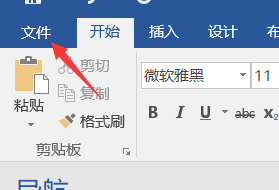{width="2.3252012248468943in"
height="1.5834700349956254in"}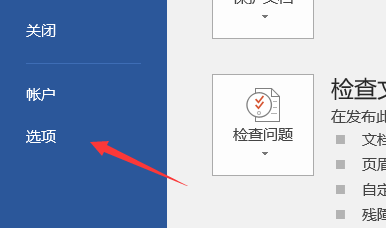{width="3.0896916010498687in"
height="1.825in"}

选择 校对 项，然后把下图的四个勾选去掉。

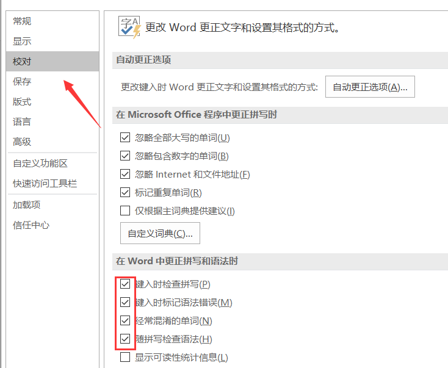{width="4.958333333333333in"
height="4.073398950131233in"}

红线就不会出现了。

## 开始课程（上） 

### 开始写插件

第一课开始了，你准备好开始学习了吗？不管你是老手还是新手，都有必要来看看哦！

我们先按照下列步骤完整走一遍。

#### 打开A1脚本

使用notepad++、vscode、webstorm、SublimeText 打开都可以，但别用 记事本
打开。

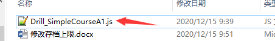{width="4.707744969378828in"
height="0.708244750656168in"}

#### 修改指定位置的数目

比如把20改成99。

+-----------------------------------------------------------------------+
| //========                                                            |
| ===================================================================== |
|                                                                       |
| // \* 存档数量                                                        |
|                                                                       |
| //========                                                            |
| ===================================================================== |
|                                                                       |
| DataManager.maxSavefiles = function() {                               |
|                                                                       |
| return 20;                                                            |
|                                                                       |
| };                                                                    |
+=======================================================================+
+-----------------------------------------------------------------------+

#### 创建测试工程

不要直接在示例里面加该插件，因为 全自定义存档界面
插件会与这个插件相互影响。

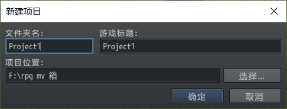{width="2.975in"
height="1.1363527996500438in"}{width="0.9334142607174103in"
height="0.8500732720909886in"}

#### 加入插件

把Drill_SimpleCourseA1插件加入到工程中，只要Drill_SimpleCourseA1。

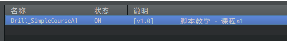{width="4.875422134733158in"
height="0.7000601487314085in"}

#### 功能测试

进入工程后，打开保存界面，查看最大存档数量是否有变化。

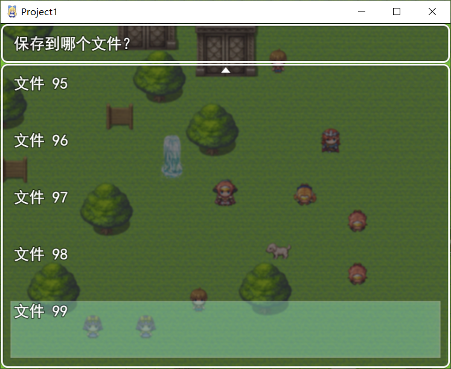{width="4.133333333333334in"
height="3.3723042432195975in"}

ヽ(\*。>Д\<)o゜在你完成上述流程之后，接下来我们开始剖析操作过程中的细节吧。

### 详解 - 代码的颜色

在第一步打开插件后，就能看到插件的文本。

不过，这里介绍一下作者我使用notepad++打开脚本时看到的情况：

+-----------------------------------------------------------------------+
| //========                                                            |
| ===================================================================== |
|                                                                       |
| // Drill_SimpleCourseA1.js                                            |
|                                                                       |
| //========                                                            |
| ===================================================================== |
|                                                                       |
| /\*:                                                                  |
|                                                                       |
| \* \@plugindesc \[v1.0\] 脚本教学 - 课程a1                            |
|                                                                       |
| \* \@author Drill_up                                                  |
|                                                                       |
| \*                                                                    |
|                                                                       |
| \* \@help                                                             |
|                                                                       |
| \*                                                                    |
| ========                                                              |
| ===================================================================== |
|                                                                       |
| \* +++ Drill_SimpleCourseA1 +++                                       |
|                                                                       |
| \* 作者：Drill_up                                                     |
|                                                                       |
| \*                                                                    |
| ========                                                              |
| ===================================================================== |
|                                                                       |
| \* 课程：修改存档上限。                                               |
|                                                                       |
| \*                                                                    |
|                                                                       |
| \*                                                                    |
|                                                                       |
| \*                                                                    |
| \-\-\-\-\-\-\-\                                                       |
| -\-\-\-\-\-\-\-\-\-\-\-\-\-\-\-\-\-\-\-\-\-\-\-\-\-\-\-\-\-\-\-\-\-\- |
| \-\-\-\-\-\-\-\-\-\-\-\-\-\-\-\-\-\-\-\-\-\-\-\-\-\-\-\-\-\-\-\-\-\-- |
|                                                                       |
| \* \-\-\--更新日志                                                    |
|                                                                       |
| \* \[v1.0\]                                                           |
|                                                                       |
| \* 完成插件ヽ(\*。>Д\<)o゜                                            |
|                                                                       |
| \*                                                                    |
|                                                                       |
| \*/                                                                   |
|                                                                       |
| //\<\<\<\<\<\<\<                                                      |
| \<\<\<\<\<\<\<\<\<\<\<\<\<\<\<\<\<\<\<\<\<\<\<\<\<\<\<\<\<\<\<\<\<\<\ |
| <\<\<\<\<\<\<\<\<\<\<\<\<\<\<\<\<\<\<\<\<\<\<\<\<\<\<\<\<\<\<\<\<\<\< |
|                                                                       |
| // 插件简称 SCA（Simple_Course_A）                                    |
|                                                                       |
| // 临时全局变量 无                                                    |
|                                                                       |
| // 临时局部变量 无                                                    |
|                                                                       |
| // 存储数据变量 无                                                    |
|                                                                       |
| // 全局存储变量 无                                                    |
|                                                                       |
| // 覆盖重写方法 无                                                    |
|                                                                       |
| //                                                                    |
|                                                                       |
| //插件记录：                                                          |
|                                                                       |
| // ★大体框架与功能如下：                                              |
|                                                                       |
| // 课程a1：                                                           |
|                                                                       |
| // -\>修改存档上限                                                    |
|                                                                       |
| //                                                                    |
|                                                                       |
| // ★必要注意事项：                                                    |
|                                                                       |
| // 1.不要用记事本打开，查看代码会非常吃力。                           |
|                                                                       |
| //                                                                    |
|                                                                       |
| // ★其它说明细节：                                                    |
|                                                                       |
| // 暂无                                                               |
|                                                                       |
| //                                                                    |
|                                                                       |
| //========                                                            |
| ===================================================================== |
|                                                                       |
| // \*\* 变量获取                                                      |
|                                                                       |
| //========                                                            |
| ===================================================================== |
|                                                                       |
| var Imported = Imported \|\| {}; //导入识别类                         |
|                                                                       |
| Imported.Drill_SimpleCourseA1 = true; //导入的插件标记                |
|                                                                       |
| var DrillUp = DrillUp \|\| {}; //临时全局变量中转类                   |
|                                                                       |
| DrillUp.parameters =                                                  |
| PluginManager.parameters(\'Drill_SimpleCourseA1\');                   |
| //读取插件管理器中的数据                                              |
|                                                                       |
| //========                                                            |
| ===================================================================== |
|                                                                       |
| // \* 存档数量                                                        |
|                                                                       |
| //========                                                            |
| ===================================================================== |
|                                                                       |
| DataManager.maxSavefiles = function() {                               |
|                                                                       |
| return 20;                                                            |
|                                                                       |
| };                                                                    |
+=======================================================================+
+-----------------------------------------------------------------------+

上面编辑器中的代码颜色有一定的意义，这样方便后期在浏览代码时，快速找到代码。

区分的部分理由如下：

（留个印象即可，详细划分内容，可以去看看 工具箱 \> 基本函数查询表.docx
的注释颜色）

1\.
rmmv注释，全程字符串，没法区分。所以只要和代码颜色不一样就可以了，那么就鲜绿色吧。

"//"注释为白色，"/\*\*/"注释为鲜绿色。

2\. 单行和多行注释常用于给不同的代码分段，

图中定义了大分段（//====）因为颜色鲜明，所以很容易注意到注释的标题。

ㄟ(ʅ⊙ω⊙)
其实你不用刻意模仿，按照你的习惯来，这里我只是提及一下我看到的代码是什么样的，因为鲜明的颜色容易引起注意，仅此而已。

比起其他编辑器花里胡哨的颜色，我的编辑器里面是完全没有 蓝色 的。

因为蓝色 = 量子妹 = 游戏界面 = 画画。

代码和画画是两个不同的维度，作为量子妹的系统世界专属之蓝，至少不会让我感到不安。

另外，代码耗血，画画耗魔，魔法肯定是蓝色的，哈哈(\*ˉ﹃ˉ) 。

（如果你想调成作者的显示颜色，可以去看看 工具箱 \> 基本函数查询表.docx
的注释颜色）

### 详解 - 数字

在第二步修改数目中，你可以填入整数、小数、表达式等内容。

需要注意的是，由于js是弱类型语言，整数和小数都为number类型。

+-----------------------------------------------------------------------+
| //========                                                            |
| ===================================================================== |
|                                                                       |
| // \* 存档数量                                                        |
|                                                                       |
| //========                                                            |
| ===================================================================== |
|                                                                       |
| DataManager.maxSavefiles = function() {                               |
|                                                                       |
| return 10\*5+8;                                                       |
|                                                                       |
| };                                                                    |
+=======================================================================+
+-----------------------------------------------------------------------+

使用数字时，需要考虑：10（整数）、-10（负整数）、10.1（小数）、undefined（未定义）、NaN（非法数）

通常整数和小数的划分比较明显，

但是有时整数如果+0.1，就变成了小数，但是这个时候你无法判断计算后的数是整数还是小数。

所以必要时，经常需要用函数Math.floor(0.1)或者parseInt(0.1)来强制转类型。

### 详解 - 插件不能重复缘由

我们回头看看A1插件中，变量获取的部分。

+-----------------------------------------------------------------------+
| //========                                                            |
| ===================================================================== |
|                                                                       |
| // \*\* 变量获取                                                      |
|                                                                       |
| //========                                                            |
| ===================================================================== |
|                                                                       |
| var Imported = Imported \|\| {}; //导入识别类                         |
|                                                                       |
| Imported.Drill_SimpleCourseA1 = true; //导入的插件标记                |
|                                                                       |
| var DrillUp = DrillUp \|\| {}; //临时全局变量中转类                   |
|                                                                       |
| DrillUp.parameters =                                                  |
| PluginManager.parameters(\'Drill_SimpleCourseA1\');                   |
| //读取插件管理器中的数据                                              |
+=======================================================================+
+-----------------------------------------------------------------------+

我们知道Drill_SimpleCourseA1是插件的文件名。

而这里出现了两处定义：

Imported.Drill_SimpleCourseA1 （导入的插件标记）

PluginManager.parameters(\'Drill_SimpleCourseA1\');
（读取插件管理器中的数据）

顾名思义，插件管理器获取数据时，需要将文件名进行捕获对应。

如果你装了两个重复文件名的插件，那么前一个插件，在初始化时，就被后一个插件给完全盖住了。

所以插件不能重复。

插件管理器PluginManager.parameters的实际数据来源是plugin.js，后期会详细讲解。

到这里，课程（上）部分就结束啦。

## 开始课程（中）

### 开始写插件

经过了上半部分，相信你已经掌握了基本的数字修改，实现修改存档数量。

下面，我们按照下列步骤完整走一遍。

#### 打开A2脚本

打开脚本。

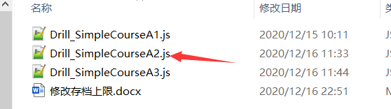{width="4.116666666666666in"
height="1.1500721784776904in"}

#### 脚本复制到：存档数量

将下列脚本复制或者手敲到A2插件的指定位置。。

  -----------------------------------------------------------------------
  return \$gameVariables.value(21);
  -----------------------------------------------------------------------

  -----------------------------------------------------------------------

#### 加入插件

把Drill_SimpleCourseA2插件加入到工程中，关闭或去掉A1。

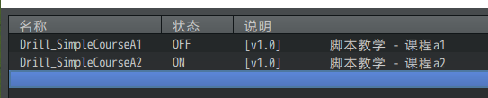{width="4.525392607174103in"
height="0.9084120734908137in"}

#### 功能测试

进入工程后，建立一个事件，这个事件控制 21号变量 的值为30。

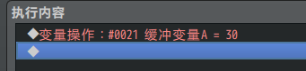{width="2.8419127296587927in"
height="0.6667246281714786in"}

然后进入地图，看看 直接进入保存界面 与 触发变量后进入保存界面 的情况。

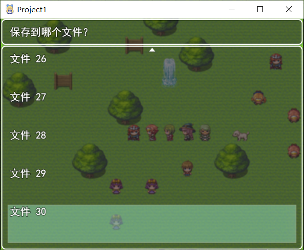{width="3.0083333333333333in"
height="2.4714752843394576in"}

ヽ(\*。>Д\<)o゜在你完成上述流程之后，接下来我们开始剖析操作过程中的细节吧。

### 详解 - 脚本复制

从这个课程开始之后，将会有大量的代码空缺，你需要依次看文档，来操作并熟悉你所复制/手敲的代码哦。

  -----------------------------------------------------------------------
  return \$gameVariables.value(21);
  -----------------------------------------------------------------------

  -----------------------------------------------------------------------

将上述代码移动到下方注释部分。

+-----------------------------------------------------------------------+
| // \>\> 代码 - 存档数量部分                                           |
|                                                                       |
| // （在这部分写课程提供的脚本内容）                                   |
+=======================================================================+
+-----------------------------------------------------------------------+

### 详解 - 变量的脚本

Rmmv中，有两种常用对象：

开关（只存ON和OFF），变量（只存整数，可负整数）

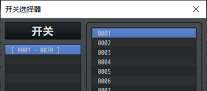{width="3.1666666666666665in"
height="1.3936253280839894in"}
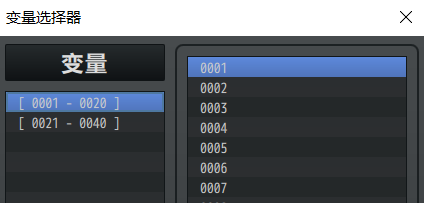{width="2.908333333333333in"
height="1.393804680664917in"}

他们对应的获取脚本与赋值脚本如下：

+-----------------------------------------------------------------------+
| var aa = \$gameSwitches.value(21); //获取21号开关值（true/false）     |
|                                                                       |
| var bb = \$gameVariables.value(22); //获取22号变量值（整数）          |
|                                                                       |
| \$gameSwitches.setValue(21,false); //设置21号开关值为false            |
|                                                                       |
| \$gameVariables.setValue(22,100); //设置22号变量值为100               |
+=======================================================================+
+-----------------------------------------------------------------------+

开关：\$gameSwitches； 变量：\$gameVariables；

插件Drill_CoreOfString字符串核心，根据开关变量的脚本结构，定义了相似用法的\$gameStrings。

不过，这里我们不考虑该插件扩展的\$gameStrings，只关心开关和变量。

后期会经常用到，这里要完全记住哦。

+-----------------------------------------------------------------------+
| **误区**：                                                            |
|                                                                       |
| 由于js的var可以是任意类型，                                           |
| 这就使得对脚本一知半解的朋友会尝试在脚本中塞入其他类型的数据。比如：  |
|                                                                       |
| \$gameVariables.setValue(22,"一串字符串");                            |
|                                                                       |
| var bb = \$gameVariables.value(22);                                   |
|                                                                       |
| 通过                                                                  |
| 这种方式，参数bb是可以获取到字符串的。但是记住，千万不能这样写脚本。  |
|                                                                       |
| 这样做有潜在的风险，一个只装整                                        |
| 数的容器，塞入了字符串、数组等其他的东西，就好比巧克力豆的罐子中混入  |
| 了图钉。（这种操作在c语言和java语言中是分分钟判死刑的，会报语法错误） |
+=======================================================================+
+-----------------------------------------------------------------------+

另外，提及一个常见的数字类型报错：(xxx.clamp is not a function)

{width="2.7283573928258966in"
height="0.9965277777777778in"}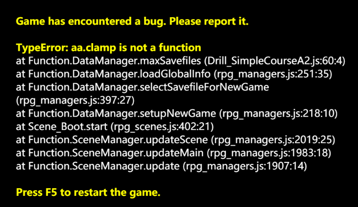{width="3.175in"
height="1.841415135608049in"}

出现这个错，就说明你使用的参数不是数字，而你却当成数字使用了，这是大忌。

### 详解 - 零值问题

在游戏的最初，所有\$gameVariables变量都会被赋值为0。

显然，这在存档中是一个比较严重的bug，因为存档数量为0时，将无法显示存档数量。

不过，按键仍可以保存，因为数据指针默认赋值为1，触发保存后，将视作为存入1号存档。

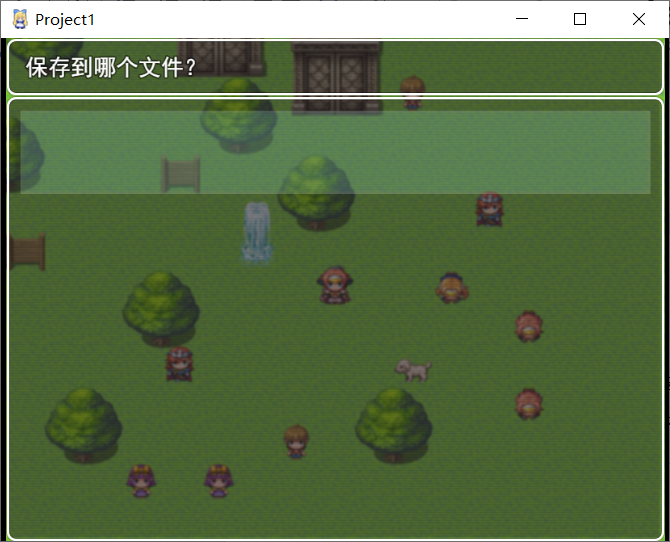{width="3.0416666666666665in"
height="2.463859361329834in"}

因此，为了规避这个情况，你需要先校验等于零、小于零的情况。

于是，这里需要添加条件校验。

+-----------------------------------------------------------------------+
| var num = \$gameVariables.value(21);                                  |
|                                                                       |
| if( num \<= 0 ){ return 1; }                                          |
|                                                                       |
| return num;                                                           |
+=======================================================================+
+-----------------------------------------------------------------------+

将上面的代码复制到 存档数量 代码区域，就可以了。

+-----------------------------------------------------------------------+
| **误区**：                                                            |
|                                                                       |
| 有萌新不理解上述的代码，为什么有两个"return"。                        |
|                                                                       |
| "一个函数如果return两次，那么这个函数返回的是什么？"                  |
|                                                                       |
| 其实作者我被群友问这个问题，问的我目瞪口呆......                      |
|                                                                       |
| （我无论如何都想不到会有人问这个，这就是知识的诅咒吗......）          |
|                                                                       |
| 函数遇到return关键字时，会立即跳出函数，后面的语句是不会被执行的。    |
|                                                                       |
| "return 1;"之后，函数就结束了，"return num;"就不会执行了。            |
|                                                                       |
| 这种写法，是考虑到后期函数中的大                                      |
| 量特殊if条件。遇到一个条件就提前return，这样有利于在写代码时防止被其  |
| 他意外条件干扰。（比如操作一串数组，如果数组为空，就提前return，写if  |
| else太多会非常难看难理解。）                                          |
|                                                                       |
| 如果你对此也有类似的代码写法问题，建议赶紧去看js视频教程补习！        |
|                                                                       |
| <https://study.163.com/course/courseMain.htm?courseId=224014>         |
|                                                                       |
| 该链接的课程是免                                                      |
| 费的，讲的js的dom知识比较全，而且时间比较老，不会涉及ES6这些新用法。  |
+=======================================================================+
+-----------------------------------------------------------------------+

到这里，课程（中）部分就结束啦。

## 开始课程（下） 

### 开始写插件

经过了中间部分，我们已经了解了变量的基本脚本，以及一些禁止事项。

接下来，我们继续按照下列步骤完整走一遍。

#### 打开A3脚本

打开脚本。

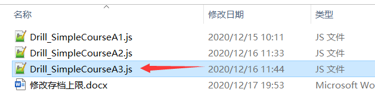{width="4.716666666666667in"
height="1.3647594050743657in"}

#### 脚本复制到：参数位置

将下列脚本复制或者手敲到A3插件的指定位置。

+-----------------------------------------------------------------------+
| \*                                                                    |
|                                                                       |
| \* \@param 最大存档数量                                               |
|                                                                       |
| \* \@desc 最大存档数量的控制参数。                                    |
|                                                                       |
| \* \@default 20                                                       |
|                                                                       |
| \*                                                                    |
+=======================================================================+
+-----------------------------------------------------------------------+

#### 脚本复制到：参数获取

将下列脚本复制或者手敲到A3插件的指定位置。

手敲代码的萌新注意，括号里是DrillUp.parameters，不是PluginManager.parameters，不要看错了。

  -----------------------------------------------------------------------
  DrillUp.g_SCA_maxFileNum =
  Number(DrillUp.parameters\[\'最大存档数量\'\] \|\| 20);
  -----------------------------------------------------------------------

  -----------------------------------------------------------------------

#### 加入插件

把Drill_SimpleCourseA3插件加入到工程中，关闭或去掉A2。

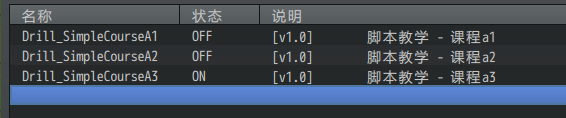{width="4.717075678040245in"
height="0.9834186351706037in"}

#### 功能测试

打开A3插件，编辑插件的参数数量。

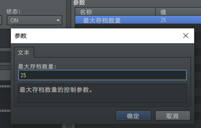{width="2.7583333333333333in"
height="1.765333552055993in"}

然后进入游戏，打开保存界面，查看最大存档数量是否有变化。

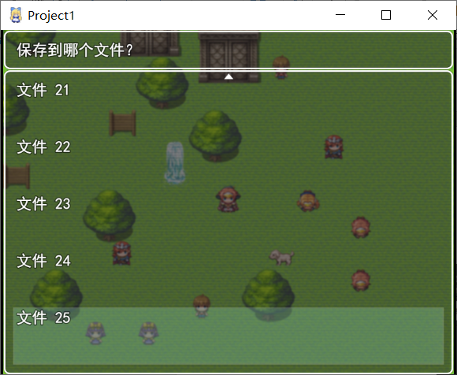{width="3.15in"
height="2.5851727909011375in"}

ヽ(\*。>Д\<)o゜在你完成上述流程之后，接下来我们开始剖析操作过程中的细节吧。

### 详解 - 注释参数

在插件注释中，通过\@param注解，可以添加配置参数到插件中。

至少要\@param、\@desc、\@default三个配置。

+-----------------------------------------------------------------------+
| \*                                                                    |
|                                                                       |
| \* \@param 最大存档数量                                               |
|                                                                       |
| \* \@desc 最大存档数量的控制参数。                                    |
|                                                                       |
| \* \@default 20                                                       |
|                                                                       |
| \*                                                                    |
+=======================================================================+
+-----------------------------------------------------------------------+

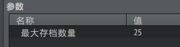{width="2.558555336832896in"
height="0.6667246281714786in"}

由于最大存档数量的参数是整数数字，你可以给这个注释添加更详细的配置。

比如将下面的注释覆盖到 参数位置 代码区域。

+-----------------------------------------------------------------------+
| \*                                                                    |
|                                                                       |
| \* \@param 最大存档数量                                               |
|                                                                       |
| \* \@type number                                                      |
|                                                                       |
| \* \@min 1                                                            |
|                                                                       |
| \* \@desc 最大存档数量的控制参数。                                    |
|                                                                       |
| \* \@default 20                                                       |
|                                                                       |
| \*                                                                    |
+=======================================================================+
+-----------------------------------------------------------------------+

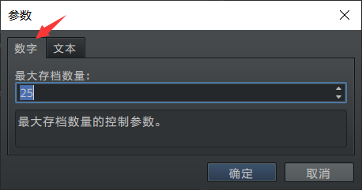{width="3.5416666666666665in"
height="1.8636286089238845in"}

这时候，参数配置就多出了数字的配置，同时最小值为1。

Rmmv的相关注释参数有很多，你可以去看看"工具箱 \> 注释参数集合.docx"。

另外，虽然这些配置都很多，但是最终存入的数据，都是文本字符串。

### 详解 - 全局变量

在贴参数获取的脚本时，你可能注意到了一个非常长的变量名：DrillUp.g_SCA_maxFileNum。

因为这个变量是全局变量，在代码任何位置都能够调用/修改，所以在起名字是，通常会加个"g\_"前缀。

这样定义是为了防止与其他插件名称重复，具体后面课程会说明。

  -----------------------------------------------------------------------
  DrillUp.g_SCA_maxFileNum =
  Number(DrillUp.parameters\[\'最大存档数量\'\] \|\| 20);
  -----------------------------------------------------------------------

  -----------------------------------------------------------------------

所有写在最外层（可以简单理解为没有被"{}"花括号包裹的）的参数，都是全局变量。

值得一提的是，后面的"\|\| 20);"为未定义情况时准备的默认值，建议加上。

这个默认值用于应对插件更新情况。

当插件更新后添加了参数："xx数量"，那么旧插件的配置是肯定没有 "xx数量"
这个变量的，未刷新的配置在获取时会显示undefined，从而导致程序报错。

通过这种写法，可以使得执行时为：Number( undefined \|\| 20
)，系统自动会去获取到20作为默认值。

这样就有效避免了插件更新而产生的undefined隐患。

+-----------------------------------------------------------------------+
| **误区**：                                                            |
|                                                                       |
| 许多脚本开发者在                                                      |
| 拿到别人发布的插件后都会进行一些简单修改，试图实现某些功能值的控制。  |
|                                                                       |
| 比如直接设置：DrillUp.g_SCA_maxFileNum = 10;                          |
|                                                                       |
| 然而，这种方法有时候有效，有时候却一点都不见效。                      |
|                                                                       |
| 主要原因是                                                            |
| 因为没有深入了解这个参数在插件中是如何被作用的，机制、结构是什么样。  |
|                                                                       |
| 开始课程的你，一定 不能                                               |
| 就这样简单改改数值就结                                                |
| 束了，这不仅会浪费大量的测试时间，还会让你失去对插件修改学习的耐心。  |
+=======================================================================+
+-----------------------------------------------------------------------+

## 课程小结

下面来总结一下课程的全部内容，如果你对下面的知识点仍然感到不好把握，可以回去多看看，自己上手试验试验，熟悉基本知识。

1）**基本意识**：所有底层函数和插件都是相通的，不能乱起名，并且要用ES5的兼容写法。（留个初步印象）

2）**代码的颜色**：通过修改代码编辑器显示的颜色，能够快速找到代码。（留个印象即可）

3）**数字**：使用数字时，需要考虑：10（整数）、-10（负整数）、10.1（小数）、undefined（未定义）、NaN（非法数）。

4）**插件不能重复**：插件管理器获取数据时，需要将文件名进行捕获对应。两个重复文件名的插件会覆盖前者。

5）**脚本复制**：在复制或手敲课程中的脚本时，需要多熟悉这些脚本的结构。

6）**变量的脚本**：\$gameSwitches是开关，\$gameVariables是变量。可以通过.setValue(...)函数赋值，通过.value(...)函数取值。

7）**零值问题**：在游戏的最初，所有\$gameVariables变量都会被赋值为0，容易造成bug。所以写函数时，需要考虑0和负数的情况，随时添加if条件。

8）**注释参数**：通过\@param注解，可以添加配置参数到插件中。随时去翻翻"工具箱
\> 注释参数集合.docx"中的内容，熟悉各类注释参数。

9）**全局变量**：写全局变量时，需要按照格式依葫芦画瓢，还要记得加个"g\_"前缀。可以简单理解为没有被"{}"花括号包裹的参数，都是全局变量。参数获取时，需要加"......\|\|
20);"作为默认值，用于应对插件更新情况。

+-----------------------------------------------------------------------+
| **挖的坑**：                                                          |
|                                                                       |
| 基本意识1，后面课程会介绍。 *-\> 课程B*                               |
|                                                                       |
| 基本意识2，后面课程会介绍。 *-\> 课程C*                               |
|                                                                       |
| 插件管理                                                              |
| 器PluginManager.parameters的实际数据来源是plugin.js，后期会详细讲解。 |
|                                                                       |
| 加                                                                    |
| 个"g\_"前缀这样定义是为了防止与其他插件名称重复，具体后面课程会说明。 |
| *-\> 课程C*                                                           |
+=======================================================================+
+-----------------------------------------------------------------------+
