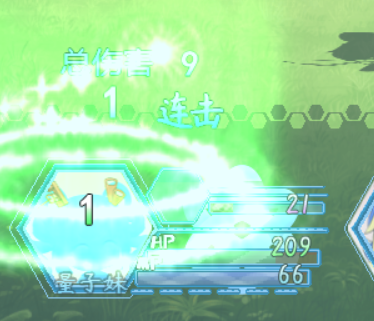

## 罕见问题

### 瞬间卡屏问题

+----------+-----------------------------------------------------------+
| **问     | 瞬间卡屏                                                  |
| 题名称** |                                                           |
+==========+===========================================================+
| **问     | {width="3.2583333333333333in" |
|          | height="2.081713692038495in"}                             |
|          | {width="1.3167804024496939in" |
|          | height="0.6750579615048119in"}                            |
+----------+-----------------------------------------------------------+
| **问     | 游戏突然卡屏，只是画面卡住，但是游戏却能够正常运行。      |
| 题描述** |                                                           |
+----------+-----------------------------------------------------------+
| **发     | 1.在游戏的某个随机时段突然发生，几率为1%。                |
| 生条件** |                                                           |
|          | 2.所有rmmv游戏都可能发生，与插件无关，与环境无关。        |
|          |                                                           |
|          | 3.设计游戏时因为设计者游                                  |
|          | 戏时间短，所以发现不了，但是玩家会经常遇到并反馈出问题。  |
+----------+-----------------------------------------------------------+
| **相     | <https://rpg.blue/forum.php?mod=viewthread&tid=483548>    |
| 关链接** |                                                           |
+----------+-----------------------------------------------------------+
| **问     | 1\. Drill黑边背景插件 的背景仍然可以正常运行，不会卡。    |
| 题特点** |                                                           |
|          | 2\. fps被停止了记录，render渲染器没有继续渲染。           |
|          |                                                           |
|          | 3\.                                                       |
|          | 和scenemanager没关系，从战斗界面开始                      |
|          | 卡，回到地图界面，切菜单界面都没用，仍然卡着原先的界面。  |
|          |                                                           |
|          | 4\. 游戏可以保存，读取后恢复正常。                        |
|          |                                                           |
|          | 5\. 系统log没有任何异常信息。                             |
+----------+-----------------------------------------------------------+
| **原     | 在排查问题时，我发现了一个漏洞。                          |
| 理解析** |                                                           |
|          | {width="3.095087489063867in" |
|          | height="2.158333333333333in"}                             |
|          |                                                           |
|          | 这个漏洞在rpg_core中1871行的Graph.render函数中，          |
|          |                                                           |
|          | if用的是 === 判断。                                       |
|          |                                                           |
|          | 由于这个函数在游戏里面执行的次数非常                      |
|          | 爆炸，正常1秒有60次，如果画面卡，会变成1000次下也有可能。 |
|          |                                                           |
|          | 而问题在_skipCount这个变量, 因为 \_skipCount\--           |
|          | 执行次数非常多，非常高的几率变成 -1，而一旦变成           |
|          | -1，就再也回不到原来的循环中了。                          |
+----------+-----------------------------------------------------------+
| **解     | 使用 Drill_RmmvCoreFix插件                                |
| 决方案** | 可以修复此漏洞，极大地降低卡死的概率。                    |
|          |                                                           |
|          | （插件在当前示例中有，叫做 系统-rmmv核心修复。）          |
+----------+-----------------------------------------------------------+

### 只恢复百分之一的生命

+----------+-----------------------------------------------------------+
| **问     | 只恢复百分之一的生命                                      |
| 题名称** |                                                           |
+==========+===========================================================+
| **问     | {width="2.65in"        |
| 题图示** | height="2.274465223097113in"}                             |
+----------+-----------------------------------------------------------+
| **问     | 所                                                        |
| 题描述** | 有恢复道具只能恢复百分之一的生命，不管怎么调都调不回来。  |
+----------+-----------------------------------------------------------+
| **发     | 1.使用 插件集合示例 作为模板进行设计。                    |
| 生条件** |                                                           |
|          | 2.无论测试战斗、正常测试游戏、部署的游戏，都出现该问题。  |
|          |                                                           |
|          | （许多萌新使用我drillup的示例作为 模板                    |
|          | 进行设计时，都像遇到神秘的诅咒一样。）                    |
+----------+-----------------------------------------------------------+
| **相     | 无                                                        |
| 关链接** |                                                           |
+----------+-----------------------------------------------------------+
| **问     | 1.  道具强制加100的生命，变成1。                          |
| 题特点** |                                                           |
|          | 2.  给友军释放治愈魔法，350的恢复，变成3。                |
|          |                                                           |
|          | 3.  敌人给自己释放治愈，却能正常恢复。                    |
+----------+-----------------------------------------------------------+
| **原     | 这个神秘的诅咒，名叫"降智诅咒"。                          |
| 理解析** |                                                           |
|          | {width="4.7569531933508316in" |
|          | height="1.3166666666666667in"}                            |
|          |                                                           |
|          | 从1.8版本开                                               |
|          | 始，为了使用描述面板更好地显示一些武器属性，我不经意间给  |
|          | 小块碎红宝石                                              |
|          | 添加了一个坑人的属性："恢复效果\*                         |
|          | 1.1%"，许多萌新都习惯性地将第一个武器复制粘贴，于是，所有 |
|          | 武器都被施加了这个神秘的"诅咒"，只能恢复百分之一的生命。  |
+----------+-----------------------------------------------------------+
| **解     | 直接去掉就好了，以后复制粘                                |
| 决方案** | 贴的时候，多注意一下是不是多了什么属性或者少了什么属性。  |
+----------+-----------------------------------------------------------+

### 地图中事件与背景错位

+----------+-----------------------------------------------------------+
| **问     | 地图中事件与背景错位                                      |
| 题名称** |                                                           |
+==========+===========================================================+
| **问     | {width="4.614386482939633in" |
|          | height="2.1354166666666665in"}                            |
|          |                                                           |
|          | {width="2.9270833333333335in" |
|          | height="1.9225863954505686in"}                            |
|          |                                                           |
|          | 图中量子妹走                                              |
|          | 到的位置，和地板上亮起的方块完全错位，并且行走图被拉扯。  |
+----------+-----------------------------------------------------------+
| **问     | 地图背景和事件的位置错位。                                |
| 题描述** |                                                           |
|          | 事件和地图背景都被拉扯，只能看到二分之一的部分。          |
+----------+-----------------------------------------------------------+
| **发     | 此问题在我自己的一个垃圾电脑上出现过（后来                |
| 生条件** | 电脑更新了），接着在一位群友上发生过，另一次是在p1吧里的  |
|          | 朋友出现，还有一次是在群友发布游戏后的玩家留言上反馈的。  |
|          |                                                           |
|          | 1.小概率在一些的低配的玩家电脑中出现。                    |
|          |                                                           |
|          | 2.win7 32位有可能遇到，win7                               |
|          | 64位也有几率，但在win10中没有出现过。                     |
|          |                                                           |
|          | 3.以下为出现问题的群友的二手笔记本配置：                  |
|          |                                                           |
|          | {width="4.769023403324584in" |
|          | height="1.3125in"}                                        |
|          |                                                           |
|          | {width="4.510416666666667in" |
|          | height="3.376868985126859in"}                             |
+----------+-----------------------------------------------------------+
| **相     | <https://rpg.blue/forum.php?mod=viewthread&tid=483705>    |
| 关链接** |                                                           |
+----------+-----------------------------------------------------------+
| **问     | 1.  事件被拉扯成大概1.5倍长，地图背景被拉扯大概2倍长。    |
| 题特点** |                                                           |
|          | 2.  该错                                                  |
|          | 位问题出现后，玩其他rmmv不含drill插件的游戏也会出现拉扯。 |
|          |                                                           |
|          | 3.  不使用任何插件时，不会出现拉扯问题。                  |
|          |                                                           |
|          | 4.  相同的电脑使用火狐浏览器打开，就不存在该问题。        |
+----------+-----------------------------------------------------------+
| **原     | 这很可能是nwjs与旧版电脑                                  |
| 理解析** | 环境不兼容有关，因为出现问题群友的电脑操作系统版本为win7  |
|          | SP1。                                                     |
|          |                                                           |
|          | 而rmmv部署的游戏用同样的火狐浏览器打开就不存在此问题。    |
+----------+-----------------------------------------------------------+
| **解决   | 让玩家升级win7的电脑环境。                                |
| 方案1**  |                                                           |
|          | （Win10不会出现此问题）                                   |
+----------+-----------------------------------------------------------+
| **解决   | 使用其它启动器，比如 火狐浏览器、谷歌浏览器 打开游戏。    |
| 方案2**  |                                                           |
+----------+-----------------------------------------------------------+
| **附加   | 启动rmmv的exe程序是nwjs，而这个nwjs仅仅是个启动环境，     |
| 知识点** |                                                           |
|          | 换成其它启动环境，是可以正常游戏的。                      |
|          |                                                           |
|          | 具体启动器可见："0.基本定义（必看） \> 游戏运行原理.docx" |
+----------+-----------------------------------------------------------+
