## 概述

### 插件介绍

| 基础插件：   ◆Drill_CoreOfActionSequence 系统 - GIF动画序列核心 子插件：  ◆Drill_ActorPortraitureExtend 战斗UI - 高级角色肖像  ◆Drill_PictureActionSequence 图片 - GIF动画序列  ◆Drill_EventActionSequence 行走图 - GIF动画序列 |
|---------------------------------------------------------------------------------------------------------------------------------------------------------------------------------------------------------------------------------|

GIF动画序列可将多张png图片组合，可随时播放不同序列。去看看：[思维导图](#思维导图)
。

该插件含配置小工具：

GIF动画序列编辑器（DrillGIFActionSequenceEditor）

你可以直接从零开始设计配置，熟悉插件：

[直接配置 - 循环GIF](#_直接配置_-_循环GIF)

[直接配置 - 单次播放GIF](#直接配置---单次播放gif)

后期制作动画序列，将会频繁用到小工具：

[小工具配置 - 循环GIF](#小工具配置---循环gif)

[小工具配置 - 单次播放GIF](#小工具配置---单次播放gif)

### 名词索引

以下你可以按住ctrl键点击下面的词，可以直接定位到想了解的名词：

| 动画序列 | [动画序列](#动画序列) [底层变换唯一性](#底层变换唯一性)        |
|----------|----------------------------------------------------------------|
| 状态元   | [状态元](#状态元) [状态名](#状态名) [状态元集合](#状态元集合)  |
| 动作元   | [动作元](#动作元) [动作名](#动作名) [优先级](#优先级)          |

### 子插件文档

以下 子插件 有相关插件说明文档：

| 子插件名称                                                | 文档名称                                 |
|-----------------------------------------------------------|------------------------------------------|
| 小工具：GIF动画序列编辑器（DrillGIFActionSequenceEditor） | （工具内）关于GIF动画序列核心编辑器.docx |
| Drill_ActorPortraitureExtend 战斗UI - 高级角色肖像        | 5.战斗UI \> 关于高级角色肖像.docx        |
| Drill_EventActionSequence 行走图 - GIF动画序列            | 7.行走图 \> 关于行走图GIF动画序列.docx   |

### 插件关系

GIF动画序列核心的插件关系如下图。

### 思维导图

GIF动画序列核心结构的思维导图如下：（调整一下word右下角的缩放率，可以看清小字）

## 动画序列

### 定义

**动画序列**：动画序列是一个完整的盒子，每个动画序列都包含成批量的GIF切片，即状态元
与 动作元。

动画序列、GIF动画序列、GIF动作序列 是同一个东西，只是称呼不同。

（就目前情况看，live2d动画序列是不可能成功写出插件了，所以只有GIF动画序列了。）

**放映动画序列：**要操作这个动画序列盒子，需要从外部输入要播放的动作名、状态名、状态名列表。动画序列接收到输入后，按情况播放不同GIF图像。

如果动画序列中没有指定的状态名、动作名，则没有任何效果。

相关名称定义可以去看后面章节的：[状态名](#状态名) 、[动作名](#动作名)。

**底层变换唯一性**：脚本上，动画序列 只变换
图片资源（bitmap），其它数据全都不影响（平移xy、中心锚点anchor、缩放拉伸scale等都不变）。

也就是说，动画序列中，不能自定义额外的平移、拉伸等效果，需要与其它动作效果插件组合使用才行。

### 状态元

**状态元**：状态元本质上就是一个GIF切片，用于表示 持续执行的状态。

比如 小爱丽丝静止的GIF状态，小爱丽丝行走时的GIF状态。

**状态元自循环**：如果状态元集合中只有一个状态元，那么这个状态元会单独循环播放。

**状态名**：即状态元的名称，设计前需要自定义此名称，会作为标识由外部调用。

下图中的”小爱丽丝静止”即为状态名。

**状态元集合**：用于存放多个状态元的集合，这个集合可以随机播放状态元。

**权重**：是指状态元被随机抽中的概率。常用的状态元可设置高权重，这样被随机抽中的概率会更大。

### 状态元设置

**默认状态元集合**：指动画序列启用后，默认执行的状态元集合。该序列必须配置至少一个状态元，不然在动画序列导入后，你将看不见任何图像。

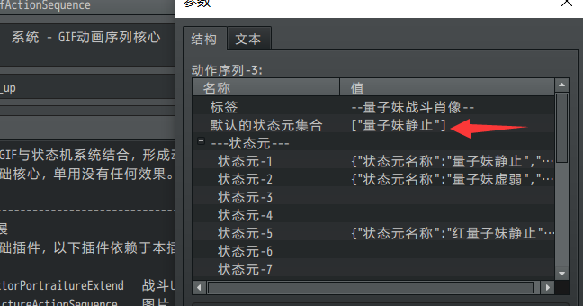

**状态元命名**：状态元的名称是完全自定义的。在使用插件指令调用动画序列时，将会直接使用状态元的名称，所以在设计名称时，最好多考虑一下起名方式。

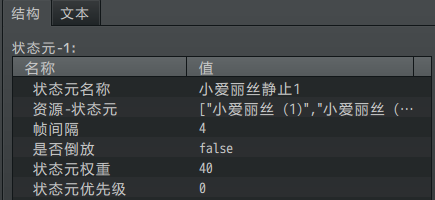

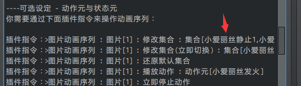

### 动作元

**动作元**：动作元本质上也是一个GIF切片，用于表示 临时执行一次的动作。

与状态元不同，动作元激活后，会在状态元集合中插播且只播放一次。

**动作名**：即动作元的名称，设计前需要自定义此名称，会作为标识由外部调用。下图中的”小爱丽丝攻击”即为动作名。

**优先级**：优先级低的动作元播放时，可以被后来的优先级高的动作元中断并播放。

优先级低的、优先级相同的 动作元 不会中断当前 动作元。

优先级低的、优先级相同的 动作元 也不会中断当前 状态元。

无法中断的动作元，会被取消。

### 资源设置

**1）资源可大可小**

资源的大小没有限制，可以是大的肖像，也可以是小像素行走图。

需要注意的是，所有帧都必须拆成单张图片，才能配置到动画序列。

**2）资源帧数不限**

GIF动画序列的帧数不限，可以通过动态立绘软件（比如live2d）导出100张以上的图片，然后配置到
动作元或状态元 中。

![F:\\rpg
mv箱\\_N0M1Z%(3OS_W3XVOO6O5]N.png](media/9a9e4fe3e322e92593303265fe7d9ea3.png)

**3）资源名不能重复**

如果你是从外面找到的素材，最好将这些素材全部进行 **重新命名**
，因为后期这些素材将会全部放在 同一个
文件夹，必须保证这些文件名不会重名，否则会被覆盖。

（下图为东方非想天则的素材示意图……好像不小心截取到了威严满满的抱头蹲防。。）

![C:\\Users\\lenovo\\AppData\\Roaming\\Tencent\\Users\\1355126171\\QQ\\WinTemp\\RichOle\\Z[\~3\`34{M0\$DX]%M2\$057S2.png](media/9add269b40b003905d7cbaf8ea0bb13c.png)

## 从零开始设计

你可以先了解 直接配置，再去看看 小工具配置，原理是一样的。

不过注意，后期主要以 小工具配置 为主。

该工具在”插件小工具”文件夹中。

具体用法你可以打开软件，并查看帮助文档：”关于GIF动画序列核心编辑器.docx”。

### 直接配置 - 循环GIF

**1）创建工程**

创建一个初始工程，加入两个动画序列插件。

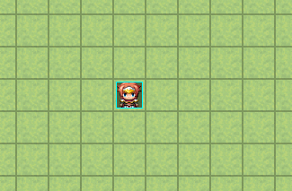

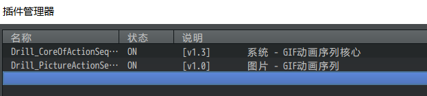

**2）复制资源**

将用到的资源png图片文件放入 Special__actionSeq 文件夹中。

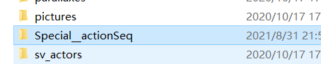

这里打算配置： 图片GIF-波浪点（20个图片）

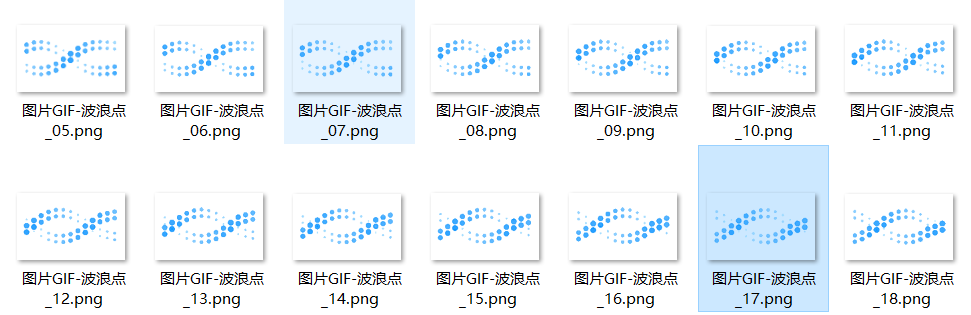

**3）配置动作序列**

进入动画序列插件核心，选择一个动画序列。

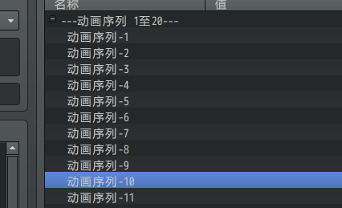

配置状态元即可，将20张图片都放入 资源-状态元 列表中。

注意，需要保证 默认状态元集合 与 状态元名称 保持一致。

![C:\\Users\\lenovo\\AppData\\Roaming\\Tencent\\Users\\1355126171\\QQ\\WinTemp\\RichOle\\[1C\~{3\$BDUX0RZM)315]I\`N.png](media/47f2698f305bea50fb3047339f9101a1.png)

**4）插件指令绑定**

配置后，用插件指令将 动画序列10 绑定到 图片8 上，就完成了。

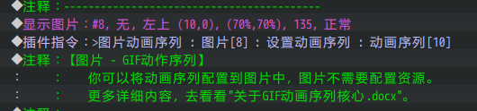

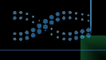

**图片延迟问题：**有时候动画序列在图片建立后，不能立即设置动画序列，不然会使得动画序列找不到对象进行初始化。这时应该等1帧再设置。

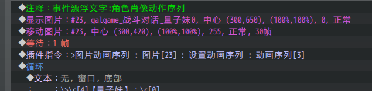

### 直接配置 - 单次播放GIF

**1）创建工程**

创建一个初始工程，加入两个动画序列插件。

**2）复制资源**

将用到的资源png图片文件放入 Special__actionSeq 文件夹中。

这里打算配置： 图片GIF-小闪烁（10个图片）

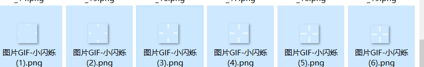

**3）配置动作序列**

进入动画序列插件核心，选择一个动画序列。

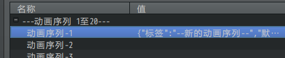

配置一个空的状态元名字为“空图片状态”。

注意，需要保证 默认状态元集合 与 状态元名称 保持一致。

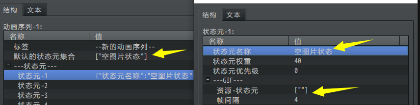

接下来，配置一个动作元，设置名字为“闪烁一次”。

将资源的10个图片，配置到 资源-动作元 列表中。

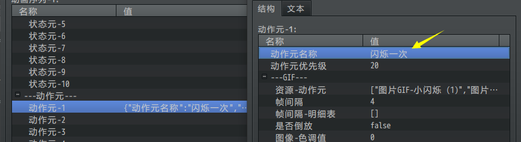

**4）插件指令绑定**

建立一个事件，执行显示图片，然后 设置动画序列。最后播放动作。

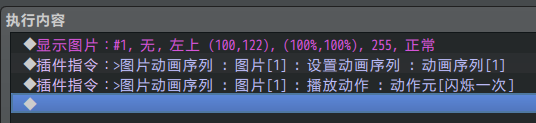

可以看到，GIF的图片播放了一次后，就消失了。

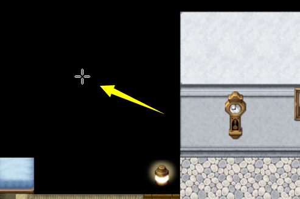

**5）原理说明**

动画序列中，**必须**要有默认状态元集合，**必须**要有至少一个状态元。

状态元需要作为循环的对象，不停的循环播放GIF。

所以，需要给一个空资源图片的状态元。（可以看看概念 [状态元](#状态元) ）

这时候，再播放一次动作元，动作元播放完毕后，就又回到 空图片 循环的状态元了。

### 直接配置 - 完整动画序列

**1）配置关系**

完整的配置就是将上述的两个配置结合起来。

一个动画序列中，可以配置很多 状态元 和 动作元，是一个大的盒子。可见
[动画序列](#动画序列) 。

你需要将资源填充到盒子中，完成盒子配置后，再通过插件指令控制播放。

**2）创建工程**

创建一个初始工程，加入两个动画序列插件。

**3）复制资源**

将用到的资源png图片文件放入 Special__actionSeq 文件夹中。

这里打算配置： 量子妹（8个图片，2个状态元，2个动作元）

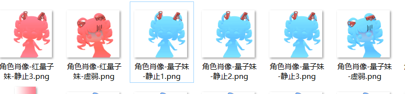

**3）配置动作序列**

进入动画序列插件核心，选择一个动画序列。

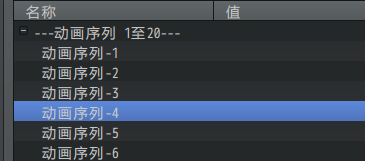

配置两个状态元：量子妹静止和 红量子妹静止

默认状态元集合为 量子妹静止 。

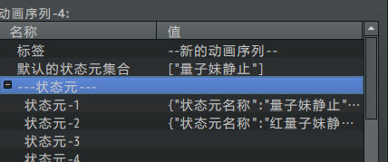

配置两个动作元：量子妹受伤 和 红量子妹受伤

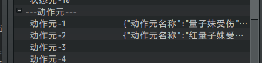

注意，配置动作元的帧间隔为25帧，拉长受伤图片的显示时间。

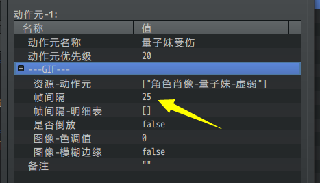

**4）插件指令绑定**

建立一个事件，执行显示图片，然后 设置动画序列。

可以看到，绑定后，动画序列将按照默认的状态，循环播放。

（默认播放速度4帧，有点快，略显鬼畜）

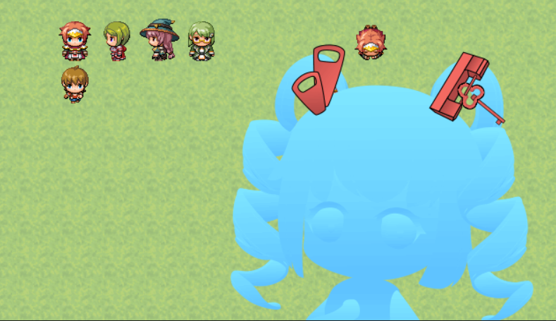

随后，添加插件指令，可以控制播放受伤动作。

以及修改集合，使其切换至红量子妹版本。

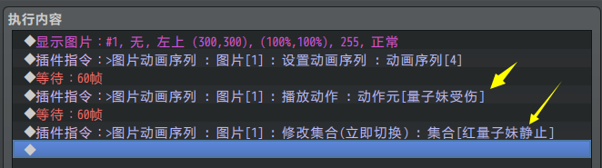

以上是完整的配置与调用方法。

**5）直接配置大量资源方法**

如果状态元有非常多的图片，一个个配置非常麻烦。（比如从live2d中导出的大量图片）

这里推荐使用小工具 动画序列GIF编辑器，可以进行批量导入。

不过，直接导入也是可以的，

比如下图有45张小爱丽丝图片需要配置。

![C:\\Users\\lenovo\\AppData\\Roaming\\Tencent\\Users\\1355126171\\QQ\\WinTemp\\RichOle\\]TI)NJ9[1}USDN}P]G\`WTGB.png](media/d653ab14da2d01b6288fa36a10fafe57.png)

先配置一个”小爱丽丝 (1)”后，点击文本。

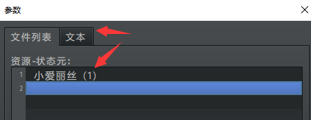

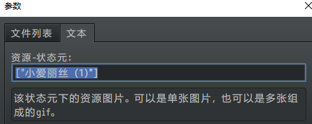

将文本复制到记事本中，按照下面的格式，一次写2、3、4、5、6……直到45.

逗号必须是英文逗号，引号也必须是英文引号。

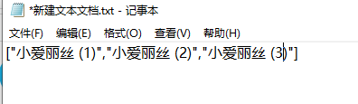

写完后，按Ctrl+A全选，然后复制粘贴到刚才的文本中。

![C:\\Users\\lenovo\\AppData\\Roaming\\Tencent\\Users\\1355126171\\QQ\\WinTemp\\RichOle\\UQAV]D5J%0S}_YE811K%A\~U.png](media/2c7d613f9441b224d6c1f1ff57e49138.png)

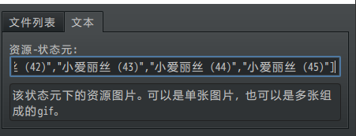

通过这种方式，可以将一堆文件配置上，可以免去一个个点资源图片的麻烦。

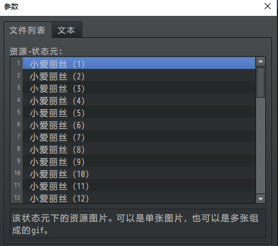

### 小工具配置 - 循环GIF

此配置步骤在小工具的操作教程中也有。

可以看看帮助文档：“关于GIF动画序列核心编辑器.docx”。

**1）小工具中导入工程**

如果你是第一次使用该工具，先 备份 你的工程，再对备份的工程进行操作。

（你可以用小工具 新建/导入/打开 工程，这里按 导入的流程 走）

进入软件后，点击rmmv交互按钮。

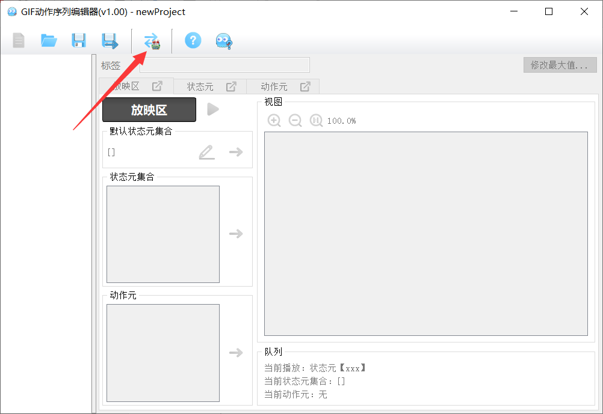

选择一个工程，然后点击“从rmmv中导入数据”。

如果指定的rmmv工程没有加动画序列插件和配置，那么会系统会提示你自动添加新的数据，并走新建的流程。

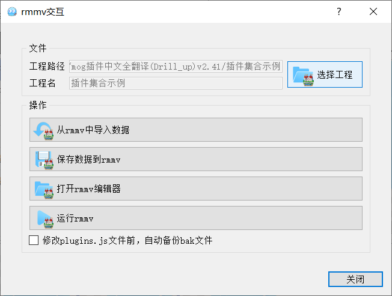

**工程与交互**：该编辑器的全部数据将单独存储成一个工程文件(.drillas)，与rmmv的工程(.rpgproject)数据完全不相关，二者是独立存在的。而该工程的数据，能够从rmmv中进行导入，也可将数据导出到rmmv中，这类过程，叫做rmmv交互。

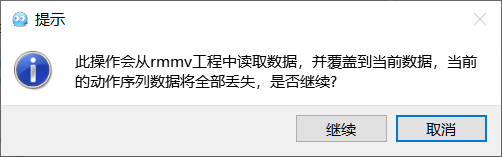

导入 插件示例集合的工程 后，可以看到动画序列数据全部显示了。

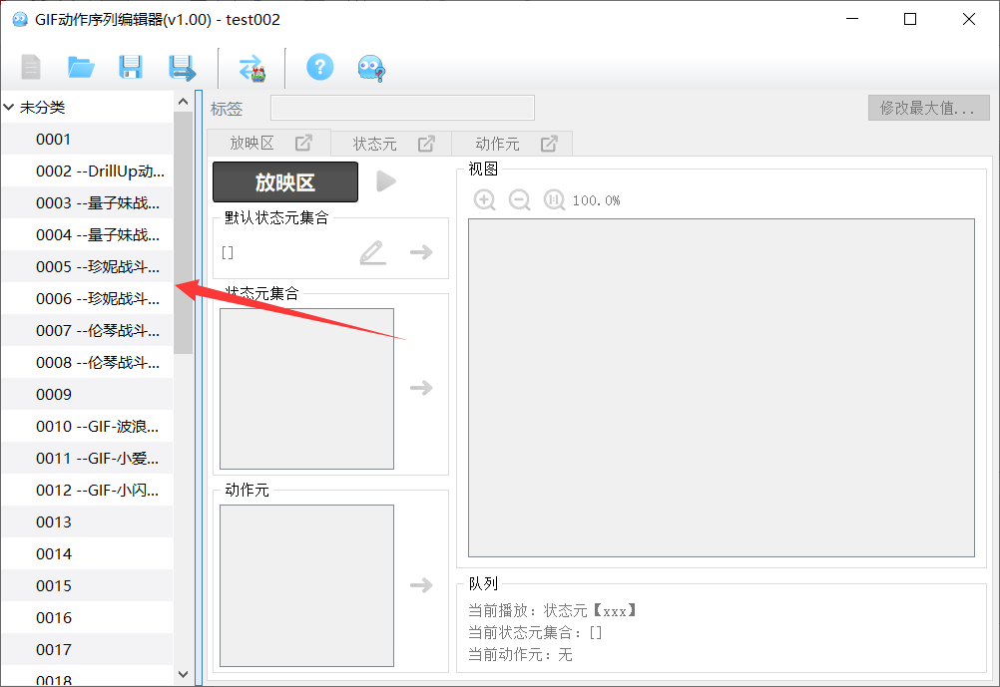

**2）新建动画序列**

选择一个空白区域，准备输入一个新的动画序列。

这里选择的动画序列编号为15。

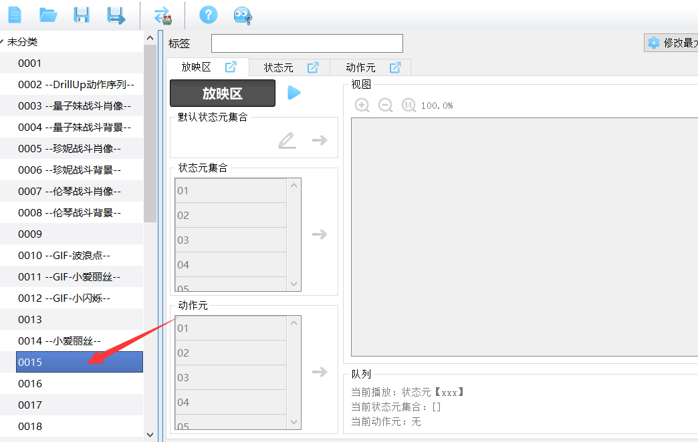

**3）新建状态元**

在图中下列输入框填写内容。

动画序列的标签随便起一个名字，并不作用到游戏中。

状态元的名称要留意一下，子插件会作为标识来调用。由于只当成一个GIF，所以这里起名为”固定的GIF”。

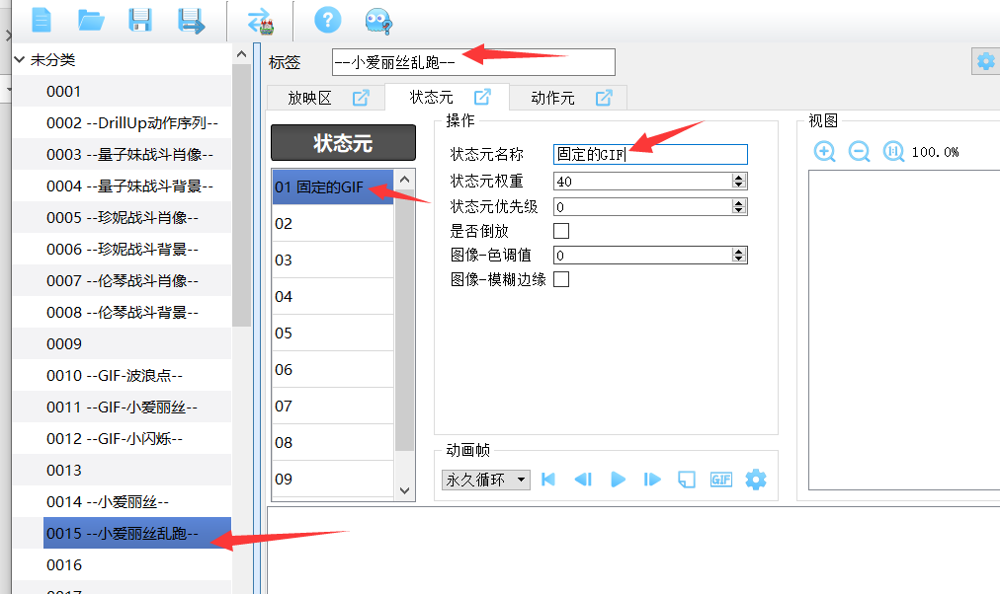

**4）状态元配置GIF**

在下方空白帧区域右键菜单，添加一个GIF。比如编辑器中help文件夹中的”小爱丽丝_示例GIF.gif”文件。（你也可以批量添加图片、序列大图）

添加GIF时，有两种读取器可选择，根据你的情况选择一个。

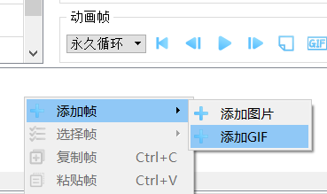
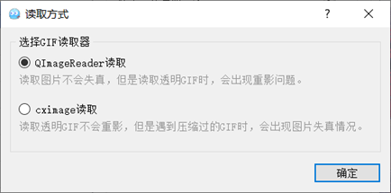

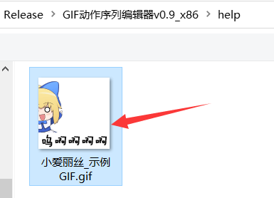

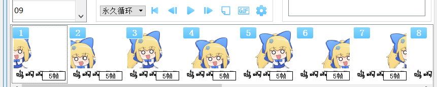

**5）保存工程**

保存工程，选择一个文件夹保存为工作空间即可。

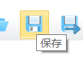

需要说明的是，编辑器会自动识别，并帮你填”默认状态元集合”参数。

游戏中会自动根据这个默认集合对GIF动画序列进行初始化。

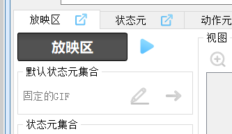

**6）导出配置到rmmv**

点击选项栏的rmmv交互按钮。

点击”导出数据到rmmv”，即可将动画序列配置转移到rmmv中。

这里软件会提示你，必须要先关rmmv工程，才能导出。

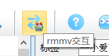
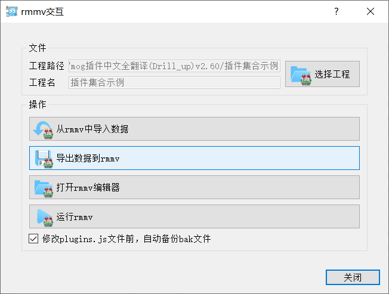

到这里，编辑器的工作就完成了，接下来我们要进入游戏进行测试配好的GIF。

（注意，img/Special__actionSeq 文件夹的图片资源，会自动覆盖，不需要去管）

上述操作全都在小工具中进行，完全不需要 经过 rmmv的插件编辑器 哦。

**7）插件指令绑定**

GIF动画序列核心 单独不能使用，所以这里还需要一个 子插件 ：

◆Drill_PictureActionSequence 图片 - GIF动画序列

加了子插件后，建立一个事件，如下：（注意动画序列编号对应15）

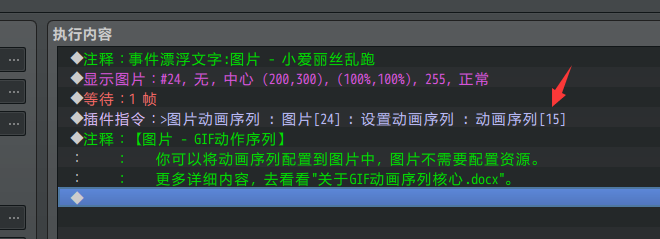

**8）测试**

在游戏中接触这个事件，就可以看到图片显示了。

### 小工具配置 - 单次播放GIF

**1）创建工程**

创建一个初始工程，加入两个动画序列插件。

**2）小工具中新建工程**

注意，这里操作的是 没有动画序列配置 的新工程，所以新建覆盖没问题。

（你可以用小工具 新建/导入/打开 工程，这里按 新建的流程 走）

进入软件后，点击新建。

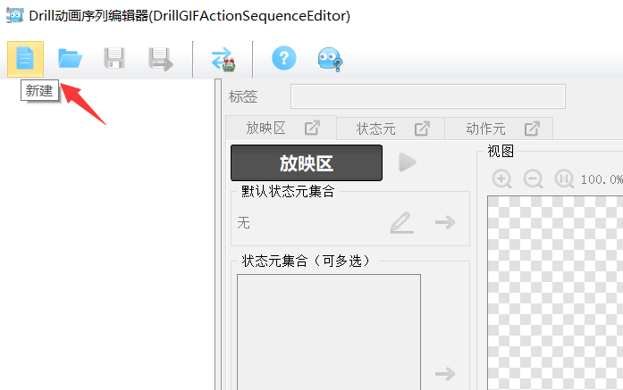

**3）新建动画序列**

新建工程后，随便在空白处选择一个动画序列，并命名。

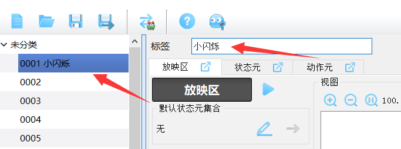

**4）新建空白状态元**

新建一个状态元，写上名称即可，不需要编辑其他内容。

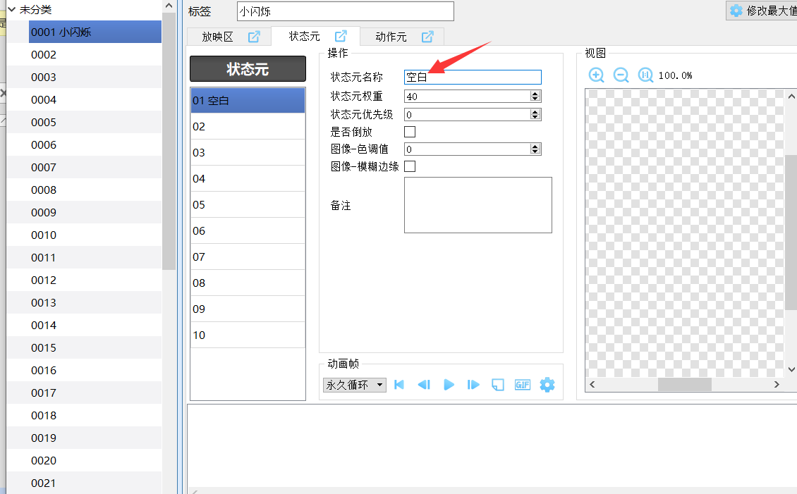

**5）新建动作元**

新建一个动作元，命名：闪烁一次。

在下面空白处右键菜单添加 图片/GIF/序列大图，配置动作元。

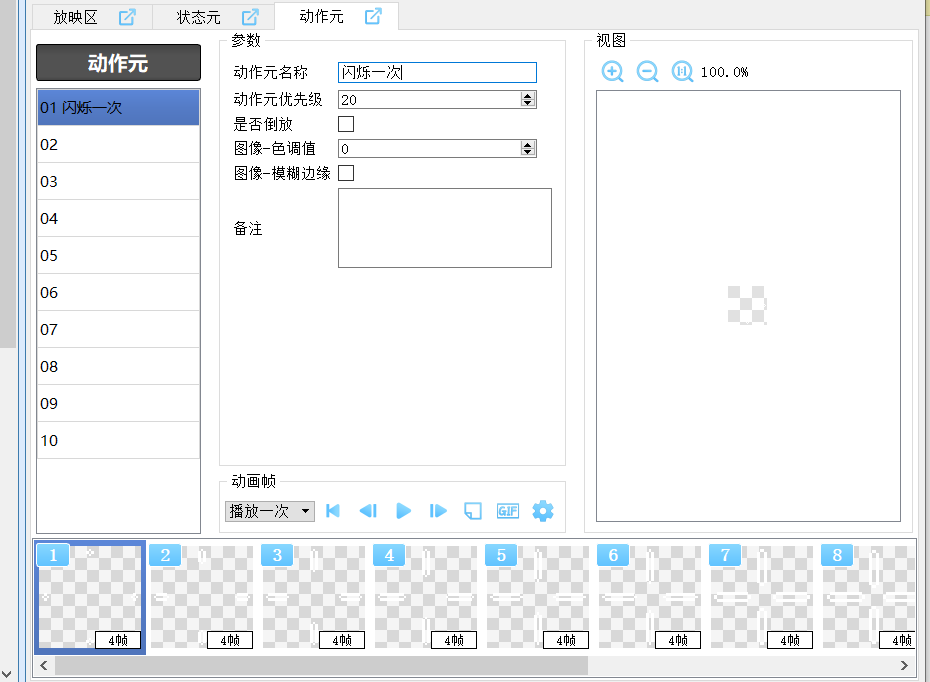

**6）保存工程**

保存工程，选择一个文件夹保存为工作空间即可。

**7）导出配置到rmmv**

点击选项栏的rmmv交互按钮。

点击”导出数据到rmmv”，即可将动画序列配置转移到rmmv中。

这里软件会提示你，必须要先关rmmv工程，才能导出。

到这里，编辑器的工作就完成了，接下来我们要进入游戏进行测试配好的GIF。

（注意，img/Special__actionSeq 文件夹的图片资源，会自动覆盖，不需要去管）

**8）插件指令绑定**

建立一个事件，执行如下指令：（注意动画序列编号对应1，播放动作元时要对应名称）

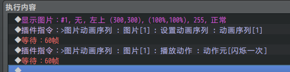

**9）测试**

在游戏中接触这个事件，就可以看到图片显示，并只播放一次动作。

（注意，核心插件v1.3及之前版本，播放结束后会停留在第一帧动作）

（此bug在v1.4中被修复）

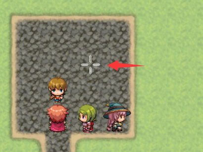

## 常见问题

### 配置的动作元无法播放

| **问题名称** | 配置的动作元无法播放                                                                                                                                                                                                      |
|--------------|---------------------------------------------------------------------------------------------------------------------------------------------------------------------------------------------------------------------------|
| **问题图示** | 无                                                                                                                                                                                                                        |
| **问题描述** | 在动画序列中，配置了 量子妹的状态元 和 量子妹的动作元。 进入游戏后，播放动作元没有效果。                                                                                                                                  |
| **原理解析** | 动画序列核心v1.2及以前版本，设定上存在一些问题， **当 动作元优先级 低于 状态元优先级 时，不会播放该动作元。** 也就是说，如果没有任何配置，默认优先级都为0时，会导致动作元无法播放。                                       |
| **解决方案** | 1）你可以更新核心到v1.3或以上版本，优先级都为0时，可以正常播放动作元。  2）你也可以在配置动作元时，直接设置优先级为1以上。  |
