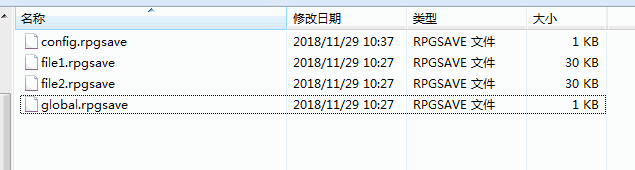

## 概述

### 相关插件

以下是与全局存储有关的插件：

◆Drill_GlobalVariable 系统 – 跨存档的变量

◆Drill_GlobalGameTimer 系统 - 累计游戏计时器

◆Drill_SceneSelfplateA、B 面板 – 全自定义信息面板A、B

◆Drill_SceneSelfplateC、D 面板 – 全自定义信息面板C、D

◆Drill_SceneSelfplateG、H 面板 – 全自定义信息面板G、H

◆Drill_SceneSelfplateI、J 面板 – 全自定义信息面板I、J

◆Drill_SceneSelfplateK、L 面板 – 全自定义信息面板K、L

◆Drill_SceneSelfplateM、N 面板 – 全自定义信息面板M、N

◆Drill_SceneGalleryA、B 面板 – 全自定义画廊A、B

◆Drill_SceneGalleryC、D 面板 – 全自定义画廊C、D

◆MOG_Music_Book 面板 – 音乐书

◆Drill_TitleBackground 标题 – 多层标题背景

◆Drill_TitleCircle 标题 – 多层标题魔法圈

◆Drill_TitleParticles 标题 – 多层标题粒子

◆Drill_TitleGif 标题 – 多层标题gif

◆Drill_TitleTiledGif 标题 – 多层标题平铺GIF

◆Drill_TitleVideo 标题 – 多层标题视频

◆Drill_TitleScene 标题 – 全自定义标题界面

全局存储相关的优化插件：

◆Drill_X_GlobalOptimization 系统 - 全局存储性能优化[扩展]

### 插件关系

全局存储的插件相互之间 没有 依赖关系，如下图所示：

## 结构

### 定义

**正常存储**：将所有游戏存档保存在固定编号的存档中。新开游戏，所有数据清空。

**全局存储**：通过插件指令后台存储，将数据存储在全局文件中。新开游戏不会改变已存储的数据。

| 注意，由于全局存储在一开游戏后，就会立即对全局数据文件进行了读取，从而覆盖初始化数据。所以你在测试游戏调整参数时，可能会遇到参数修改无效的情况。 遇到这种情况，要多留意你测试的插件是否开了全局存储，另外要记得删掉save文件夹下的文件。 |
|-----------------------------------------------------------------------------------------------------------------------------------------------------------------------------------------------------------------------------------------|

### 存储文件

**1）一般全局数据文件**

**全局数据文件位置：**rmmv没有那么深沉隐秘的存储，所有存储的文件都在save文件夹中。（如果是用服务器搭建的云端游戏，则在服务器的save文件夹中。）

你只要把save文件夹中的所有文件清空，那么游戏的所有全局存储和存档都会被清空。

（大部分metagame游戏也是通过这种全局方式存储，不过有的游戏为了完美隐藏，会将全局存储的文件藏在玩家c盘中一些非常隐秘的位置，就像病毒一样，删游戏也无法改变游戏进度。）

**2）插件自控制的文件**

部分插件可能会有自己控制的全局文件，比如：

Drill_GlobalGameTimer 系统 - 累计游戏计时器

计时器插件会专门单独存一个 drill_timer.rpgsave 文件，用来记录玩家累计游戏时间。

## 关于Meta元素

**meta-game（元游戏）**：指利用 超出游戏以外的因素 对游戏本身产生影响的游戏。

Meta元素是一种游戏设计思路，通过Meta可以增强玩家的游戏带入感。

| 游戏在被制作出来时，战斗、剧情、结局等就已经被注定了，这是游戏以内的因素。 而玩家在游戏过程中的反应、情绪，以及在游戏中某些特殊行为，都是游戏以外的因素。 |
|-----------------------------------------------------------------------------------------------------------------------------------------------------------|

我们可以通过全局存储来设计 游戏以外的影响因素 。

比如，我们可以知道
玩家的游戏时间、玩家在其它存档中的失败经历、玩家在游戏中去过哪些特地地点
等信息（玩家删正常的存档也无法清除这些信息）。

从这个角度上对玩家的行为反映进行逐一设计，能让玩家产生游戏之外的高度上思考：“到底是我在玩游戏，还是游戏在玩我？”

## 其他说明

全局变量在 **测试战斗**
时，可能会自己存储global文件，为避免影响，战斗测试前注意清理一下save里面的全部文件。
