## 概述

### 插件介绍

核心插件：

◆Drill_CoreOfNumberArray 系统 - 变量数组核心

类似插件：

◆Drill_CoreOfString 系统 - 字符串核心

这类插件用于扩展可以用的数据类型，用法和 变量、开关相似；

可以通过 脚本调用，也可以通过 插件指令调用。

（但到后期，还是建议大家学习一下脚本，底层知识了解越多，设计思路就越明朗）

## 变量数组

### 定义

**变量数组：**指多个变量按顺序划分为一个组的数据结构。

每个数字都有一个索引值对应，通过索引可以找到那个数字。

注意，变量数组 是一维数组，且只能装 整数数字 ，索引从1开始计数。

比如，rmmv的 变量 就是一个大数组。

如下图，数组的最大值为80，也就是说这是一个长度为80的数组。

索引值21，能够获取到 “缓冲变量A” 的值。

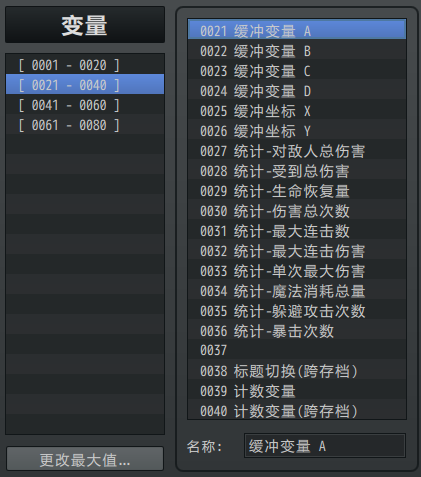

由于rmmv变量的数组经常不够用，所以这里使用变量数组，可以节省许多事件开关的写法。

另外，实际编程语言中，数组的定义极为宽泛，包含：二维数组、多维数组、元数组……这里都不考虑，只考虑简单的数组。

**索引取值：**在指定的数组中，设置索引值，可以通过插件指令获取到相应的变量值。

获取到值后，将把值赋给变量：（如下图，把数组的第1个值，给变量21）

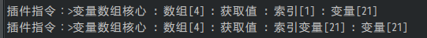

**变量数组长度：**每个数组都具有自己的长度值，具体根据配置、插件指令而定。

比如，核心中配置了五个数字，则长度值为5。

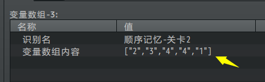

使用插件指令赋值，并显示，可以看到下图效果：

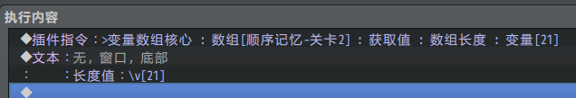

需要注意的是，如果使用索引获取时，索引值超出了数组长度，则获取到默认的0值。

### 基本操作

**1）遍历数组：**

一个标准的遍历写法如下：

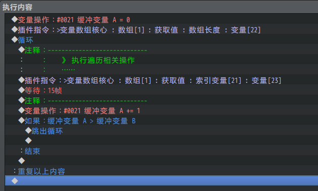

用到了3个变量：

缓冲变量A（id 21）： 用于表示当前的索引。

缓冲变量B（id 22）： 用于表示当前数组的长度。

缓冲变量C（id 23）： 用于表示当前取到的数字，取到即用。

数组长度也可以实时获取，这样可以节约一个变量B：

另外，需要注意的是，如果你把事件写在了**并行事件中，且有 等待
时间**，那么你一定要确保同一时间里，变量ABC不会被其他事件调用，否则会出现赋值错位的情况。

如果你知道数组长度，比如长度为5，且不会变化，那么直接索引赋值就可以，只不过有些费变量：

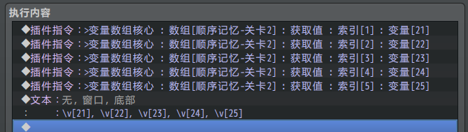

**2）复制/切分数组：**

你可以在核心中，准备一个临时数组，与“缓冲变量”的用法一样，只临时使用。

通过复制数组，复制后操作这个临时数组，来进行遍历或其他操作。

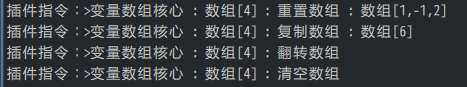

**3）统计值：**

变量数组核心还额外提供了一些查找最大最小值、平均数的方法。

（注意，由于平均数不能存小数，所以计算结果会被四舍五入。）

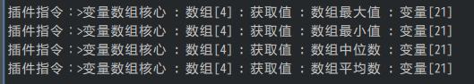

用法如下：

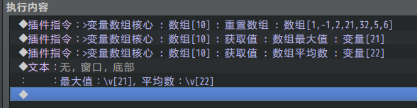

**4）脚本调用：**

如果你需要使用一些脚本来调用到数组，可以用下面的指令：

## 其它相关

### 解谜设计

解谜设计中，顺序记忆关卡用到了变量数组。

通过变量数组，将关卡的显示顺序存储了起来。

具体可以去看看“解谜设计-顺序记忆.docx”。

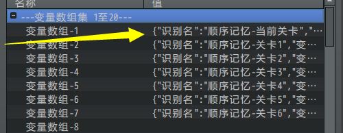

### 物体触发插件

物体触发中，经常会批量获取事件id，这些事件id可以转存到 变量数组中。

下图为通过对话框的方式，显示捕获的事件id。

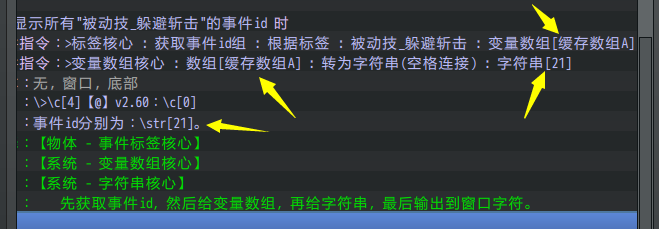

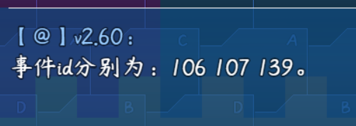
