## 概述

### 插件介绍

按钮组的有许多作用范围，菜单界面、战斗界面、地图界面都可以作用到：

◆Drill_CoreOfSelectableButton 系统 - 按钮组核心

以下是按钮组的子插件：

◆Drill_SceneMain 面板 - 全自定义主菜单面板

◆Drill_SceneSelfplateI 面板 - 全自定义信息面板I

**核心只对按钮组的各个部件进行详细说明，如果你想找”从零开始设计”教程，去看看子插件相关的文档说明**。

### 名词索引

以下你可以按住ctrl键点击下面的词，可以直接定位到想了解的名词：

| 主体       | [按钮贴图](#指定按钮贴图) [按钮名称](#按钮名称) [相对坐标起点](#相对坐标起点) [统一坐标起点](#统一坐标起点)  |
|------------|--------------------------------------------------------------------------------------------------------------|
| 排列       | [直线排列](#直线排列) [环形排列](#环形排列) [矩阵排列](#矩阵排列) [固定离散排列](#固定离散排列)              |
| 名称块     | [名称块](#名称块)                                                                                            |
| 选中的按钮 | [线性变化](#线性变化) [周期变化](#周期变化) [出列](#出列)                                                    |
| 激活       | [激活流程](#激活流程) [激活出列](#激活出列)                                                                  |

### 插件关系

按钮组核心的插件关系如下图。

### 思维导图

按钮组结构的思维导图如下：（调整一下word右下角的缩放率，可以看清小字）

## 主体

### 按钮组中心

如果你对按钮组的位置规划存在疑问，你可以开启DEBUG，显示规划线：

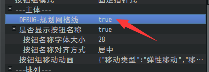

按钮组核心中所有坐标设置都以按钮组(0,0)中心位置为基准。

子插件可以设置按钮组的整体位置，对整体进行位移。

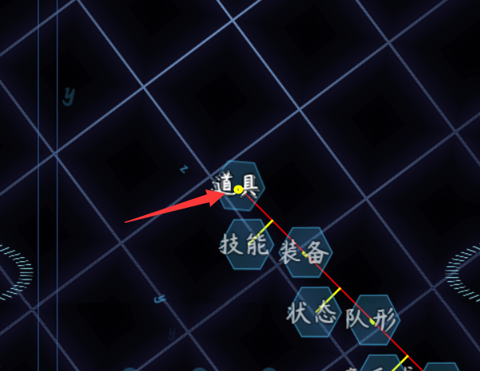

(不同的排列方式下围绕中心点排列的方式不一样，具体可以看看 [排列方式](#排列方式)
。)

### 起点

起点是指 按钮最初出现的位置，进入菜单后，按钮会从起点回到原位置。

分为相对坐标的起点与统一坐标的起点。

（相对起点 与 统一起点
是很久以前提的概念，在旧版本的文档中有提及。由于mog插件写死了结构，一直实现不了，现在终于推翻了。）

**1）相对坐标起点**

所有按钮从相对的起点出发，回到自己的位置。

**2）统一坐标起点**

所有按钮从同一个起点出发，回到自己的位置。

**3）不移动直接显现**

设置起点的坐标类型为 相对坐标 ，起点为(0,0)即可。

## 资源图片

### 默认按钮贴图

**注意，核心本体并不配置贴图资源，贴图资源都在子插件中配置。**

这里以子插件 全自定义信息面板I插件 为例子。

信息面板I有按钮组 中心位置
配置（对应[按钮组中心](#按钮组中心)）、按钮组样式（对应核心配置的样式id）、以及按钮贴图。

按钮贴图配置后，所有按钮将会用同一个背景图片。

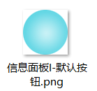
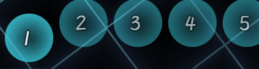

### 指定按钮贴图

**注意，核心本体并不配置贴图资源，贴图资源都在子插件中配置。**

按钮组核心必须依赖一个有 选项的窗口，通过选项窗口获取到对应的选项。

每个选项都对应一个按钮贴图。

对应模式是由 子插件 固定的，不能改。

**1）顺序对应**

部分子插件使用的是顺序对应，即根据序号一一对应。

以 信息面板I为例子，效果为：第n个内容选项，对应第n个按钮。

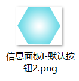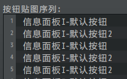

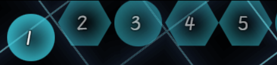

**2）按钮关键字对应**

部分子插件采用按钮关键字进行绑定，与顺序无关。

其中 全自定义主菜单插件 就是基于按钮关键字
对应的，（因为按钮随时会增减，并且都可能来自不同插件）具体可以去看看”菜单关键字.docx”。

下图为：道具按钮 通过Button_item关键字，对应到主菜单的面板中。

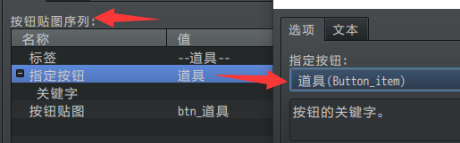
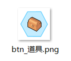

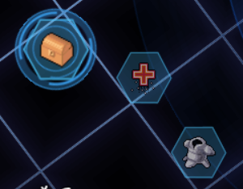

### 按钮名称

按钮名称即写在按钮上面的名称。

**注意，按钮名称与名称块是两个不同的东西**。

下图中，红色框内的单独漂浮名称是名称块，黄色框内与按钮一起的是按钮名称。

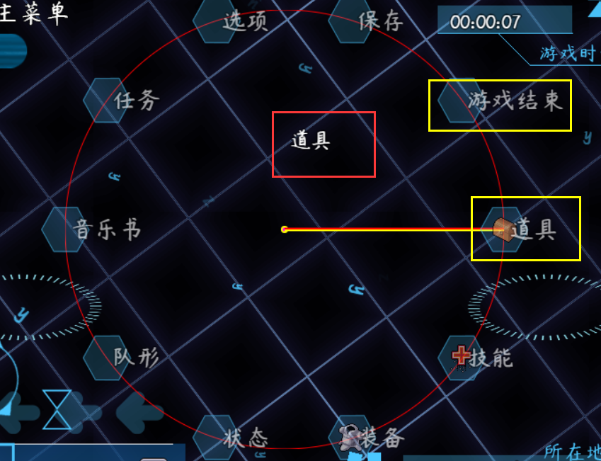

你可以把名称写在按钮资源图片中，也可以使用空的按钮背景，然后显示按钮名称，按钮名称支持各类特殊字符。

## 排列

### 排列方式

按钮组可以完全自定义排列方式，也可以使用下面规律公式的排列。

**1）直线排列**

直线排列有三个参数：直线间距、直线W间距、直线旋转角度。

其中W间距是针对偶数按钮的垂直相对间距。

\> 间距30，W间距0，角度0的情况如下：

\> 间距30，W间距20，角度0的情况如下：

\> 间距30，W间距20，角度45的情况如下：

当然，如果按钮数量很多，很可能会挤出到游戏之外，你可以限制按钮的最大长度，使得超过最大长度后，强制挤在一起，而不再延伸。

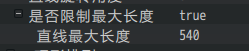

**2）环形排列**

环形排列有三个参数：环形半径、环形起始角、环形终止角。

当环形起始角与终止角 相等 或 相差360度
时，相当于形成了一个闭环，则所有按钮均匀平分圆。按钮数量越多，平分越细。比如下面例子：

（黄色为起始角，红色为终止角，0度向右，90度向下，180向左，270向上）

\>半径145，起始角270，终止角270的情况如下：

\>半径145，起始角270，终止角90的情况如下：

**3）矩阵排列**

矩阵排列有三个参数：矩阵列数、矩阵列宽、矩阵行高。

由于按钮组的前身就是窗口的矩阵排列，这里相当于保持窗口的原排布方式，进行类似的按钮变换。

\>列数5，列宽48，行高48的情况如下：

\>列数3，列宽48，行高48的情况如下：

**4）固定离散排列**

除了上述公式化的排列方式，你还可以自定义设置所有坐标点。只不过，需要从1到n按顺序填写每个坐标点，如果按钮序号\>n，则按钮默认处于0,0位置（按钮组的中心点）。

### 排列与流线

开发中，待续。

## 名称块

### 定义

**名称块**：名称块是指 当前选中
的选项名称贴图。与按钮贴图不同，是独立显示的结构。

图中黄色方框内的为名称块。你可以放在其他位置，不一定必须在中心。

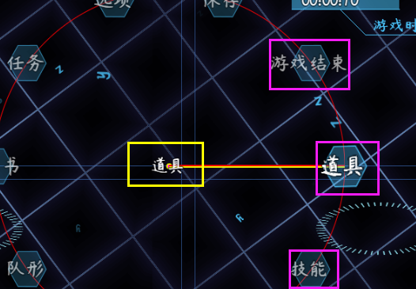

## 选中的按钮

### 选中与未选中

**按钮变化效果：**按钮组中，所有按钮的变化效果都是独立的，插件会对当前选中的按钮进行透明度变化、摇晃效果、缩放效果、浮动效果、出列等变化。

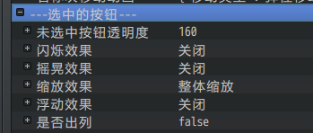

当选中的按钮失去选中焦点后，变化效果并不会立即消失，会有一小段恢复过程。

根据恢复过程的不同，分为两种变化：线性变化与周期变化。

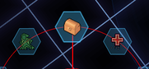
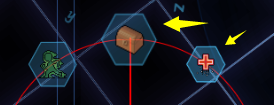
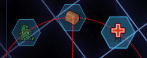

### 线性变化

**线性变化：**是指A状态变化到B状态后将停止，失去焦点后才回到A状态的变化。

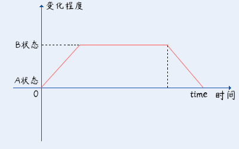

**1）出列**

这里的 出列 和 激活状态的出列
不同，按钮选中时，会在相对自己的位置，偏移多出一定的位置。

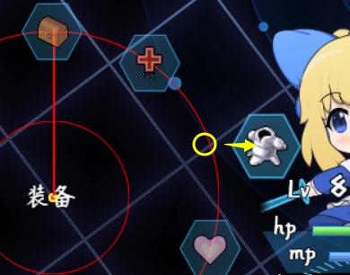

这个效果在环形排列中并不常用，在矩阵排列（抽卡弹出）或直线排列（凸出的选项）中比较常见。具体需要根据你的情况来设计。

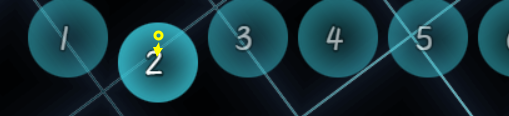

**2）透明度变化**

透明度变化原理为： A状态为”未选中按钮透明度”，B状态为透明度255值。

通过对选中的按钮线性变化透明度，来实现按钮高亮。

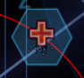
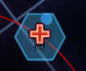

如果未选中按钮的透明度被设置为255，则高亮效果将会失效。

### 周期变化

**周期变化：**是指ABACA这样循环变化的状态，失去焦点后，变化会自动找到一个A状态的落脚点，恢复到A状态。

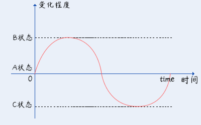

闪烁效果周期变化的参数是透明度，若开启了闪烁效果，线性透明度变化会被覆盖。

摇晃效果周期变化的参数是旋转角度。

缩放效果周期变化的参数是缩放x和缩放y。

浮动效果周期变化的参数是xy偏移值。

这些参数都可以与其他效果完全叠加，但是注意，效果如果全部叠加，反而会非常难看，所以你需要根据实际情况进行选择。

## 指针

### 菜单指针

指针功能需要下面的插件支持，才能具备功能。

◆Drill_MenuCursor 主菜单 - 多样式菜单指针

从本质上说，指针就是一个贴图。

可以是圆环，可以是指向标，可以是大外框，还可以配置成gif。

考虑到指针的多变性，菜单指针中你可以自定义多个不同的指针样式。

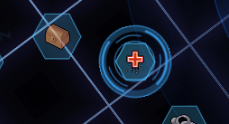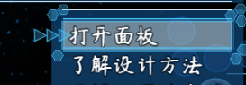

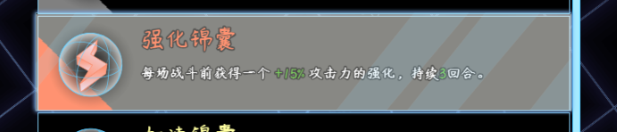

具体可以去看看”关于指针与边框.docx”。

由于按钮组没有矩形区域框，所以不能支持 菜单选项边框 和 菜单滚动条 。

## 激活

### 激活流程

按钮组的本质，是一个有选项的窗口，窗口的先后顺序，将会影响界面的流程，但是总体是一样的。

**激活流程分为：激活前状态、激活状态、激活后状态 三种。**

处于 激活状态 时，按钮才可以进行选择。

处于 激活后状态 时，选中的按钮可以单独显示并出列。

### 激活出列

由于激活的条件比较特殊，按钮核心只有特定的子插件才会有相关配置。

以主菜单为例，在 菜单选项按钮组 处于 激活后状态
时，选中的按钮会跑到指定偏移的位置。

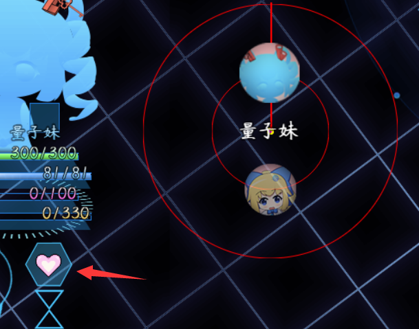

值得一提的是，按钮变化效果、 激活出列、移动动画
三者是相互独立的变化系统，三者是叠加在一起的。

激活出列时，移动动画的变化会收起，使得最终按钮的移动轨道并不是直线。

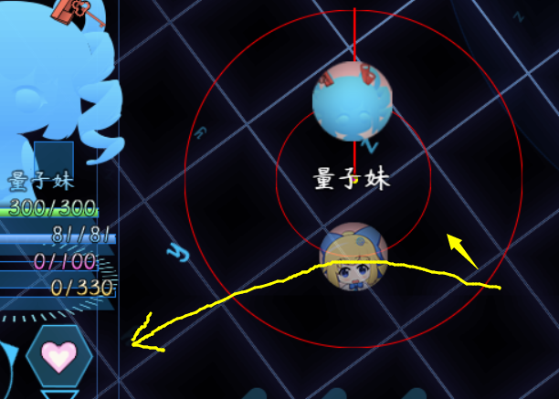

## 输入设备

### 鼠标

**1）触发范围**

按钮的触发范围，是以配置的资源贴图的范围而定的。

比如，如果你开启了”按钮接近后自动选中”功能，你会发现按钮接近激活的范围是矩形的区域。这个矩形区域就是资源图片的高宽。

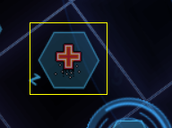
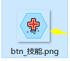

**2）触发顺序**

如果多个按钮相互挤在一起，点击相交的位置，则会触发配置id最小的按钮。

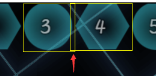

按钮被点击后，如果指定的按钮没有被选中，那么将会选中该按钮。

按钮在选中状态被点击，才会进入执行按钮的功能。

**3）滚轮控制**

鼠标滚轮控制开启后，滚动鼠标滚轮即可切换选中的按钮。

切换间隔用于控制滚轮切换的速度，防止滚动的太快。

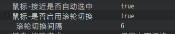

### 键盘与排列

注意按钮组的排列方式，你需要根据排列实际情况，配置合适的键盘模式。

比如90度朝下的直线排列，使用的是 上下切换 键盘模式。

而270度朝上的直线排列，使用的是 反向上下切换 键盘模式。

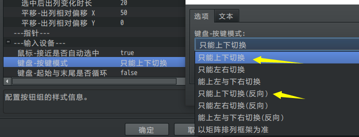
