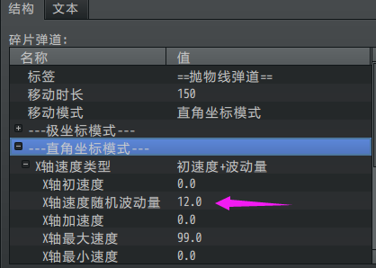
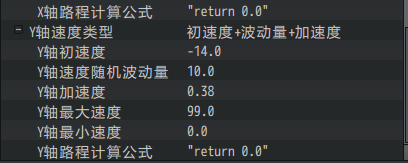
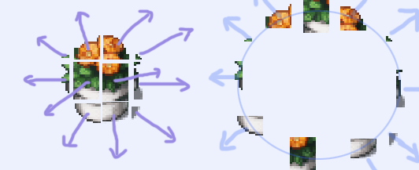
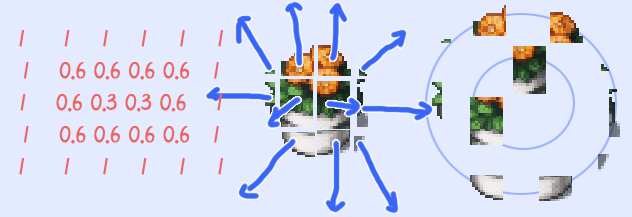
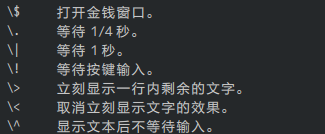
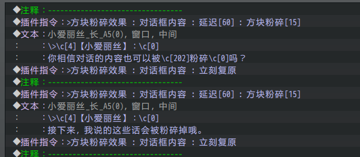
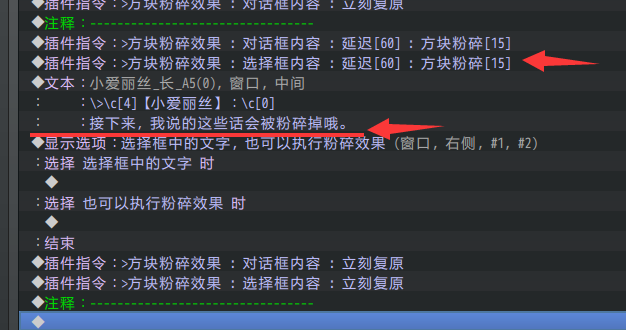

## 概述

### 插件介绍

方块粉碎的作用范围比较广，它由基于弹道的方块粉碎核心，派生出许多子插件：

◆Drill_CoreOfBallistics 系统 - 弹道核心

◆Drill_CoreOfShatterEffect 系统 - 方块粉碎核心

以下是方块粉碎的子插件：

◆Drill_BattleShatterEffect 战斗 - 方块粉碎效果

◆Drill_LayerShatterEffect 地图 - 方块粉碎效果

◆Drill_EventShatterEffect 行走图 - 方块粉碎效果

◆Drill_PictureShatterEffect 图片 - 方块粉碎效果

◆Drill_DialogShatterEffect 对话框 - 方块粉碎效果

### 插件关系

插件的从属关系如下图：

需要注意的是，虽然都属于方块粉碎家族，**但是插件里面的插件指令/注释，可能指令和参数的格式有很大区别**，注意区分。

## 定义

### 方块粉碎

方块粉碎，是在资源图片的基础上，对资源图片进行额外切割分片处理的模块。

切割的范围为资源图片的大小，下图中为3行4列的切割情况，一共分成了12等分。由于图中第9等分为全透明的图片，所以看不出来。

方块粉碎一般为动态效果，不会持续非常长的时间。不过，部分子插件可以支持碎片长时间滞留在界面中。

### 弹道

弹道是描述一群粒子/碎片/子弹运动的轨迹。

具体弹道的内容，去看看”关于弹道.docx”。

方块粉碎后，由于被切成了许多片，每块碎片都可以有不同的弹道轨迹，从而形成碎片四处散落的效果。

由于弹道具有回溯反转的功能，你可以使用插件指令倒放粉碎效果。

## 自定义粉碎

### 一般粉碎

基于弹道的相关知识，你完全可以自定义粉碎效果，具体属性去看看”关于弹道.docx”。

其中，切割的行数和列数需要你根据实际情况来考虑，小图切割的比较散，大图切割的比较密。你也可以行数10，列数1，那么切割出来的为10个横条。

设计自定义粉碎时，你需要确保**随机波动量足够大**，使得方块粉碎能够比较均匀地散开，不然所有碎片挤在一起，看不出粉碎的效果。

### 比例粉碎

一般粉碎中，除了波动量设置，每块碎片的速度都几乎一样。

比如线性粉碎中，你能够清晰地看到一个圆向外扩散的样子。因为所有碎片的速度都几乎一样。

而比例粉碎，**最外面碎片的速度最快，里面的速度较慢**。通过设置
"碎片速度是否分比例" 可以使得碎片里外的速度不一样。

（波动量也可以让速度不一样，但是每块碎片的速度都会随机快慢。而比例速度，是里面的碎片一定慢，外面的碎片一定快。）

### 指令时差（对话框粉碎）

指令时差是对话框粉碎中一个特殊的情况。

◆Drill_DialogShatterEffect 对话框 - 方块粉碎效果

**1) 阻塞时差**

进入对话框时，对话框会阻塞事件指令，指令不会并行生效。

**如果粉碎提前执行了，或者在对话框关闭后才执行，那么效果会非常差**。

**过早执行**（文字还没输出来，就已经碎消失了）

**过晚执行**（对话已经结束且关闭了，才执行粉碎）

当然，如果执行的是 反转粉碎 ，设置延迟[0]是可以的。

**2) 字符控制时差**

对话时间是**不稳定**的，玩家如果不停地按确定键，或者消息核心的加速键，那么很有可能时间太短，粉碎根本就执行不到。你可以使用rmmv默认的等待字符，控制时差。

**3) 选项与对话的时差**

如果在第一个对话中，很短时间内就按了下一个对话，那么粉碎将会在第二个对话中执行。**如果不按第一个对话，等第一个对话粉碎，第二个对话，就是已经粉碎且消失的状态，你将看不见任何内容**。

所以，一般一个对话都会按照下面的方法，进行控制。确保每个对话，都能够看见，且隔一段时间粉碎掉。

当然，也有特殊情况，就是**对话框和选择框必须贴在一起**的情况，如果对话框和选择框中间有任何其他指令，则这两个框都不会同时出现。为了避免分开问题，你可以按照下面的方式写指令。

## 其他说明

### 性能影响

方块粉碎是**性能消耗大户**，因为他能够将1个贴图变成大量的新贴图碎片，并且每个贴图都有自己的弹道与运动。碎片的数量
= 切割矩阵列数 x 切割矩阵行数。

性能测试中并不能准确找到该插件的消耗量，只能通过update总消耗量相减来进行估算。所以误差会比较大。

具体性能数据你可以去看看”性能测试统计表(方块粉碎).xlsx”。
