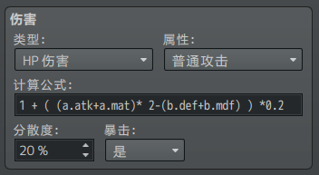
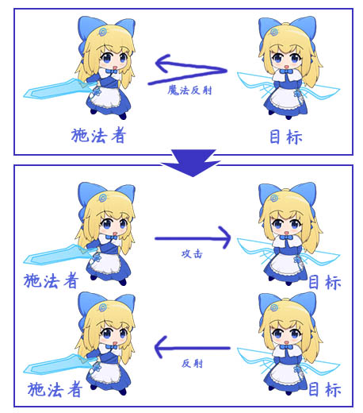
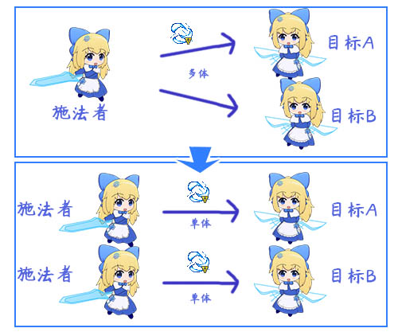
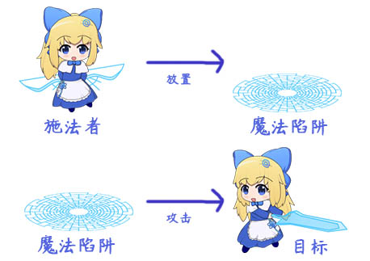
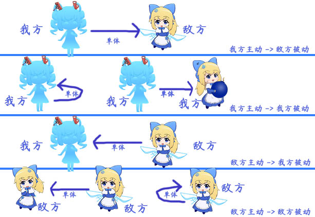

## 概述

### 插件介绍

以下是插件与本文档的概念相关：

◆Drill_ActorPortraitureExtend 战斗UI - 高级角色肖像

◆Drill_SkillRecorder 技能 - 技能记录器

◆Drill_AnimationInSkill 动画 - 并行动画绑定于技能

### 名词索引

以下你可以按住ctrl键点击下面的词，可以直接定位到想了解的名词：

  -----------------------------------------------------------------------
  行动              [行动](#行动-1) [主动方](#主动方) [被动方](#被动方)
                    [行动属性](#行动属性)
  ----------------- -----------------------------------------------------
  多次行动          [反制行动](#反制行动-1) [多次连续攻击](#多次连续攻击)
                    [多个目标攻击](#多个目标攻击)

  范围技能          [范围技能](#范围技能)

  阵营              [阵营](#阵营-1) [我方与敌方](#我方与敌方)
  -----------------------------------------------------------------------

## 攻击者与被攻击者

### 行动

#### 单次行动

[]{#行动-1
.anchor}**行动**：是指两个单位之间进行的一次攻击、释放技能、使用物品等，统称为"行动"。脚本中为Game_Action。

**行动单位：**是指行动过程中相关的单位，每次行动只有两个单位。

[]{#主动方 .anchor}**主动方**：行动单位中，主动的一方。脚本中为subject。

[]{#被动方 .anchor}**被动方**：行动单位中，被动的一方。脚本中为target。

主动方和被动方可以是同一个人，即自己对自己执行行动。

举个例子：A攻击B；

那么，这次的 行动 是"攻击"，主动方是A（攻击者），被动方是B（被攻击者）。

![F:\\rpg
mv箱\\S\$088I8CL\]FT\`F6)T5\[ssI2EB.png](./MediaFolder/media/image3.png){width="4.816666666666666in"
height="2.1380511811023624in"}

所有技能，包括
攻击/防御/闪避/反击/反射/使用物品/逃跑/掩护，都有两个行动单位，主动 与
被动。

（注意，战斗回合界面的 队伍逃跑选项，不是逃跑的技能，所以不属于 行动。）

行动之间有很多称呼，表示的意思在本质上都是一样的：

  -----------------------------------------------------------------------
  行动              主动方                    被动方
  ----------------- ------------------------- ---------------------------
  攻击              攻击者                    被攻击者

  技能              施法者                    目标

  物品              使用者                    作用目标
  -----------------------------------------------------------------------

[]{#行动属性
.anchor}**行动属性**：是指执行的行动中，行动本身具有的属性。属性如下：

在rmmv编辑器中，叫做"伤害"，但这个词并不完全准确。

\> 成功情况：命中/落空

\> 类型：HP伤害/ MP伤害/ HP恢复/ MP恢复/ HP吸收/ MP吸收

\> 属性：普通攻击/.../...（数据库中自定义的属性）

\> 计算公式

\> 分散度

\> 暴击

{width="3.6666666666666665in"
height="2.0083333333333333in"}

需要注意的是 成功情况+类型+属性 可以组合成 2x6xN 种特殊的反应条件。

插件-高级角色肖像 和 插件-并行动画绑定于技能
对此条件组合进行了比较详细的区分。

单次行动中，敌我阵营不属于行动的属性，具体去看后面章节介绍：[阵营](#阵营-1)
。

#### 反制行动

[]{#反制行动-1
.anchor}**反制行动**：反制行动是指，行动产生后，立即出现的另一次反馈的行动，比如魔法反射，物理反击等。反制行动不会嵌套累加，只会执行一次。

{width="4.0in"
height="4.545147637795275in"}

正常的魔法反射，可以拆分成两个部分，一个是正常攻击行动，另一个是被动方产生的反制攻击的反制行动。

被动方的反制行动，不会被主动方再次反制执行反制行动。

（这是程序硬性规定的，不然两个100%反击的小爱丽丝，会无限反击下去了。）

#### 多次行动

**1）**[]{#多次连续攻击 .anchor}**多次连续攻击**

连续攻击，原理为同一个技能**执行多次**。由于多次行动中，每次行动都不相关。所以造成的伤害、闪避情况、状态施加的结果都相互独立。

{width="4.291666666666667in"
height="1.9062620297462818in"}

**2）**[]{#多个目标攻击 .anchor}**多个目标攻击（伪AOE）**

多个目标攻击，实际上并不是真的AOE全体攻击，原理为同一个技能根据目标ID从左至右，分别
拆成 单体一次攻击。

在对多个目标进行攻击时，被动方都有机会执行 反制行动。

{width="5.768055555555556in"
height="4.868055555555555in"}

### 范围技能（AOE）

注意，正常的rpg双方战斗，是没有AOE技能的。

所以这里只简单概念介绍，不作详细说明。

[]{#范围技能
.anchor}**范围技能**：简称AOE，是指在一定范围内有效，可作用于多个目标的技能。

范围技能最大的特点是：中间多了一个中介，被动方无法执行 反制行动。

举个例子：A放置了魔法陷阱，B进入魔法陷阱，

那么，这次交互的行动是"攻击"，主动方是魔法陷阱，被动方是B。

{width="4.241666666666666in"
height="2.991023622047244in"}

### 阵营

[]{#阵营-1
.anchor}**阵营：**是指交互过程中，主动方和被动方所内置的属性。

简单的阵营只有敌我，复杂的阵营可以分为 我方、友军、中立、野生敌对、敌军
等多个阵营。

#### Rpg战斗阵营

**目前战斗界面明确分为两方阵营，即**[]{#我方与敌方
.anchor}**我方与敌方**。

根据 主动 -\> 被动 关系，可以分成4种情况：

我方主动 -\> 敌方被动

我方主动 -\> 我方被动

敌方主动 -\> 我方被动

敌方主动 -\> 敌方被动

如下图：

{width="5.768055555555556in"
height="3.967361111111111in"}

我方自己对自己，也算作一次 我方主动-\>我方被动。

同理，敌方自己对自己，也算作一次 敌方主动-\>敌方被动。

另外需要注意的是，只有玩家(我方)才能够**使用物品**，敌方不能使用物品，只能释放技能。

#### 炸弹人阵营

炸弹人游戏中，虽然AI是分阵营的，但是实际上造成行动伤害的炸弹是不分敌我的，炸弹的效果类似于AOE技能。

具体阵营的划分，去看看"关于炸弹人游戏.docx"。
