## 概述

### 插件介绍

插件基于核心：

◆Drill_CoreOfGaugeMeter 系统 - 参数条核心

◆Drill_CoreOfGaugeNumber 系统 - 参数数字核心

插件本体：

◆Drill_EnemySimpleHud 战斗UI - 简单生命框

该插件的配置项非常多，需要花较长的时间耐心学习。

**这个插件的可以实现 敌人的生命、魔法、怒气属性
的可视化，只提供信息显示，并不影响敌人的真实属性值。**

### 相似文档

以下为设计方法相似的插件文档，可以结合理解：

+-----------------------------+----------------------------------------+
| 插件名称                    | 文档名称                               |
+=============================+========================================+
| Drill_EnemySimpleHud        | 5.战斗UI \> 关于战斗简单生命框.docx    |
|                             |                                        |
| 战斗UI - 简单生命框         |                                        |
+-----------------------------+----------------------------------------+
| Drill_GaugeForBoss          | 13.UI \> 关于高级BOSS生命固定框.docx   |
|                             |                                        |
| UI -- 高级变量固定框        |                                        |
+-----------------------------+----------------------------------------+
| Drill_GaugeForVariable      | 13.UI \> 关于高级变量固定框.docx       |
|                             |                                        |
| UI -- 高级变量固定框        |                                        |
+-----------------------------+----------------------------------------+
| Drill_GaugeOfBufferTimeBar  | 13.UI \> 关于缓冲时间条与数字.docx     |
|                             |                                        |
| UI - 缓冲时间条             |                                        |
|                             |                                        |
| Drill_GaugeOfBufferTimeNum  |                                        |
|                             |                                        |
| UI - 缓冲时间数字           |                                        |
+-----------------------------+----------------------------------------+

### 插件关系

战斗简单生命固定框的关系如下图。

## 简单生命框样式

### 结构

简单生命框的结构如下图所示。

**简单来说，主要较复杂的配置为 外框+3个参数数字+3个参数条。**

**参数条和参数数字要去相应的核心先设计好，再贴到框样式中**。

这里的参数设置与高级BOSS生命框配置相似。

注意，你需要留意当前插件中 没有提供的功能 ，比如：

没有生命、魔法、怒气段数；

段上限/额定值为固定最大生命/魔法/怒气值，只能单段，不能多段显示；

没有加满动画功能；

没有单位名称显示；

没有单位状态显示。

以 生命+魔法框 为例，图解结构如下：

{width="4.65in"
height="2.321514654418198in"}

其中：

1）段上限/额定值为固定最大生命/魔法/怒气值，只能单段，不能多段显示。

插件内部的硬性设置，由于每个单位的生命框风格简单，所以不需要。

### 参数条

**1) 参数条样式**

下图为背景框与参数条的组合关系。

配置参数条坐标时，注意要使得参数条与背景框完美嵌入。

**参数条的详细样式配置，可以去看看"关于参数条.docx"，这里不赘述**。

{width="3.066666666666667in"
height="0.9100579615048119in"}

{width="2.225in" height="0.625in"}

{width="5.125in" height="0.125in"}

{width="1.7083333333333333in"
height="0.125in"}

图中有背景框和3个参数条：（前景框为空图片）

生命条：段数1 + 流动 + 凹槽条

魔法条：关闭

怒气条：关闭

**2) 加满动画**

加满动画是指，框出现时，生命条加满过程的动画。

由于指针或受到攻击时，框会临时显现，所以加满动画用处不大。

所以该功能是关闭的。

### 参数数字

**1) 参数数字样式**

下图为背景框与参数数字的组合关系。

**参数数字的详细样式配置，可以去看看"关于参数数字.docx"，这里不赘述**。

{width="2.3in"
height="0.8430872703412073in"}

上图有背景框，1个参数条，1个参数数字。其中生命数字设为右对齐。

{width="2.1083333333333334in"
height="0.8433333333333334in"}

上图有背景框，2个参数条，2个参数数字，其中生命数字和魔法数字设为右对齐。

**2) 生命数字**

需要说明的是，这里固定最大生命值为额定值。（额定值是参数数字中的概念）

魔法、怒气同理。

即显示"678/720"的格式时，720是最大生命值。

**3) 插件指令临时显示数字**

你可以使用插件指令设置参数数字在战斗进行时出现。

{width="3.85in"
height="1.5950820209973753in"}

但注意前提，你必须配置样式，如果样式为0，则什么都看不见。

{width="2.626017060367454in"
height="1.2666666666666666in"}

## 简单生命框创建

### 绑定关联

战斗简单生命框自动绑定所有敌人和角色。

通过敌人注释或者角色注释，可以绑定样式。

{width="3.675in"
height="1.488883420822397in"}

{width="4.851388888888889in"
height="3.370155293088364in"}

若没有设置注释，则使用默认框。

**\
**

### 时机

**1) 显现条件**

插件默认为自动显现，显现的条件为：

菜单指针选中时

我方/敌方生命值变化时（包括受伤和恢复）

{width="3.55in"
height="1.1166666666666667in"}

你可以在样式中，强制生命框保持显示。

**2) 修改样式**

你可以通过插件指令临时修改指定敌人的样式，

但是注意，这会刷新战场上所有单位的生命框。

（插件指令临时显示的生命数字，会全部复原原样式设置）

{width="3.966666666666667in"
height="0.4383059930008749in"}

**3) 中途出现的敌人**

敌人处于\"中途出现\"的状态时，生命框不会显示。

出现后，才会显示。

{width="2.430813648293963in"
height="1.2333333333333334in"}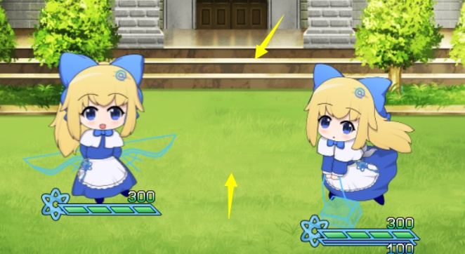{width="2.9916666666666667in"
height="1.6420669291338583in"}

**4) 敌人变身**

对于该插件而言，敌人变身后，数据变化不大。

脚本层面上换了该单位的攻击、防御等能力值，敌人id，以及刷新了贴图。

这些都不会影响生命框的显示。

（敌人变身后，当前生命值是不会变的，但是生命上限会变，如果变身的两个敌人生命上限不一样，变身后你可以看到参数条长短突然变化）

**5) 车轮战**

车轮战中，每一波战斗相当于一次完整的战斗。

生命框会完整全部刷新，所以不会出现数值错误或框错位情况。

## 设计

### 配置流程

战斗简单生命框与 boss生命框的配置一样。

由于 生命框、参数条核心、参数数字核心
中都有不同的关联配置，这里建议添加自定义的 **文件名前缀**
来区分不同的生命框样式。防止各个配置纠缠在一起，难以区分。

{width="5.066666666666666in"
height="3.631334208223972in"}

在文件夹中查看时，建议将内容平铺，方便看图片名称和分辨率。

{width="5.362435476815398in"
height="3.1416666666666666in"}

## 从零开始设计

在开始设计前，你可以先了解一下 [配置流程](#配置流程) 。

+-----------------------------------------------------------------------+
| **关于审美：**                                                        |
|                                                                       |
| 经过群友提醒，作者我才注意到，设计出来的框架可能【不好看】。          |
|                                                                       |
| 这是因为作者我编                                                      |
| 写文档时，是以一个开荒者的角度思考问题的。开荒者关注的侧重点是一个满  |
| 足功能的框架和一个完整的教程说明，美感是次要因素，所以自然显得难看。  |
|                                                                       |
| 作为读                                                                |
| 者的你们，更多要关注的是游戏的细节和UI的设计。所以，千万不要把我的拙  |
| 劣的美术当成UI的能力上限。希望你们能在此教程基础上设计出更漂亮的UI。  |
+=======================================================================+
+-----------------------------------------------------------------------+

### 1.设置一个目标

首先要想明白自己想创建一个什么样的生命框，这一点非常重要。

战斗生命框可以设计很多样式，但并不是越多越好，设计同种画风但显示内容不同的框架，也是一种方法。

这次直接仿造mog原来的布局结构，画一个框架：

{width="1.875in"
height="0.5666666666666667in"}

### 2.结构分解，规划区域

你需要将 参数条、参数数字、外框
的结构分离。因为三者都在不同的插件中配置。

这里打算设计两个样式，

一个只有生命，外框x1，参数条x1，参数数字x1；

一个含生命和魔法，外框x1，参数条x2，参数数字x2。

{width="4.4430555555555555in"
height="1.9594160104986877in"}

### 3.起草资源

**1）框架**

框先设为外面包裹的一层简单框架。

梅花形状，就直接用Ai矢量图建一个六边形椭圆就可以了。

（作者我的小爱丽丝全是用Ai矢量图画的，你可以使用Ai画画，画好的Ai文件能够直接拖进ps里面用）

{width="2.0833333333333335in"
height="1.6807031933508312in"}

由于是平行四边形的形状，简单画了一下框架。

{width="4.469061679790026in"
height="1.3833333333333333in"}

由于平行四边形的边角需要用遮罩遮住生命条。

那么反正要遮住，干脆将格子分成四等分。

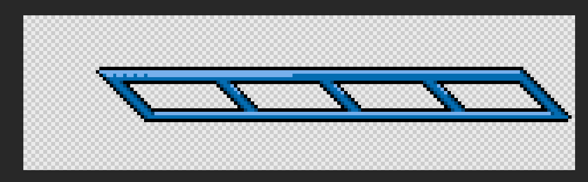{width="4.503640638670166in"
height="1.4in"}

完善高光 和 底面的黑色玻璃。

{width="4.483333333333333in"
height="1.318118985126859in"}

**2）生命条资源**

这里在框架做好的基础上，再根据框的具体长方形区域，来制作生命条。

{width="4.916666666666667in"
height="1.5053073053368329in"}

由于栏杆有遮挡效果，所以提取出来后，用 PS的铅笔工具
把遮挡的部分涂黑，其他部分涂白：

{width="1.7083333333333333in"
height="0.125in"}

默认设置生命条流动，所以设置为遮罩的3倍长：

{width="5.125in" height="0.125in"}

再加上凹槽条，顺带把凹槽条的流速设置为非常慢。

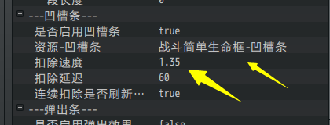{width="3.35in"
height="1.2761909448818898in"}

**2) 生命数字资源**

生命数字这里在变量框像素风格的基础上，添加圆形镶边。

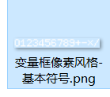{width="1.45in"
height="1.275in"}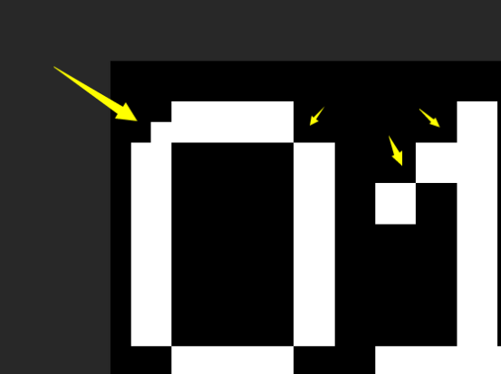{width="2.501388888888889in"
height="1.8671576990376202in"}

然后使用一层描边+白色渐变叠加就可以了，

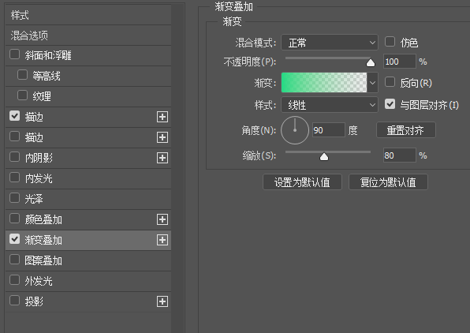{width="4.218055555555556in"
height="2.9840234033245845in"}

如果你是从零开始画的，需要注意排布，要分成等距的14份。

"视图 \> 新建参考线版面"

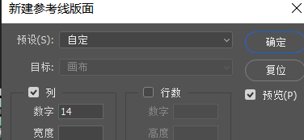{width="3.133604549431321in"
height="1.450125765529309in"}

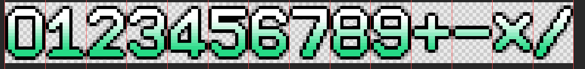{width="5.768055555555556in"
height="0.6826388888888889in"}

**\
**

### 4.配置样式

**1) 生命条配置**

下面把打开 参数条核心插件
，配置一个参数条，由于需要考虑遮罩，并且流动，所以配置如下：

由于该插件固定为1段，所以在核心中建议配置段数为1。

（段数设置可以大于1，如果你的资源含多段，那么设置段数后，核心可以根据段数切割资源。但是，在该插件，仍然只显示单段的结构）

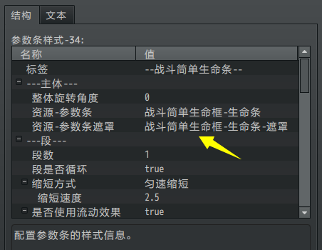{width="3.7666666666666666in"
height="2.9133333333333336in"}

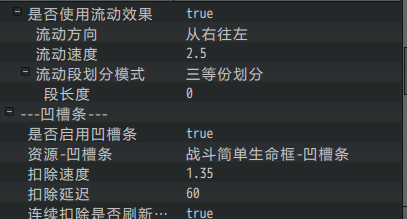{width="3.5833333333333335in"
height="1.9289468503937008in"}

注意在测试前，有可能需要把部分默认资源设为空，如果默认的资源找不到，会报文件错误：

{width="5.1263156167979in"
height="0.934484908136483in"}

**2) 外框配置**

外框配置，在 战斗简单生命框的样式中进行配置。

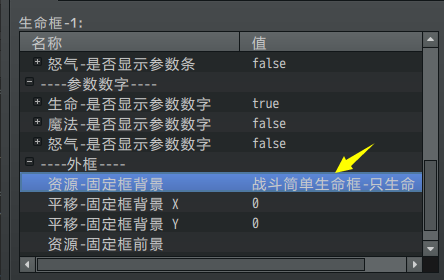{width="3.1666666666666665in"
height="1.9969969378827646in"}

**PS对坐标点**：这里比较关键的是要对齐条的位置与外框的坐标，由于参数条的中心锚点在左上角，所以你需要对齐外框左上角的像素点位置。（这里不考虑旋转情况，但是要留意旋转影响）

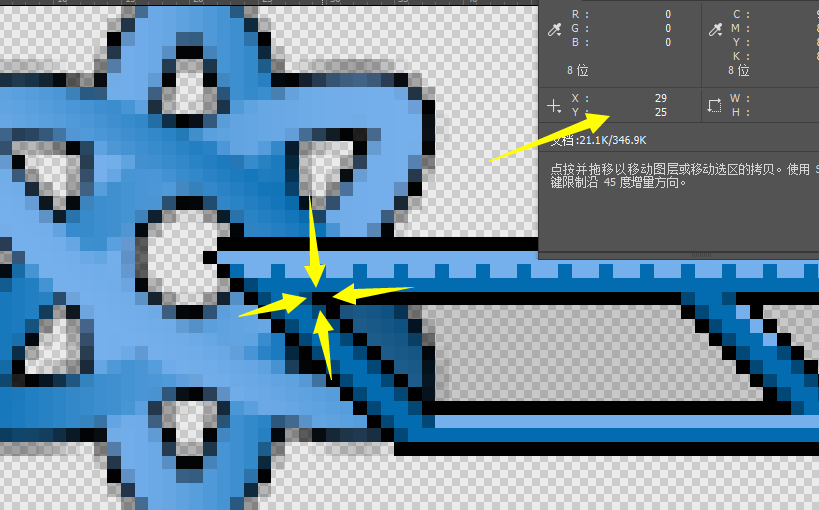{width="4.534194006999125in"
height="2.825in"}

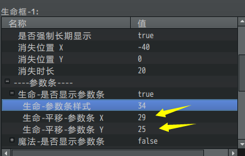{width="3.683333333333333in"
height="2.349712379702537in"}

**3) 参数数字配置**

下面进入参数数字插件。参数数字相对来说，就不需要那么严格的吻合要求，不过要注意参数数字的锚点在中心，不是左上角。下图为生命数字的配置。

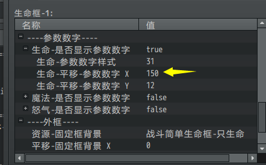{width="3.4428532370953633in"
height="2.1416666666666666in"}

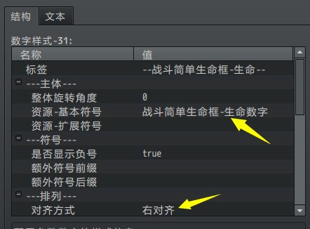{width="3.365890201224847in"
height="2.4833333333333334in"}

### 5.实例测试

生命框样式设计好了之后，就可以直接进行战斗测试了。

进行测试的时候，会发现很多问题，比如生命条分成四份，但是由于黑边被遮住了，感觉效果很一般。

并且没有生命数字正常显示出来。

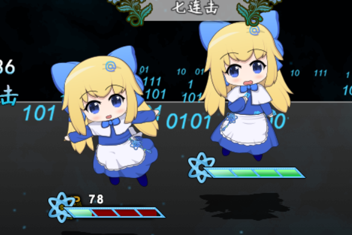{width="4.558333333333334in"
height="3.049132764654418in"}

如果你的生命框直接 没有显示
，那么需要检查一下是不是添加了隐藏注释，或者被其他插件干扰了，需要换换插件顺序。

### 6.细节调整

1）颜色调整

之前框的颜色太深了，对比度不强，稍微调整了下。

{width="2.225in" height="0.625in"}
-\> {width="2.225in"
height="0.625in"}

2）边缘调整

这里给生命条加了一层遮罩，让框的黑色描边能够显现出来。

遮罩：{width="1.7083333333333333in"
height="0.125in"}

{width="3.2416666666666667in"
height="2.358611111111111in"}

3）数字位置对齐

测试时，参数数字没有正常对齐，稍微改改偏移坐标就好。

### 7.收尾部分

完成生命框后，继续回到步骤3；

将魔法条的相关资源画好，然后走一遍流程，即可完成 生命+魔法框 的结构。

{width="2.225in" height="0.625in"}
{width="2.225in" height="0.625in"}

## 常见问题

### 参数条和参数数字不显示

+----------+-----------------------------------------------------------+
| **问     | 参数条和参数数字不显示                                    |
| 题名称** |                                                           |
+==========+===========================================================+
| **问     | {width="2.7083333333333335in" |
|          | height="1.1701924759405073in"}                            |
+----------+-----------------------------------------------------------+
| **问     | 将插件和内容复制到自己工程下时，不显示参数条和参数数字，  |
| 题描述** |                                                           |
|          | 系统也不报错。                                            |
|          |                                                           |
|          | 1.配置了参数条核心、参数数字核心、简单生命框插件。        |
|          |                                                           |
|          | 2.special_meter、special_number等资源文件夹都复制了。     |
|          |                                                           |
|          | 3.生命框配置了，参数条也配置了。                          |
+----------+-----------------------------------------------------------+
| **原     | 既然排除了资源和插件问题的可能性，                        |
| 理解析** |                                                           |
|          | 那么问题就肯定出现在配置参数上了。                        |
|          |                                                           |
|          | {width="4.258333333333334in" |
|          | height="2.6792738407699037in"}                            |
|          |                                                           |
|          | 最后发现是 参数数字样式 参数条样式 没有修改，             |
|          |                                                           |
|          | 导致链接了 样式31，空的样式配置。                         |
+----------+-----------------------------------------------------------+
| **解     | 样式配置为0 或 样式配置链接到了                           |
| 决方案** | 空的配置，都不会显示任何效果，也不会报错。                |
|          |                                                           |
|          | 每次 新建框/复制框 条件时，要留意这种外链id配置的参数。   |
+----------+-----------------------------------------------------------+
