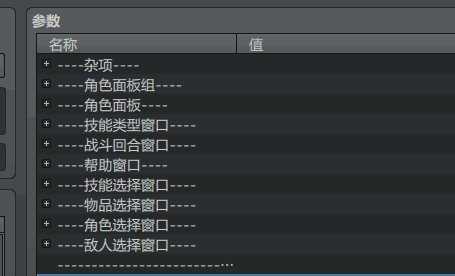
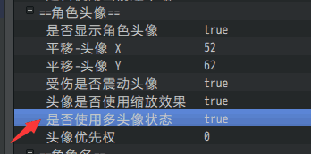
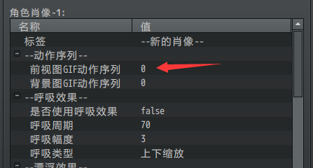
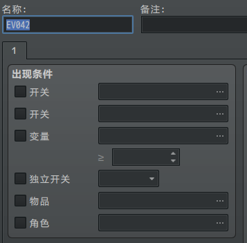
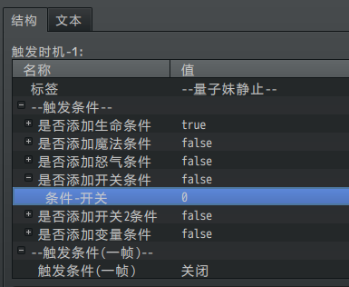
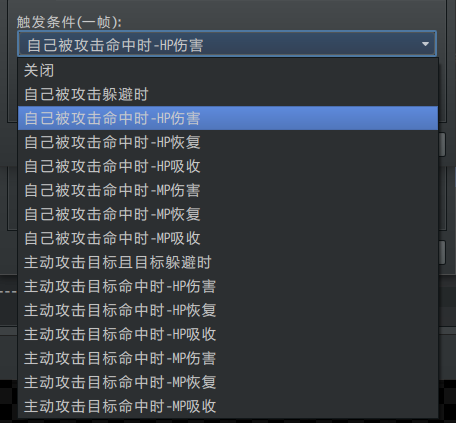
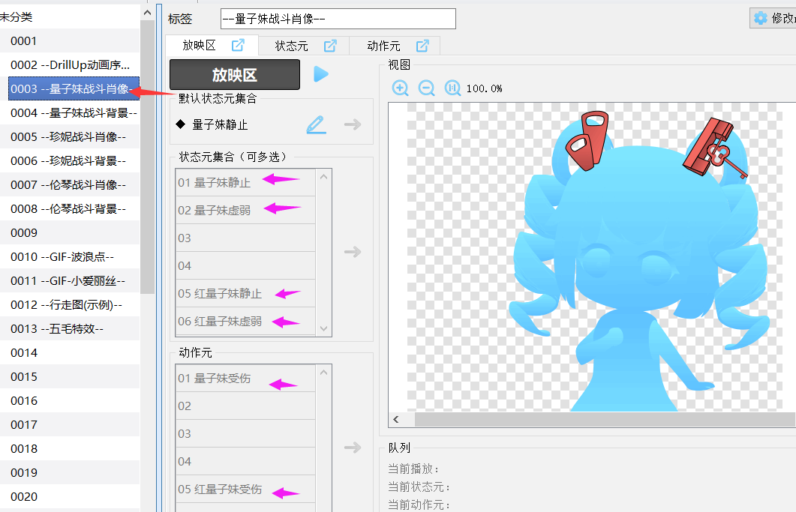
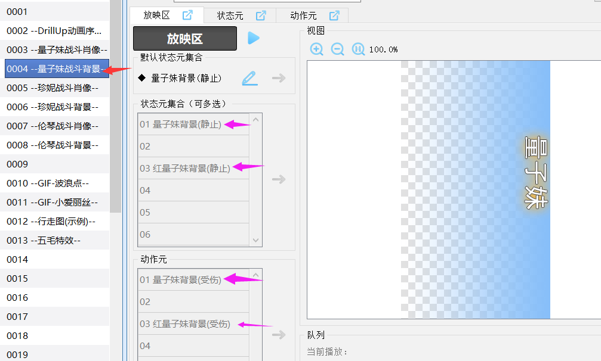

## 版本说明

◆MOG_BattleHud (v4.0)战斗UI - 角色窗口

◆MOG_BattleCommands (v1.2)战斗UI - 技能类型面板

**当前的战斗角色窗口已经升级为4.0，对应技能类型面板是1.2。**

旧版本是3.5对应1.0。它们之间不能交叉使用！

## 角色窗口

◆MOG_BattleHud (v4.0)战斗UI - 角色窗口

插件分成4个部分：角色面板组、角色面板、窗口集合、杂项数据

{width="4.738991688538933in"
height="2.874641294838145in"}

点击旁边的小按钮可以将它们收起。

**关于窗口如何配置规划，去看看
"窗口与布局.docx"。你可以把窗口规划到任意位置，大小、贴图、列数都可以随意控制。**

根据窗口的定义，上述的所有窗口都是可以有**起点移动时长**的配置的。但是由于脚本写得太复杂，不好提出设置参数，这里就没优化了。

## 角色头像状态

你可以设置角色头像拥有多个不同的状态。设置后头像会被被分成5份。

（为false则不会被分）

{width="2.900251531058618in"
height="1.4417913385826773in"}

分别用于表示 正常、受伤、进攻、虚弱、阵亡 5种状态。

{width="5.208333333333333in"
height="1.0416666666666667in"}

## 技能类型窗口 与 技能类型面板

这里相对于之前的翻译版本，重新整理了定义。

（旧的翻译版本翻译为命令面板）

窗口是具有滚动条，以及宽度高度的；而面板仅仅是按钮与贴图组合。

插件 **战斗-技能类型面板** 是将 角色窗口中的 **技能选择窗口**
美化的插件。

下图时只开启角色窗口插件，关闭技能类型面板插件的效果。

{width="3.5625in"
height="2.7591568241469817in"}

技能类型面板是在角色窗口的基础上，对技能类型窗口进一步美化的插件。

{width="3.6354166666666665in"
height="2.9145483377077865in"}

## 关于技能类型面板的按钮

技能类型面板固定有3个按钮：攻击、防御、道具 三个

其中的物理技、特殊技、辅助技都是在数据库中设置的。

设置如下：（这里设置了5个）

{width="2.066846019247594in"
height="1.591804461942257in"}

对应的插件就要配置：

{width="4.408715004374454in"
height="2.2418613298337706in"}

基本的技能设置就配置好了。

下面是角色能拥有哪些技能：

{width="5.768055555555556in"
height="2.23125in"}

（这里示例中添加技能类型是在职业中添加的，你也可以在角色中添加相关技能类型）

这里添加了物理技、特殊技、辅助技。

所以战斗中会出现下面六个类型：

{width="2.683566272965879in"
height="2.175188101487314in"}

技能类型的顺序是你配置技能类型的顺序，攻击在顺序的最前面，防御和道具在顺序的末尾。

顺序为：1.攻击2.物理技3.特殊技4.辅助技5.防御6.道具

## 如何将技能类型面板固定在中心

只要在角色窗口中配置不纠正（固定窗口），以及设置命令面板的xy坐标就可以了。

注意：如果你要将设置改回纠正，记得设置xy坐标为0,-15，不然命令面板会被移动到非常下面的位置，以至于看不到面板了。

{width="5.768055555555556in"
height="3.466666666666667in"}
