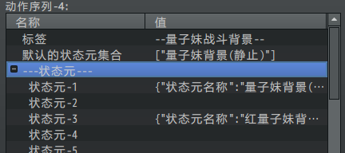

## 概述

### 插件介绍

基于核心：

◆Drill_CoreOfActionSequence 系统 - GIF动画序列核心

高级肖像插件：

◆Drill_ActorPortraitureExtend 战斗UI - 高级角色肖像

只需要上述两个插件即可。

高级角色肖像 组成结构比较复杂，你需要先了解 GIF动画序列核心 才能配置。

具体可以去看看：

关于GIF动画序列核心.docx

关于GIF动画序列核心编辑器.docx

另外，Drill_ActorPortraiture角色肖像
插件是低配的简单插件，可以单独使用，如果你对角色肖像的动作精细要求没有那么高，可以先试试那个插件。

### 插件关系

高级角色插件的关系如下图。

## 高级角色肖像

### 原理

该插件实际上内嵌了一套自主向动画序列进行调用的方法，所以设置都是固定好的。

（战斗时大部分行为都是 一瞬间
的，通过事件很难捕获到，直接调取就简单许多。）

每个肖像都对应两个动画序列：

前视图GIF动画序列；

背景图GIF动画序列。

（动画序列 和 GIF动画序列 是同一个东西，只是称呼不同）

![C:\\Users\\lenovo\\AppData\\Roaming\\Tencent\\Users\\1355126171\\QQ\\WinTemp\\RichOle\\S_C\]\@0Y3\`F_E\`Q8YQ8NXV\[G.png](./MediaFolder/media/image4.png){width="3.6083333333333334in"
height="1.9373600174978127in"}

动画序列不一定非要是角色立绘，也可以是环绕的魔法特效等GIF。

### 触发时机

[]{#触发时机-1 .anchor}触发时机与事件页的功能相似。

如果触发同时满足多个触发时机，则序号大的触发时机优先。

比如：3的"量子妹受伤"的条件满足时，1和2的触发会被跳过。

（量子妹受伤的条件只出现一帧，然后触发一个动作）

{width="3.75in"
height="2.4596773840769903in"}

满足条件时全部满足才能触发：

（"是否添加"与事件页的勾选是一样的效果，你可以把触发时机看做事件页）

{width="2.6083333333333334in"
height="2.5732436570428696in"}
{width="2.5833333333333335in"
height="2.121447944006999in"}

### 触发条件（一帧）

根据 攻击者与被攻击者 的关系，触发条件有下列情况：

（具体可以去看看 "攻击者与被攻击者.docx" ）

由于该插件是 角色肖像，所以敌我关系以 我方 为准。

我方主动 -\> 我方被动 对应：自己被攻击

我方主动 -\> 敌方被动 对应：主动攻击目标

敌方主动 -\> 我方被动 对应：自己被攻击

敌方主动 -\> 敌方被动 无对应

根据关系，伙伴直接对同伴造成伤害，也会被条件"自己攻击被命中时-HP伤害"捕获。

{width="3.4833333333333334in"
height="3.2327777777777778in"}

该条件只在满足后一帧内结束，常用于播放动作。

假设敌人攻击量子妹5下，全命中。

因为每下都在不同的帧，所以此条件会触发5次。

如果你开了状态元切换，那么状态切换会执行5次。

如果你开了动作元播放，那么相同动作元会播放5次。

（相同优先级的动作元在未播放完时不会被中断覆盖，可见"关于GIF动画序列核心.docx"的
优先级 定义。）

## 从零开始设计

在开始设计前，你需要先了解一下"关于GIF动画序列核心"。

以及小工具 GIF动画序列编辑器 。

### 1.设置一个目标

首先要想明白自己想做一个什么样角色立绘，有哪些动作、状态，然后评估一下工作量，这一点很重要。

这里拿一个示例中已经有的例子来说明一下，即：能够在战斗中变身的量子妹。

**1）前视图**

考虑到本人美术能力有限，又实在不想画，所以只考虑两个状态和一个动作。

分别为：

状态 - 量子妹静止

状态 - 量子妹虚弱

动作 - 量子妹受伤

由于之前有量子妹还有进化成红色版本的能力，所以还包含：

状态 -- 红量子妹静止

状态 -- 红量子妹虚弱

动作 -- 红量子妹受伤

小工具中，只能通过输入状态元和动作元来进行战斗时的模拟，

而在战斗中进行的实时反应需要在 该插件 中配置，后面会提及。

{width="4.866666666666666in"
height="3.1340955818022747in"}

**2）背景图**

背景包含一个状态和一个动作：

状态 - 量子妹背景(静止)

动作 - 量子妹背景(受伤)

变身后的红色版本：

状态 -- 红量子妹背景(静止)

动作 -- 红量子妹背景(受伤)

{width="5.041666666666667in"
height="3.031312335958005in"}

不经意加起来，一共10个gif片段！

如果随便设置一下，你就会发现你要配置的东西 呈指数级 增长。

**所以在最开始设计时，不要一拍脑袋就想把
点头、微笑、奔跑、跳跃、下蹲、格挡、轻攻击、重攻击、大招、防御
全部情况都考虑进来，工作量是非常恐怖的。**

所以，首先一定要想好要做几个状态元、几个动作元。

### 2.起草资源

你需要在GIF动画序列编辑器中将目标动作元、状态元进行设计，以准备给插件调用。

具体介绍去结合"关于GIF动画序列核心"和GIF动画序列编辑器。

由于高级角色肖像插件中，分为 前视图 和 背景图，这两个都是GIF动画序列。

那么对应的，要在动画序列中，建立两个完整的肖像：

{width="3.125in"
height="1.2486198600174978in"}

你也可以只设计肖像，不要背景。（背景动画序列设0即可）

实际上作者我只画了两个形象......其它都是用ps稍微变色的。（后面会慢慢加吧......）

虚弱状态 和 受伤动作 使用的是同一个资源......

{width="3.2291666666666665in"
height="2.0006780402449693in"}

需要注意的是，导入的图片，要注意资源不重名。重名的资源在编辑器中会提示，因为所有资源都会转到同一个文件夹中。

另外，通过编辑器配置好的资源，会自动将资源筛选并转移到rmmv工程的文件夹

img/Special\_\_actionSeq中，不需要对这个文件夹作多余操作。

### 3.配置资源

**1）前视图**

状态元编号和动作元编号 没有先后顺序关系，因为调用是通过 名称
进行调取的。

{width="1.8308716097987752in"
height="1.8576388888888888in"}
{width="2.841666666666667in"
height="1.8634897200349956in"}

这里，考虑到动作元之间存在优先级关系，红量子妹 的优先级 \> 量子妹
的优先级，

所以红量子妹设置了 状态元优先级30，动作元优先级31。

{width="3.120833333333333in"
height="1.6953051181102363in"}

{width="3.120833333333333in"
height="1.8106550743657044in"}

设置优先级这样可以 避免 红量子妹状态时误播放 (蓝)量子妹受伤 的动作。

**2）背景图**

背景图有4个配置。

注意，这里状态元命名最好不要和之前立绘的状态元重名了。

（立绘叫 "量子妹静止"， 背景叫 "量子妹背景(静止) " ）

> {width="1.6458497375328085in"
> height="1.5019805336832897in"}
> {width="3.466666666666667in"
> height="1.5407403762029745in"}

{width="1.2708333333333333in"
height="1.1044706911636046in"}
![C:\\Users\\lenovo\\AppData\\Roaming\\Tencent\\Users\\1355126171\\QQ\\WinTemp\\RichOle\\O09Y\[A\]\]W)\@3\[\]S(J7GJRLE.png](./MediaFolder/media/image20.png){width="4.033333333333333in"
height="1.1203718285214348in"}

不重名可以 防止 在肖像配置时搞混淆。

{width="3.9166666666666665in"
height="1.7068044619422573in"}

### 4.配置样式

**1）动画序列对应**

首先将 肖像序列和背景序列 对应上：

{width="3.257311898512686in"
height="1.168711723534558in"}
{width="1.9625in"
height="1.1586712598425197in"}

**2）触发时机 配置**

触发时机与事件页的功能相似，有先后顺序，序号越大，优先级越高。

你可以理解为：

一个行走图 对应 一个事件页，多个事件页可以用重复的行走图；

一个状态元/动作元 对应 一个触发时机，多个触发时机可以用重复状态元；

你还可以在触发时机中，添加开关控制；

具体可以看看前面章节 [触发时机](#触发时机-1) 。

![C:\\Users\\lenovo\\AppData\\Roaming\\Tencent\\Users\\1355126171\\QQ\\WinTemp\\RichOle\\)I\]\`OZ\@Q8K)03XD\`IIN}ZTB.png](./MediaFolder/media/image24.png){width="3.283333333333333in"
height="2.06298009623797in"}

**3）触发时机的 状态元与动作元**

每个时机都对应4种模式切换，分别为：

前视图切换状态元、前视图播放动作、背景图切换状态元、背景图播放动作。

切换状态和播放动作可以同时开启；同开后，会先播放动作，然后进入状态。

{width="3.308248031496063in"
height="1.4416666666666667in"}

### 5.细节调整

下面点开敌群进行测试。

**1）中心锚点**

如果你的资源图片**不是等宽高的**，那么你需要注意图像的中心锚点，

GIF动画序列编辑器 的视图，中心锚点在正中心

前视图的中心锚点在正下方，背景图的中心锚点在左下角。

![C:\\Users\\lenovo\\AppData\\Roaming\\Tencent\\Users\\1355126171\\QQ\\WinTemp\\RichOle\\E\$1O095JCGT\]E8N@\[4PDGWW.png](./MediaFolder/media/image25.jpeg){width="3.0087117235345584in"
height="2.7416666666666667in"}
{width="1.9388888888888889in"
height="2.6938932633420825in"}

**2）资源调整**

由于角色肖像的 前视图背景图是直接对 所有肖像
进行设定的，不能单独修改偏移。

{width="3.609985783027122in"
height="2.3645833333333335in"}

因此，你只能根据实际个例情况，对编辑器中的 **资源图片** 进行ps修改。

## 其他说明

如果你在配置过程中遇到了无法解决的问题，

可以去看看"关于GIF动画序列核心.docx"文档中的 常见问题 章节。
