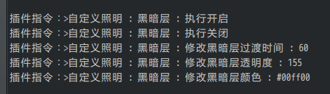
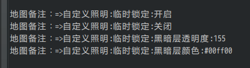
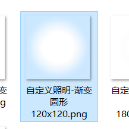
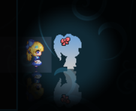
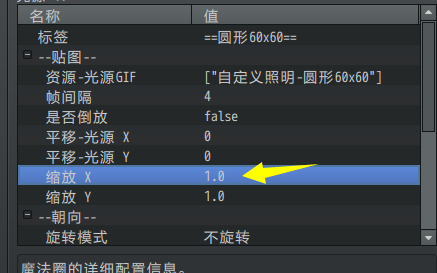
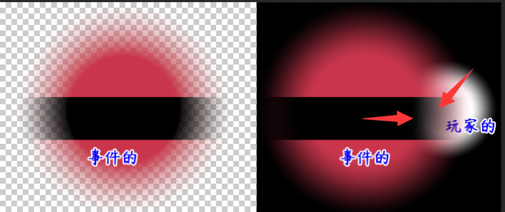
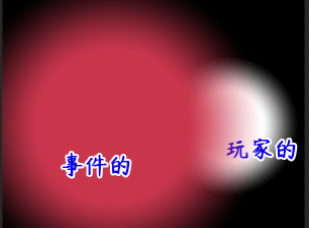
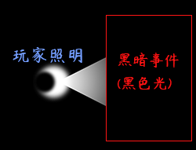

## 概述

### 相关插件

插件本体：

◆Drill_LayerCamera 地图 - 活动地图镜头

大部分镜头的控制方法，插件信息里面都有说明。

**镜头移动**：插件中有配置。

**镜头缩放/旋转**：可见该文档后面章节，示例中有地图管理层的镜头控制仪。

**镜头翻转**：见示例中，地图管理层的镜头翻转仪。

**镜头锁定/看向指定位置**：见示例中，地图管理层的镜头锁定器。

**镜头墙**：可见该文档后面章节，示例中的体积管理层也有相关说明。

**视野触发**：见示例中，体积管理层的"发现秘密声"事件。

这里介绍一些特殊的情况和内容。

**\
**

### 插件关系

地图镜头的插件关系如下。镜头与其他插件都可以断开，属于被扩展关系。

（地图相关插件需要主动适配 活动镜头 ，由于数量很多，这里只列举部分）

**\
**

## 镜头

### 边缘图块

**1) 查看边缘方法**

在插件中，关闭 "缩小强制刷新"
，然后缩小镜头，你可以看到事件（红箭头）、背景（紫箭头）、图块（黄箭头）是三个分离的结构。

{width="4.15in"
height="3.241794619422572in"}

使用插件指令旋转12度时，也可以看到部分黑边，都属于正常现象。

{width="4.191666666666666in"
height="3.2215102799650044in"}

需要注意的是，通过这些黑边、边角看到的事件，**都不会被 视野触发
激活独立开关**，必须要在标准的 矩形视野 范围内才会被激活。

**2) 镜头处理原理**

结合下面地图界面的层级来看。

\- Rmmv的图块根据镜头的位置，**实时拼接**。原理来源于脚本中的Tilemap类。

\-
Rmmv的远景被地图背景插件替代，根据镜头的位置，**实时切分**。原理来源于脚本中的TilingSprite类。

\-
Rmmv的事件是**直接贴在地图**中并且固定位置的，所以你可以看到悬空的事件。

{width="5.768055555555556in"
height="6.172928696412948in"}

### 缩放兼容问题

由于镜头涉及脚本很多方面，镜头插件只能提供单纯的图像缩放，无法顾及其他插件。仍然需要外部插件主动配合。

比如，**鼠标的触发面积**与**地图镜头**从原理上互不相通，但是镜头缩小后，鼠标触发面积显然也需要缩小。所以需要专门兼容镜头插件。（现鼠标触发插件已兼容缩放）

{width="3.5083333333333333in"
height="1.8402187226596676in"}{width="3.5347419072615924in"
height="2.0in"}

再比如，地图ui部件、鼠标辅助面板，也不会与地图一起缩放，这可能会造成比例不对的错位现象。（后期会慢慢给其它插件的缩放情况做兼容）

**所以，在控制镜头缩放时，你需要考虑现有的一些功能插件，是否支持镜头缩放，会不会在缩放后错位**。

### 1像素的偏移

**1) 渲染原理**

默认rmmv地图固定1像素或2像素匀速移动；

而弹性移动，图块、背景和事件的渲染方式不再是1像素的方式渲染；

这就造成了0.25像素时，图块和事件在特定的位置产生偏差的bug细节。

下图为早期版本的缝隙bug（v1.6之前的bug）：

{width="5.768055555555556in"
height="2.6944444444444446in"}

经过反复修正，终于使得1像素的偏移缝隙不会再出现。

**2) 细节bug**

但是，如果你细心观察，还是能够发现偏移的小细节：

镜头静态不动时，没有任何问题，而你如果突然走动一下，所有事件会向前偏移1像素，然后迅速恢复与地图同步。（偏移不会产生早期版本的缝隙）

这部分的细节难以修正，因为地图图块和地图背景是先渲染，而事件是后渲染，这里的1像素，是建立在渲染的先后顺序的偏差上。

### 镜头墙

镜头墙属于镜头移动，是一种阻止镜头单向向上/下/左/右移动的墙，如果玩家越过了墙壁线，则镜头将不再受阻止。

**1）单向墙**

图中红色部分为镜头墙的墙面，如果玩家在**左墙的左边**，则会被墙阻挡，只要在**左墙的右边**，墙就失效。

{width="3.316666666666667in"
height="2.131765091863517in"}

{width="3.341666666666667in"
height="2.0445888013998252in"}

**2）双向墙**

一个事件可以同时拥有左墙和右墙，玩家在事件左边，右墙失效，左墙启用。而玩家去事件右边，右墙启用，左墙失效。可以使得镜头有隔墙划分的效果。

{width="3.558333333333333in"
height="2.1034700349956257in"}

{width="3.475in"
height="1.958400043744532in"}

需要注意的是，左墙右墙的实际位置都在事件的**左侧边线**。上墙下墙的实际位置都在事件的**上侧边线**。

**3）宽地图中的墙**

以向上的墙为例，当镜头看到了指定的墙（红色部分），那么镜头就会被事件的镜头墙顶起。因为，玩家在**上墙的上边**，会被墙阻挡，只要在**上墙的下面**，墙就失效。

{width="4.041919291338583in"
height="2.5166666666666666in"}

{width="4.050127952755905in"
height="2.5in"}

## 其他说明

暂无
