## Rmmv默认类型

### 单行走图

单行走图（也称大图）必须要在资源前面加"\$"符号，比如"\$小爱丽丝.png"。
资源排布方式为下图所示：(每块48x48，共144x192)

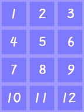{width="1.0375in"
height="1.3833333333333333in"}
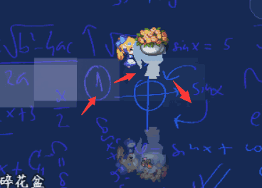{width="1.0166666666666666in"
height="1.3555555555555556in"}

需要注意的是，资源是被分成了12等分，**但是并不代表每等分必须是48x48像素**。你可以是48x96像素：(每块48x96，共144x384)

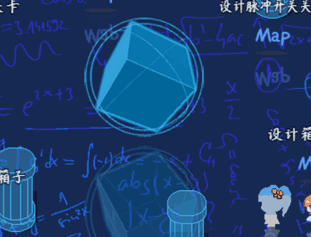{width="1.0125in" height="2.7in"}
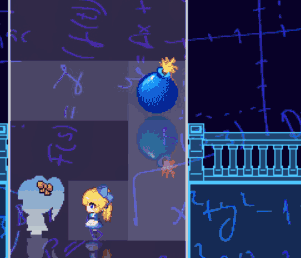{width="1.01875in"
height="2.716666666666667in"}

在这12等份中，分别表示不同的情况，每个朝向默认3帧，并且是以2-\>1-\>2-\>3-\>2...的往返方式播放的。（多帧行走图、锁定帧
插件可以额外修改顺序）

{width="1.10625in" height="1.475in"}
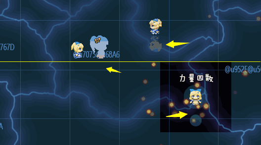{width="1.1083333333333334in"
height="1.4777777777777779in"}
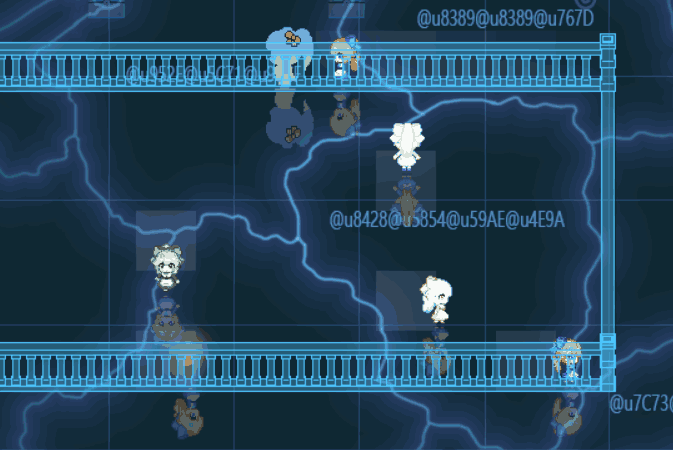{width="1.1125in"
height="1.4833333333333334in"}
{width="1.1083333333333334in"
height="1.4777777777777779in"}

### 八行走图

一般图都会被分成12\*8等分，资源排布如下图所示：

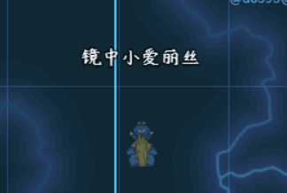{width="2.683333333333333in"
height="1.7887817147856517in"}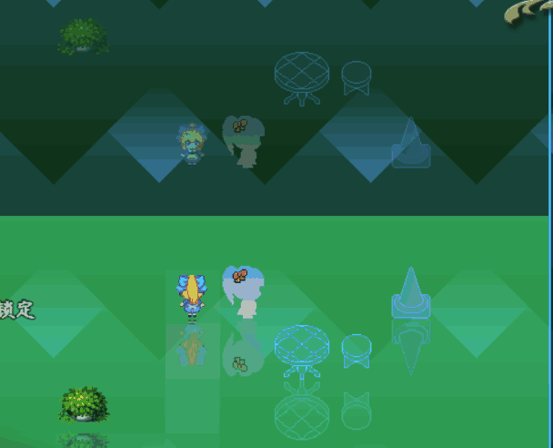{width="2.699119641294838in"
height="1.7993055555555555in"}

同样的，每等分不一定必须48x48，你可以设置成其他大小：

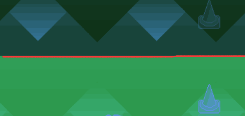{width="2.505133420822397in"
height="3.3402777777777777in"}
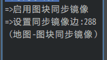{width="2.475in"
height="3.3000984251968504in"}

这里的不同朝向也可以代表不同的物体，但是在设置事件时，需要勾选"固定朝向"。

需要注意的是，**不要把 八行走图
的不同区域混淆在一起了，每个区域都是独立的行走图，你应该先取其中一个单行走图，再对其进行分析**。

### 图块行走图

图块行走图最大的特点，**是没有朝向、帧数的**，且只能按照图块大小（48x48）来进行约束。

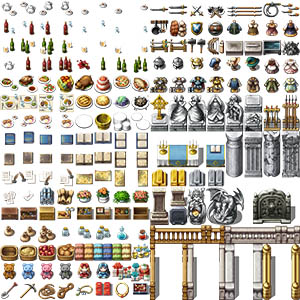{width="3.0in" height="3.0in"}

另外值得一提的是，rmmv之所以把各种场景元素都集中在图块中，而非事件资源。是为了节约部分图片内存的占用，不然每次读取一张新图时，都要等待一段时间。

这种收发等待、内存占用对于手机端和网页端是致命的。（PC电脑中不存在这种问题。）

### 行走图的中心

**行走图的中心在事件正下方的点，**如果只改变高度，为48的倍数即可。

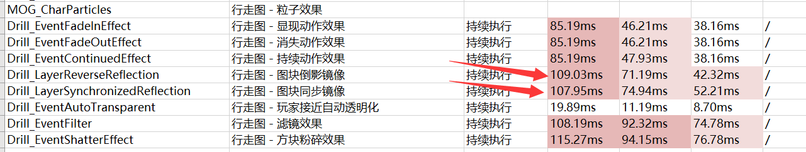{width="0.5in" height="1.0in"}
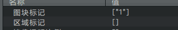{width="1.9084984689413824in"
height="1.5834700349956254in"}
{width="2.1666666666666665in"
height="1.581418416447944in"}

而如果你要改变宽度，需要注意**宽度**问题，偶数比例会出现半个图块的占用情况。所以横向的比例建议用1,3,5,7......奇数比例。

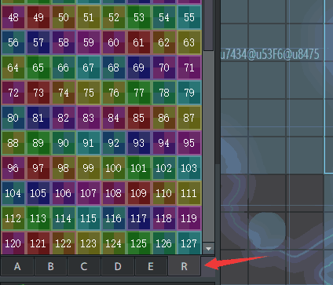{width="1.6333333333333333in"
height="1.0888888888888888in"}
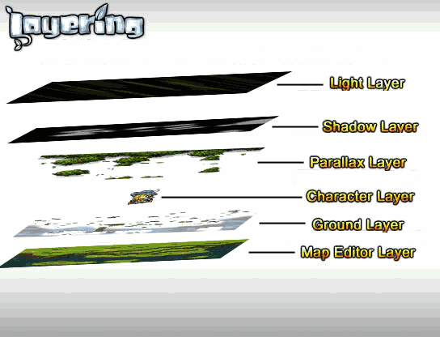{width="1.6503455818022748in"
height="1.3493055555555555in"}
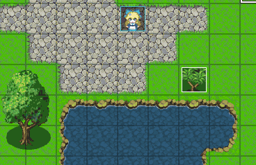{width="2.0211001749781277in"
height="1.3416666666666666in"}

## 一体化行走图的3d画法

### 连接边

Rmmv会将指定的行走图切割成固定的等分，你可以将这些等分进行随意组合，当遇到一体化事件时，你可能需要把行走图分成多个部分。

连接边 的定义：等分A和等分B靠在一起时连接的那一条边。

{width="0.5in"
height="0.5in"} + {width="0.5in"
height="0.5in"} = {width="1.0in"
height="0.5in"}

以 华容道方块
行走图为例，如果两两事件都有相同的连接，并且连接处能够吻合相连，那么你就可以用重复的图块画很多种不同的形状了。

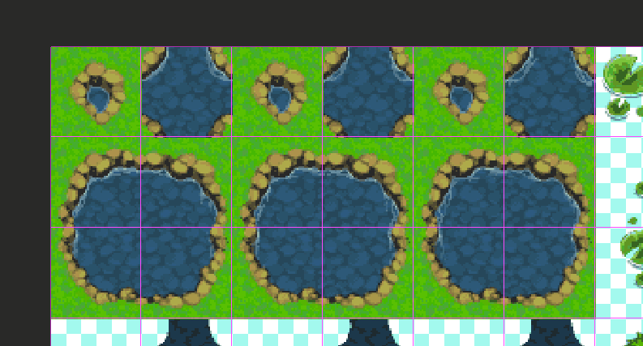{width="3.3958333333333335in"
height="3.550188101487314in"}

### 48x48直接连接

直接匹配48\*48的图片是可以完美连接在一起的，但是缺点是不能画类似3d突出来的方块效果。

因为高度需要占用一定空间，下图中的高度明显越出了连接边的范围，在游戏中会发现相连处会有明显的截断部分。

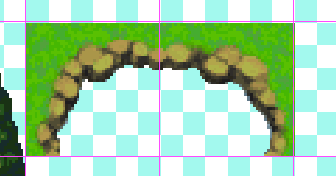{width="3.539248687664042in"
height="2.8020833333333335in"}

每个方块都自己单独画一个图形，是一种解决办法，但是设计行走图资源配置时会变得非常复杂。

### 顶面与墙面

这里可以从一个3d物体开始分析。

下图中的3d物体，分为顶面和墙面。顶面是之前画的48x48连接图，而墙面是连接图向下延伸具有高度的面。

你会发现，顶面是可以**遮挡**墙面的，并且墙面也可能**遮挡**墙面。

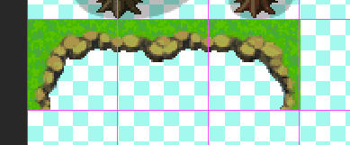{width="3.158333333333333in"
height="2.21916447944007in"}

根据前面章节的行走图知识，我们发现图块可以不是48x48的，也可以是48x96的，只是会**遮挡**住其他图块。

结合分析你会发现，通过相互遮挡的关系，如果配置含有顶面和墙面的行走图（48x60），那么正好可以将整个顶面支撑起12像素的高度，专门用来画墙面，刚好能够契合3d效果。

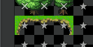{width="3.1416666666666666in"
height="3.2631233595800526in"}

通过rmmv超出48x48部分会遮挡的特性，你可以画出下面的凸出的方块结构。

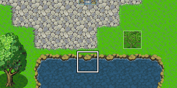{width="1.7084809711286089in"
height="1.5584678477690288in"}
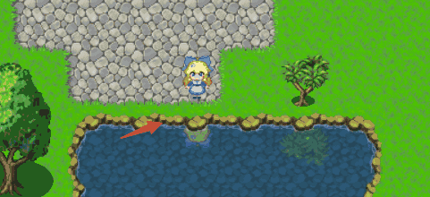{width="1.783487532808399in"
height="1.633474409448819in"}

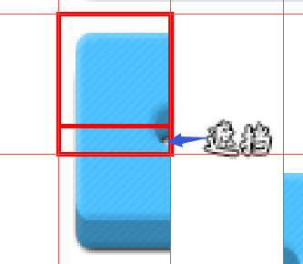{width="2.7752405949256342in"
height="2.4168766404199475in"}

### 视错觉问题

你的大脑在一定程度上会欺骗你，比如下面两个桌子的顶面，灰色的平行四边形和青色的平行四边形的**面积是一模一样**的。

{width="5.133778433945757in"
height="2.6002252843394578in"}

这种视错觉，会给你的眼睛造成误差，明明是等面积的长方形，画出来缺感觉竖起突出的部分面积有些不对称。

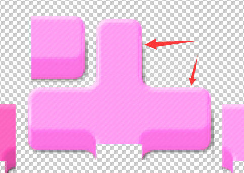{width="2.9in"
height="2.059420384951881in"}

所以，这里必须**刻意**给纵向的长方形加宽一点点，来消除视错觉影响。

## 插件功能

### 行走图-多帧行走图

1\) 帧数

多帧行走图**只支持单行走图**。并专门扩充横向的帧，将默认的3列帧扩展到任意列的帧数，**原先默认分成3x4=12等分，修改n帧后，将分成nx4等分**。

（可以参考示例中 地图管理层的"123456"行走图 和 物体管理层的旋转立方体）

{width="1.1125in"
height="1.4833333333333334in"}
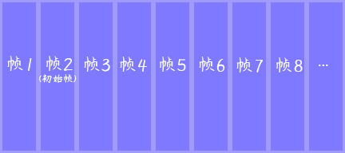{width="3.325in"
height="1.4777777777777779in"}

2\) 动画帧间隔

动画帧间隔用于控制行走时，每帧的播放速度，**帧间隔越小，动画播放越快**。

(图中的帧间隔为4)

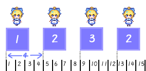{width="4.241666666666666in"
height="2.069933289588801in"}

另外，移动速度也与动画帧间隔有关，这是因为**帧间隔默认是一个公式**：6+(7-speed)\*3，根据公式可以计算出：

速度1，帧间隔：24； 速度2，帧间隔：21； 速度3，帧间隔：18；

速度4，帧间隔：15； 速度5，帧间隔：12； 速度6，帧间隔：9；

3\) 固定帧

**固定帧不改变朝向内容，也就是说你用于事件/角色图时，可以正常上下左右行走**。并且，使用固定帧时，一样可以正常上下左右行走，只是帧被固定了，看起来像滑行：

{width="4.1in"
height="1.8222222222222222in"}

4\) 行走循环动画

当事件步行行走时，会循环播放动画，你可以控制动画的循环方式包括循环序列。

Rmmv默认的循环方式为**左右往返**：(1-\>2-\>3-\>2-\>1-\>2-\>......)

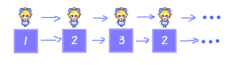{width="5.210208880139983in"
height="1.4833333333333334in"}

这里的循环方式你可以设置为从 左往右循环 或者
从右往左循环，你也可以完全自定义序列。

另外需要注意的是，**当事件停止移动时，会结束循环，恢复到初始帧**。

### 行走图-锁定帧

1\) 锁定帧

锁定后，无论行走图如何、朝向如何，**行走图都为rmmv编辑器中设置的帧图像。**

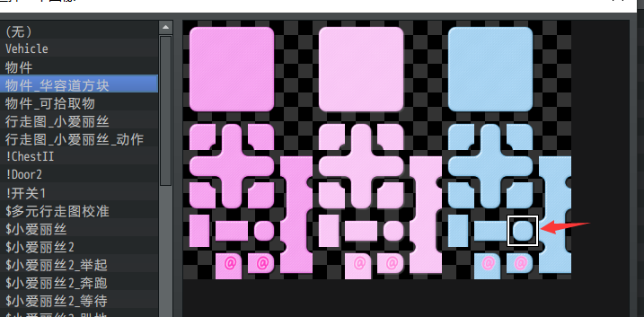{width="4.75in"
height="2.338400043744532in"}

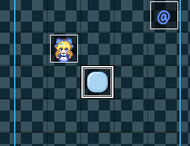{width="2.275196850393701in"
height="1.7501520122484688in"}
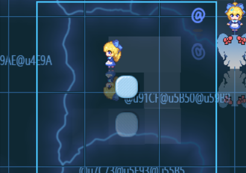{width="2.4791666666666665in"
height="1.75in"}

锁定帧支持单行走图和八行走图，这里需要区分一下定义：

**固定帧**：只控制帧数，不影响朝向。

**锁定帧**：直接控制帧数与朝向，锁定一个具体的帧。

  --------------------------------------------------------------------------------------------------------------------------
  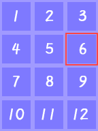{width="1.125in"   {width="3.3916666666666666in"
  height="1.5in"}                                        height="1.5074070428696413in"}
  ------------------------------------------------------ -------------------------------------------------------------------
  **锁定帧**                                             **固定帧**

  --------------------------------------------------------------------------------------------------------------------------

两者的区别，可以去地图管理层的示例看看。

2\) 锁定帧动画

锁定帧动画将强制行走图按照指定序列进行播放，也就是将行走图变成静态gif。并且行走图锁定只有12帧的内容。（八行走图中，这12帧取决于你选中的那个区域）

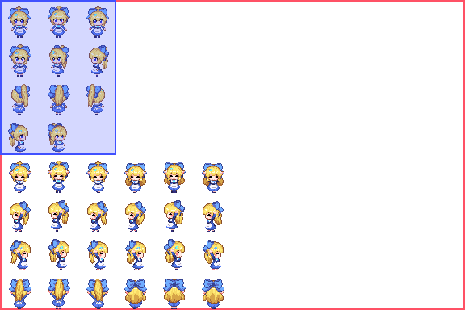{width="3.615844269466317in"
height="2.410416666666667in"}
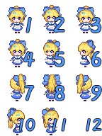{width="1.5916666666666666in"
height="2.1222222222222222in"}

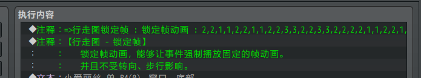{width="5.768055555555556in"
height="1.0708333333333333in"}

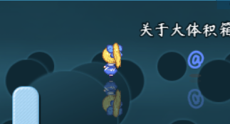{width="2.6918996062992124in"
height="1.4584601924759406in"}

图中所示的为 体积管理层 的跳舞小爱丽丝。

### 行走图-玩家接近自动透明化

事件自动透明化插件中，你需要控制单行走图中的比例，来绘制柱子、云朵、屋檐等阻挡物：

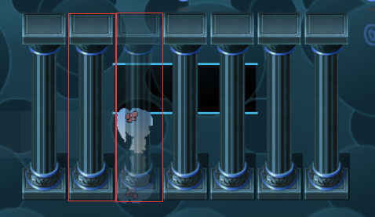{width="3.1in"
height="1.7964435695538057in"}

需要注意的是，**接触面是与资源大小有关的长方形面积，即等分切分后的面积，事件的长方形与玩家的长方形相互接触，才会自动透明**。

事件为多帧行走图也能支持自动透明。
