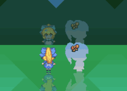
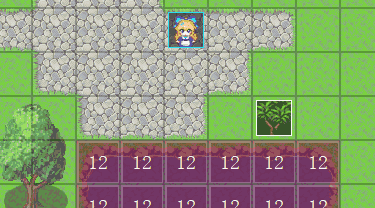
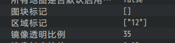
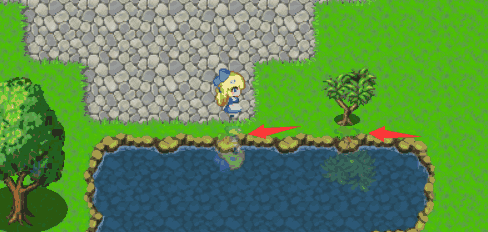

## 概述

### 相关插件

相关插件如下：

◆Drill_LayerReverseReflection 行走图 - 图块倒影镜像

◆Drill_LayerSynchronizedReflection 行走图 - 图块同步镜像

通过该插件，你可以将地图中的角色与npc都反射出来。

### 快速区分

**镜面：** 指能反射出镜像的表面。

**镜像：** 指镜面反射出的形象。

{width="2.75in"
height="2.0104166666666665in"}

由于管理层的地板大部分是完全光滑镜面，所以你很可能会忽视镜面的存在。

## 镜像

### 倒影镜像的反射

目前的介绍以最新的镜像插件为准。

**镜像可以反射跳跃高度、花盆高度。**

{width="2.85in"
height="2.0445647419072617in"}

**镜像可以适应 多帧行走图、GIF动画序列。**

{width="2.8833333333333333in"
height="2.2021784776902886in"}

**新复制的事件也拥有镜像。**

{width="2.5085509623797027in"
height="2.1501859142607174in"}

**镜像经过地图循环边界时，会出现反射关闭现象**。

如果你开启了地图纵向循环，进入地图边缘部分时，一部分反射会被截断：

（横向循环也一样，不过一般玩家不仔细看是注意不到的。）

{width="3.3541666666666665in"
height="1.8740135608048993in"}

**镜像不能反射滤镜效果。**

{width="4.033333333333333in"
height="2.6968799212598427in"}

另外，你可以通过插件指令，设置事件透明但是镜像不透明，看起来像在镜子中一样。

{width="2.7002340332458443in"
height="1.8168241469816273in"}

### 同步镜像的反射

同步镜像和倒影镜像一样，只是稍微多了一些特殊规则。

**同步镜像具有上述倒影镜像全部效果。另外，同步镜像是没有倒影的。**

{width="3.433333333333333in"
height="2.7782884951881015in"}

**同步镜像必须指定地图中的一条反射边。**

{width="2.6083333333333334in"
height="1.233523622047244in"}{width="1.4751279527559056in"
height="0.8334055118110236in"}

**朝向镜面时（朝向上或下），反射的行走图是相反的。**

{width="2.100181539807524in"
height="1.5167979002624672in"}

### 性能消耗

该插件性能消耗较高，会稍微影响游戏速度。

因为设置后，所有事件具有两个的图像，一个标准行走图，一个镜像。

{width="5.768055555555556in"
height="1.0951388888888889in"}

由于示例中是全程开镜像的，插件本身消耗占100ms左右，属于高消耗插件。

但是，由于镜像的特殊性，显现动作效果等行走图相关插件
的消耗也因此显著提高了。

## 镜面

### 镜面设置方法

镜面的基本设置有下面两种，设置图块标记和设置区域标记。

镜像设置中用的图块R区域比较多，你需要用表格分类，不要与其他区域用重了，去看看"关于插件与图块R占用说明.xlsx"。

{width="2.891917104111986in"
height="0.5000437445319335in"}

图块标记对应图块的地形标志，如果标志对应上了，这个地形将会成为镜面。

{width="4.466666666666667in"
height="2.328517060367454in"}

区域标记对应区域的标记信息，如果区域对应上了，这个区域将会成为镜面。

{width="3.533639545056868in"
height="3.025262467191601in"}

### 画大地图镜面方法

你如果对镜面的模糊程度、形状等有更高的要求，可以直接画一张非常大的遮罩图，用于整个地图的镜面反射深度情况，原理与"如何制作优秀的光影效果"相似。

（关于如何画阴影，这个帖子有详细介绍哦！）

<https://rpg.blue/forum.php?mod=viewthread&tid=388527&extra=page%3D1%26filter%3Dtypeid%26typeid%3D483>

{width="5.666666666666667in"
height="4.333333333333333in"}

## 从零开始设计

### 河流倒影设置

由于示例中管理层的图块非常鲜明，都是正方形图块。冰面也是正方形图块。不需要那么多细节。而真实要画河流倒影时，可能情况就复杂的多了。

现在绘制一个河流。

{width="3.066932414698163in"
height="1.9835050306211723in"}

铺上区域。

{width="3.1252712160979876in"
height="1.7334831583552055in"}
{width="2.5002165354330708in"
height="0.6250546806649169in"}

你会发现陆地部分也反射出了图像，这里本不应该出现图像。

{width="3.8in"
height="1.806557305336833in"}

这个时候，可以用ps将地形截取成图块，使用处在上层的图块来遮挡阴影。{width="4.266666666666667in"
height="2.297199256342957in"}

{width="2.259091207349081in"
height="1.1833333333333333in"}
{width="2.7666666666666666in"
height="1.1450732720909886in"}

{width="1.2667760279965004in"
height="0.6500568678915135in"}

铺上之后就，看不出任何痕迹。而实际上，已经起到遮挡阴影的效果了。

{width="2.908584864391951in"
height="1.4584601924759406in"}

{width="3.75in"
height="1.7151771653543306in"}

除了倒影镜像，同步镜像也可以通过这个方式，绘制大镜子。
