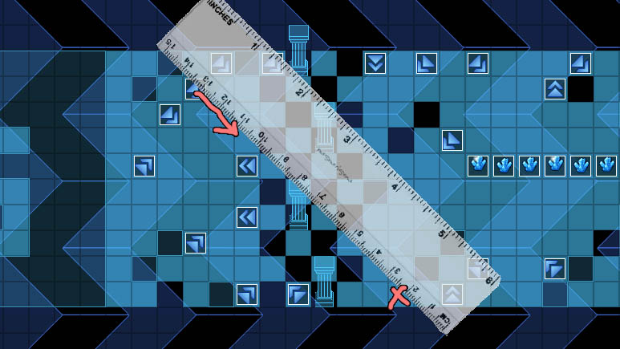

## 概述

### 基础插件

如果要从零开始设计 光滑图块 游戏，需要下图的插件：

{width="5.768055555555556in"
height="1.488888888888889in"}

**注意，该文档只详细说明 整体设计思路 和 解谜方法 。**

**物体滑行的具体细节，可以去看看文档"关于物体滑行.docx"。**

### 基础配置

具体注意示例下面的地方：

**1）地形设计**

地形需要铺上R图块，来表示光滑地面。

（示例中，光滑图块定义为10号图块，其他R图块用途分配可以去看看
"关于插件与图块R占用说明.xlsx" ）

{width="5.768055555555556in"
height="2.297222222222222in"}

**2）地图事件**

所有与该解谜相关的事件 ，都在地图"设计-光滑图块"中。

这里主要需留意一类事件：

转向地毯

{width="5.768055555555556in"
height="2.39375in"}

**\
**

## 光滑图块-谜题设计

### 设计简介

**1）游戏规则**

光滑地面会限制玩家的移动方向。

每次碰壁/停下后，玩家才有机会对下一个移动的方向进行选择。

**2）难度分配**

非光滑地面、墙壁的数量将会影响可能的路径。

转向地毯会扰乱玩家的预判，从而增加难度。

**3）禁用能力**

禁跳跃。（可选）

禁炸弹。（可选）

**4）卡关注意事项**

这里使用了"控件 - 按钮窗口管理器"并连接到了公共事件"滑行卡关"。

玩家可以在菜单界面瞬间传回地图的开始点。

{width="3.2583333333333333in"
height="0.9583333333333334in"}

### 设计建议

**1）设计细节**

玩家滑行时，不要设计出下面的情况，这样会造成死循环，卡关。

{width="2.5083333333333333in"
height="1.9646205161854768in"}{width="2.2083333333333335in"
height="1.9714523184601924in"}

{width="1.8916666666666666in"
height="1.825932852143482in"}

**2）关卡安排建议**

如果你需要在你的游戏中添加该解谜类型，

这些关卡可以被切分成许多小的迷宫解谜，难度最大到第五关，作为
支线或主线谜题 。

第六关的设计最多作为 小支线或奖励成就 即可。

光滑图块在迷宫中可以大量使用，但如果作为一个特定的谜题关卡时，建议不要难度太高，且地图不要太大。想办法减少玩家在光滑地面中乱滑的时间。

## 光滑图块-谜题解法

### 尺子预判法

如果单纯靠眼力判断滑行的方向，是不太准的，这时候需要使用物理尺子，放在在目标图块上进行笔画。

（编辑器中还有辅助网格，而真实游戏中，是没有网格的。）

{width="4.293055555555555in"
height="2.416329833770779in"}

尺子相交的部分，很可能是前一个要到达的点。再通过前一个点，继续找再往前的一个点，直到推出你可以到达的点位，再进行滑行。
