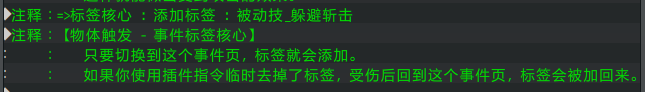
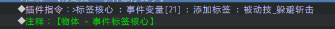
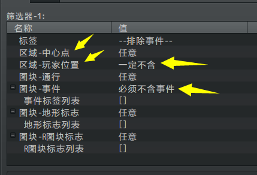
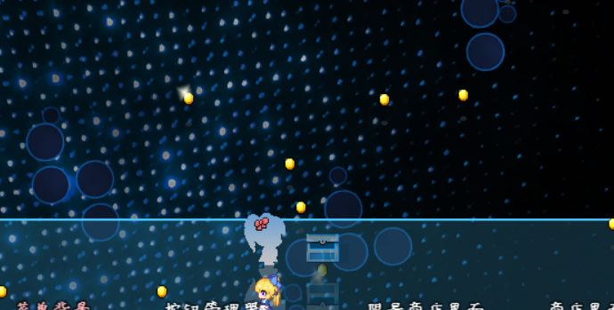
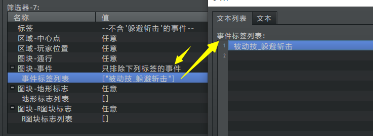
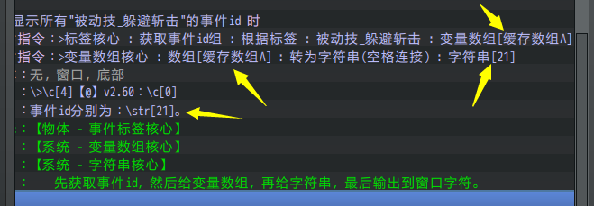

## 概述

### 基础插件

插件本体：

◆Drill_CoreOfEventTags 物体触发 - 事件标签核心

扩展支持插件：

◆Drill_CoreOfFixedArea 物体触发 - 固定区域核心

◆Drill_CoreOfNumberArray 系统 - 变量数组核心

事件标签核心主要体现"标签获取"的功能，含特定标签的事件，都可以被捕获。

通常与 区域触发 形成： 区域+标签 = 筛选器 的效果。

另外注意，事件标签 和 固定区域
两个插件是独立的，只是相互提供扩展功能而已。

### 插件关系

事件标签核心插件关系如下。**虚线表示扩展关系，可以断开，实线表示必备关系，若有子插件则必须有父插件支持**。

## 事件标签

### 标签标记

**1）注释添加**

你可以通过注释给指定事件添加标签。

需要注意的是，切换事件页后，标签会改变。

{width="5.559722222222222in"
height="0.7931944444444444in"}

**2）插件指令临时添加**

使用插件指令也可以临时添加标签，使得该事件被捕获。

{width="5.591666666666667in"
height="0.49211504811898515in"}

## 筛选器

筛选器在 物体触发-固定区域核心 中配置。

### 中心点与玩家位置

其中，中心点、玩家位置属于特殊的情况。

因为玩家不属于事件，所以在触发时，需要单独检查是否需要包含在条件内。

（如果要控制玩家能像事件一样受伤，可以使用"玩家的事件"插件来控制。）

{width="3.4833333333333334in"
height="2.37204615048119in"}

去掉玩家位置后，可以确保金币不会直接落到玩家身上。

（可拾取事件落到玩家身上不算接触，需要离开然后返回才能捡起）

{width="4.018055555555556in"
height="2.0298293963254594in"}

### 标签筛选

筛选器中，可以根据标签来筛选特定的事件，如下图。

{width="5.533333333333333in"
height="2.0305325896762905in"}

## 设计示例

### 显示指定标签的全部事件id

物体触发中，经常会批量获取事件id，这些事件id可以转存到 变量数组中。

下图为通过对话框的方式，显示捕获的事件id。

用到了 变量数组核心（接收id列表） 和 字符串核心（显示id列表）。

{width="5.176388888888889in"
height="1.7967169728783903in"}

{width="4.2in"
height="1.0851432633420823in"}
